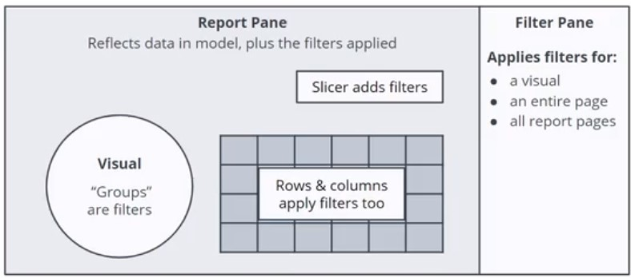

# PowerBI

[Udacity: Data Analysis and Visualization with Microsoft Power BI](https://learn.udacity.com/nanodegrees/nd331)
[Dax Studio](https://daxstudio.org/)
[PowerBI](https://powerbi.microsoft.com/)

Power BI = Power Query + Data Model + Power BI Report

## Power Query

* Multiple data sources
* Change structure without changing the source
* Auto-refresh
* Get data in PowerBI or Excel

## Data Model

* vlookup, xlookup, index-match
* range of calculations you want to apply
* Keys to support relationships

## Power BI Report

* Enable users to explore data
* Avoid versioning of report
* Access to dataset, data flow or data model

# Data Model

## Components

* Dimensions: who, what, where, when, how, why
* Facts: what, how much
  * Additive Facts
  * Semi-Additive Facts
  * Non-Additive Facts: Percentages ...
* Keys: Connect dimensions to facts

## Key Questions

* Key data to calculate?
* How is the data grouped of filtered?
* Where can we access the data?
* Do we need access rights?
* Any sensitive data?
* Can we rely on the data?

# Date Tables

    Calendar(<startdate>,<enddate>)
    CalendarAuto()
    
## Dynamic Date Table

New Source > Blank Query

    = Date.StartofYear(List.Min(#"Sales Transactions"[Date]))
    
    = Date.EndofYear(List.Max(#"Sales Transactions"[Date]))
    
rename Queries "Start" and "End".

New Source > Blank Query

    = {Number.From(#"Start")..Number.From(#"End")}
     
convert to table, convert column to date format.

# Relationships

Direction from dimension table to fact table.

|Cardinalitly|Description|
|-|-|
|One-to-many|One value in dimension table relates to many values in fact table|
|One-to-one||
|Many-to-many||

|Filter direction|Description|
|-|-|
|Single|Filters can be applied in one direction|
|Both|Filters can be applied in both directions|

## Bi-Directional Filters

* One-to-one Relationships
* Bridging Tables
* Unique Slicer Requirements
* Dimenstion to Dimension Analysis

### One-to-One

Check, if a merged table is possible for the requirement.

### Many-to-Many

An item is related to multiple categories. Leverages bi-directional filters. Causes unpredictable results.

# Filters and Visuals

Report pane reflects data in model, plus the filters applied. Filter pane applies filters for a visual, an entire page or all report pages.

 
# Write Data from BPI to SQL

https://www.youtube.com/watch?v=WgIhsF7kEjI

https://www.youtube.com/watch?v=uPHwjPRnRwE
