# PowerBI

[Udacity: Data Analysis and Visualization with Microsoft Power BI](https://learn.udacity.com/nanodegrees/nd331)
[Dax Studio](https://daxstudio.org/)
[PowerBI](https://powerbi.microsoft.com/)

Power BI = Power Query + Data Model + Power BI Report

## Power Query

* Multiple data sources
* Change structure without changing the source
* Auto-refresh
* Get data in PowerBI or Excel

## Data Model

* vlookup, xlookup, index-match
* range of calculations you want to apply
* Keys to support relationships

## Power BI Report

* Enable users to explore data
* Avoid versioning of report
* Access to dataset, data flow or data model

# Data Model

## Components

* Dimensions: who, what, where, when, how, why
* Facts: what, how much
  * Additive Facts
  * Semi-Additive Facts
  * Non-Additive Facts: Percentages ...
* Keys: Connect dimensions to facts

## Key Questions

* Key data to calculate?
* How is the data grouped of filtered?
* Where can we access the data?
* Do we need access rights?
* Any sensitive data?
* Can we rely on the data?

# Date Tables

    Calendar(<startdate>,<enddate>)
    CalendarAuto()
    
## Dynamic Date Table

New Source > Blank Query

    = Date.StartOfYear(List.Min(#"Sales Transactions"[Date]))
    
    = Date.EndOfYear(List.Max(#"Sales Transactions"[Date]))
    
rename Queries "Start" and "End".

New Source > Blank Query

    = {Number.From(#"Start")..Number.From(#"End")}
     
convert to table, convert column to date format.

# Relationships

Direction from dimension table to fact table.

|Cardinalitly|Description|
|-|-|
|One-to-many|One value in dimension table relates to many values in fact table|
|One-to-one||
|Many-to-many||

|Filter direction|Description|
|-|-|
|Single|Filters can be applied in one direction|
|Both|Filters can be applied in both directions|

## Bi-Directional Filters

* One-to-one Relationships
* Bridging Tables
* Unique Slicer Requirements
* Dimenstion to Dimension Analysis

### One-to-One

Check, if a merged table is possible for the requirement.

### Many-to-Many

An item is related to multiple categories. Leverages bi-directional filters. Causes unpredictable results.

## Filters and Visuals

Report pane reflects data in model, plus the filters applied. Filter pane applies filters for a visual, an entire page or all report pages.

## Two Fact Tables
    
If on of the fact tables has as different level of granularity, a many-to-many relation might occur. To avoid suach a relation, use a Bridge table. Fact Table High Granularity < many-to-one < Dimension 1 with additional column for lower granularity > many-to-one > Bridge > one-to-many > Fact Table Low Granularity
    
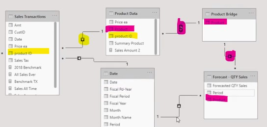

# Multiple Date Tables

Use the dax function USERELATIONSHIP to express to which of the many date columns in your fact table the date table should relate to. Examples for different date columns might be order date, shipping date ...  

Another option is to create new date tables for each date column.

## Disconnected Tables

Table is not related to fact table, like a "What-if" Parameter.

    New Forecast = 'What-if'[Forecast Adjust Value] * sum('Forecast'[forecast QTY Sales])

# Visualization

## Design principles.

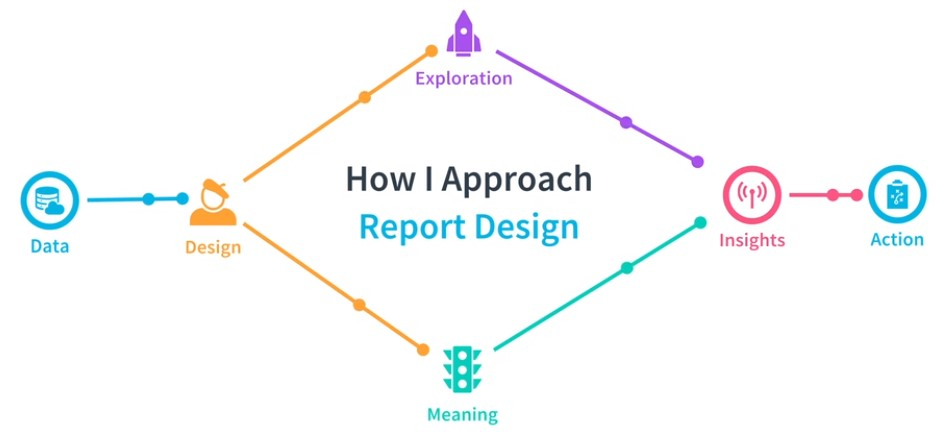

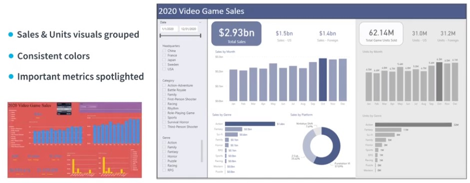

|A|B|C|D|
|-|-|-|-|
|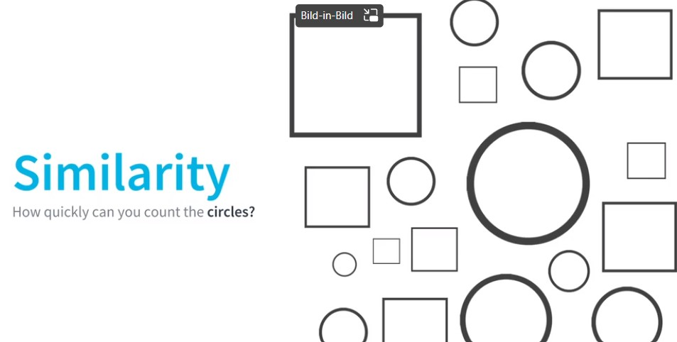|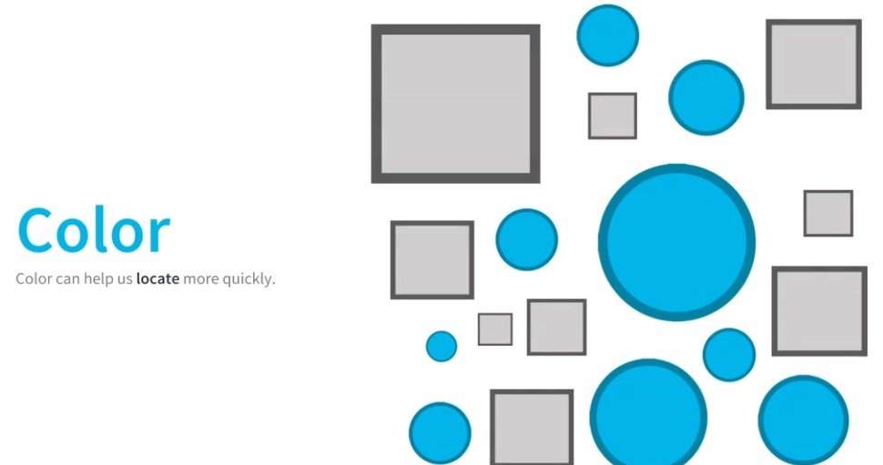||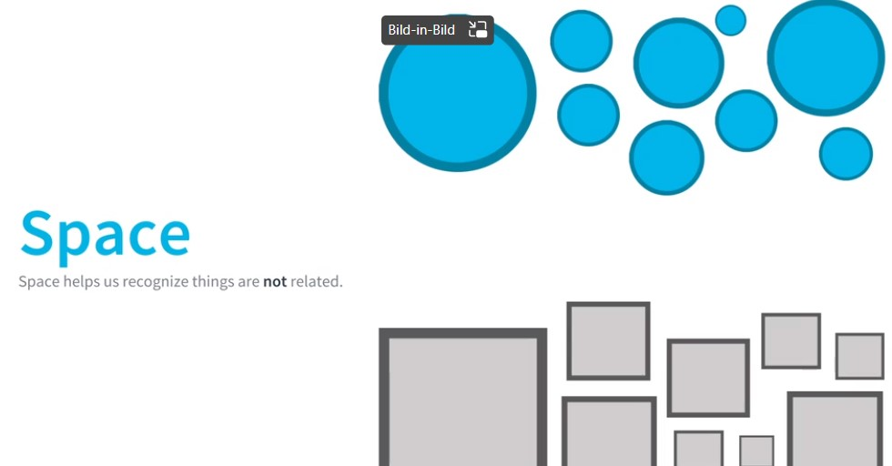|
|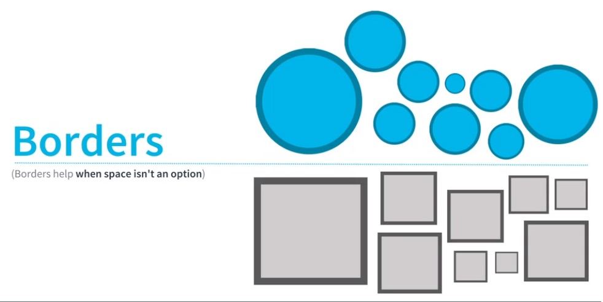|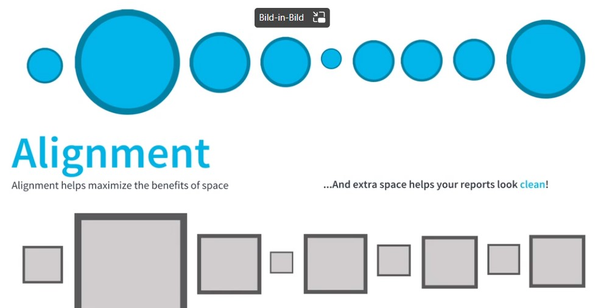|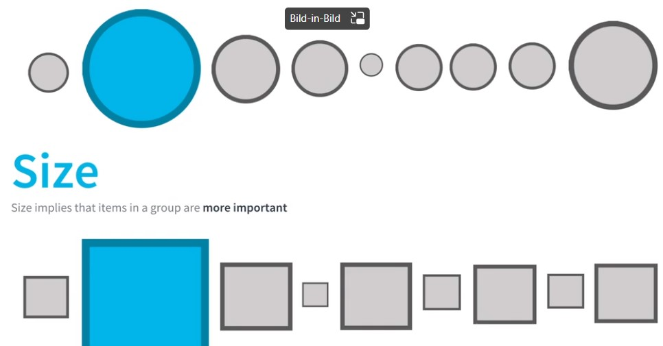|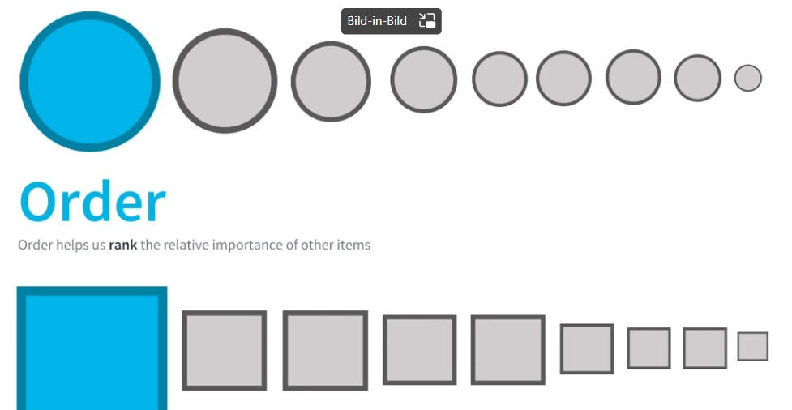|

## Chart Types

### Bar Charts
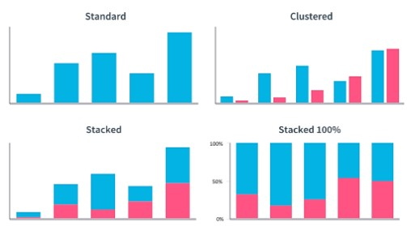

### Line Charts
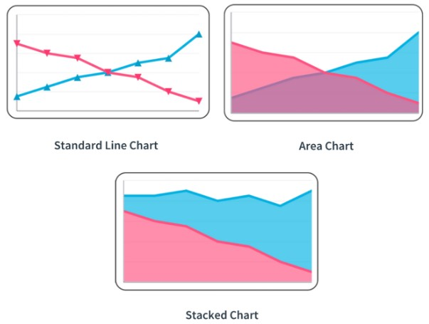

# Write Data from BPI to SQL

https://www.youtube.com/watch?v=WgIhsF7kEjI

https://www.youtube.com/watch?v=uPHwjPRnRwE

# Data Analytics

## Analytics Process

|Stage|Description|Example|
|-|-|-|
|Define|Problem Statement|We need to prepare for the challenges of an aging population|
|Construct|Research Topic|Which countries age the fastest?|
|Retrieve|Access Data Sources|Census data, population statistics, economic data|
|Cleaning|Clean and Organize the Data||
|Conclusion|Take Measurements, make Conclusion||

