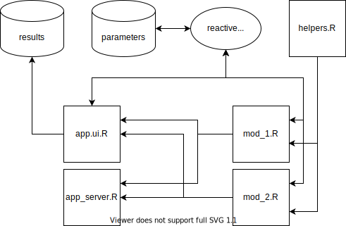

# Application Architecture

The user interacts with the dataset using the application interface 'app_ui.R'. All features are encapsulated in modules (mod_1.R, mod_2.R). All changes in the user interface are stored in a reactive list. Changes to this list affect the display elements in the user interface. The list is stored in the database. The result of the app is stored in the database.
