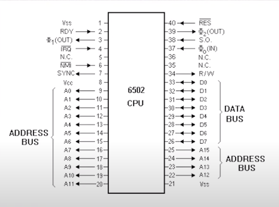
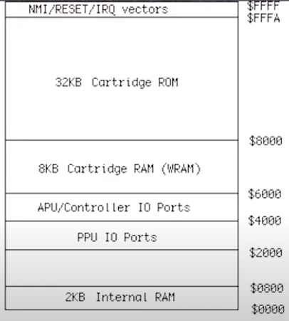
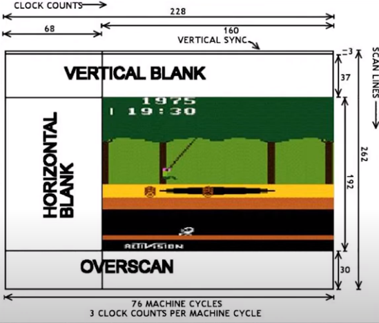

# 6502

Most information on this page is compiled from 'Programmer Den's Youtoube channel. The particular playlist is here: https://youtube.com/playlist?list=PLnjAJ75A-OrDWPcVzIB63cqsRCLHJd80E&si=wKQ9lkAveRlJ4Mls  

[Github Repo](https://github.com/danielsega/Nes-Tutorial)  
[Nerdy Night Mirror](https://nerdy-nights.nes.science/)

## Dev Environment

## Architecture

### CPU

### PPU

Nintendo chip to display graphics.  

  
