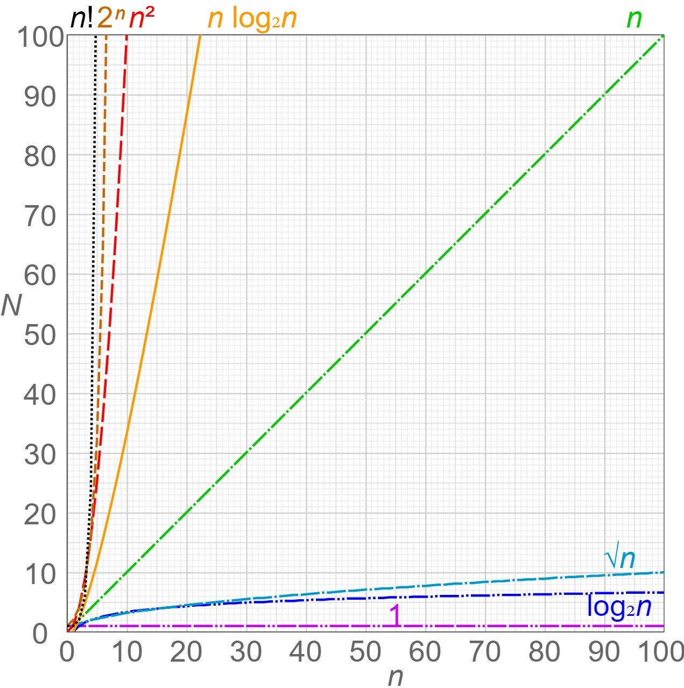

# What is good code?

* Readable
* Scalable
    * Time Complexity
    * Space Complexity

# Big O

Characterise code in terms of runtime and memory requirements.

## Time Complexity

### Rules

1. Worst case
2. Remove constants
3. Different terms for inputs
4. Drop non dominants

# Sources

Udemy: https://www.udemy.com/course/master-the-coding-interview-data-structures-algorithms/
