# Introduction to Data Structures

Data Structures + Algorithms = Programs  
  
How to built a data structure?  
How to use a data structure?  
  
## How Computers Store Data

* RAM Random Access Memory (fast): Variables
* Storage (slow): Persistant data
* CPU
* Cache (Tiny RAM, very fast)
  
## Most Important Data Structures

* Arrays
* Stacks
* Queues
* Linked Lists
* Trees
* Tries
* Graphs
* Hash Tabley

## Data Operations

* Access
* Insertion
* Deletion
* Traversal
* Searching
* Sorting

# Arrays

|No Index|Item|
|-|-|
|0|Juice|
|1|Apple|
|2|...|

* lookup O(1)
* push O(1)
* insert O(n)
* delete O(n)
<a/>

## Examples

    const strings = ['a','b','c','d'];
    //32Bit: 4 shelfs * 4 items = 16 bytes of storage

    strings[2] //index starts from 0
    > 'c'

    strings.push('e'); // O(1)

    console.log(strings);
    > ['a','b','c','d','e']

    strings.pop(); // O(1)
    > ['a','b','c','d']
    
    strings.unshift('x');
    > ['x','a','b','c','d'] // O(n)
    
    strings.splice(2, 0, 'y');
    > ['c','a','y','b','c'] // O(n/2) > O(n)
    
## Types of Arrays

* Static (Fixed Size)
* Dynamic > append O(1) can be O(n)

## Implementing an Array

    class MyArray {
      constructor() {
        this.length = 0;
        this.data = {};
      }
      
      get(index) {
        return this.data[index];
      }
      
      push(item) {
        this.data[this.length] = item;
        this.length ++;
        return this.length;
      }
      
      pop() {
        const lastItem = this.data[this.length-1];
        delete this.data[this.length-2];
        this.length --;
        return LastItem;
      }
      
      delete(index) {
        const item = this.data[index];
        this.shiftItems(index);
      }
      
      shiftItems(index) {
        for (let i = index; i < this.length - 1; i++) {
          this.data[i] = this.data[i+1];
        }
        delete this.data[this.length-1];
        this.length --;
      }
    }
    
    const newArray = new MyArray();
    newArray.push('hi');
    newArray.index(0);
    mewArray.pop();

## Conclusion

|Pro|Con|
|-|-|
|Fast lookkups|Slow inserts|
|Fast Push/Pop|Slow deletes|
|Ordered|Fixes-size|

# Hash Tables

Dictionaries, Objects, Hashtables, Libraries ...  

    basket.grapes = 1000

|Key|Value|
|-|-|
|501|1|
|502|3|
|501|...|

* insert O(1)
* lookup O(1)
* delete O(1)
* search O(1)
<a/>

## Hash Function (md5 Hash)

Generates value of fixed length for each input. You cannot generate the input from the output. It generates always the same output, if the input is constant.
  
indepotent  
  
Values are put in specific position in memory, based on the value. We do not need to iterare the whole datastructure.

## Downside: Collision

Different keys can generate same memory address, because of limited memory space. This is called collision. This proplem is solved by another datastructures like linked lists. Collisions slow down hash tables.

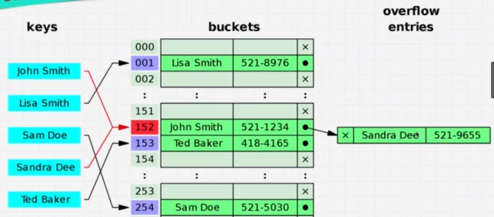
  
## Examples

    let user = { // keys must be strings. Random insertion order
      age:54,
      name: 'Kyle',
      magic:'true',
      scream: function() {
        console.log('aaah!');
      }
    }
    
    user.age; // O(1)
    user.speall = 'abra kadabra'; // O(1)
    user.scream(); // O(1)
    
    const a = new Map() //Save any datatype as key. Maintain insertion order
    
    const b = new Sets() // Stores just keys, no values

## Implementing a Hash Table

    class HashTable {
      constructor(size){
        this.data = new Array(size); // ['grapes',10000]
      }
      
      _hash(key) { // _ means private function
        let hash = 0;
        for (let i = 0; i < key.length; i++) {
          hash = (hash + key.charCodeAt(i) * i) %
          this.data.length;
        }
        return hash;
      }
      
      set(key, value) {
        let address = this._hash(key);
        if (!this.data[adress]) {
          this.data[address] = [];
        }
        this.data[address].push(key,value]);
      }
      
      get(key) {
        let address = this._hash(key);
        const currentBucket = this.data[address];
        if (currentBucket) {
          for(let i = 0; i < currentBucket.length; i++) {
            if (currentBucket[i][0] === key) {
              return currentBucket[i][1];
            }
          }
        }
      }
      
      keys() {
        const keysArray = [];
        for (let i=0; i < this.data.length; i++) {
          if(this.data[i]) {
            keysArray.push(this.data[i][0][0]);
          }
        }
        return keysArrays;
      }
    }
    
    const myHashTable = new HashTable(50);
    myHashTable.set('grapes',10000);
    myHashTable.set('apples',50);
    myHashTable.set('oranges',1);
    myHashTable.get('grapes);
    myHashTable.keys();

## Comparison

|Method|Arrays|HashTables|
|-|-|-|
|search|O(n)|O(1)|
|lookup|O(1)|O(1)|
|push|O(1)||
|insert|O(1)|O(1)|
|delete|O(n)|O(1)|

## Examples

    //Given 2 arras, create a function that let's user know whether these two arrays contain any common items.
    
    fucntion containsCommonItem_slow(arr1,arr2) {
      for (let i=0; arr1.length; i++) {
      }
        for (let j=0; arr2.length; j++) {
          if(arr1[i] === arr2[j]) {
            return true;
          }
        }
      }
    } //O(n^2)
    
    function containsCommonItem_fast(arr1,arr2) {
      let map = {};
      for (let i=0; i < arr1.length; i++) {
        if(!map[array1[i]]) {
          const item = array1[i];
          map[item] = true;
        }
      }
      for (let j=0; j < arr2.length; j++) {
        if(map[array2[i]]) {
          return array2[j];
        }
      }
    } // O(n)

    //Given an array = [2,5,1,2,3,5,1,2,4]
    //Tell the first recurring Number (2)
    
    function fristRecurringCharacter_slow(input) {
      for (let i = 0; i < input.length; i++) {
        for (let j = i + 1; j < input.length; i++) {
          return input[i];
        }
      }
    } //O(n^2) //Solution: 2
    
    function firstRecurringCharacter_fast(input) {
      let map = {};
      for (let i = 0; i < input.length; i++) {
        if(map[input[i]] !== undefined) {
          return input[i];
        } else {
          map[input[i]] = i
        } 
      }
    } //O(n) //downside: higher memory requirement //Solution 5
    
    firstRecurringCharacter_fast([2,5,5,2,3,5,1,2,4])
    
## Conclusion

|Pro|Con|
|-|-|
|Fast lookups|Unordered|
|Fast Inserts|Slow Iteration|
|Flexible Keys||

# Linked Lists

* Singly Linked Lists
* Doubly Linked Lists
<a/>

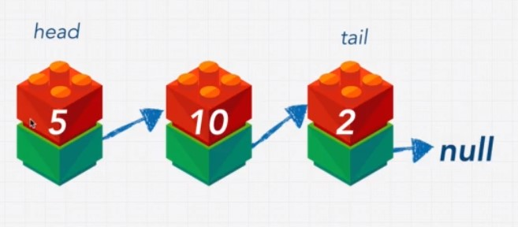

    const basket = ['apples','grapes','pears'];
    
## Comparison

|prepend|O(1)|
|append|O(1)|
|loopkup|O(n)|
|insert|O(n)|
|delete|O(n)|

## Pointer

    const obj1 = {a:true];
    const obj2 = obj1;
    
    obj1.a = false;
    
    => obj1 = false, ob2 = false
 
## Example Singly Linked List
 
    //1 --> 10 --> 5 --> 99 --> 16
    
    //let myLinkedList = {
    //  head: {
    //    value: 10
    //    next: {
    //      value: 5,
    //      next: {
    //        value: 16,
    //        next: null
    //      }
    //    }
    //  }
    //}
    
    class newNode {
      constuctor(value) {
        this.value = value;
        this.next = null;
      }
    }
    
    class LinkedList {
      constuctor(value) {
        this.head = new Node(value);
        this.tail = this.head;
        this.length = 1;
      }
      
      append(value){
        const newNode = new Node(value);
        this.tail.next = newNode;
        this.tail = newNode;
        this.length++;
        return this;
      }
      
      prepend(value){
        const newNode = new Node(value);
        newNode.next = this.head;
        this.head = newNode;
        this.length++;
        return this;
      }
      
      printList(){
        const array = [];
        let currentNode = this.head;
        while (currentNode !== null) {
          array.push(currentNode.value);
          currentNode = currentNode.next;
        }
      }
      
      insert(index, value) {
        //check params
        if (index >= this.length) {
          return this.append;
        }
        const newNode = new Node(value);
        currentNode = {};
        const leader = this.traverseToIndex(index-1);
        const holdingPointer = leader.next;
        leader.next = newNode;
        newNode.next = holdingPointer;
        this.length++;
        return this.printList();
      }
      
      traverseToIndex(index) {
        //check params
        let counter = 0;
        let currentNode = this.head;
        while (counter !== index {
          currentNode = currentNode.next;
          coutner++;
        }
        return currentNode;
      }
      
      remove(index) {
        //check params
        const leader = this.traverseToIndex(index-1);
        const unwantedNode = leader.next;
        leader.next = unwantedNode.next;
        this.length--;
        return this.printLIst();
      }
      
    }
    
    const myLinkedList = new LinkedList(10);
    myLinkedList.append(5);
    myLinkedList.append(16);
    myLinkedList.prepend(1);
    myLinkedList.insert(2,99);
    
## Doubly Linked Lists

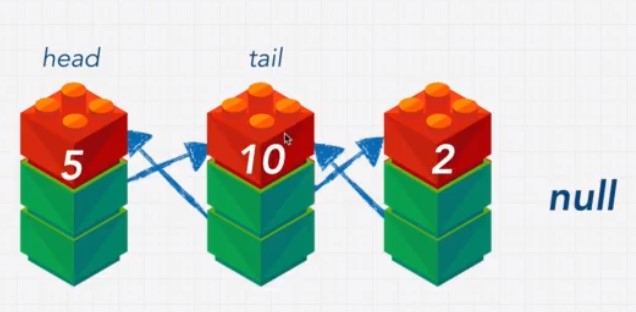

## Example Doubly Linked List

    class newNode {
      constuctor(value) {
        this.value = value;
        this.prev = null;
        this.next = null;
      }
    }
    
    class LinkedList {
      constuctor(value) {
        this.head = new Node(value);
        this.tail = this.head;
        this.length = 1;
      }
      
      append(value){
        const newNode = new Node(value);
        newNode.prev = this.tail;
        this.tail.next = newNode;
        this.tail = newNode;
        this.length++;
        return this;
      }
      
      prepend(value){
        const newNode = new Node(value);
        newNode.next = this.head;
        this.head.prev = newNode;
        this.head = newNode;
        this.length++;
        return this;
      }
      
      printList(){
        const array = [];
        let currentNode = this.head;
        while (currentNode !== null) {
          array.push(currentNode.value);
          currentNode = currentNode.next;
        }
      }
      
      insert(index, value) {
        //check params
        if (index >= this.length) {
          return this.append;
        }
        const leader = this.traverseToIndex(index-1);
        const follower = leader.next;
        leader.next = newNode;
        newNode.prev = leader;
        newNode.next = follower;
        follower.prev = newNode;
        this.length++;
        return this.printList();
      }
      
      traverseToIndex(index) {
        //check params
        let counter = 0;
        let currentNode = this.head;
        while (counter !== index {
          currentNode = currentNode.next;
          coutner++;
        }
        return currentNode;
      }
      
      remove(index) {
        //check params
        const leader = this.traverseToIndex(index-1);
        const unwantedNode = leader.next;
        const follower = unwantedNode.next;
        leader.next = unwantedNode.next;
        follower.prev = unwantedNode.prev;
        this.length--;
        return this.printLIst();
      }
      
    }
    
    const myLinkedList = new LinkedList(10);
    myLinkedList.append(5);
    myLinkedList.append(16);
    myLinkedList.prepend(1);
    myLinkedList.insert(2,99);
    
## Singly vs Doubly Linked Lists

|Singly|Doubly|
|-|-|
|+ simple|- complex|
|+ memory efficient|- more memory|
|+ fast|- slower|
|- no backwards search|+ backwards search|

## Reverse Singly Linked List

    class newNode {
      constuctor(value) {
        this.value = value;
        this.next = null;
      }
    }
    
    class LinkedList {
      constuctor(value) {
        this.head = new Node(value);
        this.tail = this.head;
        this.length = 1;
      }
      
      append(value){
        const newNode = new Node(value);
        this.tail.next = newNode;
        this.tail = newNode;
        this.length++;
        return this;
      }
      
      prepend(value){
        const newNode = new Node(value);
        newNode.next = this.head;
        this.head = newNode;
        this.length++;
        return this;
      }
      
      printList(){
        const array = [];
        let currentNode = this.head;
        while (currentNode !== null) {
          array.push(currentNode.value);
          currentNode = currentNode.next;
        }
      }
      
      insert(index, value) {
        //check params
        if (index >= this.length) {
          return this.append;
        }
        const newNode = new Node(value);
        currentNode = {};
        const leader = this.traverseToIndex(index-1);
        const holdingPointer = leader.next;
        leader.next = newNode;
        newNode.next = holdingPointer;
        this.length++;
        return this.printList();
      }
      
      traverseToIndex(index) {
        //check params
        let counter = 0;
        let currentNode = this.head;
        while (counter !== index {
          currentNode = currentNode.next;
          coutner++;
        }
        return currentNode;
      }
      
      remove(index) {
        //check params
        const leader = this.traverseToIndex(index-1);
        const unwantedNode = leader.next;
        leader.next = unwantedNode.next;
        this.length--;
        return this.printLIst();
      }
      
      reverse () {
        if (!this.head.next){
          return this.head;
        }
        let first = this.head;
        this.tail = this.head;
        let second = first.next;
        while(second) {
          const temp = second.next;
          second.next = first;
          first = second;
          second = temp;
        }
        this.head.next = null;
        this.head = first;
        return this.printList();
      }
      
    }

# Stacks and Queues

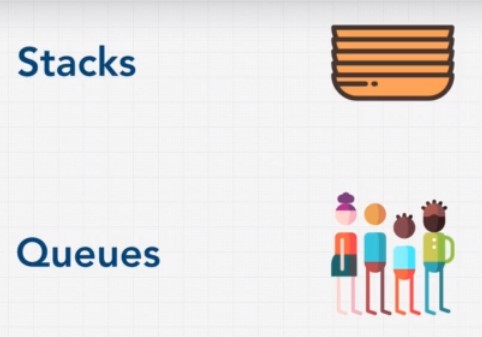

## Stacks

Browser history ...  

LIFO (Last im, first out)  

|Operation|O|
|-|-|
|loopkup|O(n)|
|pop|O(1)|
|push|O(1)|
|peek|O(1)|

## Queues

FIFO (First in, first out)

|Operation|O|
|-|-|
|lookup|O(1)|
|enqueue|O(1)|
|dequeue|O(1)|
|peek|O(1)|

## Example Stack

    class Node {
      constructor(value){
        this.value = value;
        this.next = null;
      }
    }

    class Stack {
      constructor(){
        this.top = null;
        this.bottom = null;
        this.length = 0;
      }
      
      peek(){
        return this.top;
      }
      
      push(value){
        const newNode = new Node(value);
        if (this.length) == 0 {
          this.bottom = newNode;
        } else {
          const holdingPointes = this.top;
          this.top = newNode;
          this.top.next = holdingPointer;
        }
        this.length++;
        return this;
      }
      
      pop(){
        if (!this.top) {
          return null;
        }
        if (this.top === this.bottom) {
          this.bottom = null;
        }
        //const holdingPointer = this.top;
        this.top = this.top.next;
        this.length--;
        return this;
      }
    }
    
    const myStack = new Stack();
    myStack.push('google');
    myStack.push('udemy');
    myStack.push('discord');
    myStack.peek();
    myStack.pop();
 
## Example Queue

    class Node {
      constructor(value){
        this.value = value;
        this.next = null;
      }
    }
    
    class Queue {
      constructor() {
        this.first = null;
        this.last = null;
        this.length = 0;
      }
    }
    
    peek(){
      return this.first;
    }
    
    enqueue(value){
      newNode = new Node(value);
      if (this.length === 0) {
        this.first = newNode;
        this.last = newNode;
      } else {
        this.last.next = newNode;
        this.last = newNode;
      }
      this.length++;
      return this;
    }
    
    dequeue(){
      if(!this.first) {
        return null;
      }
      if(this.first === this.last) {
        this.last = null;
      }
      this.first = this.first.next;
      this.length--;
      return this;
    }
    
    const myQueue = new Queue();
    myQueue.enqueue('Joy');
    myQueue.enqueue('Matt');
    myQueue.enqueue('Pavel');
    myQueue.peek();
    myQueue.dequeue();
    myQueue.dequeue();
    myQueue.dequeue();

# Trees

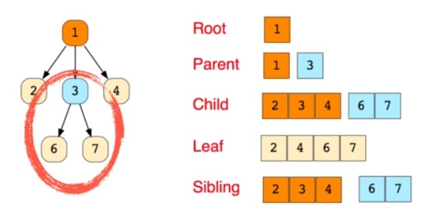

Abstract syntax tree  

## Binary Trees

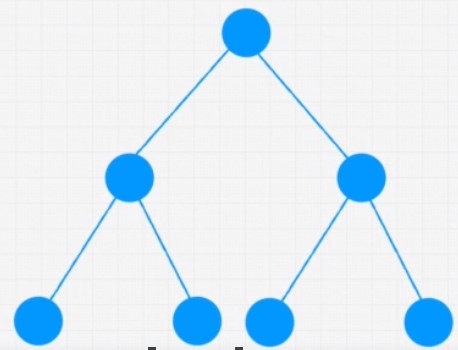

    function BinaryTreeNode(value) {
      this.value = value;
      this.left = null;
      this.right = null;
    }
    
* 'Perfect binary tree' -> All nodes are filled
* 'Full Binary Tree' -> A node has either 0, 1 or 2 children.
<a/>

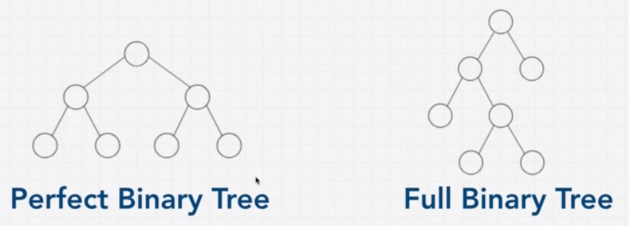

|operation|O|
|-|-|
|lookup|O(log N)|
|insert|O(log N)|
|delete|O(log N)|

### O(log N)

    Level 0: 2^0 = 1;
    Level 1: 2^1 = 2;
    Level 2: 2^2 = 4;
    Level 3: 2^3 = 8;

    number of nodes = 2^h - 1;  
    log nodes = height

Binary Search Tree: Example, search for a person in a phonebook.  

### Binary Search Trees

[VisualGo](https://visualgo.net/en/bst)

               101
           33       105
         9   37  104   144

* All values right of the node are bigger than the node
* All values left of the node are smaller than the node
* A node can only have two children
<a/>

|operation|O|
|-|-|
|lookup|O(log N)|
|insert|O(log N)|
|delete|O(log N)|

|Pro|Con|
|-|-|
|Better than O(n)|No O(1) operations|
|Ordered||
|Flexible Size||

### Balanced vs Unbalanced

Tree turns into linked list, if items are just appended on one side. There are ways to balance the tree using 'AVL Time', or 'Red Black Tree'.  

=> O[log n] turns into O[n]  

### Example Binary Search Tree

    class Node {
      constructor(value){
        this.left = null;
        this.right = null;
        this.value = value;
      }
    }

    class BinarySearchTree {
      constructor(){
        this.root = null;
      }
      insert(value){
        const newNode = new Node(value);
        if (this.root === null) {
          this.root = newNode;
        } else {
          let currentNode = this.root;
          while(true){
            if(value < currentNode.value){
              //Left
              if(!currentNode.left){
                currentNode.left = newNode;
                return this;
              }
              currentNode = currentNode.left;
            } else {
              //Right
              if(!currentNode.right){
                currentNode.right = newNode;
                return this;
              } 
              currentNode = currentNode.right;
            }
          }
        }
      }
      lookup(value){
        if (!this.root) {
          return false;
        }
        let currentNode = this.root;
        while(currentNode){
          if(value < currentNode.value){
            currentNode = currentNode.left;
          } else if(value > currentNode.value){
            currentNode = currentNode.right;
          } else if (currentNode.value === value) {
            return currentNode;
          }
        }
        return null
      }
      remove(value) {
        if (!this.root) {
          return false;
        }
        let currentNode = this.root;
        let parentNode = null;
        while(currentNode){
          if(value < currentNode.value){
            parentNode = currentNode;
            currentNode = currentNode.left;
          } else if(value > currentNode.value){
            parentNode = currentNode;
            currentNode = currentNode.right;
          } else if (currentNode.value === value) {
            //We have a match, get to work!

            //Option 1: No right child: 
            if (currentNode.right === null) {
              if (parentNode === null) {
                this.root = currentNode.left;
              } else {

                //if parent > current value, make current left child a child of parent
                if(currentNode.value < parentNode.value) {
                  parentNode.left = currentNode.left;

                //if parent < current value, make left child a right child of parent
                } else if(currentNode.value > parentNode.value) {
                  parentNode.right = currentNode.left;
                }
              }

            //Option 2: Right child which doesnt have a left child
            } else if (currentNode.right.left === null) {
              currentNode.right.left = currentNode.left;
              if(parentNode === null) {
                this.root = currentNode.right;
              } else {

                //if parent > current, make right child of the left the parent
                if(currentNode.value < parentNode.value) {
                  parentNode.left = currentNode.right;

                //if parent < current, make right child a right child of the parent
                } else if (currentNode.value > parentNode.value) {
                  parentNode.right = currentNode.right;
                }
              }

            //Option 3: Right child that has a left child
            } else {

              //find the Right child's left most child
              let leftmost = currentNode.right.left;
              let leftmostParent = currentNode.right;
              while(leftmost.left !== null) {
                leftmostParent = leftmost;
                leftmost = leftmost.left;
              }

              //Parent's left subtree is now leftmost's right subtree
              leftmostParent.left = leftmost.right;
              leftmost.left = currentNode.left;
              leftmost.right = currentNode.right;

              if(parentNode === null) {
                this.root = leftmost;
              } else {
                if(currentNode.value < parentNode.value) {
                  parentNode.left = leftmost;
                } else if(currentNode.value > parentNode.value) {
                  parentNode.right = leftmost;
                }
              }
            }
          return true;
          }
        }
      }
    }

    const tree = new BinarySearchTree();
    tree.insert(9)
    tree.insert(4)
    tree.insert(6)
    tree.insert(20)
    tree.insert(170)
    tree.insert(15)
    tree.insert(1)
    tree.remove(170)
    JSON.stringify(traverse(tree.root))

    //     9
    //  4     20
    //1  6  15  170
    
    //       9
    //   4       20
    // 1   6   15  170

### AVL Trees & Red Black Trees

To avoid unbalanced trees in real life, use packages like 'AVL Trees', or 'Red Black Trees'.

## Binary Heaps

Root note is always greater than every node on the next level down. There is no left right order. There is no problem with balancing. Insertion order is preserved.

|Operation|O(n)|
|-|-|
|lookup|O(n)|
|insert|O(log N)|
|delete|O(log N)|

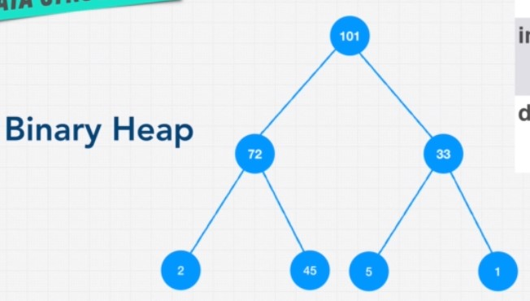

### Priority Queue

Each element in queue has prioority.

|Pro|Con|
|-|-|
|Better than O(n)|Slow lookup|
|Priority||
|Flexible Size||
|Fast insert||

## Trie

Does a word exist in a body of text? Search for a city in car navigation.

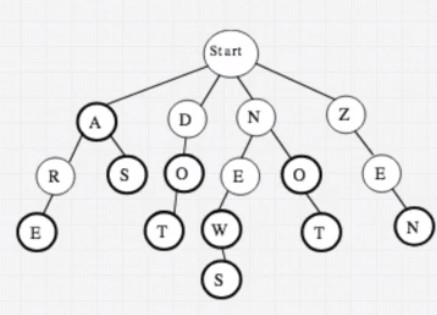

O(length of the word)

# Graphs

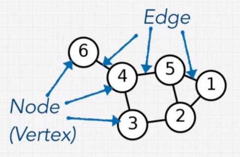

Linked lists and trees are special cases of graphs.

Examples: [VisualGo](https://visualgo.net/en/bst)

## Directed vs Undirected

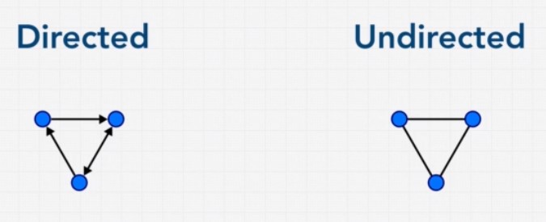

## Weighted vs Unweighted

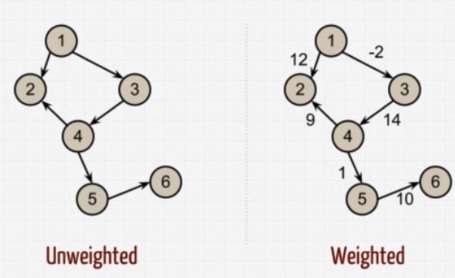

## Cyclic vs Acyclic

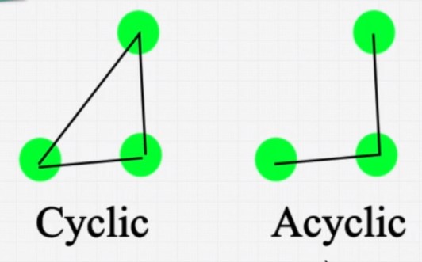

## Example

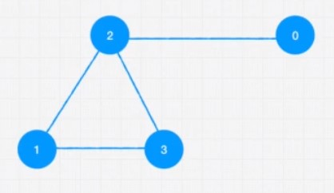

    //Edge List
    const graph = [[0,2],[2,3],[2,1],[1,3]];
    
    //Adjacent List
    const graph = [[2],[2,3],[0,1,3],[1,2]];
    
    //Adjacent Matrix
    const graph = [
      [0,0,1,0],
      [0,0,1,1],
      [1,1,0,1],
      [0,1,1,0]
    ]
    
    class Graph {
      constructor(){
        this.numberOfNodes = 0;
        this.adjacentList = {};
      }
      
      addVertex(node){
        this.adjecentList[node] = [];
        this.numberOfNodes++;
      }
      
      addEdge(node1,node2){
        //undire
        this.adjacentList[node1].push(node2);
        this.adjacentList[node2].push(node1);
      }
      
      showConnections(){
        const allNodes = Objects.keys;
        (this.adjacentList);
        for (let node of allNodes) {
          let nodeConnections =
          this.addjacentList[node];
          let connections = "";
          let vertex;
          for (vertex of nodeConnections) {
            connections += vertex + " ";
          }
          console.log(node + "-->" + connections);
        }
      }
    }
    
    const myGraph = new GRaph();
    myGraph.addVertex('0');
    myGraph.addVertex('1');
    myGraph.addVertex('2');
    myGraph.addVertex('3');
    myGraph.addVertex('4');
    myGraph.addVertex('5');
    myGraph.addVertex('6');
    myGraph.addEdge('3','1');
    myGraph.addEdge('3','4');
    myGraph.addEdge('4','2');
    myGraph.addEdge('4','5');
    myGraph.addEdge('1','2');
    myGraph.addEdge('1','0');
    myGraph.addEdge('0','2');
    myGraph.addEdge('6','5');
    
    myGraph.showConnections();
    
## Review

|Pro|Con|
|-|-|
|Relationships|Scaling is hard|

[Neo4J](https://neo4j.com/)
