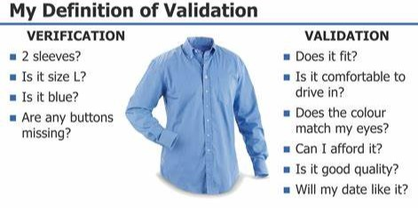
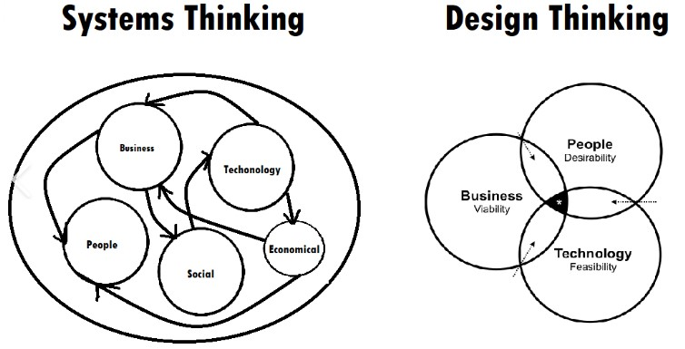

# Testing
## 1.1 What is Testing?
If software does not work correctly it can cause loss of money, time of business reputation. Software testing assesses software quality. It helps reducing the risk of software failure in operation.  
Software testing is a set of activities to discover defects and evaluate the quality of software artifacts (when tested named a s test objects).  
* verification: Checking whether the system meets specified requirements
* validation: Checking whether the system meets useres and other steakholders neets
</li>

* dynamic: Execution of software
* static: No execution of software, like reviews and analysis
</li>

Testers use tools, but is is important that testing is largely an intellectural activity, requiring the testes to have specialized knowledge, use analytical skills and apply critical thinking and systems thinking.  

### 1.1.1 Test Objectives
* Evaluating work products such as requirements, user stories, designs and code
* Trigger failures and finding defects
* Ensuring required coverage of a test object
* Reducing the level of risk of inadequate software quality
* Verifying whether specified requirements have been fulfilled
* Verifying that a test objecct complies with contractual, legal, and regulatory requirements
* Providing information to stakeholdes to allow them to make informed decisions
* Building confidence in the quality of the test object
* Validating whether the test object is compolete and works a expected
</li>

### 1.1.2 Testing and Debugging
Testing and debugging are separate activities. Testing can trigger failures that are caused by defects in the software (dynamic testing) of can directly find defects in the test object (static testing).  
When dynamic testing triggers a failure, debugging ist concerned with finding cuases of this failure (defects), analyzing these causes, and eliminating them. The typical debugging process in this case involves:
* Reproduction of a failure
* Diagnosis (finding the root cause)
* Fixing the cause
</li>

Subsequent confirmation testing checks whether the fixes resolved the problem (Testing should be done by the same person).  
When static testing identifies a defect, debugging is concerned with removing it. There is no need for reproduction of diagnosis, since static testing directly finds defects, and cannot cause failures.

