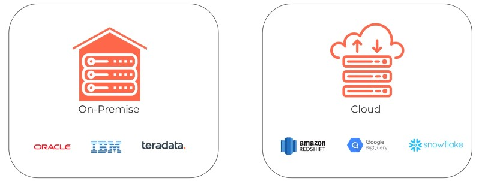
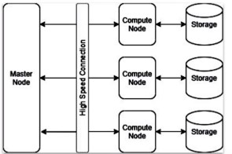
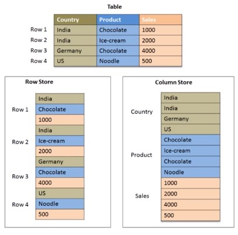
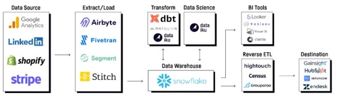
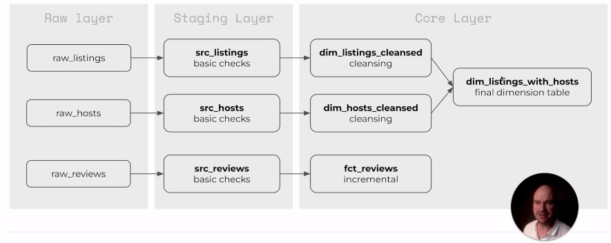

# dbt (Data Build Tool)

dbt: https://www.getdbt.com/
Snowflake: https://ns18238.us-east-2.aws.snowflakecomputing.com
Jinja: https://jinja.palletsprojects.com/en/3.1.x/
Udemy: https://www.udemy.com/course/complete-dbt-data-build-tool-bootcamp-zero-to-hero-learn-dbt

## Admin

### Install

    pip install virtualenv
    virtualenv venv
    
    source venv\Scripts\activate

### dbt commands

#### Check Structure

    dbt compile
    
#### Create Models

    dbt run
    
#### Create Snapshots

    dbt snapshot
    
#### Run Tests

    dbt test
    
#### Install Packages

Get packages fromhttps://hub.getdbt.com/ and reference it in packages.yml

    dbt deps
    
#### Generate Documentation

    dbt docs generate
    dbt docs serve

## Data Maturity Model

Data Collection > Data Wrangling > Data Integration > BI and Analytics > Artificial Intelligence 

### Data Integration

Write data from staging area to database.

### ETL vs ELT (Extract, Transform, Load)

* Data Warehouse: Source > Extract > Transform > Load  
* Data Lakehouse: Soruce > Extract > Load > Transform

## Data Storage

### Data Warehouse

A central repository of integrated data from one or more disparate sources. It is used to store structured data.

### Data Lake

Storage of unstructured data like Images and text files.

### Data Lakehouse

Data management like in a data warehouse, but data is stored cheap datalakes

## SCDs Slowly Changing Dimensions

|Type|Desctiption|
|-|-|
|0|Not updating the DWH when a dimension changes|
|1|Overwrite original data|
|2|Add new row|
|3|Add new attribute|

## CTE Common Table Expression

    -- STEP 1
    with raw_listings as (
    
    -- STEP 2
        select * from [source] [listings]
    )
    
    -- STEP 3
    select * ftom raw_listings

## Data Stack

### SMP Warehouses (Symmetric Multi Procecessing)

Each processor is trated equally and runs in parallel with one another. The workload is evenly distributed when processing the program. Each processor shares the same resources. A single computer with multuple CPU cores.  
This architecture can only scale vertically.

### MPP Cloud Warehouse (Multi Parallel Processing)

Master node and compute nodes. Each processor has its own dedicated resources. Many computers work together.  

### Decoupling of Data and Storage

Comopute nodes are shut down, if not needed. Data persists.

### Column Oriented Databases

Row oriented databases are good in reading and writing data, but not efficient for analytical workloads.

### Modern Data Stack

## dbt Structures

### Materializations

|Type|Use|Don't Use|
|-|-|-|
|View|lightweight representation|Date often used|
|Table|Data often used|Single-use models, Incremental tables|
|Incremental|Fact tables, Appends|Update historical records|
|Ephemeral|Alias data|Read model several times|

### Seeds and Sources

* Seeds are local files that you upload to the dwh
* Sources are abstraction layers on th top of your input tables
</a>

#### Seeds

Copy csv file in 'seeds' folder

    dbt seed
    
#### Sources

Sources are abstractions of tables.

    with raw_reviews as (
        select * from {{source('airbnb','reviews')}}--AIRBNB.RAW.RAW_REVIEWS
    )
    
##### Data Freshness

Check, if data is current. Condigure freshness in 'sources.yml'

    sources:
      - name: airbnb
        schema: raw
        tables:
          - name: reviews
            identifier: raw_reviews
            loaded_at_field: date
            freshness:
              warn_after: {count: 1, period: hour}
              error_after: {count: 24, period: hour}
              
run command

    dbt source freshness

### Snapshots

Handle type 2 slowly changing dimensions. Example update e-mail address and keep history. dbt adds two dimensions: dbt_valid_from and dbt_valid_to.  

|Strategy|How To|
|-|-|
|Timestamp|Unique columns: key and updated_ad|
|Check|Any change in set of columns trigger snapshot|

snapshots/scd_raw_listings.sql

    

    {{
        config(
            target_schema='dev',
            unique_key='id',
            strategy='timestamp',
            updated_at='updated_at',
            invalide_hard_deletes=True
        )
    }}

    select * from {{ source('airbnb','listings')}}

    

### Tests

* There are two types of tests: singular and generic
* Singular tests are SQL queries stored in tests which are expected to return an empty resultset
* Generic tests:
    * unique
    * not_null
    * accepted_values
    * relationships
* You can define your own custom generic tests.
</a>

#### Generic Tests

models/schema.yml

    version: 2

    models:
      - name: dim_listings_cleansed
        columns:
          - name: listing_id
            tests:
              - unique
              - not_null
              
          - name: host_id
            tests:
              - relationships:
                  to: ref('dim_hosts_cleaned')
                  field: host_id
                  
          - name: room_type
            tests:
              - accepted_values:
                  values: ['Entire home/apt',
                          'Private room',
                          'Shared room',
                          'Hotel room']

#### Singular Tests

Tests passes, if query returns no values.

test/dim_listings_minimum_nights.sql

    select
        *
    from
        {{ref('dim_listings_cleaned')}}
    where
        minimum_nights < 1
    limit 10

tests/consistent_crated_at.sql

    SELECT
        *
    FROM
        {{ ref('dim_listings_cleansed') }} l
    INNER JOIN {{ ref('fct_reviews') }} r
        USING (listing_id)
    WHERE
        l.created_at >= r.review_date

### Macros

* Nacros are jinja templates created in the macros folder
* There are many built-in macros in DBT
* You can use macros in model definitions and tests

macros/no_null_in_columns.sql

    
        select
            *
        from
            {{model}}
        where
            
                {{col.column}} is null or
            
                false
    
    
tests/no_nulls_in_dim_listings.sql

    {{no_nulls_in_columns(ref('dim_linstings_cleansed'))}}
    
    dbt test --select dim_listings_cleansed
    
#### Custom Generic Tests

macros/positive_value.sql

    
        select
            *
        from
            {{model}}
        where
            {{column_name}} < 1
    
    
models/schema.yml

    - name: minimum_nights
        test:
            - positive_value

### Third-Party Packages

https://hub.getdbt.com/

#### dbt_utils

packages.yml

    packages:
        - package: dbt-labs/dbt_utils
            version: 0.8.0

models/fct/fct_reviews.sql

    {{
        config(
            materialized = 'incremental',
            on_schema_change='fail'
        )
    }}

    with src_reviews as (
        select * from {{ref('src_reviews')}}
    )

    select
        {{dbt_utils.surrogate_key(['listing_id','review_date','reviewer_name','review_text'])}} as review_id,
        *
    from
        src_reviews
    where
        review_text is not null
    
        and review_date > (select max(review_date) from {{this}})
    

    $ dbt run --full-refresh --select fct-reviews

### Documentation

* Documents can be provided as yaml files, or as markdown files
* dbt ships with a documentation web server
* Customize the landing page with overview.md
* Add assets in special folder
<a/>

#### Basic Documentation

models/schema.yml

    version: 2

    models:
      - name: dim_listings_cleansed
        description: Cleansed table which contains Airbnb listings.
        columns:
          - name: listing_id
            decription: Primary key fot the listing

#### Markdown Files

models/docs.md

    
    Minmum number of nights required to rent this property.
    
    Keep in mind that old listings might have 'minimum_nights' set
    to 0 in the source tables. Our cleansing algorithm updates this
    to '1'.
    

models/schema.yml

    - name: minimum_nights
      description: '{{doc("dim_listing_cleansed__minimum_nights")}}'

#### Overview

Put images in folder "assets"

dbt_project.yml

    asset-paths:["assets"]

models/overview.md

    
    #Airbnb Pipeline
    
    Hey, welcome to our Airbnb pipeline documentation!
    
    Here is the schema of our input data:
    
    
    

### Python Models

https://docs.getdbt.com/docs/building-a-dbt-project/building-models/python-models

models/my_python_model.py

    def model(dbt, session):

    ...

    return final_df
    

    def model(dbt, session):

        # DataFrame representing an upstream model
        upstream_model = dbt.ref("upstream_model_name")

        # DataFrame representing an upstream source
        upstream_source = dbt.source("upstream_source_name", "table_name")

        ...
        
models/downstream_model.sql

    with upstream_python_model as (

        select * from {{ ref('my_python_model') }}

    ),

    ...
