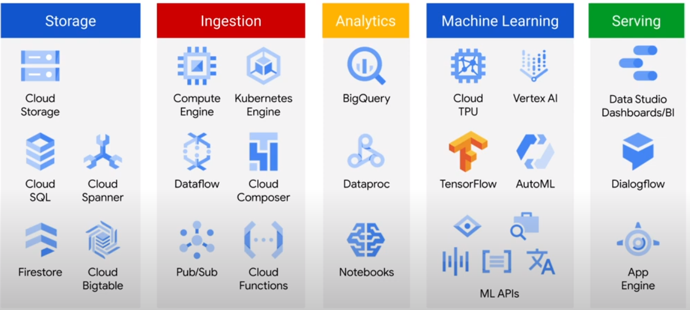

# Google Cloud Platform

## Concepts

* [General](gcp/googlecloudplatform.md)
* [Data Engineering](gcp/dataengineering.md)
* [Data Processing](gcp/dataprocessing.md)
* [Storage Types](gcp/storagetypes.md)

## GCP Modules

|Ingestion|Storage|Analytics|Machine Learning|Orchestration|
|-|-|-|-|-|
|[Dataflow](gcp/dataflow.md)|[Cloud Storage](gcp/cloudstorage.md)|[BigQuery](gcp/bigquery.md)|[AI](gcp/ai.md)|[Cloud Composer](gcp/cloudcomposer.md)|
|[Pub/Sub](gcp/pubsub.md)||[BigTable](gcp/bigtable.md)|||
|[Kubeflow](gcp/kubeflow.md)||[Dataproc](gcp/dataproc.md)|||
|[Datafusion](gcp/datafusion.md)|||||

## [Examples](gcp/examples/)
