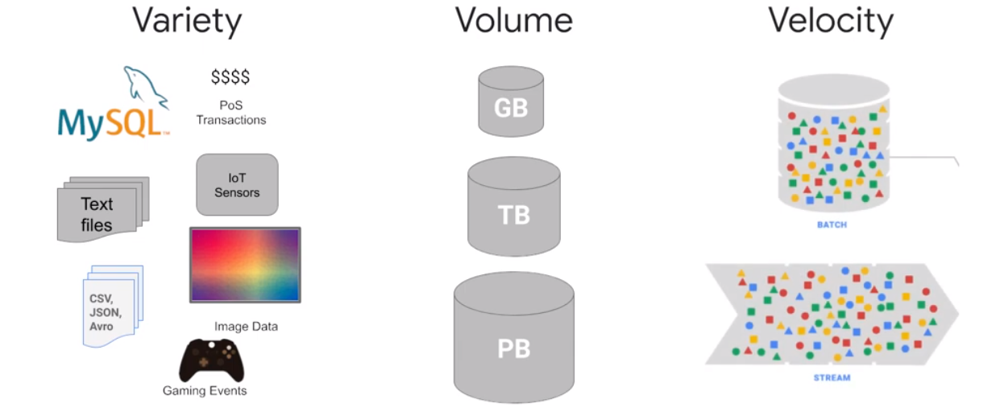
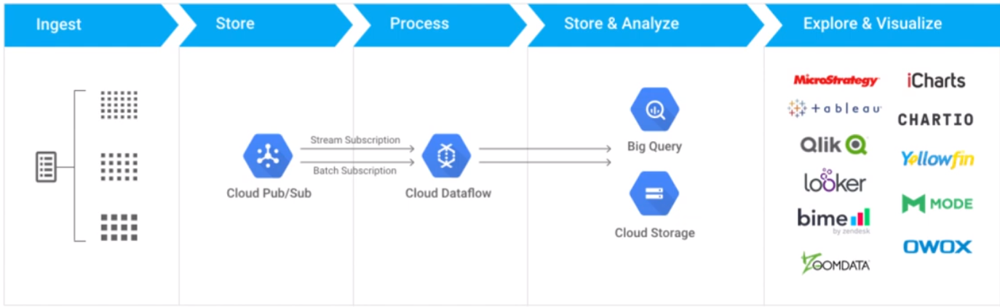
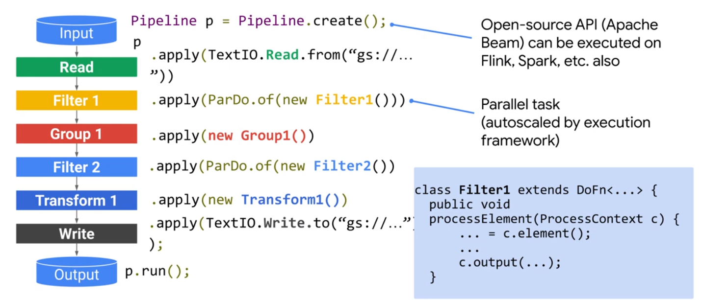
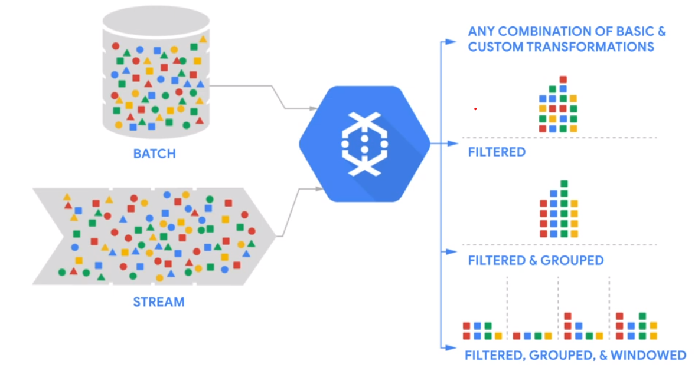
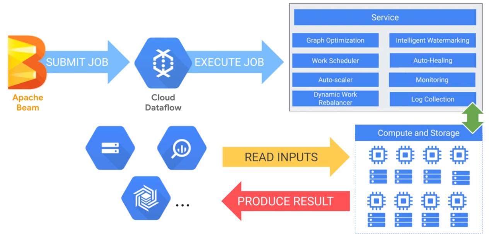
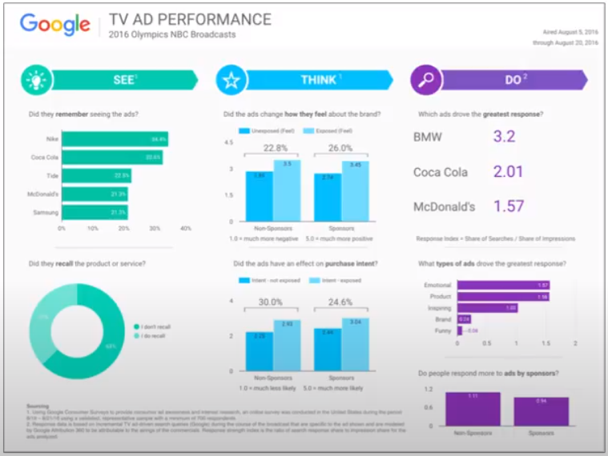

# Introduction

* Streaming data from farious processes
* Distributing notifications
* Scale to handle volume
* Reliable

# Pub/Sub

Streaming data architecture

Decoupling sources and workers

|Pipeline Design|Implementation|
|-|-|
|Is the code compatible with streaming and batch data|How much maintenance|
|Does the SDK support transformations|Infrastructure|
|Are there existing solutions|Scaling|
||Vendor Lock|

# Pipeline

## Apache Beam

* Unified: Batch and Streaming
* Portable: Multible Environments
* Extensible: Write and share Objects

## Cloud Dataflow

* Serverless
* Build ond Apache Beam
* Autoscale

  

# Data Studio

Visualization

