# What is AI?

AI > Machine Learning > Deep Learning  

  

## From Ad-how Data Analysis to Data-Driven Devisions

Ad-How:
* Manual, repetitive work
* Any decision is based on hunches how factors interact
<a/>

=> Build forecasting ML Models

## Options for ML Models

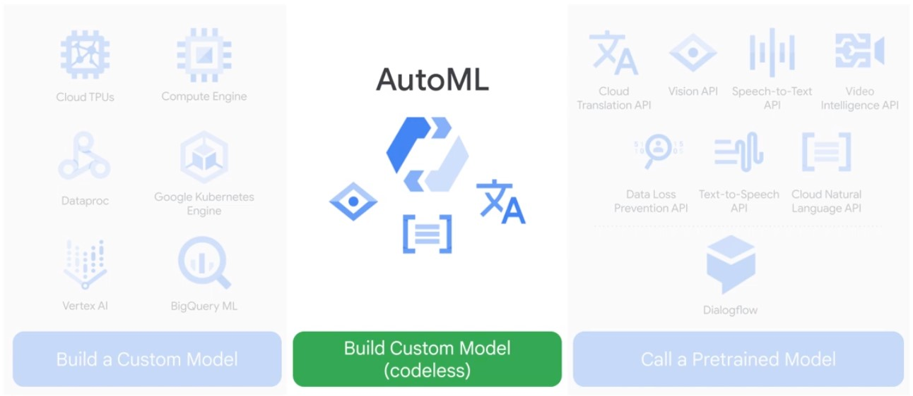  

## Notebooks

Customize hardware for your specific notebook needs.  

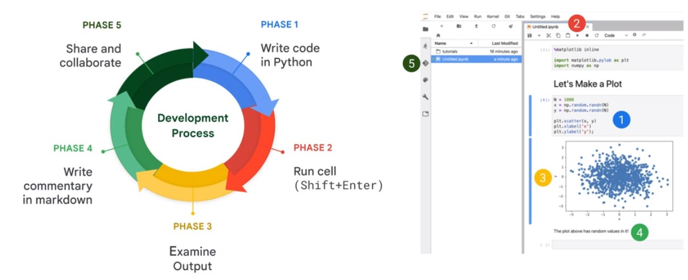  

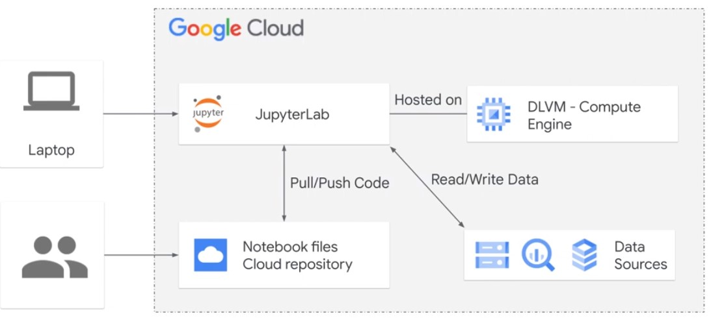 

### BigQuery Magic

BigQuery result is saved in pandas dataframe 'df'. Be aware that memory is limited in notebooks.  

    %%biquery df
    select
      *
    from
      ...
    limit
      50

# ML on Unstructured Data

Unstructured data is about 90% of a companies data.  

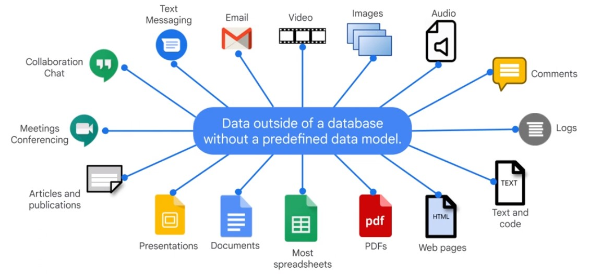  

ML can automate tasks.  

Different approaches to AI. You need 100k+ Datapoints to train your own model.

## Prebuild Models

### Natural Language API

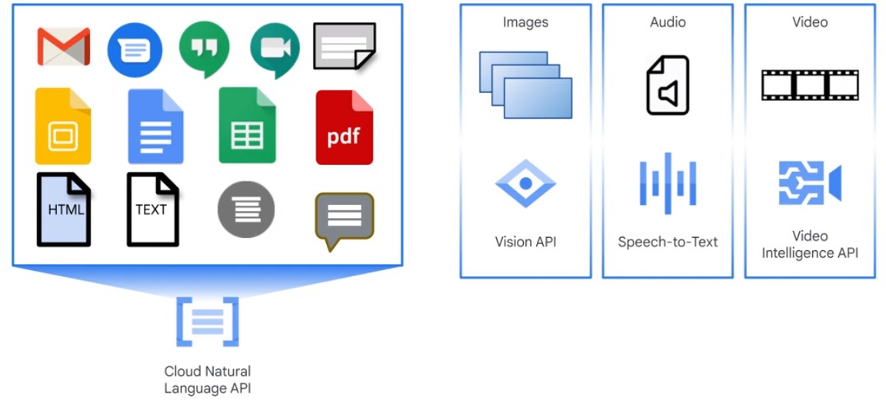  

#### Enitity analysis

* Locations
* People
* Artwork
* Consumer Products
* Addresses
* Numbers (Prices, Phone numbers, Dates ..)
<a/>

#### Sentiment Analysis

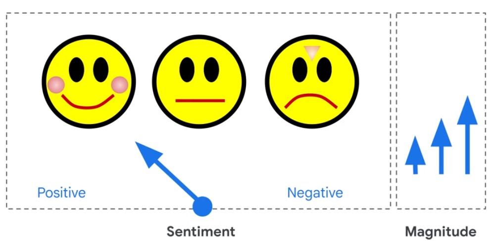

#### Entity Sentiment Analysis

Sentiment analysis on each eantity of a document.

### Content Classification

* Sports
* Foods
* Literature
<a/>

### Vision API

### Translate API

### Language API

Sentiment Analysis

### Speech API

### Video Intelligence API

## Dialog Flow

Natural Language understanding API.

Prebuilt Chatbots

## AutoML

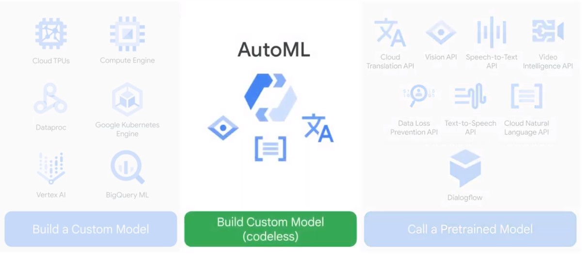

* Train
    * Dataset preparation
    * Readiness Analysis
    * Train
    * Test and Evaluate   
* Deploy
* Server
    * Predict
    * Classify
<a/>

### Process

#### Prepared Dataset to train custom Model

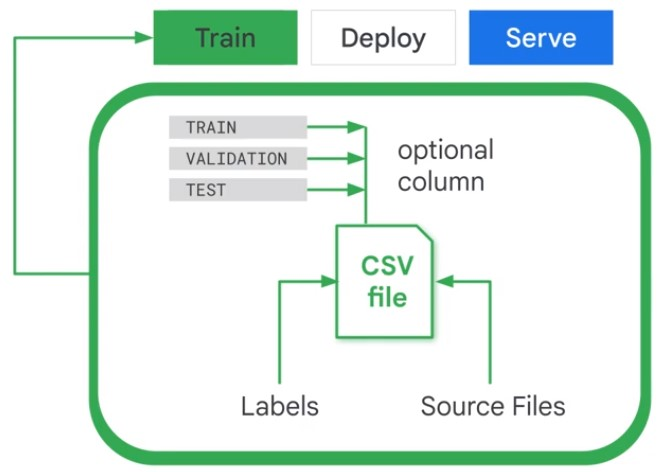

#### Preliminary Analysis

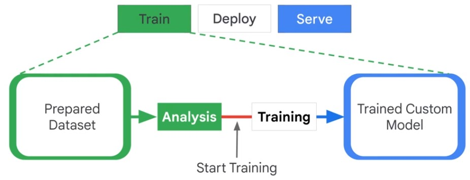

One full run through all training data is called 'epoch'.

#### Evaluation

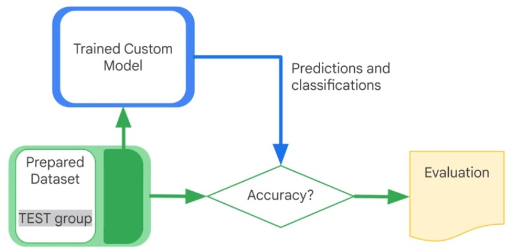

#### Activate Model

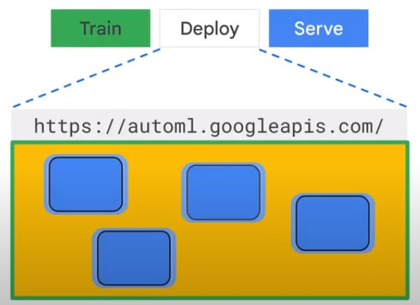

#### Serve Model

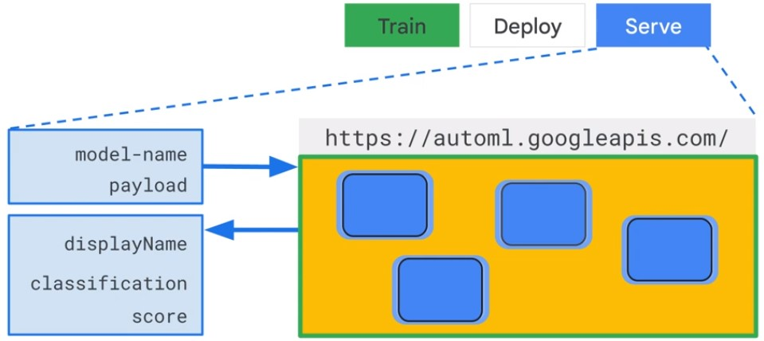

### Multiple Models

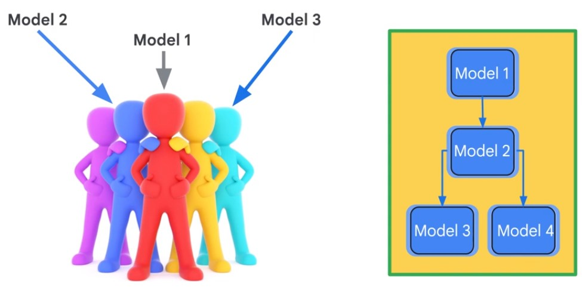

### AutoML Products

#### AutoML Vision

AutoML takes more time to come up with a model, due to ensemble learning.

  
  
  

|Attribute|AutoML Vision|Vision API|
|-|-|-|
|Objective|Enabling developers with no ML expertise to build ML models|Enable ML practitiones to use Googles ML|
|Primary use|Classification|Face detection, OCR ...|
|Data|Images with Labels|Justt Images|

##### Process

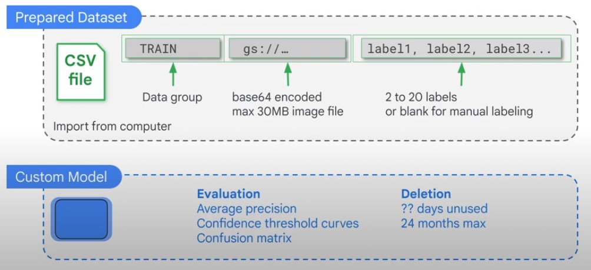  

##### Improving Data

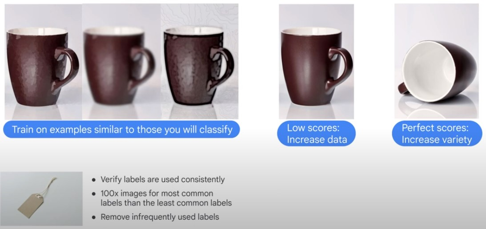  

### AutoML Natural Language

#### Process

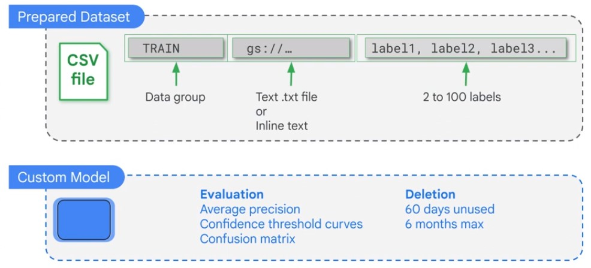 

##### Improving Data

 

### AutoML Tables

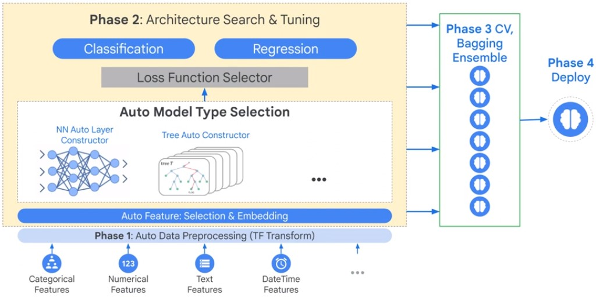 

#### Price Suggestions

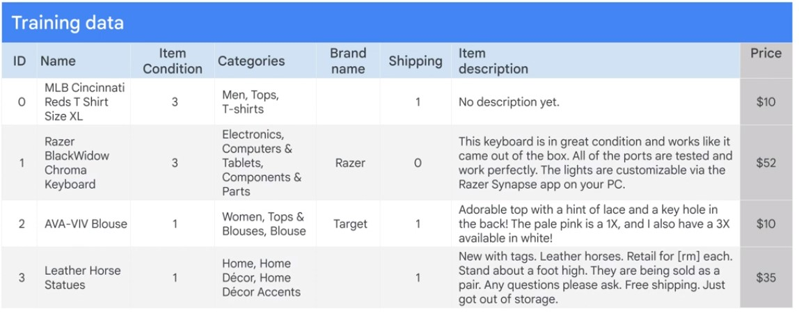

## Custom Models

* BigQuery ML
* TensorFlow, Keras

Model Quality: Custom Model > AutoML > BigQueryML

## Make or Buy Models?

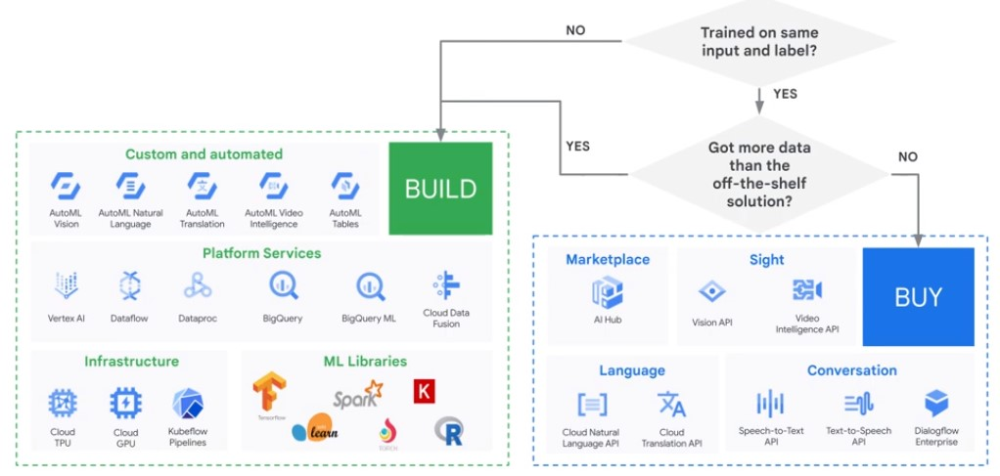

## BigQuery ML, AutoML or Custom Model?

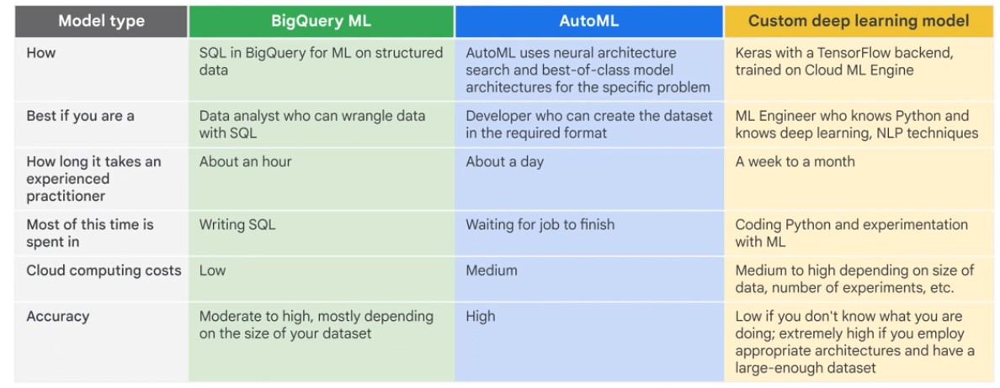
