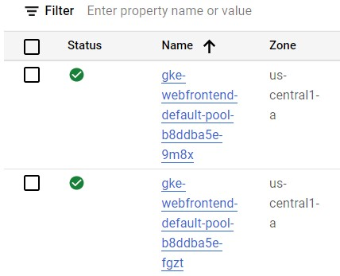

# App Engine

Platform as a Service (PaaS)

* Makes deployment, maintenance and scalability easy
* Build scalable web applications and mobile webends
<a/>

## Services

* NoSQL
* Authentication
* Load Balancing
* Logging
* Health Checks
<a/>

## App Engine Standard Environment

* Easily deploy applications
* Autoscale workloads
* Economical (Free daily quota)
* SDKs for development, testing and deployment
<a/>

### Requiements and Constraints

* Runtimes for Java, Python, PHP and Go
* Sandbox Constraints
  * No writing to local file system. Only to database.
  * Request timeout 60 seconds
  * Limited third party installations
<a/>

### App Engine Standard Workflow

## App Engine Flexible Environment

* Build and deploy containerized apps with a click
* App runs inside docker containers in compute engine
* No sandbox constraints
* Can access App Engine resources
* Standard runtimes: Python, Java, Go and Node.js
* Custom runtime support: Any language that support HTTP requests
<a/>

||Standard|Flexible|
|-|-|-|
|Instance startup|Milliseconds|Minutes|
|SSH access|No|Yes|
|Write to local disk|No|Yes|
|Support for 3rd pary binaries|No|Yes|
|Network access|Via App Engine services|Yes|
|Pricing model|After free daily use, pay per instance class|Pay for resource allocation per hour|

### Deployment

||Kubernetes|App Engine Flexible|App Engine Standard|
|-|-|-|-|
|Language Support|Any|Any|Java,Python,Go,PHP|
|Service model|Hybrid|PaaS|PaaS|
|Primary use case|Container-based workloads|Web and mobile applications, container based workloads|Web and mobile applications|

## Cloud Endpoints and Apigee Edge

An API provides a clean, well defined interface to a complex, changeable implementation.

### Cloud Endpoints

* Distributed API management through an API console
* Expose your API using a RESTful interface
* Cotnrol access and validate calls with JSON Web Tokens and Google API keys
* Generate client libraries
<a/>

#### Supported Platforms

|Runtime|Clients|
|-|-|
|App Engine Flexible Environment|Android|
|Kubernetes Engine|iOS|
|Compute Engine|Javascript|

### Apigee Edge

Focus on business problems

* A platform for making APIs available to your customers and partners
* Contains analytics, monetization, and a developer portal.
<a/>
