# BigQuery

* Serverless
* Flexible Pricing
* Data encryption
* Geospacial data
* Foundation for BI and AI
<a/>

Computation time of 50 minutes down to 13 seconds!

Big Query combines data storage and the SQL engine.
  

  
You can load data direct into the SQL engine without uploading it into die Bigquery datastorage. 
  
## Dataprep
  
UI to explore dataset.
  

  
## Security
  
Viewer, Editor, Owner

## STRUCTs and ARRAYs

Structs are nested collections of columns. Arrays allow to split data cells in multiple records.

  
## GIS
  
GeoVIS

 
## Datasets
  
[Datasets](https://console.cloud.google.com/marketplace/browse?filter=solution-type:dataset)

## Machine Learning
           
ML features BigQuery:
* Write ML models in SQL
* Experiment and iterate right where your data lives
* Build classification and forecasting models
* Inspect model weights and adjust hyper parameters
           
Distribution of ML models

Types of ML models

### ML in BigQuery
           
ML Process in BigQuery:
* Dataset
* Create/Train
* Evaluate
* Predict/Classify

           
* Use Cluster to build Model
* Auto tune learning rate (alternatively set it maunually)
* Auto split training test (Random, Sequential, Custom)
* L1/L2 regularization

### ML.WEIGHTS

Show how usefull an item is to predict value.
           
### Overview
           

## Partitioning and Clustering

    create table mydataset.myclusteredtable
      (
      c1 numeric,
      userId string,
      c3 string,
      enventDate timestamp,
      c5 geography
      )
    partition by date(eventDate)
    cluster by userId
    options
      (
      partition_expiration_days=3,
      description="cluster"
      )
    as select * from maydataset.myothertable

### Partitioning

  

  

  

### Clustering

  

  

## Streaming

Streaming data is charged transaction.  

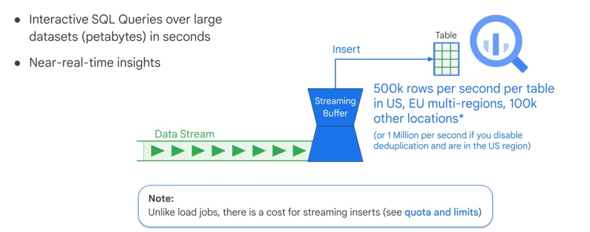

    $ export GOOGLE_APPLICATION_CREDENTIALS="/home/user/Downloads/[FILE_NAME].json"
    $ pip install google-cloud-bigquery
    
    from google.cloud import bigquery
    client = bigquery.Client(project='PROJECT_ID')
    
    dataset_ref = bigquery_client.dataset('my_dataset_id')
    table_ref = dataset_ref.table('my_dataset_id')
    table = bigquery_client.get_table(table_ref)
    
    to_to_insert = [
      (u'customer 1', 5),
      (u'customer 2', 17)
    ]
    
    errors = bigquery_client.insert_rows(table, rows_to_insert)

### Data Studio

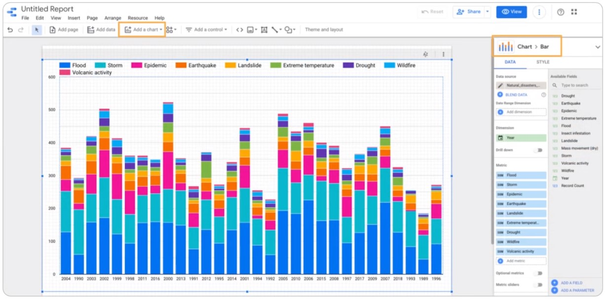  

### BI Engine

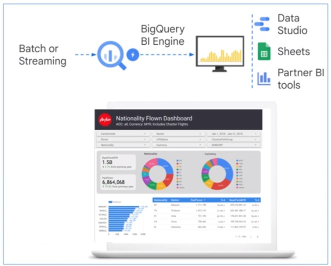

## Analytic Window Functions

* Standard aggregations
* Navigation functions
* Ranking and numbering functions
<a/>

### Navigation

* NTH_VALUE
* LAG
* FIRST_VALUE
* LAST_VALUE
<a/>

### Rank

    with
      longest_trips as (
        select
          start_station_id,
          duration,
          rank() over(partition by start_station_id order by duration desc) as nth_longest
        from
          `bigquery-public-data`.london_bicycles.cycle_hire
        )
      
      select
        start_station_id,
        array_agg (
          duration
          order by
            nth_longest
          limit
            3
          ) as durations
      from
        longest trips
      groub by
        start_station_id

* cume_dist
* dense_rank
* row_number
* percent_rank
<a/>

## GIS Functions

* ST_DWithin
* ST_GeogPoint
* ST_Intersects
<a/>

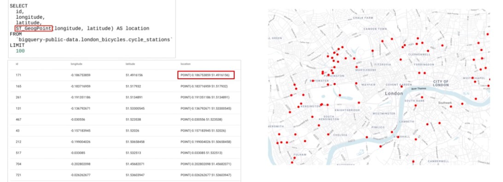  

## Performance

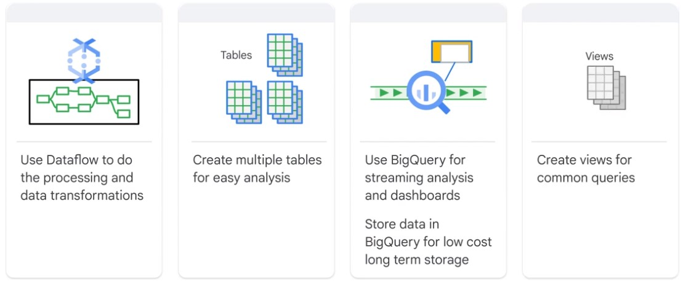  

* I/O: How many bytes are read?
* Shuffling: How many bytes were passed to the next stage?
* Grouping: How many bytes were passed through to each group?
* Materialization: How many byters were written?
* Functions and UDFs: How much CPU are the functions using?
<a/>

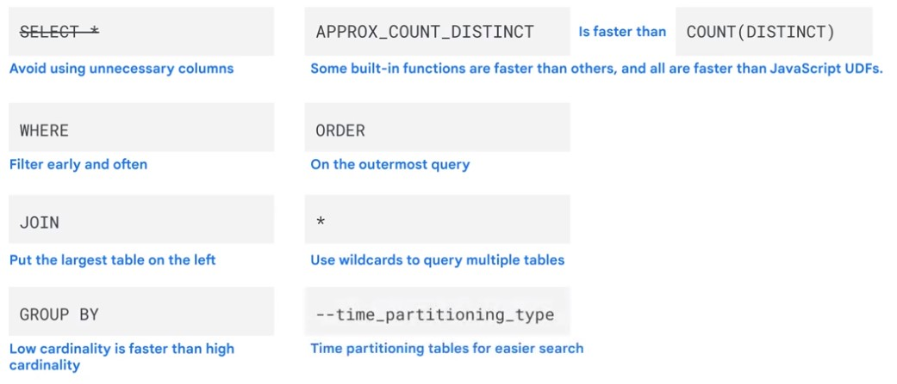  

### Intermediate Tables

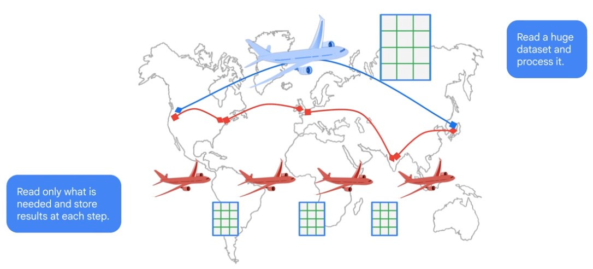  

gcp > BigQuery > Execution Details

### Aproximate Functions

* Approc_count_distinct

## Prcing

### Active Storage

* 100 MB, half a month = 0.001 $
* 500 GB, half a month = 5 $
* 1 TB, full month = 20 $
<a/>

### Long-term Storage

Table or partition not edited 90+ days

* Price drops 50%
* No degregation
* Applies to BigQuery storage only
<a/>

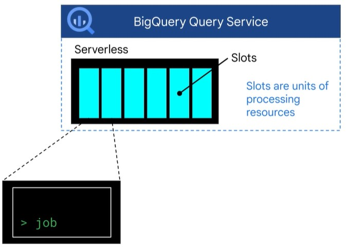 

### On-Demand Pricing

* 5 $ / TB of data processed
* Quota Limit 2000 slots
* Slots shared amond all users
* 1st TB of data is free each month
<a/>

### Flat-Rate Pricing

* 10000 $ / month per 500 slots
* Slots are dedicated 24/7
* Starting at 500 slots
* unlimited use of slots
<a/>

### Flex Slots

* BigQuery Slots per minute
* increment 100 slots
* 0.04 $ / slot / hour
<a/>

### Fair Scheduler

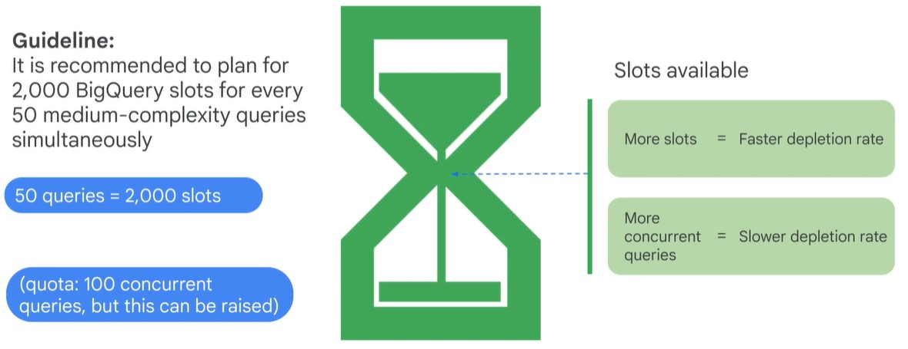  

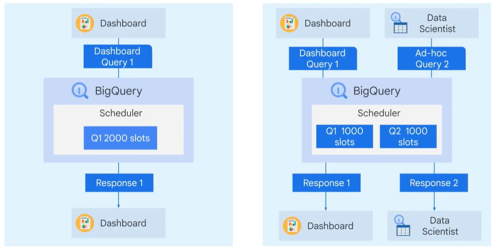  

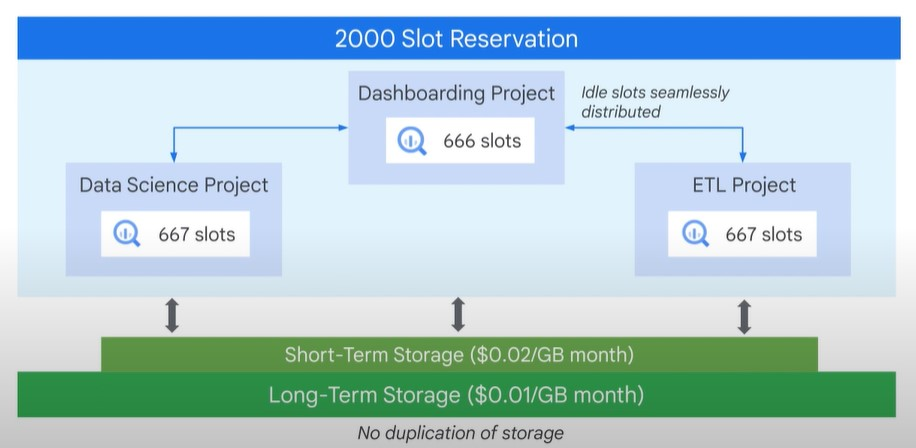  

You can set hierarchical reservation.  
