# Cloud Bigtable

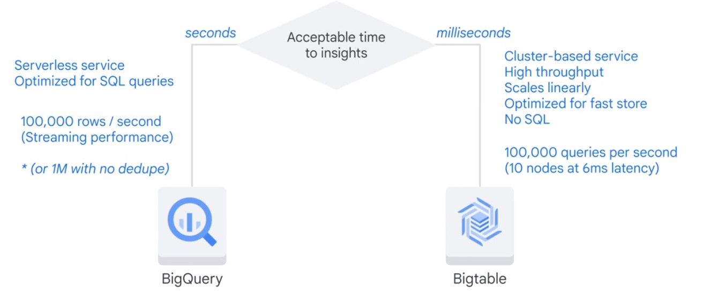

* >1 TB
* High throughput
* Asynchonous batch
* Rapidly chaning
* Time series data
* Natural semantic ordering
* Real-time processing
<a/>

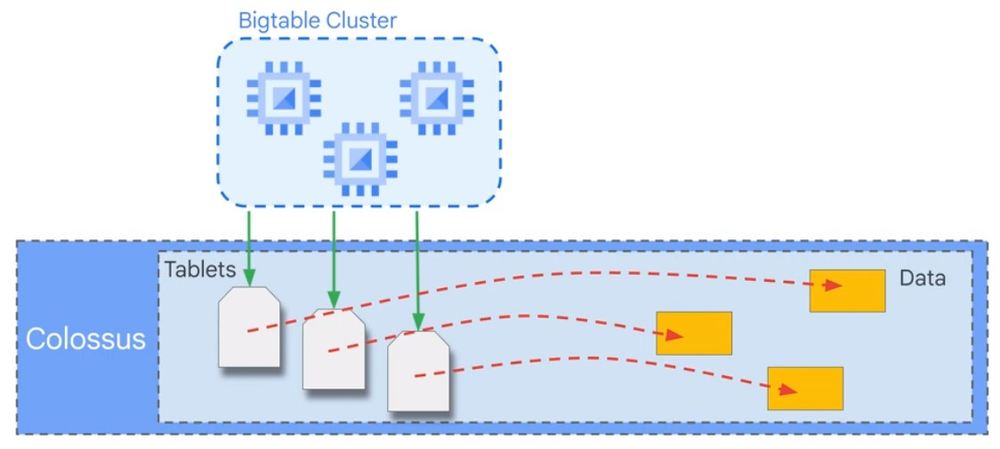  

## Simplify for speed

NoSQL Database.

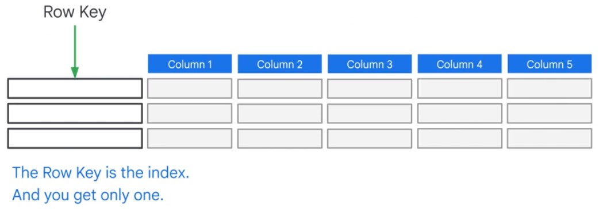  

Operations affecting performance.  

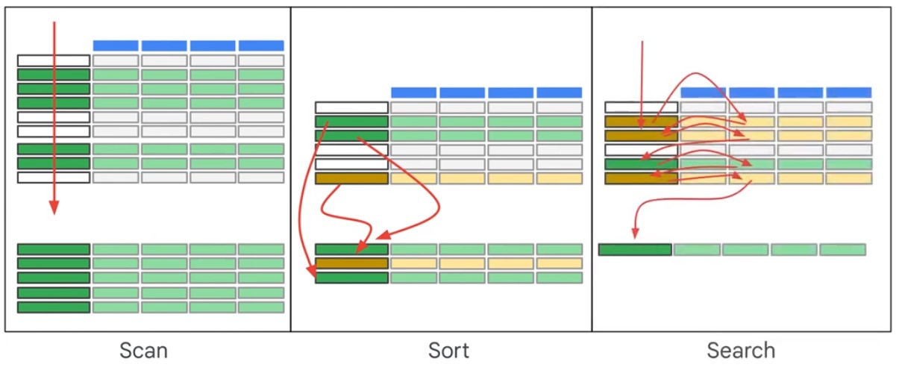  

Get data in order first.  

## Example

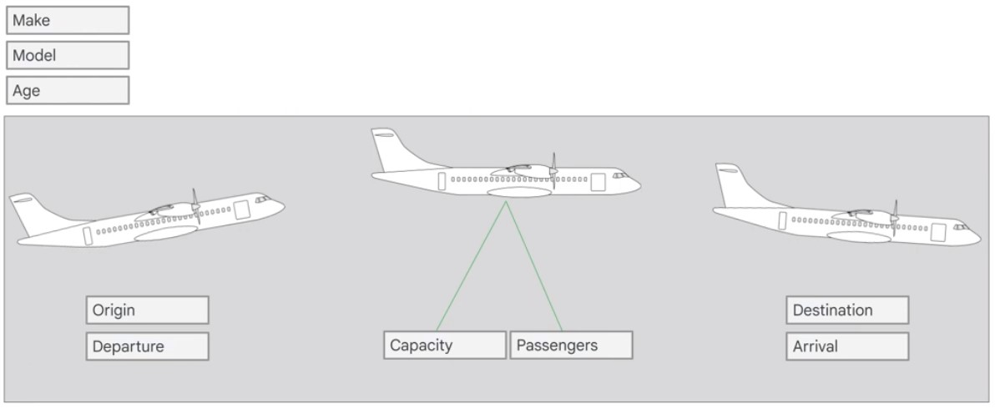  

### Construct combined rowkey  

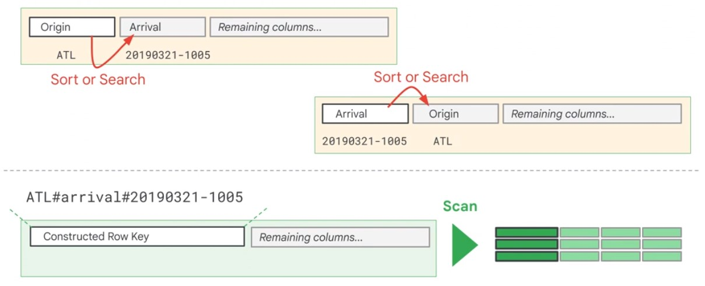  

### Column Family

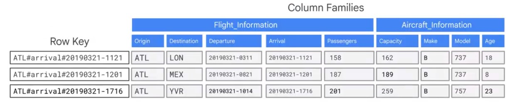

### Reverse Timestamps

Rowkey with most recent Flight.

## Deletion

Deleted rows are marked for deletion.  

## Data Organization

* Group related data
* Distribute data evenly
* Place identical values in the same row for more efficient compression
<a/>

## Self-Learning

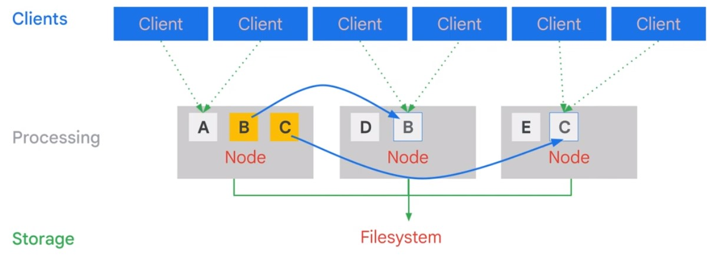  

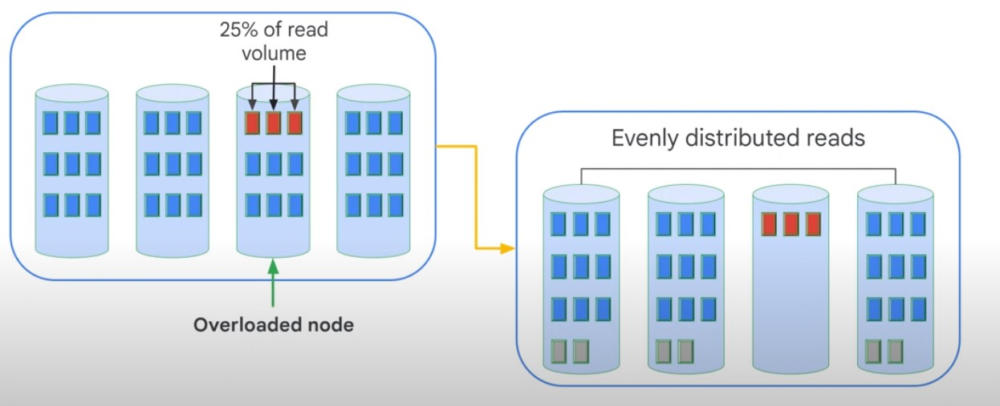  

## Optimize Performance

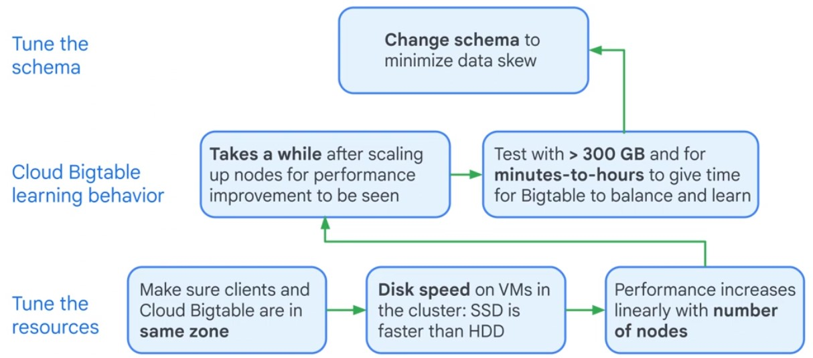  

## Streaming

  

## Replication

* Isolate serving applicatoins from batch reads
* Improve availability
* Provide near-real-time backup
* Ensure data has a global presence
<a/>

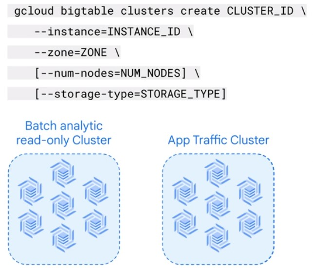  

## Performance

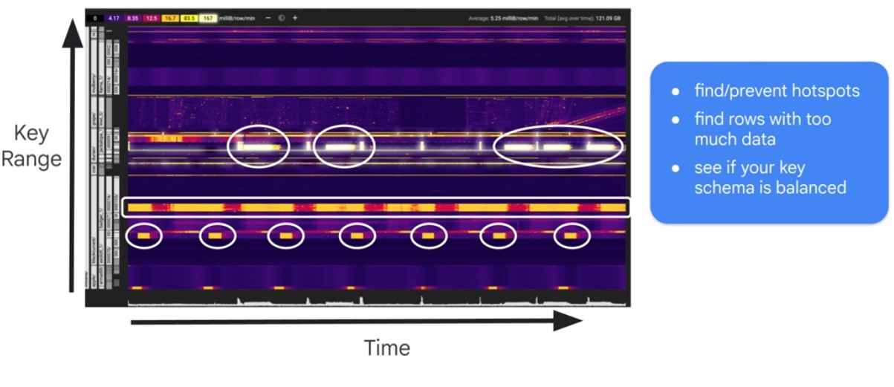  
