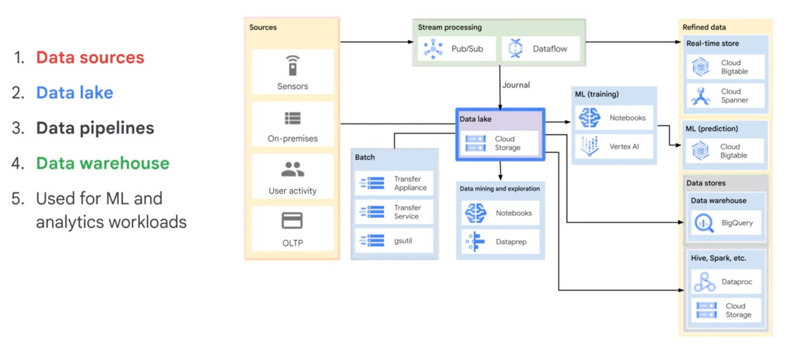
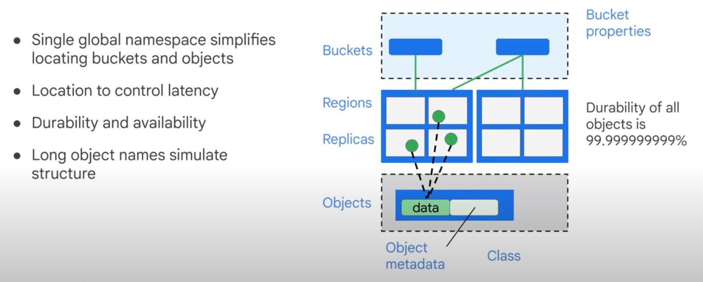
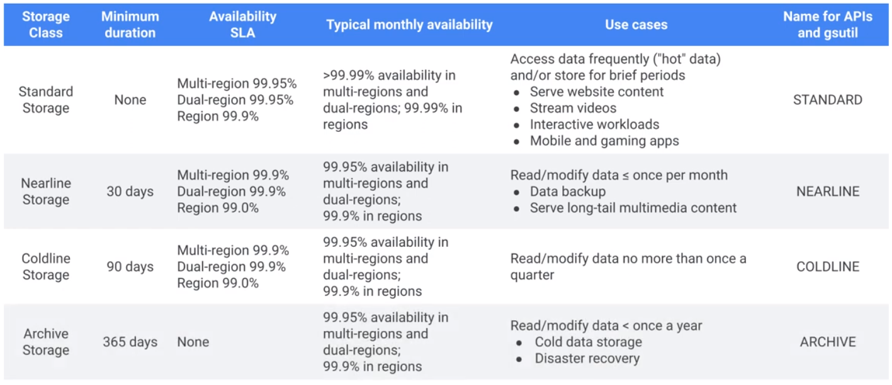
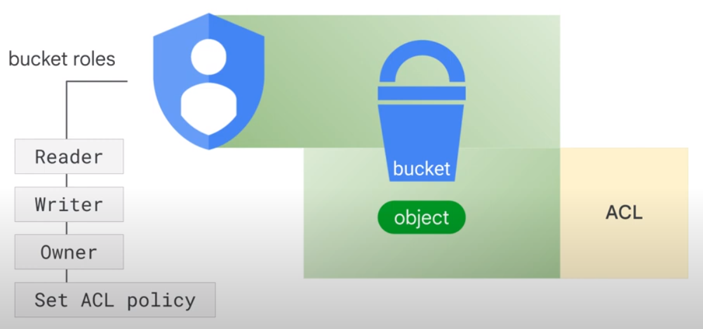
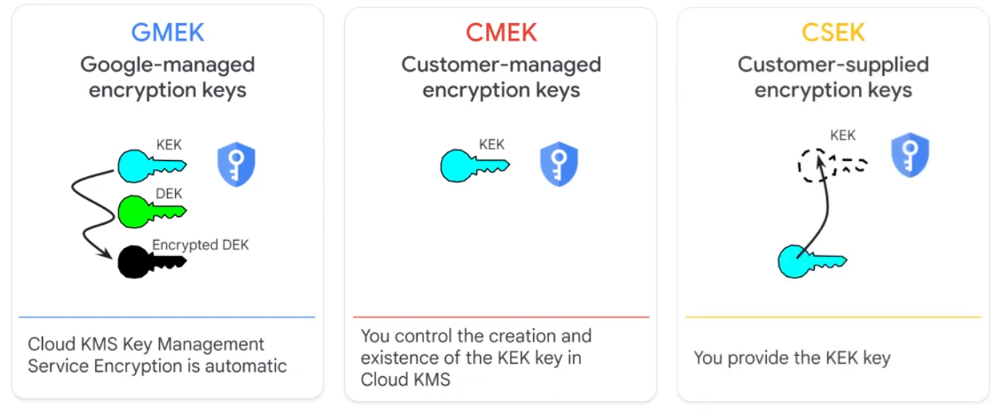
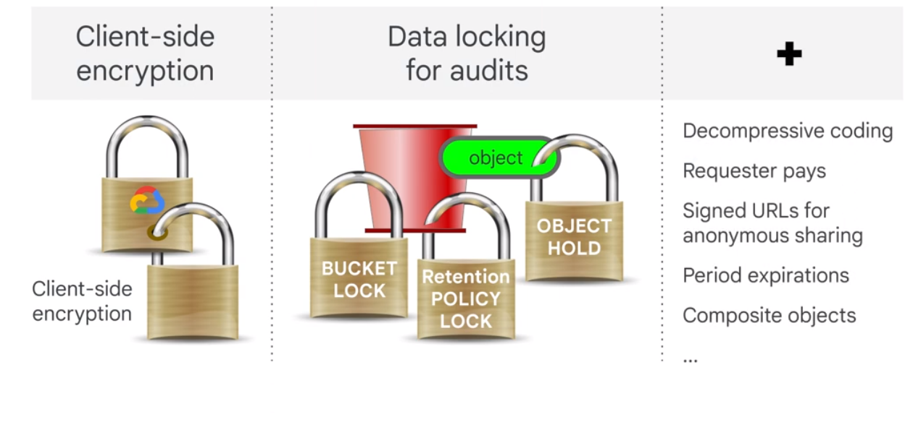
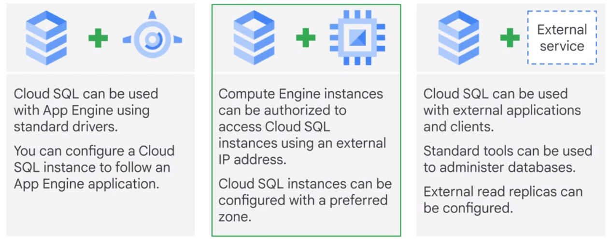
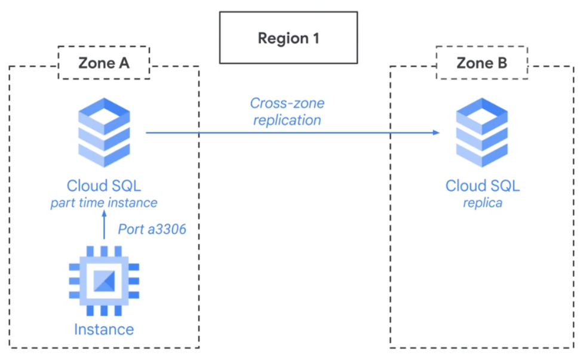

# Introduktion to Data Lakes

A scalable and secure data platfrom that allows enterprises to

* ingest
* store
* process
* analyze
<a/>

any type or volume of information.

* Structured, Semi-Structured, Unstructured
* Batch, Streaming
* SQL, ML/AI, Search
* On-Prem, Cloud, Edge
<a/>

## Ecosystem

* Data sources
* Data sinks
  * Central data lake repo
  * Data warehouse
* Data Pipelines
* High-level orchestration workflows
</a>

  

## Datalake vs Datawarehouse

|Datalake|Datawarehouse|
|-|-|
|Native format|Loaded after usecase|
|All data types|Processed|
|Easy Changes|Faster insights|
|Applicatoin-specific|Current and historical data|
||Consistent schema|

# Data Extraction

* Where ist youz data now
* How big is your data
* Where has it get to go
* How much transformation is needed
<a/>

## EL (Extract and Load)

Data can be imported "as is".

## ELT (Extract, Load and Transform)

Data is transformed after loading it in the target.

## ETL (Extract, Transform and Load)

Data needs to be Transformed before loading.

# How does Cloud Storage Work?

* Persistance
* Durability
* Strong consistency
* Availability
* High throughput
<a/>

Cloud Storage simulates file system. Object paths are stored as metadata for each object. They are not partitioned in distinct folders.  

## File Access

File Access

    gs://declass/de/modules/02/script.sh

Web Access

    https://storage.cloud.google.com/declass/de/modules/02/scsript.sh

## Object Management Features

* Retention
* Versioning
* Lifecycle Management
<a/>

# Secure Cloud Storage

* IAM policy: Bucket Level
* ACL: Access Control Lists, Object Level
<a/>

  
  

# Storage Types

## Transactional vs Analytic Workload

Transactional workload is write-heavy. Analytical systems are read-heavy. 

    $ gsutil -m cp ..

* Transaction: Cloud SQL > Cloud Spanner
* Analytics: Cloud Bigtable > BigQuery
</a>

# Cloud SQL as Relational Datalake

Managed Services for RDBMS (SQL Server, MySQL, PostgreSQL).

Backup, revocery, scaling and security is managed.

## Fully Managed vs Serverless

|Fully managed|Serverless|
|-|-|
|No setup|No server managemend|
|Automatd backups|Fully managed security|
|Replicated|Pay for usage|

## Serverless Data Management Architecture

