# Containers in the Cloud

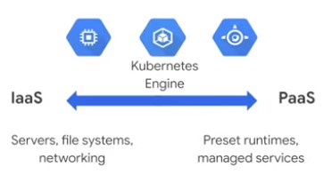

## Compute Options

## IaaS

Share compute resources by virtualizing hardware. Smallest entity is a whole server. Full control of hardware, but hard to scale.

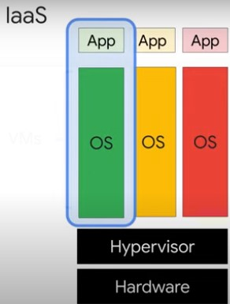

## PaaS (App Engine)

Easy to scale, but no control of hardware.

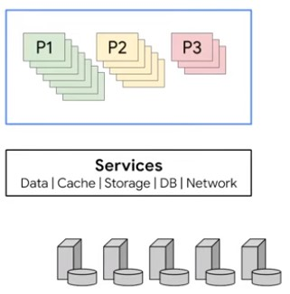

## Containers

Virtualize operating system. Easy scaling. Kubernetes is a tool to orchestrate containers.

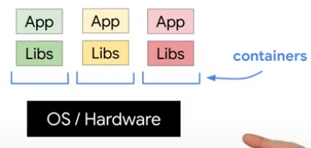

# Kubernetes, Google Kubernetes Engine

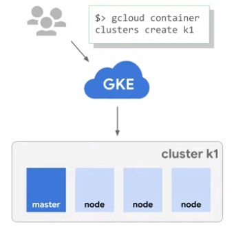

## Create Pods

A pod is the smalles deployable component in Kubernetes.

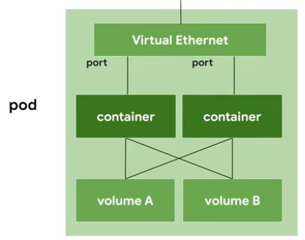

A deployment is a group of replicas of the same pod.

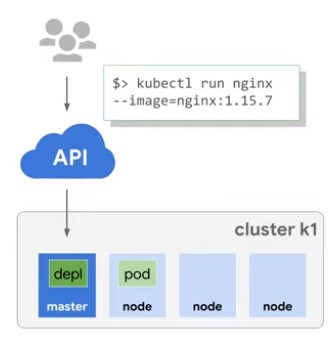

List running pods

    $> kubectl get pods
    
## Expose Pods to Internet
    
Expose pods to the internet using a loadbalancer. Kubernetes creates a service with a fixed IP address for the pods.

    $> kubectl expose deployments nginx --port=80 --type=LoadBalancer
    
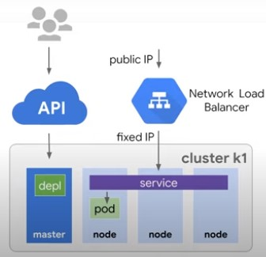

A service groups a set of pods together and provides a stable endpoint, like a public IP address. Pods have their internal IP addresses, but these addresses are not stable. Services create a stable entrypoint to the pods.

    $> kubectl get services
    
## Scale Application

    $> kubectl scale nginx --replicas=3

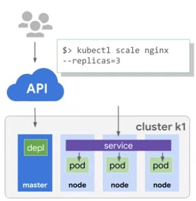

### Autoscaling

    $> kubectl autoscale nginx --min=10 --max=15 --cpu=80
    
## Configuration File

    $> kubectl get pods -l "app=nginx" -o yaml
    $> kubectl apply -f nginx-deployment.yaml
    
## Monitoring

    $> kubectl get replicasets
    $> kubectl get pods
    $> kubectl get deployments
    $> kubectl get services
    
## Updating

Update strategies define how an update is deployed. For example: Rolling Update.

# Hybrid and Multi-Cloud Computing (Anthos)

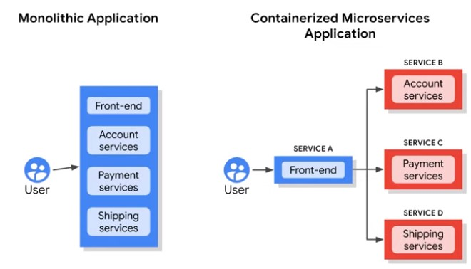

Hybrid architectures allow for on-premise and cloud compute workloads.

* Kubernetes and GKE On-Prem create the foundation.
* On-premise and Cloud environments stay in sync.
* Tools are proviced for:
  * Managing services
  * Monitoring
  * Migration
  * Consistent policies
<a/>

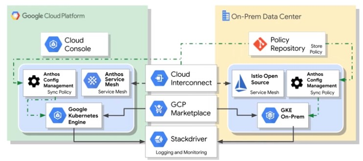
