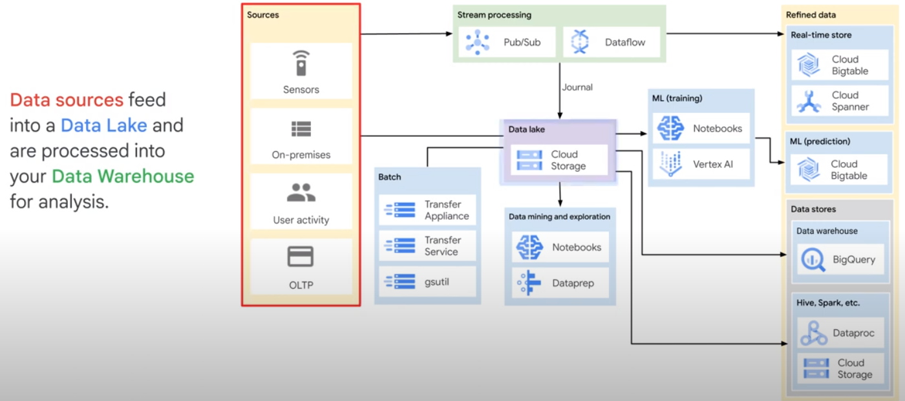
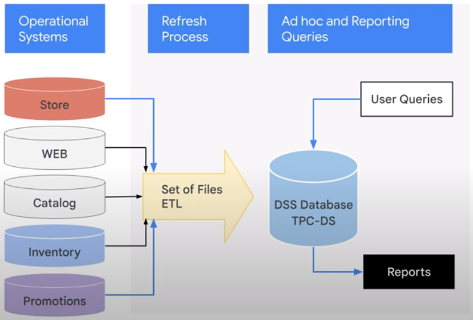
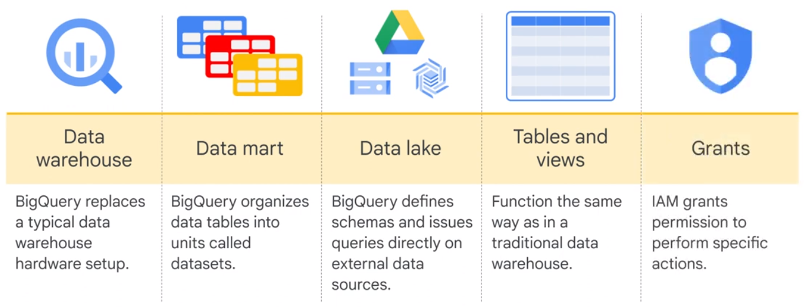
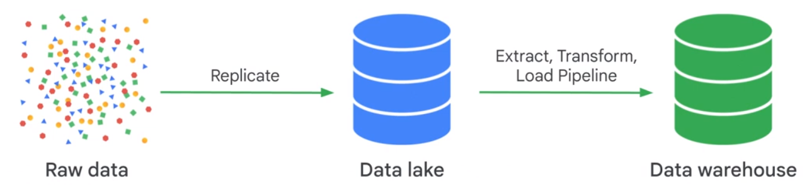
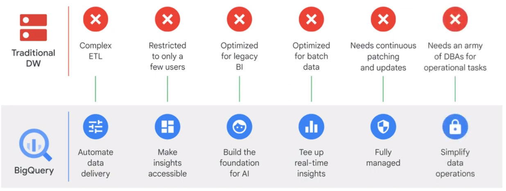
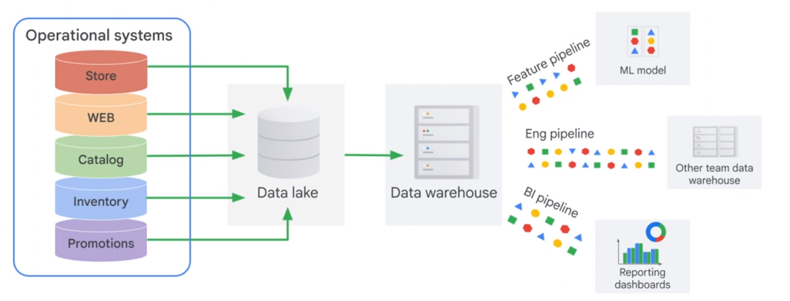
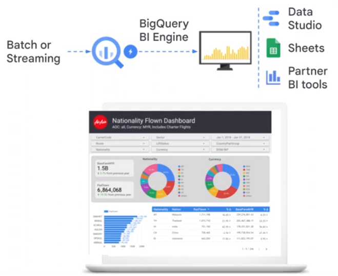
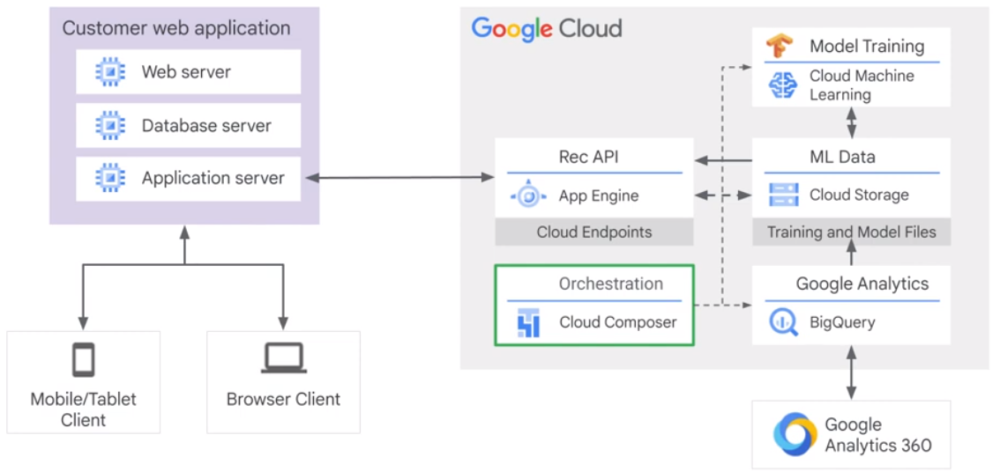

# Introduction

## The Role of a Data Engineer

A dataengineer builds data pipelines.

* Get the data where it can be useful
* Get the data in a usable condition
* Add new value to the data
* Manage the data
* Productionize data processes
<a/>

### Data Lake

Brings together data from multiple sources. Cloud Storage Bucket.

* Does it handle all types to data?
* Can it Scale?
* Does it support high throughtput ingestion
* Control to objects
* Can other tools connect easily
<a/>

### ETL

Extract, Transform, Load. Dataproc, Dataflow

### Real Time Analytics

Pub/Sub

## Data Engineering Challenges

* Access to Data
* Quality
* Computational ressources
* Query Performance

## BigQuery

Serverless Datawarehouse

### Data Lakes and Data Warehouses

Datawarehouse
* Can it serve as a sink for batch and streaming data
* Can it scale
* How is the data organized
* Is it designed for performance
* What it the maintenance level
<a/>

  

## Databases vs Data Warehouses

SQL > CloudSQL

|Cloud SQL|BigQuery|
|-|-|
|Transactional DB|Data Warehouse|
|Record Based|Column Based|

## Partners

* ML Engineer
* Data Analyst
* Data Engineer

### BigQuery ML

### BigQuery BI Engine

## Data Access

* Data Catalog
* Data Loss Prevention API (Manage sensitive Data)

## Cloud Composer (Airflow)

* How can we ensure pipeline health
* minimize maintenance
* respond to business needs
* are we using the latest tools?

