# Dataflow

* Scalable
* Low latency
* Batch and Strem

||Dataflow|Dataproc|
|-|-|-|
|Recommended for|New data processing pipelines, unified batch and streaming|Existing Hadoop/Spak applications, ML, large-batch jobs|
|Fully managed|Yes|No|
|Auto scaling|Yes (adaptive)|Yes (reactive)|
|Expertise|Apache Beam|Hadoop, Hive, Pig, Sprak ...|

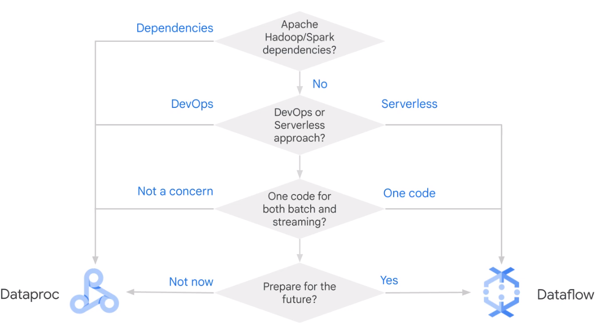

## Apache Beam

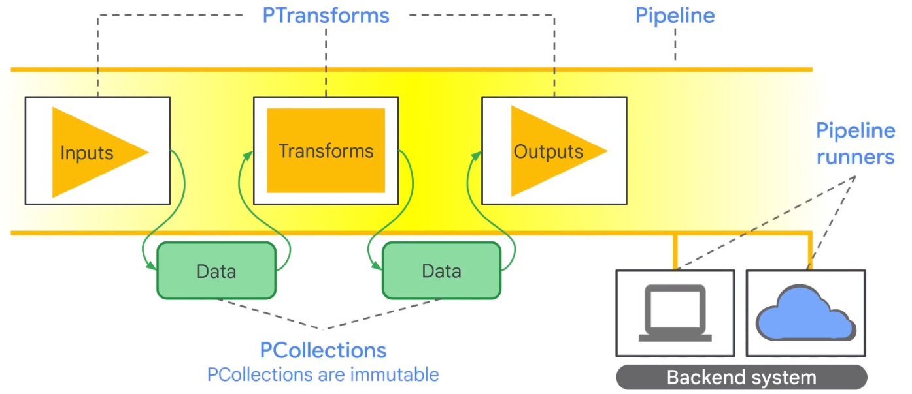

### Datagraph

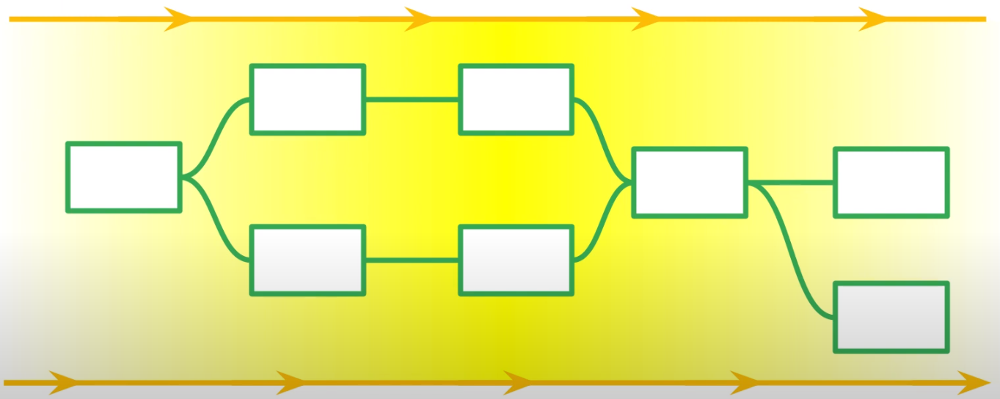

### PCollection

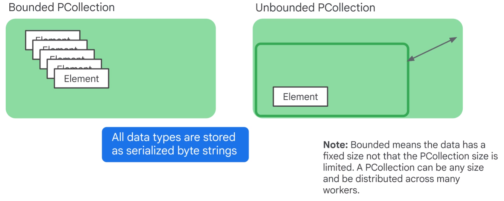

In a PCollection all data is immutable and stored as bytestring.

## How does Dataflow Work?

* Fully Managed
* Optimizes Datagraph
* Autoscaling
* Rebalancing
* Streaming Semntics

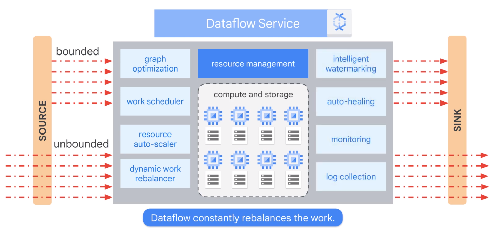

## Dataflow Pipelines

### Simple Pipeline

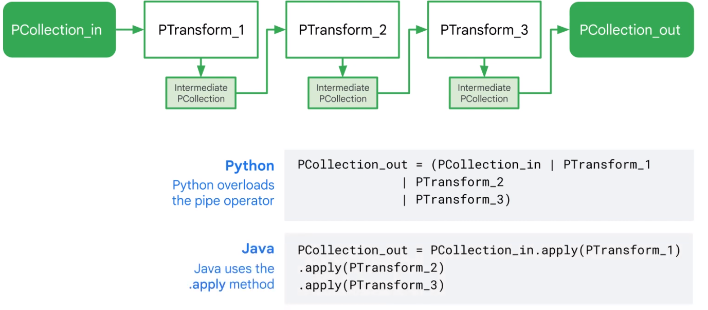

### Branching Pipeline

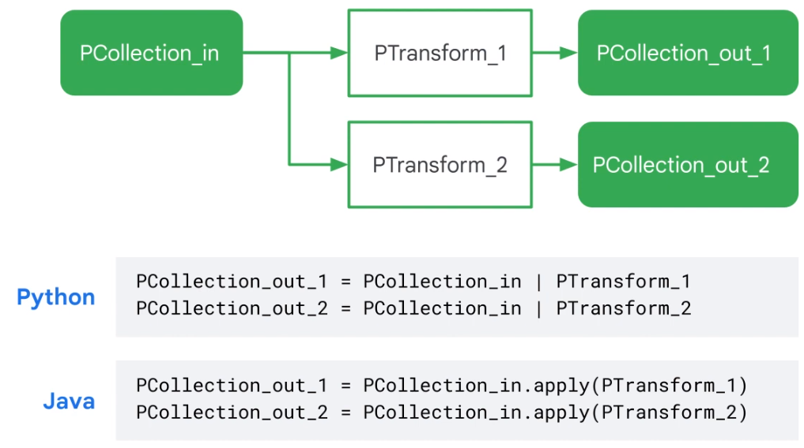

### Start End

    import apache_beam as beam
    
    if __name == '__main__':
    
      with beam.Pipeline(argv=sys.argv) as p: # Create pipeline parameterized by command line flags
      
        (p
          | beam.io.ReadFromText('gs://...') # Read Input
          | beam.FlatMap(count_words) # Apply transform
          | beam.io.WriteToText('gs://...') # Write output
        )
    
    options = {'project':<project>,
               'runner':'DataflowRunner'. # Where to run
               'region':<region>.
               'retup_file':<setup.py file>}
    
    pipeline_options = beam.pipeline.PipelineOptions(flags=[],**options)
    
    pipeline = beam.Pipeline(options=pipeline_options) # Creates the pipeline

#### Run local

    $ python ./grep.py

#### Run on cloud

    $ python ./grep.py \
             --project=$PROJECT \
             --job_name=myjob \
             --staging_location=gs://$BUCKET/staging/ \
             --temp_location=gs://$BUCKET/tmp/ \
             --runnner)DataflowRunner
 
 ### Read Data
 
    with beam.Pipeline(options=pipeline_options as p:
    
       # Cloud Storage
      lines = p | beam.ioReadFromText("gs://..../input-*.csv.gz")
      
      # Pub/Sub
      lines = p | beam.io.ReadStringsFromPubSub(topic=known_args.input_topic)
      
      # BigQuery
      query = "select x, y, z from `project.dataset.tablename`"
      BQ_source = beam.io.BigQuerySource(query = <query>, use_standard_sql=True)
      BQ_data = pipeline | beam.io.Read(BG_srouce)
      
 ### Write to Sinks
 
    from apache_beam.io.gcp.internal.clients import bigquery
    
    table_spec = bigquery.TableReference(
      projectId='clouddataflow-readonly',
      datasetId='samples',
      tableId='weather_stations')
      
     p | beam.io.WriteToBigQuery(
      table_spec,
      schema=table_schema,
      write_disposition=beam.io.BigQuerryDisposition.WRITE_TRUNCATE,
      create_disposition=beam.io.BigQueryDisposition.CREATE_IT_NEEDED)

### Map Phase > Transform

    'WordLengths' >> beam.Map(word, len(word))

    def my_grep(line_term):
      if term in line:
        yield line
        
    'Grep' >> beam.FlatMap(my_grep(line, searchTerm))

#### ParDo Parallel Processing

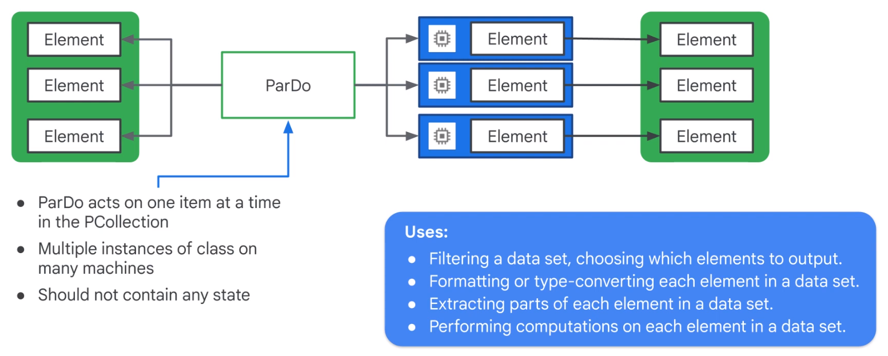

    words = ...
    
    # Do Fn
    class ComputeWordLengthFn(beam.DoFn):
      def process(self,element):
        return [len(element)}
    
    # ParDo
    word_lengths = words | beam.ParDo(ComputeWordLengthFn())

##### Multiple Variables

    results = (words | beam.PrDo(ProcessWords(),
      cutoff_length=2, marker='x')
      .with_putputs('above_cutoff_lengths','marked strings',main='below_cutoff_strings'))
      
    below = results.below_cutoff_strings
    above = results.above_cutoff_strings
    marked = results['marked strings']

### GroupByKey

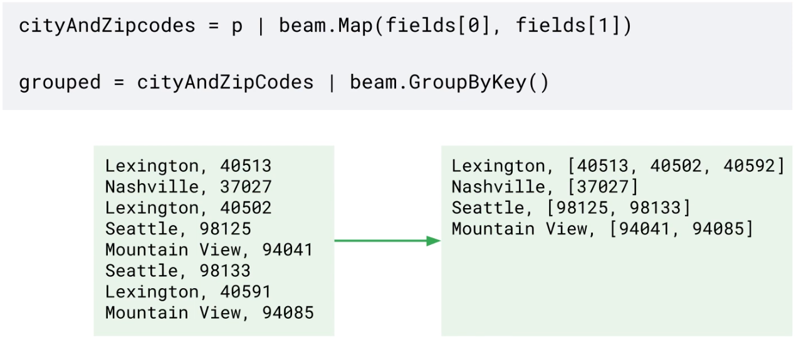  

Data skew makes grouping less efficient at scale.  

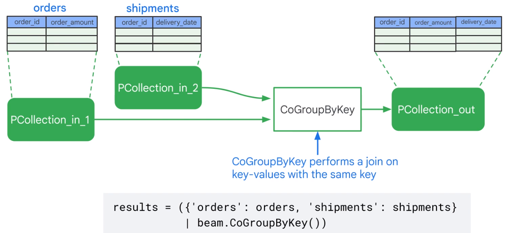  

    totalAmount = salesAmounts | CombineGlobally(sum)
    totalSalesPerPerson = salesRecords | CombinePerKey(sum)
    
### CombineFn works by overriding exisintg operations

You must provide four functions

    class AverageFn(beam.CombineFn):
    
        def create_accumulator(self):
            return(0.0,0)
        
        def add_input(self, sum_count, input):
            (sum, count) = sum_count
            return sum + input, count + 1
            
        def merge_accumulators(self, accumulators):
            sums, counts = zip(*accumulators)
            return sum(sums), sum(counts)
            
        def extract_output(self, sum_count):
            (sum, count) = sum_count
            return sum / count if count else float('NaN')
            
    pc = ...
    average = pc | beam.CombineGlobally(AverageFn())
    
Combine is more efficient that GroupByKey  

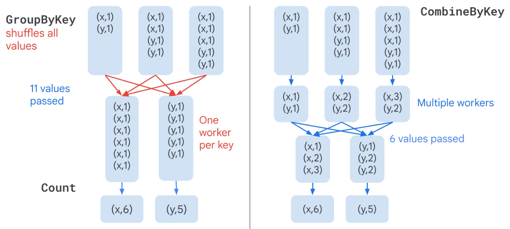  

### Flatten Merges identical PCollections

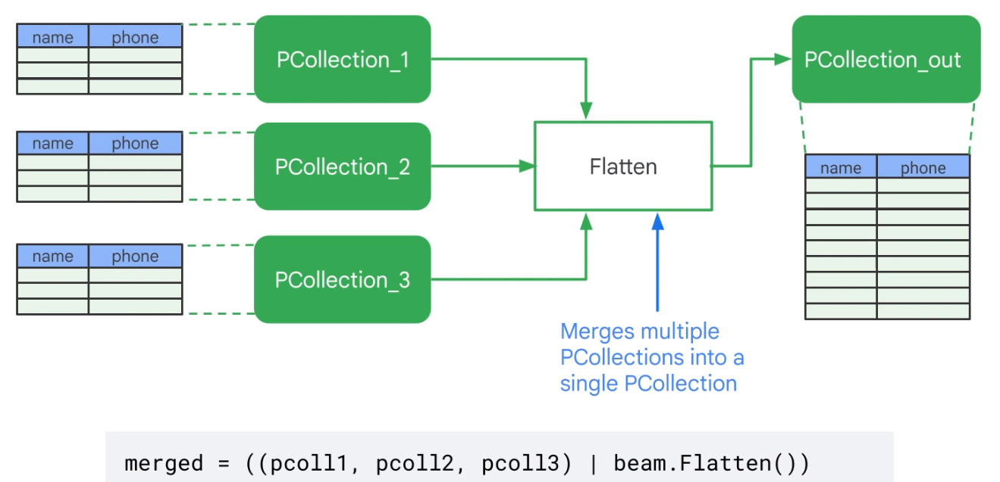

### Partition Splits PCollections

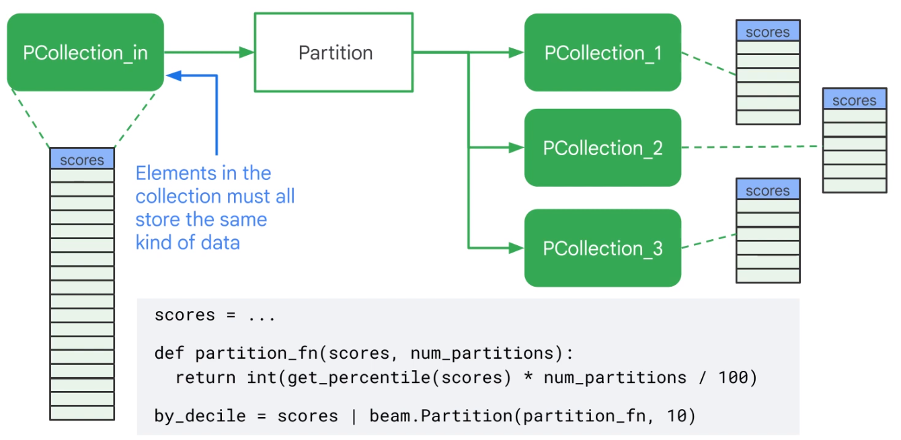

## Side-Inputs and Windows

### Side-Input

A side-input is an input the do-function can access every time it processes an element of the inputP collection.  

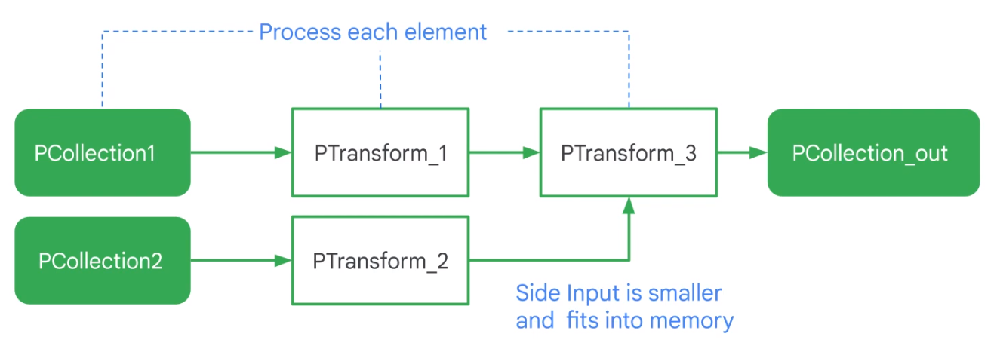  

    words = ...
    
    def filter_using_length(word, lower_bound, upper_bound=floar('inf')):
        if lower_bound <= len(word) <= upper_bound:
            yield word
            
    small_words = words | 'small' >> beam.FlatMap(filter_using_length, 0, 3)
    
    # Side input
    avg_word_len = (words
               | beam.Map(len)
               | beam.CombineGlobally(beam.containers.MeanCombineFn())
    
    larger_than_average = (words | 'large' >> beam.FlatMap(
        filter_using_length,
        lower_bound=value.AsSingleton(avg_word_len)))
        
### Window

Unbounded PCCollection not useful for Streaming data.  

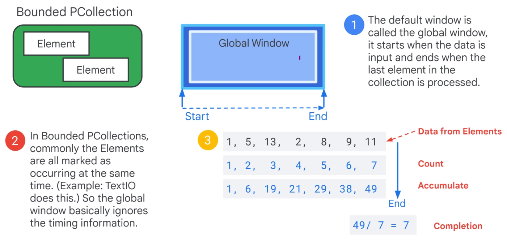  

Use time windows.  

    lines = p | 'Create' >> beam.io.ReadFromText('access.log')
    
    windowd_counts = (
        lines
        | 'Timestamp' >> beam.Map(beam.window.TimestampedValue(X, extract_timestamp(x)))
        | 'Window' >> beam.WindowInto(beam.window.SlidingWindows(60,30))
        | 'Count' >> (beam.CombineGlobally(beam.combiners.CountCombineFn()).without_defaults())
    )
    
    windowed_counts = windowed_counts | beam.ParDo(PrintWindowFn())

## Templates

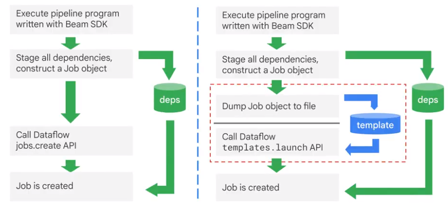

Separate developer from user.  

### Create own Template

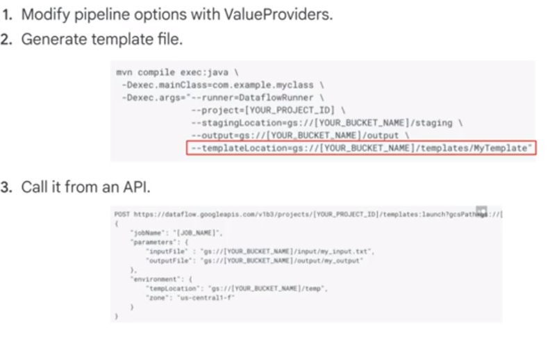

Each template has metadata:  

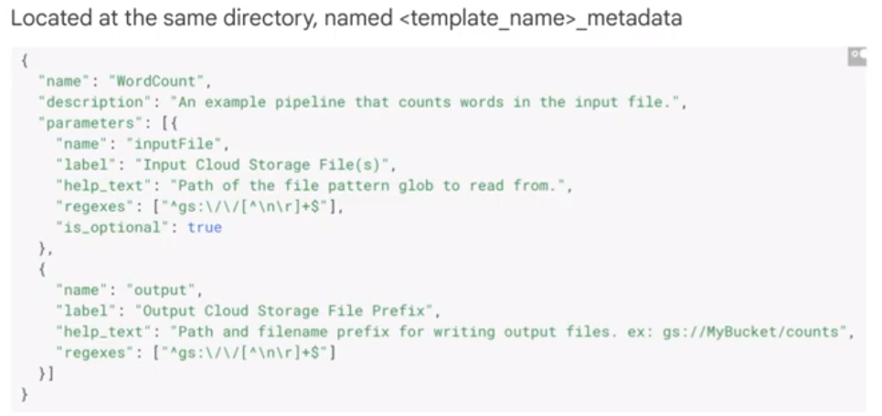  

## Dataflow SQL

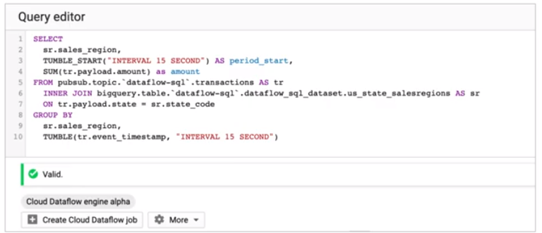  
