# Dataflow

* Scalable
* Low latency
* Batch and Stream

||Dataflow|Dataproc|
|-|-|-|
|Recommended for|New data processing pipelines, unified batch and streaming|Existing Hadoop/Spak applications, ML, large-batch jobs|
|Fully managed|Yes|No|
|Auto scaling|Yes (adaptive)|Yes (reactive)|
|Expertise|Apache Beam|Hadoop, Hive, Pig, Sprak ...|

## Apache Beam

### Datagraph

### PCollection

In a PCollection all data is immutable and stored as bytestring.

## How does Dataflow Work?

* Fully Managed
* Optimizes Datagraph
* Autoscaling
* Rebalancing
* Streaming Semntics

## Dataflow Pipelines

### Simple Pipeline

### Branching Pipeline

### Start End

    import apache_beam as beam
    
    if __name == '__main__':
    
      with beam.Pipeline(argv=sys.argv) as p: # Create pipeline parameterized by command line flags
      
        (p
          | beam.io.ReadFromText('gs://...') # Read Input
          | beam.FlatMap(count_words) # Apply transform
          | beam.io.WriteToText('gs://...') # Write output
        )
    
    options = {'project':<project>,
               'runner':'DataflowRunner'. # Where to run
               'region':<region>.
               'retup_file':<setup.py file>}
    
    pipeline_options = beam.pipeline.PipelineOptions(flags=[],**options)
    
    pipeline = beam.Pipeline(options=pipeline_options) # Creates the pipeline

#### Run local

    $ python ./grep.py

#### Run on cloud

    $ python ./grep.py \
             --project=$PROJECT \
             --job_name=myjob \
             --staging_location=gs://$BUCKET/staging/ \
             --temp_location=gs://$BUCKET/tmp/ \
             --runnner)DataflowRunner
 
### Read Data
 
    with beam.Pipeline(options=pipeline_options as p:
    
       # Cloud Storage
      lines = p | beam.ioReadFromText("gs://..../input-*.csv.gz")
      
      # Pub/Sub
      lines = p | beam.io.ReadStringsFromPubSub(topic=known_args.input_topic)
      
      # BigQuery
      query = "select x, y, z from `project.dataset.tablename`"
      BQ_source = beam.io.BigQuerySource(query = <query>, use_standard_sql=True)
      BQ_data = pipeline | beam.io.Read(BG_srouce)
      
### Write to Sinks
 
    from apache_beam.io.gcp.internal.clients import bigquery
    
    table_spec = bigquery.TableReference(
      projectId='clouddataflow-readonly',
      datasetId='samples',
      tableId='weather_stations')
      
     p | beam.io.WriteToBigQuery(
      table_spec,
      schema=table_schema,
      write_disposition=beam.io.BigQuerryDisposition.WRITE_TRUNCATE,
      create_disposition=beam.io.BigQueryDisposition.CREATE_IT_NEEDED)

### Map Phase > Transform

    'WordLengths' >> beam.Map(word, len(word))

    def my_grep(line_term):
      if term in line:
        yield line
        
    'Grep' >> beam.FlatMap(my_grep(line, searchTerm))

#### ParDo Parallel Processing

    words = ...
    
    # Do Fn
    class ComputeWordLengthFn(beam.DoFn):
      def process(self,element):
        return [len(element)}
    
    # ParDo
    word_lengths = words | beam.ParDo(ComputeWordLengthFn())

##### Multiple Variables

    results = (words | beam.PrDo(ProcessWords(),
      cutoff_length=2, marker='x')
      .with_putputs('above_cutoff_lengths','marked strings',main='below_cutoff_strings'))
      
    below = results.below_cutoff_strings
    above = results.above_cutoff_strings
    marked = results['marked strings']

### GroupByKey

  

Data skew makes grouping less efficient at scale.  

  

    totalAmount = salesAmounts | CombineGlobally(sum)
    totalSalesPerPerson = salesRecords | CombinePerKey(sum)
    
### CombineFn works by overriding exisintg operations

You must provide four functions

    class AverageFn(beam.CombineFn):
    
        def create_accumulator(self):
            return(0.0,0)
        
        def add_input(self, sum_count, input):
            (sum, count) = sum_count
            return sum + input, count + 1
            
        def merge_accumulators(self, accumulators):
            sums, counts = zip(*accumulators)
            return sum(sums), sum(counts)
            
        def extract_output(self, sum_count):
            (sum, count) = sum_count
            return sum / count if count else float('NaN')
            
    pc = ...
    average = pc | beam.CombineGlobally(AverageFn())
    
Combine is more efficient that GroupByKey  

  

### Flatten Merges identical PCollections

### Partition Splits PCollections

## Side-Inputs and Windows

### Side-Input

A side-input is an input the do-function can access every time it processes an element of the inputP collection.  

  

    words = ...
    
    def filter_using_length(word, lower_bound, upper_bound=floar('inf')):
        if lower_bound <= len(word) <= upper_bound:
            yield word
            
    small_words = words | 'small' >> beam.FlatMap(filter_using_length, 0, 3)
    
    # Side input
    avg_word_len = (words
               | beam.Map(len)
               | beam.CombineGlobally(beam.containers.MeanCombineFn())
    
    larger_than_average = (words | 'large' >> beam.FlatMap(
        filter_using_length,
        lower_bound=value.AsSingleton(avg_word_len)))
        
### Window

Unbounded PCCollection not useful for Streaming data.  

  

Use time windows.  

    lines = p | 'Create' >> beam.io.ReadFromText('access.log')
    
    windowd_counts = (
        lines
        | 'Timestamp' >> beam.Map(beam.window.TimestampedValue(X, extract_timestamp(x)))
        | 'Window' >> beam.WindowInto(beam.window.SlidingWindows(60,30))
        | 'Count' >> (beam.CombineGlobally(beam.combiners.CountCombineFn()).without_defaults())
    )
    
    windowed_counts = windowed_counts | beam.ParDo(PrintWindowFn())

## Templates

Separate developer from user.  

### Create own Template

Each template has metadata:  

  

## Dataflow SQL

  

## Streaming Data Challenges

* Scalability
* Fault Tolerance
* Model (Sreaming, Repeated Batch)
* Timing
* Aggregation

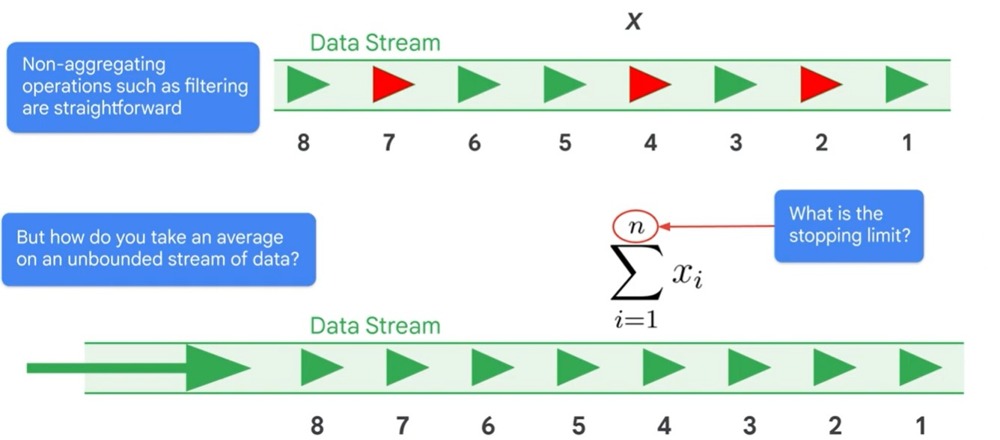  

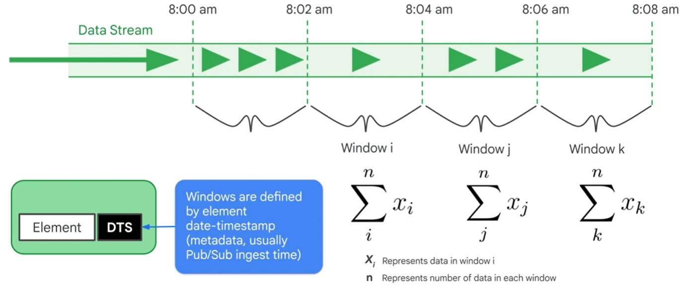  

### Message Ordering

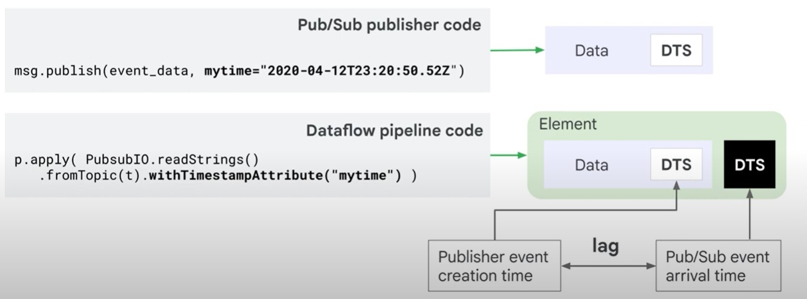  

Timestamps can be modified

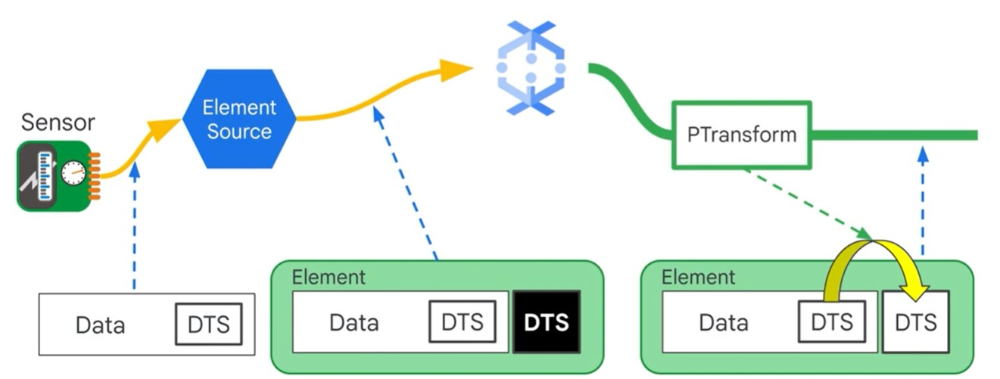  

    unix_timestamp = extract_timestamp_from_log_entry(element)
    yield beam.window.TimestampedValue(element, unix_timestamp)
    
### Duplication

    msg.publish(event_data, ,myid="34xwy57223cdg")
    
    p.apply(PubsubIO.readStrings().fromTopic(t).idLabel("myid"))
    
## Windowing

* Fixed
* Sliding
* Session

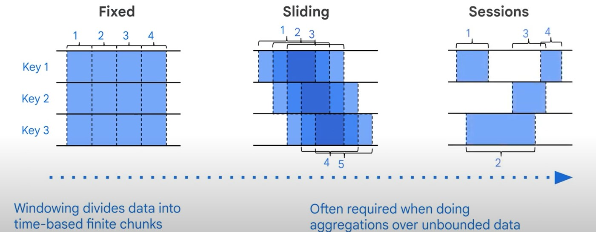

### Fixed

    from apache_beam import window
    fixed_window_items = (items | 'window' >> beam.WindowInto(window.FixedWindows(60)))
    

### Sliding

    from apache_beam import window
    fixed_window_items = (items | 'window' >> beam.WindowInto(window.SlidingWindows(30,5)))
    

### Session

    from apache_beam import window
    fixed_window_items = (items | 'window' >> beam.WindowInto(window.Sessions(10*60)))
    
## Pipeline Processing

### No Latency

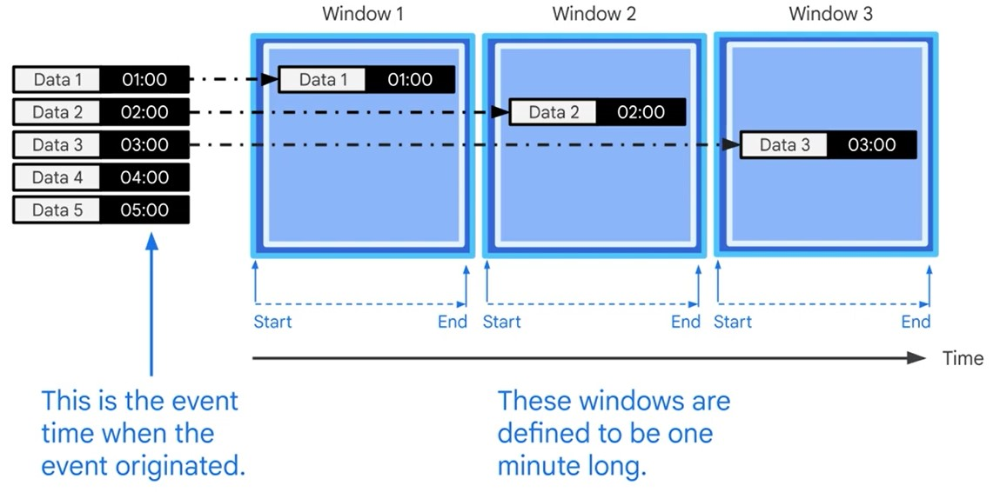

### Latencies (Watermark)

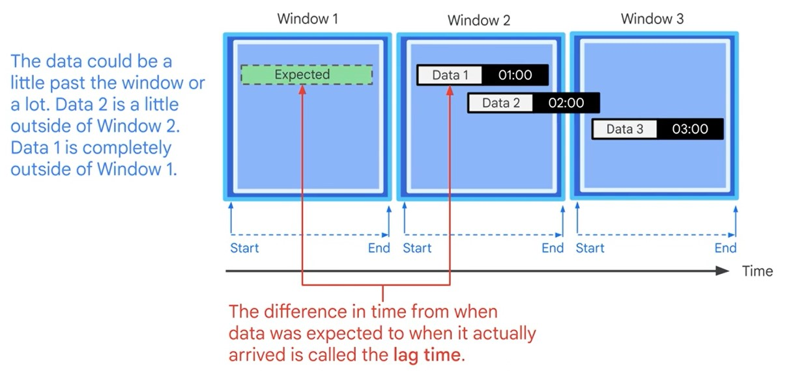  

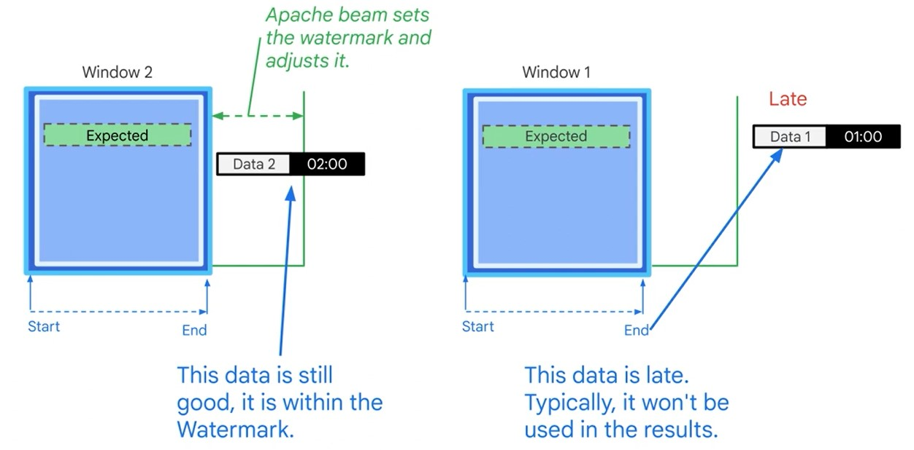

Late messages won't be processed. You can decide to re-read the dataset.  

### Triggers

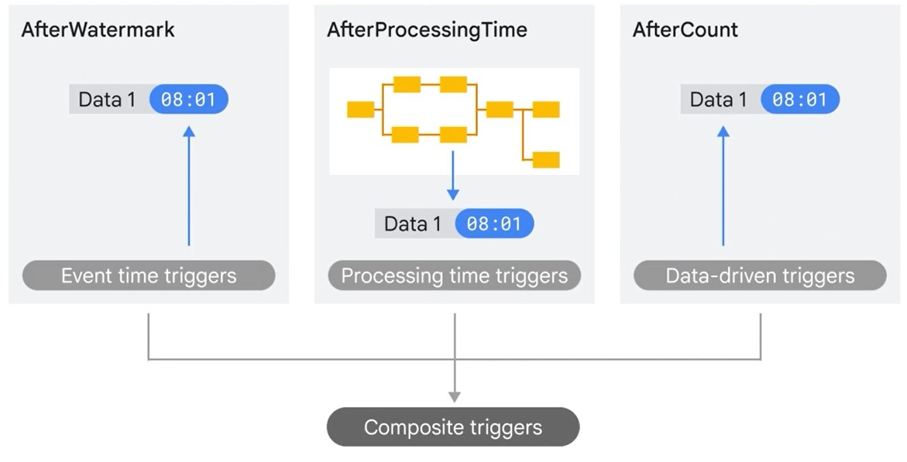

### Allow late Data past the Watermark

    pc = [Initial PCollection]
    pc | beam.WindowInto(
        FixedWindow(60),
        trigger=trigger_fn,
        accumulation_mode=accumulation_mode,
        timestamp_combiner=timestamp_combiner,
        allowed_lateness=Duration(seconds=2*24*60*60)) # 2 days

### Accumulation Mode

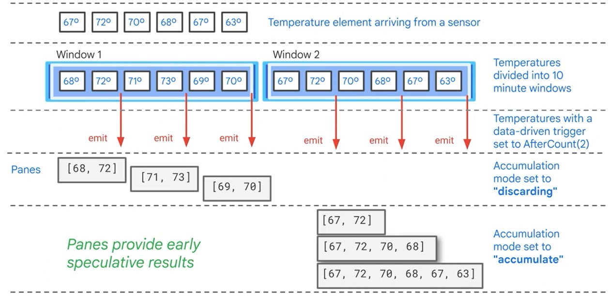

## Apache Beam

* Programming model for bath and streaming data pipelines.
* Pipelines can run locally or other backend servers
* A Runner is used to execute you pipeline
<a/>

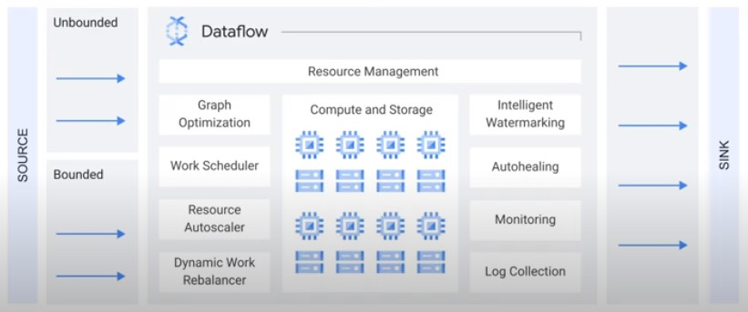

### Beam Portability

Provide portability framework for data pipelines.

* Portability Framework
* Language agnostic
* Interoperability layer = Portability API
* Docker containerization
<a/>

* Every runner works with every language
* Configurable worker environment
* Multi-language pipelines
* Cross-language transforms
* Faster delivery of new features
<a/>

### Dataflow Runner V2

### Container Environment

* Containerized with Docker
* Per-operation execution
<a/>

#### Custom Container

* Apache Beam SDK 2.25.0 or later
* Docker is required, to test pipeline locally

##### Create Dockerfile

    $ from apache/beam_python3.8_sdk:2.25.0
    $ env my_file_name=my_file.txt
    $ copy path/to/myfile/$MY_FILE_NAME ./
    
##### Build Image

    $ export PROJECT=my-project-id
    $ export REPO=my-repository
    $ export TAG=my-image-tag
    $ export REGISTRY_HOST=gcr.io
    $ export IMAGE_URI=$REGISTRY_HOST/$PROJECT/$REPO:$TAG
    
    $ gcloud builds submit --tag $IMAGE_URI
    
    $ docker build -f Dockerfile -t $IMAGE_URI ./
    $ docker push $IMAGE_URI
    
##### Launch Job

    $ python my-pipeline.py \
    --input=INPUT_FILE \
    --output=OUTPUT_FILE \
    --project=PROJECT_ID \
    --region=REGION \
    --temp_location=TEMP_LOCATION \
    --runner=DataflowRunner \
    --worker_harness_container_image=$IMAGE_URI
    
### Cross-Language Transforms

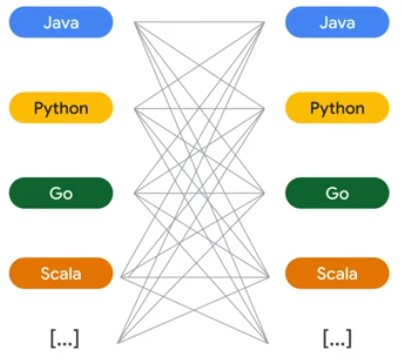

    from apache_beam.io.kafka import ReadFromKafka
    
    with beam.Pipeline(options=<You Beam PipelineOptions object>) as p:
      p
      | ReadFromKafka(
        consumer_config={'bootstrap.servers':'Kafka bootstrap servers list>'},
          topics=[<List of Kafka topics>])
    
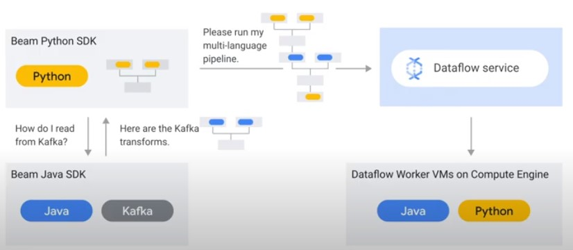

## Separate Compute and Storage

Dataflow allows executing Apache Beam Pipelines on Google Cloud.

### Dataflow Shuffle Service

Only for Batch pipelines. Faster execution time.  

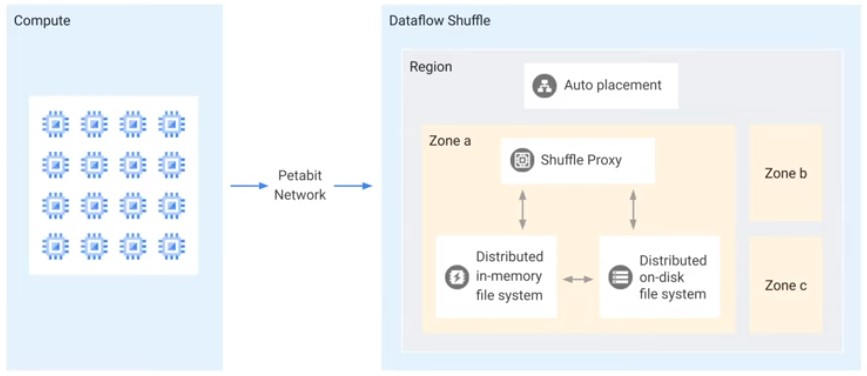

### Dataflow Streaming Engine

For Streaming Data pipelines. Less CPU and Memory.

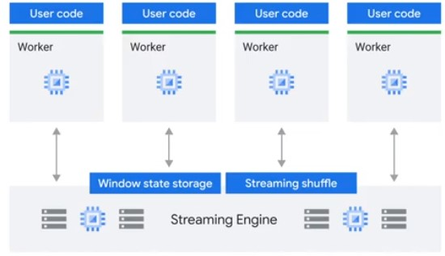

### Flexible Resource Scheduling (FlexRS)

Reduce cost of batch processing pipelines
* Advanced scheduling
* Dataflow Shuffle service
* * Mix of preemptible and normal VMs
<a/>

Execution within 6 hours. For non-time critical workflows.

## IAM

### Job Submission

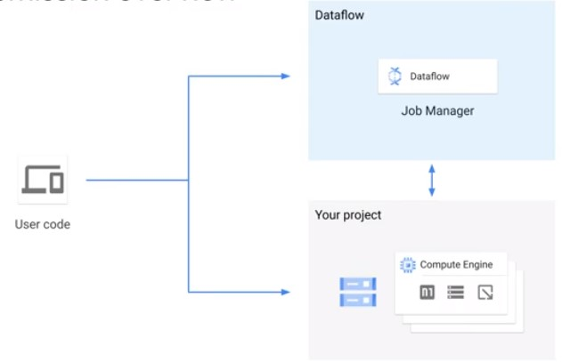

### Three Credentials

#### User roles

* Dataflow Viewer: Read-Only access to DF ressources
* Dataflow Developer: View, Update and Cancel DF jobs
* Dataflow Admin: Create and manage Dataflow jobs
<a/>

### Dataflow Service Account

* Interacts between project and Dataflow
* Used for worker creation and monitoring
* service-<project_number>@dataflow-service-producer-prod.iam.gserviceaccount.com
* Dataflow Agent role
<a/>

### Dataflow Controller Service Account

* Used by the workers to access resources needed by the pipeline
* <project-number>-compute@developer.gserviceaccount.com
<a/>
  
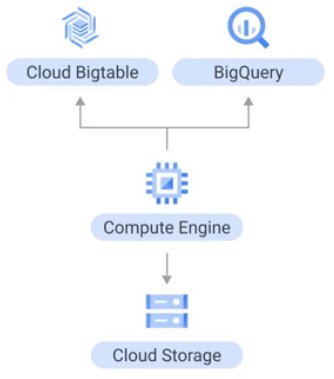

## Quotas
  
### CPU
  
Total number of CPUs consumed in a region.  

gcp > IAM > Quota.  
  
### IP
  
Total number of VMs with external IP address in a region.
  
### Persistent Disks
  
Either HDD, or SSD. set --worker_disk_type flag (pd-ssd).

#### Batch
  
* VM to PD ration is 1:1 for batch
* Size if Shuffle on VM: 250 GB
* Size if Shuffle Service: 25 GB
* Override default: --disk_size_gb
<a/>
  
#### Streaming

* Fixed numer of PD
* Default size if shuffle on VM: 400 GB
* Shuffle service: 30 GB
* Amount of disk allocated == Max number of workers
* --max_num_workers
<a/>

## Security
  
### Data Locality
  
Ensure all data and metadata stays in one region.
  
* Backend that deploys and controls Dataflow workers.
* Dataflow Service accound talks with regional endpoint.
* Stores and handles metadata about you DF job.
<a/>
  
#### Reasons for regional endpoint.

* Security and complience
* Min network latency and network transport costs
<a/>
  
* No zone preference: --region $REGION
* Specific region endpoint: --region $REGION -- worker_zone $WORKER_ZONE
<a/>
  
### Shared VPC (Virtual Private Cloud)
  
* Jobs can run in either VPC of Shared VPC
* Works for both default and custom networks
* Number of VMs is constrained by subnet IP block size
* Dataflow service account needs Compute Network User role in host project
<a/>
  

* --network default
  
## Private IPs
  
* Secure you data processing infrastructure
* Pipeline cannot access the internet and other Google Cloud networks
* Network must have Pricate Google Access to reach Google Cloud APIs and services
* --subnetwork regions/$REGION/subnetworks/$SUBNETWORK \
  --no_use_public_ips

## CMEK
  
Customer Managed Encryption Key. By default, Google manages key encryption. Customers can use symmetric CMEK keys stored in Google Cloud managed key service. Job metadata is encrypted with Google encryption.

* --temp_location gs://$BUCKET/tmpt/ \
  --dataflow_kms_key=projects/$PROJECT/locations/$REGION/keyRings/$KEY_RING/cryptoKeys/$KEY
</a>

# Dataflow Pipelines

Start Dataflow Pipeline
* Launch Template
* Authoring Pipeline using Apache Beam SDK
* Writing a SQL Statement
<a/>

## Beam Basics (Beam = Batch + Stream)

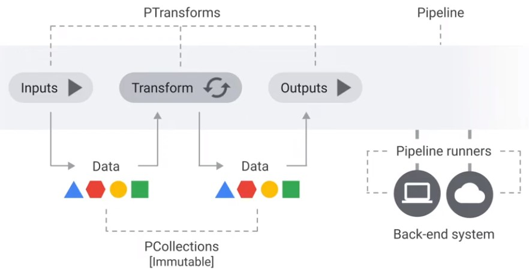

## Transforms

|Transformation|Description|
|-|-|
|ParDo|The most-general mechanism for applying a user-defined DoFn to every element in the input collection.|
|Combine|Transforms to combine elements.|
|GroupByKey|Takes a keyed collection of elements and produces a collection where each element consists of a key and all values associated with that key.|
|CoGroupByKey|Takes several keyed collections of elements and produces a collection where each element consists of a key and all values associated with that key.|
|Flatten|Given multiple input collections, produces a single output collection containing all elements from all of the input collections.|
|Partition|Routes each input element to a specific output collection based on some partition function.|

[Python Transformation Catalogue](https://beam.apache.org/documentation/transforms/python/overview/)

## DoFn

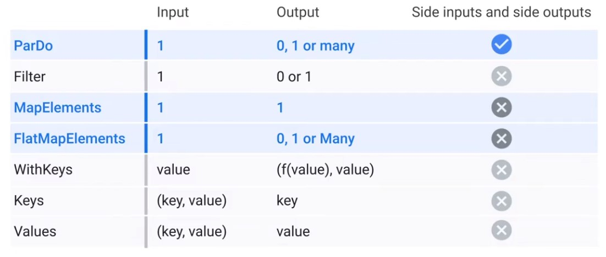

### Data Bundles

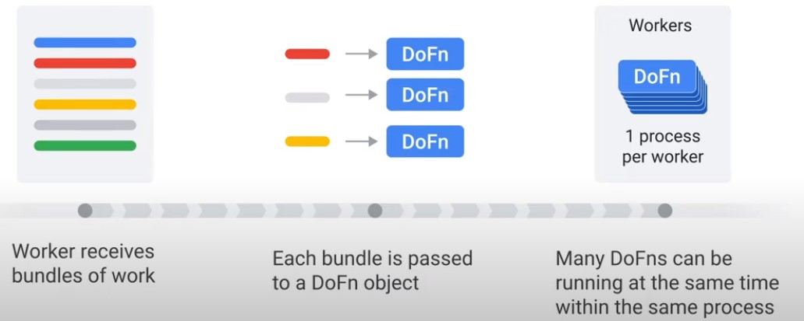

### Methods of DoDn

    class MyDoFn(bean.DoFn):
      def setup(self):
        pass
      def start_bundle(self):
        pass
      def process(self,element):
        pass
      def finish_bundle(self):
        pass
      def teardown(self):
        pass
        
### Lifecycle

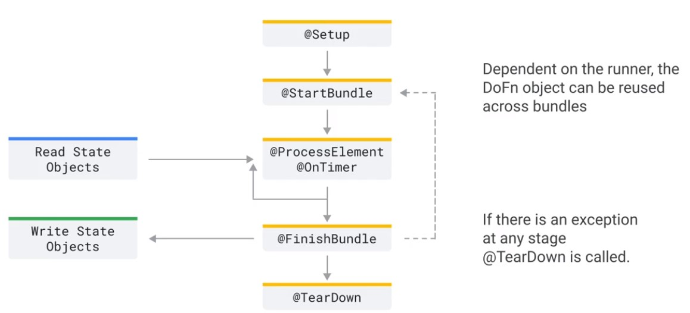

