# Dataflow

* Scalable
* Low latency
* Batch and Stream

||Dataflow|Dataproc|
|-|-|-|
|Recommended for|New data processing pipelines, unified batch and streaming|Existing Hadoop/Spak applications, ML, large-batch jobs|
|Fully managed|Yes|No|
|Auto scaling|Yes (adaptive)|Yes (reactive)|
|Expertise|Apache Beam|Hadoop, Hive, Pig, Sprak ...|

## Apache Beam

### Datagraph

### PCollection

In a PCollection all data is immutable and stored as bytestring.

## How does Dataflow Work?

* Fully Managed
* Optimizes Datagraph
* Autoscaling
* Rebalancing
* Streaming Semntics

## Dataflow Pipelines

### Simple Pipeline

### Branching Pipeline

### Start End

    import apache_beam as beam
    
    if __name == '__main__':
    
      with beam.Pipeline(argv=sys.argv) as p: # Create pipeline parameterized by command line flags
      
        (p
          | beam.io.ReadFromText('gs://...') # Read Input
          | beam.FlatMap(count_words) # Apply transform
          | beam.io.WriteToText('gs://...') # Write output
        )
    
    options = {'project':<project>,
               'runner':'DataflowRunner'. # Where to run
               'region':<region>.
               'retup_file':<setup.py file>}
    
    pipeline_options = beam.pipeline.PipelineOptions(flags=[],**options)
    
    pipeline = beam.Pipeline(options=pipeline_options) # Creates the pipeline

#### Run local

    $ python ./grep.py

#### Run on cloud

    $ python ./grep.py \
             --project=$PROJECT \
             --job_name=myjob \
             --staging_location=gs://$BUCKET/staging/ \
             --temp_location=gs://$BUCKET/tmp/ \
             --runnner)DataflowRunner
 
### Read Data
 
    with beam.Pipeline(options=pipeline_options as p:
    
       # Cloud Storage
      lines = p | beam.ioReadFromText("gs://..../input-*.csv.gz")
      
      # Pub/Sub
      lines = p | beam.io.ReadStringsFromPubSub(topic=known_args.input_topic)
      
      # BigQuery
      query = "select x, y, z from `project.dataset.tablename`"
      BQ_source = beam.io.BigQuerySource(query = <query>, use_standard_sql=True)
      BQ_data = pipeline | beam.io.Read(BG_srouce)
      
### Write to Sinks
 
    from apache_beam.io.gcp.internal.clients import bigquery
    
    table_spec = bigquery.TableReference(
      projectId='clouddataflow-readonly',
      datasetId='samples',
      tableId='weather_stations')
      
     p | beam.io.WriteToBigQuery(
      table_spec,
      schema=table_schema,
      write_disposition=beam.io.BigQuerryDisposition.WRITE_TRUNCATE,
      create_disposition=beam.io.BigQueryDisposition.CREATE_IT_NEEDED)

### Map Phase > Transform

    'WordLengths' >> beam.Map(word, len(word))

    def my_grep(line_term):
      if term in line:
        yield line
        
    'Grep' >> beam.FlatMap(my_grep(line, searchTerm))

#### ParDo Parallel Processing

    words = ...
    
    # Do Fn
    class ComputeWordLengthFn(beam.DoFn):
      def process(self,element):
        return [len(element)}
    
    # ParDo
    word_lengths = words | beam.ParDo(ComputeWordLengthFn())

##### Multiple Variables

    results = (words | beam.PrDo(ProcessWords(),
      cutoff_length=2, marker='x')
      .with_putputs('above_cutoff_lengths','marked strings',main='below_cutoff_strings'))
      
    below = results.below_cutoff_strings
    above = results.above_cutoff_strings
    marked = results['marked strings']

### GroupByKey

  

Data skew makes grouping less efficient at scale.  

  

    totalAmount = salesAmounts | CombineGlobally(sum)
    totalSalesPerPerson = salesRecords | CombinePerKey(sum)
    
### CombineFn works by overriding exisintg operations

You must provide four functions

    class AverageFn(beam.CombineFn):
    
        def create_accumulator(self):
            return(0.0,0)
        
        def add_input(self, sum_count, input):
            (sum, count) = sum_count
            return sum + input, count + 1
            
        def merge_accumulators(self, accumulators):
            sums, counts = zip(*accumulators)
            return sum(sums), sum(counts)
            
        def extract_output(self, sum_count):
            (sum, count) = sum_count
            return sum / count if count else float('NaN')
            
    pc = ...
    average = pc | beam.CombineGlobally(AverageFn())
    
Combine is more efficient that GroupByKey  

  

### Flatten Merges identical PCollections

### Partition Splits PCollections

## Side-Inputs and Windows

### Side-Input

A side-input is an input the do-function can access every time it processes an element of the inputP collection.  

  

    words = ...
    
    def filter_using_length(word, lower_bound, upper_bound=floar('inf')):
        if lower_bound <= len(word) <= upper_bound:
            yield word
            
    small_words = words | 'small' >> beam.FlatMap(filter_using_length, 0, 3)
    
    # Side input
    avg_word_len = (words
               | beam.Map(len)
               | beam.CombineGlobally(beam.containers.MeanCombineFn())
    
    larger_than_average = (words | 'large' >> beam.FlatMap(
        filter_using_length,
        lower_bound=value.AsSingleton(avg_word_len)))
        
### Window

Unbounded PCCollection not useful for Streaming data.  

  

Use time windows.  

    lines = p | 'Create' >> beam.io.ReadFromText('access.log')
    
    windowd_counts = (
        lines
        | 'Timestamp' >> beam.Map(beam.window.TimestampedValue(X, extract_timestamp(x)))
        | 'Window' >> beam.WindowInto(beam.window.SlidingWindows(60,30))
        | 'Count' >> (beam.CombineGlobally(beam.combiners.CountCombineFn()).without_defaults())
    )
    
    windowed_counts = windowed_counts | beam.ParDo(PrintWindowFn())

## Templates

Separate developer from user.  

### Create own Template

Each template has metadata:  

  

## Dataflow SQL

  

## Streaming Data Challenges

* Scalability
* Fault Tolerance
* Model (Sreaming, Repeated Batch)
* Timing
* Aggregation

  

  

### Message Ordering

  

Timestamps can be modified

  

    unix_timestamp = extract_timestamp_from_log_entry(element)
    yield beam.window.TimestampedValue(element, unix_timestamp)
    
### Duplication

    msg.publish(event_data, ,myid="34xwy57223cdg")
    
    p.apply(PubsubIO.readStrings().fromTopic(t).idLabel("myid"))
    
## Windowing

* Fixed
* Sliding
* Session

### Fixed

    from apache_beam import window
    fixed_window_items = (items | 'window' >> beam.WindowInto(window.FixedWindows(60)))
    

### Sliding

    from apache_beam import window
    fixed_window_items = (items | 'window' >> beam.WindowInto(window.SlidingWindows(30,5)))
    

### Session

    from apache_beam import window
    fixed_window_items = (items | 'window' >> beam.WindowInto(window.Sessions(10*60)))
    
## Pipeline Processing

### No Latency

### Latencies (Watermark)

  

Late messages won't be processed. You can decide to re-read the dataset.  

### Triggers

### Allow late Data past the Watermark

    pc = [Initial PCollection]
    pc | beam.WindowInto(
        FixedWindow(60),
        trigger=trigger_fn,
        accumulation_mode=accumulation_mode,
        timestamp_combiner=timestamp_combiner,
        allowed_lateness=Duration(seconds=2*24*60*60)) # 2 days

### Accumulation Mode

## Apache Beam

* Programming model for bath and streaming data pipelines.
* Pipelines can run locally or other backend servers
* A Runner is used to execute you pipeline
<a/>

### Beam Portability

Provide portability framework for data pipelines.

* Portability Framework
* Language agnostic
* Interoperability layer = Portability API
* Docker containerization
<a/>

* Every runner works with every language
* Configurable worker environment
* Multi-language pipelines
* Cross-language transforms
* Faster delivery of new features
<a/>

### Dataflow Runner V2

### Container Environment

* Containerized with Docker
* Per-operation execution
<a/>

#### Custom Container

* Apache Beam SDK 2.25.0 or later
* Docker is required, to test pipeline locally

##### Create Dockerfile

    $ from apache/beam_python3.8_sdk:2.25.0
    $ env my_file_name=my_file.txt
    $ copy path/to/myfile/$MY_FILE_NAME ./
    
##### Build Image

    $ export PROJECT=my-project-id
    $ export REPO=my-repository
    $ export TAG=my-image-tag
    $ export REGISTRY_HOST=gcr.io
    $ export IMAGE_URI=$REGISTRY_HOST/$PROJECT/$REPO:$TAG
    
    $ gcloud builds submit --tag $IMAGE_URI
    
    $ docker build -f Dockerfile -t $IMAGE_URI ./
    $ docker push $IMAGE_URI
    
##### Launch Job

    $ python my-pipeline.py \
    --input=INPUT_FILE \
    --output=OUTPUT_FILE \
    --project=PROJECT_ID \
    --region=REGION \
    --temp_location=TEMP_LOCATION \
    --runner=DataflowRunner \
    --worker_harness_container_image=$IMAGE_URI
    
### Cross-Language Transforms

    from apache_beam.io.kafka import ReadFromKafka
    
    with beam.Pipeline(options=<You Beam PipelineOptions object>) as p:
      p
      | ReadFromKafka(
        consumer_config={'bootstrap.servers':'Kafka bootstrap servers list>'},
          topics=[<List of Kafka topics>])
    

## Separate Compute and Storage

Dataflow allows executing Apache Beam Pipelines on Google Cloud.

### Dataflow Shuffle Service

Only for Batch pipelines. Faster execution time.  

### Dataflow Streaming Engine

For Streaming Data pipelines. Less CPU and Memory.

### Flexible Resource Scheduling (FlexRS)

Reduce cost of batch processing pipelines
* Advanced scheduling
* Dataflow Shuffle service
* * Mix of preemptible and normal VMs
<a/>

Execution within 6 hours. For non-time critical workflows.

## IAM

### Job Submission

### Three Credentials

#### User roles

* Dataflow Viewer: Read-Only access to DF ressources
* Dataflow Developer: View, Update and Cancel DF jobs
* Dataflow Admin: Create and manage Dataflow jobs
<a/>

### Dataflow Service Account

* Interacts between project and Dataflow
* Used for worker creation and monitoring
* service-<project_number>@dataflow-service-producer-prod.iam.gserviceaccount.com
* Dataflow Agent role
<a/>

### Dataflow Controller Service Account

* Used by the workers to access resources needed by the pipeline
* <project-number>-compute@developer.gserviceaccount.com
<a/>
  

## Quotas
  
### CPU
  
Total number of CPUs consumed in a region.  

gcp > IAM > Quota.  
  
### IP
  
Total number of VMs with external IP address in a region.
  
### Persistent Disks
  
Either HDD, or SSD. set --worker_disk_type flag (pd-ssd).

#### Batch
  
* VM to PD ration is 1:1 for batch
* Size if Shuffle on VM: 250 GB
* Size if Shuffle Service: 25 GB
* Override default: --disk_size_gb
<a/>
  
#### Streaming

* Fixed numer of PD
* Default size if shuffle on VM: 400 GB
* Shuffle service: 30 GB
* Amount of disk allocated == Max number of workers
* --max_num_workers
<a/>

## Security
  
### Data Locality
  
Ensure all data and metadata stays in one region.
  
* Backend that deploys and controls Dataflow workers.
* Dataflow Service accound talks with regional endpoint.
* Stores and handles metadata about you DF job.
<a/>
  
#### Reasons for regional endpoint.

* Security and complience
* Min network latency and network transport costs
<a/>
  
* No zone preference: --region $REGION
* Specific region endpoint: --region $REGION -- worker_zone $WORKER_ZONE
<a/>
  
### Shared VPC (Virtual Private Cloud)
  
* Jobs can run in either VPC of Shared VPC
* Works for both default and custom networks
* Number of VMs is constrained by subnet IP block size
* Dataflow service account needs Compute Network User role in host project
<a/>
  

* --network default
  
## Private IPs
  
* Secure you data processing infrastructure
* Pipeline cannot access the internet and other Google Cloud networks
* Network must have Pricate Google Access to reach Google Cloud APIs and services
* --subnetwork regions/$REGION/subnetworks/$SUBNETWORK \
  --no_use_public_ips

## CMEK
  
Customer Managed Encryption Key. By default, Google manages key encryption. Customers can use symmetric CMEK keys stored in Google Cloud managed key service. Job metadata is encrypted with Google encryption.

* --temp_location gs://$BUCKET/tmpt/ \
  --dataflow_kms_key=projects/$PROJECT/locations/$REGION/keyRings/$KEY_RING/cryptoKeys/$KEY
</a>

# Dataflow Pipelines

Start Dataflow Pipeline
* Launch Template
* Authoring Pipeline using Apache Beam SDK
* Writing a SQL Statement
<a/>

[Dataflow Pipeline Coding Examples](https://github.com/GoogleCloudPlatform/dataflow-sample-applications)

## Beam Basics (Beam = Batch + Stream)

[Apache Beam Programming Guide](https://beam.apache.org/documentation/programming-guide/#pipeline-io)

## Transforms

|Transformation|Description|
|-|-|
|ParDo|The most-general mechanism for applying a user-defined DoFn to every element in the input collection.|
|Combine|Transforms to combine elements.|
|GroupByKey|Takes a keyed collection of elements and produces a collection where each element consists of a key and all values associated with that key.|
|CoGroupByKey|Takes several keyed collections of elements and produces a collection where each element consists of a key and all values associated with that key.|
|Flatten|Given multiple input collections, produces a single output collection containing all elements from all of the input collections.|
|Partition|Routes each input element to a specific output collection based on some partition function.|

[Python Transformation Catalogue](https://beam.apache.org/documentation/transforms/python/overview/)

## DoFn

### Data Bundles

### Methods of DoDn

    class MyDoFn(bean.DoFn):
      def setup(self):
        pass
      def start_bundle(self):
        pass
      def process(self,element):
        pass
      def finish_bundle(self):
        pass
      def teardown(self):
        pass
        
### Lifecycle

# Dataflow Streaming Data

## Batch vs Streaming

Out order Stream.

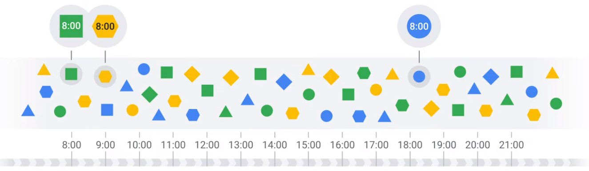

## Windows

* Windowing divides data into time-based finite chunks.
* Required when doing aggregations over unbound data using Beam primitives (GroupByKey, Combiners).
<a/>

### Two Dimensions of Time

* Processing Time
* Event Time
<a/>

### Types of Windows

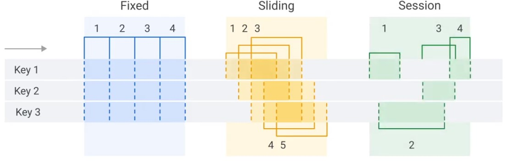

## Watermarks

### Latency Problem. When to close the Window?

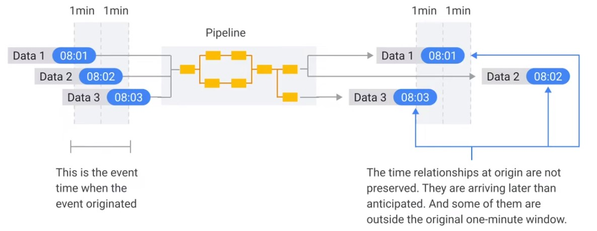  

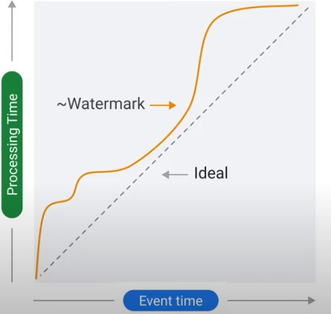  

### Time Lag

Data is only late when it exceeds the watermark.  

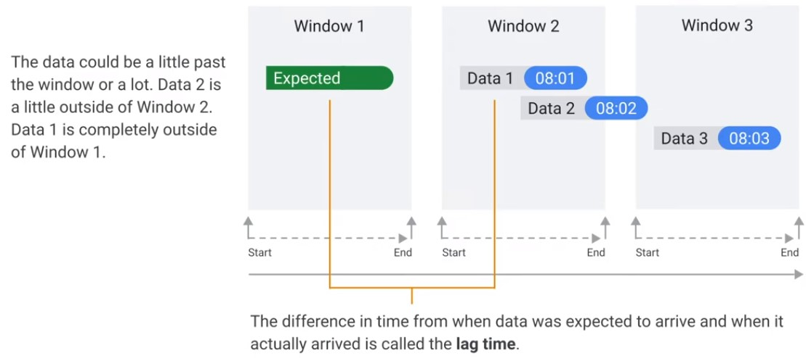  

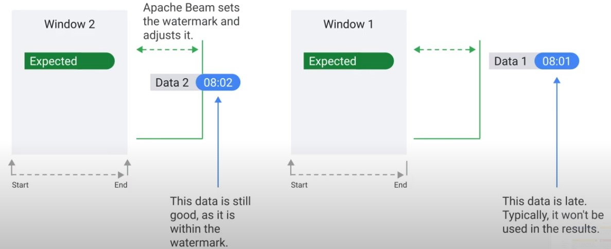  

### Observe Watermark

* Data Freshness: The amount of time between real time and the output watermark.
* System Latency: System latency is the current maximum duration that an item of data has been processing.

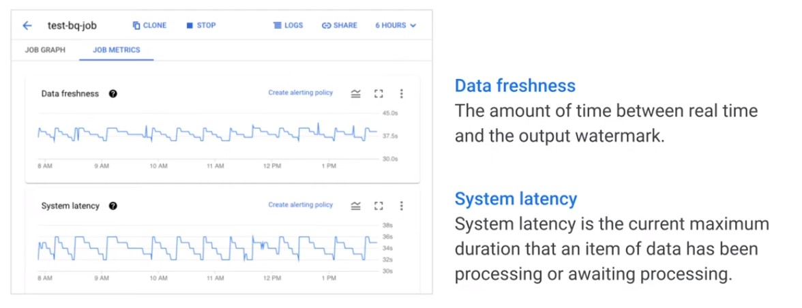  

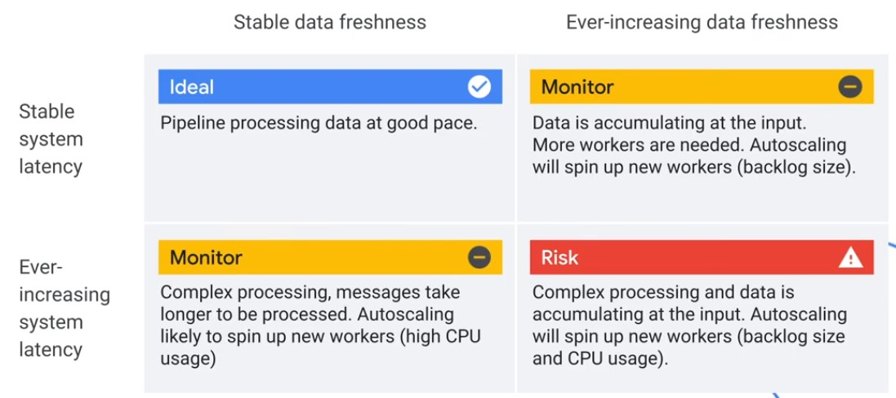  

## Triggers

Decide when to close window, even if late data has not arrived.

* Event Time (After Watermark)
* Processing Time (After Processing Time)
* Composite
* Data-driven (After Count)
<a/>

### Custom Triggers

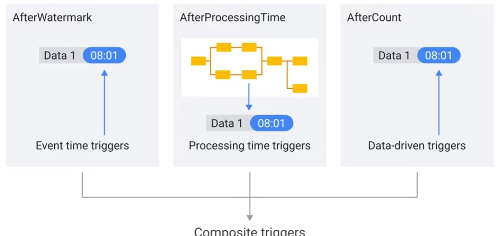

### Accumulate Mode

* Accumulate: Calculation is repeated including late messages
* Discard: Calculate only new messages
<a/>

#### Accumulate

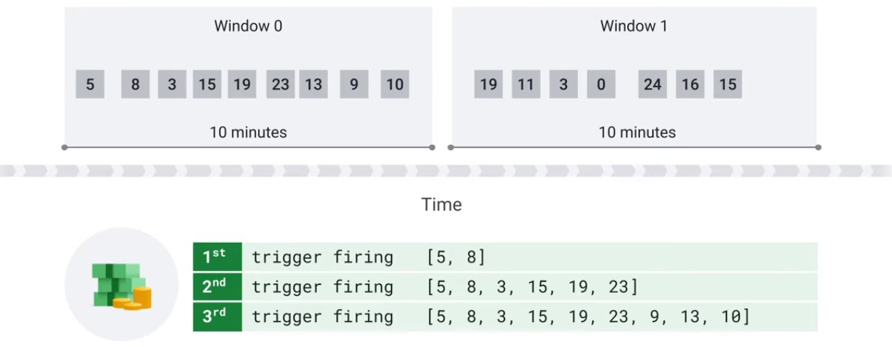

    pcollection | Windowinto(
      SlidingWindows(60,5),
      trigger=AfterWatermark(
        early=AfterProcessingTime(delay=30),
        late=AfterCount(1))
      accumulation_mode=AccumulationMode.ACCUMULATING)

#### Discard

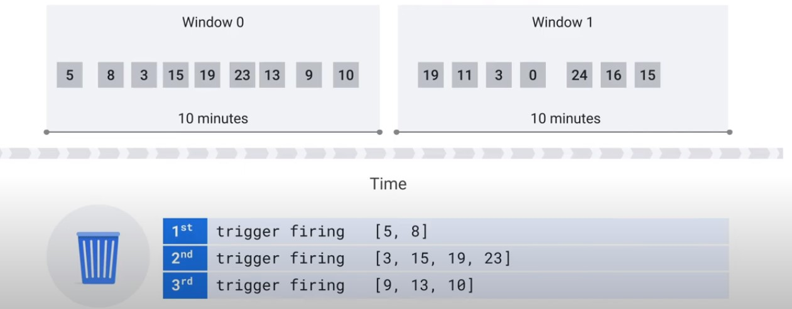

    pcollection | WindowInto(
      FixedWindow(60),
      trigger=Repeatedly(
        AfterAny(
          AfterCound(100),
          AfterProcessingTime(1*60))),
      accumulation_mode=AccumulationMode.DISCARDING,
      allowed_lateness=Duration(seconds=2*24*60*60))

# Sources and Sinks

* Source: Read Data
    * Bounded: Batch Data (Read Data in Bundles)
    * Unbounded: Stream Data
* Sink: Write Data (PTransform Write)
    * Watermarks
<a/>

## Beam Data Sinks

    Java
    @AutoValue
        public abstract static class Write<T> extends
    PTransform<PCollectoin<T>,WriteResult> {
    
    Python
    class WriteToPubSub(PTransform):
    
### Text IO

#### Reading

##### Java

    Pipeline
        .apply(
            "Read from source",
            TextIO
                .read()
                .from(options
                .getInputFilePattern()))

###### Reading with Filenames

    p.apply(
        FileIO
        .match()
        .filepattern("hdfs://path/to/*.gz"))
    .apply(
        FileIO
        .readMatches().withCompression(Compression.GZIP))
    .apply(
        ParDo.of(
            mew DoDn<FileIO.ReadableFile, String>() {
            @ProcessElement
            public void process(
                @Element FileIO.ReadableFile file) {
                    LOG.info("File Metadata resourceId is {} ",
                        file.getMetadata().resourceId());
                }
            }));

###### Processing Files as they arrive

    p.apply(
        FileIO.match()
            .filepattern("...")
            .continuously (
                Duration.standardSeconds(30),
                Watch.Growth.afterTimeSinceNewOutput(
                    Duration.standardHours(1))));

###### Contextual Text reading

    PCollection<Row> records1 =
        p.apply(ContextualTextIO.read().from("..."));
        
    PCollection<Row> records2 =
        p.apply(ContextualTextIO.read()
            .from("/local/path/to/files/*.csv")
            .withHasMultilineCSVRecors(true));
    
    PCollection<Row> records3 =
        p.apply(ContexturalTextIO.read()
            .from("/local/path/to/files/*")
            .watchForNewFiles(
                Duration.standardMinutes(1),
                afterTimeSinceNewOutput(
                    Duration.standardHours(1))));
                    
##### Python

    pcoll1 = (pipeline
        | 'Create' >> Create([file_name])
        | 'ReadAll' >> ReadAllFromText())
        
    pcoll2 = pipeline | 'Read' >> ReadFromText(file_name)

###### Reading with Filenames

    with beam.Pipeline() as p:
        readable_files = (
            p
            | fileio.MatchFiles ('hdfs://path/to/*.txt')
            | fileio.ReadMatches()
            | beam.Reshuffle())
        files_and_contens = (
            readable_files
            | beam.Map(lambda x: (x.metadata.path,
                x.read_utf8)))

###### Processing Files as they Arrive

    with beam.Pipeline() as p:
        readable_files = (
            p
            | beam.io.ReadFromPubSub(...)
            ... #<Parse PubSub Message and Yield Filename>
        )
        files_and_contents = (
            readable_files
            | ReadAllFromText())

#### Writing

##### Java

    csv.appy(
        "Write to storage",
        TextIO
        .write()
        .to(Options
            .getTextWritePrefix())
            .withSuffix(".csv"));

###### Text Writing with Dynamic Destinations

    PCollection<BankTransaction> transactions = ...;
    
    transactions.apply(FileIO.<TransactionType,
        Transaction>writeDynamic()
        .by(Transaction::getTypeName)
        .via(tx -> tx.getTypeName().toFields(tx),
            type -> new CSVSink(type.getFieldNames()))
        .to(".../path/to/")
        .withNaming(type -> defaultNaming(
            type + "-transactions", ".csv"));
            
##### Python

    transformed_data
    | 'write' >> WriteToText(
        known_args.output, coder=JsonCoder()))

###### Text Writing with Dynamic Destinations

    (my_pcollection
    | beam.io.fileio.WriteToFiles(
        path='/my/file/path',
        destination=lamba record: 'avro'
            if record ['type'] == 'A' else 'csv',
        sink = lamda dest: AvroSink()
            if fest == 'avro' else CsvSink(),
                file_naming = beam.io.fileio
                .destination_prefix_naming()))
 
 ### BigQuery IO
 
 #### Reading
 
 ##### Java
 
    PCollection<Double> maxTemperatures = 
        p.apply(
            BigQueryIO.read(
                (SchemaAndRecord elem) -> (Double)
                    elem.getRecord()
                    .get("max_temperature"))
            .fromQuery(
                "select max_temperature from
                `clouddataflow-readonly.samples.weather_stations`")
            .usingStandardSql()
            .withCoder(DoubleCoder.of()));
            
###### Reading with BiqQuery Storage API

    PCollection<MyData> rows =
        pipeline.apply("Read from BitQuery table",
            BigQueryIO.readTableRows()
                .from(
                    String.format("%s:%s,%s,
                        project, dataset, table))
                .withMethod(Method.DIRECT_READ)
                //.withRowRestriction
                .withSelectedFields(
                    Arrays.asList(..."string_...","Int64...")))
                        .apply("TableRows to MyData",
                            MapElements.into(
                                TypeDescriptor.of(MyData.class))
                        .via(MyData::fromTableRow))

##### Python

    max_temperatures = (
        p
        | 'QueryTableStdSQL' >> beam.io.ReadFromBigQuery(
            query = 'select max_temperature from '\
            `clouddataflow-readonly.samples.weather_stations`',
            use_standard_sql=True)
        | beam.Map(lambda elem: elem['max_temperature']))
        
#### Writing

##### Java

###### Dynamic Destinations

        pc.apply(BigQueryIO.<Purchase>write(tableSpec)
            .useBeamSchema()
            .to((ValueInSingleWindow<Purchase> purchase) -> {
                return new TableDestition(
                    "project:dataset-" +
                        purchase.getValue().getUser() +
                        ":purchases","");
            });

##### Python

    def table_fn(element, fictional_characters):
        if element in fictional_characters:
            return 'my_dataset.fictional_quotes'
        else:
            return 'my_dataset.real_quotes'
            
    quotes | 'WriteWithDynamicDestination' >>
    beam.io.WriteToBigQuery(
        table_fn,
        schema=table_schema,
        table_side_inputs=(fictional_characters_view, ),
        ...)
        
### Pub/Sub IO

#### Java

    pipline
        .apply("Read PubSub Messages",
            PubsubIO
            .readStrings()
            .fromTopic(options.getInputTopic()))
        .apply(
            Window.into(
                FixedWindows.of(
                    Duration.standardMinutes(
                        options.getWindowSize()))));

#### Python

    class GroupWindowsIntoBatches(beam.PTransform):
    ...
        >> beam.WindowInto(
            window.FixedWindows(self.window_size))
    
    pipeline
        | "Read PubSub Messages"
            >> beam.io.ReadFromPubSub(topic=input_topic)
        | "Window into"
            >> GroupWindowsIntoBatches(window_size)

### Kafka IO

#### Java

    PCollectoin<KV<String, String>> records =
    pipeline
        .apply("Rad From Kafka",
            KafkaIO.<String, String>read()
                .withConsumerConfigUpdates(ImmutableMap.of(
                    CosumerConfig
                        .AUTO_OFFSET_RESET_CONFIG, "earlies"))
        .withBootstrapServers(options.getBootstrapServers())
            .withTopics(<...list...>)
            .withKeyDeserializersAndCoder(...))
            .withValueDeserializerAndCoder(...)
            .withoutMetadata())
            
#### Python

    pipeline
        | ReadFromKafka(
            consumer_config={
                'bootstrap.servers':bootstrap_servers},
                topics=[topic])

### BigTable IO

#### Java

    p.appy("filterd read",
        BittableIO.read()
            .withProjectId(projectId)
            .withInstanceId(instanceId)
            .withTableId("table")
            .withRowFilter(filter));

##### Reading with Prefix Scan

    ByteKeyRange keyRange = ...;
    p.appy("read",
    BittableIO.read()
        .withProjectId(projecctId)
        .withInstanceId(instanceId)
        .withTableId("table")
        .withKeyRange(keyRange));

##### BigTable IO writing with additional actions

    PCollection<KV<..., Iterable<Mutation>>> data = ...;
    
    PCollection<BigtableWriteResult> writeResults = 
        data.apply("write",BittableIO.write()
            .withProjectId("project")
            .withInstanceId("instance")
            .withTableId("table"))
            .withWriteResults();
    
    PCollection<...> moreData = ...;
    
    moreData
        .apply("wait for writes", Wait.on(writeResults))
        .apply("do something", ParDo.of(...))
        
### Avro IO

#### Java

    PCollection<AvroAutoGenClass> records =
        p.apply(AvroIO.read(AvroAutoGenClass.class)
            .from("gs:...*.avro"));
    
    Schema schema = new Schema.Parser()
        .parse(new File("schema.avsc"));
    
    PCollecction<GenericRecord> records =
        p.apply(AvroIO.readGenericRecords(schema)
            .from("gs:...-*.avro"));

#### Python

    with beam.Pipeline() as p:
        records = p | 'Read' >> beam.io.ReadFromAvro('/mypath/myavrofiles*')

### Splittable DoFn

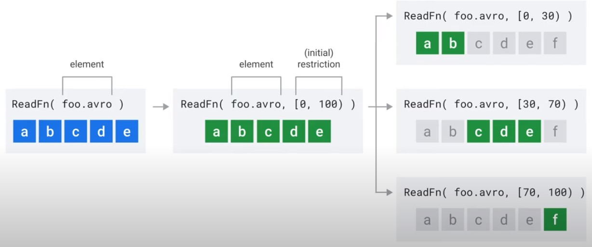

#### Java

    @BoundPerElement
    private static class FileToWordsFn extends DoFn<String,Integer> {
        @GetInitialRestriction
        public OffsetRange getInitialRestriction(
            @Element String fileName) throws IOException {
                return new OffsetRange(0,
                    new File(fileNam).length());
            }

    @ProcessElement
    public void processElement(
        @Element String fileName,
        RestrictionTracker<OffsetRange, Long> tracker,
        OutputReceiver<Integer> outputReceiver){...}
        

#### Python

    class FileToWordsRestrictionProvider(
        beam.io.RestrictionProvider):
            def initial_restriction(self, file_name):
                return OffsetRange(0,os.stat(file_name).st_size)
            def create_tracker(self,restriction):
                return beam.io.restriction_trackers.OffsetRestrictionTracker()
    
    clas FileToWordsFn(beam.DoFn):
        def process(...)

## Beam Schemas

### Convert Elements into Objects

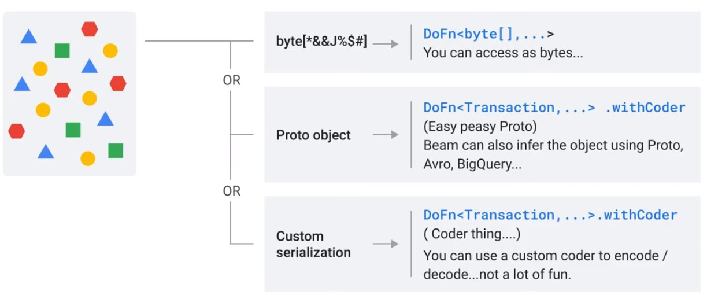

### Schemas

* Describes a type in Terms of fields and values
* String names or numerical indexed
* Primitive Types int, long, string
* Some field can be marked optional
* Schemas can be nested
<a/>

### Code Examples

#### Filter Purchases

##### Without Schemas

    purchases.apply(Filter.by(purchase -> {
        return purchase.location.lat < 40.720 && purchase.location.lat > 40.699
            && purchase.location.lon < -73.969 && purchase.locatoin.lon > -74.747}));
            
##### With Schemas

    purchases.apply(
        Filter.whereFieldName("location.lat", (double lat) -> lat < 40.720 && lat > 40.699)
              .whereFieldName("lcoation.lon", (double lon) -> lon < -73.969 && lon > -74.747));
              
#### Total Purchases per Transaction

    PCollection<UserPurchases> userSums =
    purchases.apply(Join.innerJoin(transactions).using("transactionId"))
             .apply(Select.fieldNames("lhs.userId","rhs.totalPurchase"))
             .apply(Group.byField("userId").aggregateField(Sum.ofLongs(),"totalPurchase"));

## State and Timers

* Domain-specific triggering
* Slowly changing dimensions
* Stream joins
* Fine-grained aggregation
* Per-key workflows
<a/>

### States

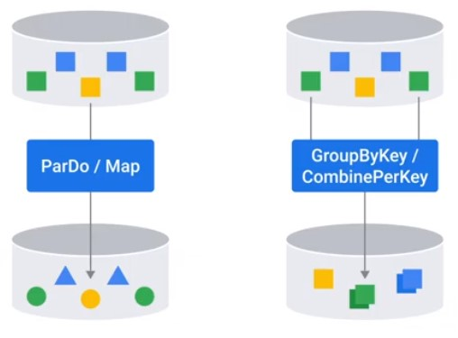  

#### Types of State Variables

|Type|Strength|Dataflow|
|-|-|-|
|Value|Read/write any value|yes|
|Bag|Cheap append no ordering on read|yes|
|Combining|Associatie/cummulative compaction|yes|
|Map|Read/write just keys you specify|yes|
|Set|Membership checking|no|

#### Stateful ParDo

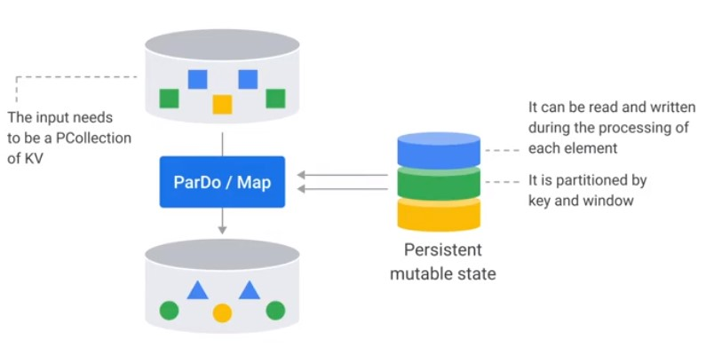  

  

#### Accumulate Calls

    class StatefulBufferingFn(beam.DoFn):
        MAX_BUFFER_SIZE = 500;
        BUFFER_STATE = BagStateSpec('buffer', EventCoder())
        COUNT_STATE = CombiningValueStateSpec('count',VarIntCoder(),combiners.SumCombineFn())
        
        def process(self, element,
            buffer_state=beam.DoFn.StateParam(BUFFER_STATE),
            count_state=beam.DoFn.StateParam(COUNT_STATE)):
            
            buffer_state.add(element)
            count_state.add(1)
            count=count_state.read()
            
            if count >= MAX_BUFFER_SIZE:
                for event in buffer_state.read():
                    yield event
                count_state.clear()
                buffer_state.clear()

? What happens with the last Buffer, if it has not got enough messages to be cleared?

### Timers

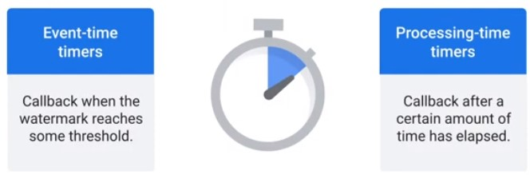

    class StatefulBufferingFn(beam.DoFn):
        ...
        
        EXPIRY_TIMER = TimerSpec('expiry', TimeDomatin.WATERMARK)
        
        def process(self, element,
            w = beam.DoFn.WindowParam,
            ...
            expiry_timer=beam.DoFn.TimerParam(EXPIRY_TIMER)):
                expiry_timer.set(w.end + ALLOWED_LATENESS)
                
        @on_timer(EXPIRY_TIMER)
        def_expiry(self,
            buffer_state=beam.DoFn.StateParam(BUFFER_STATE),
            count_state=beam.DoFn.StateParam(COUNT_STATE)):
            
            events = buffer_state.read()
            for event in events:
                yield event
            buffer_state.clear()
            count_state.clear()

  

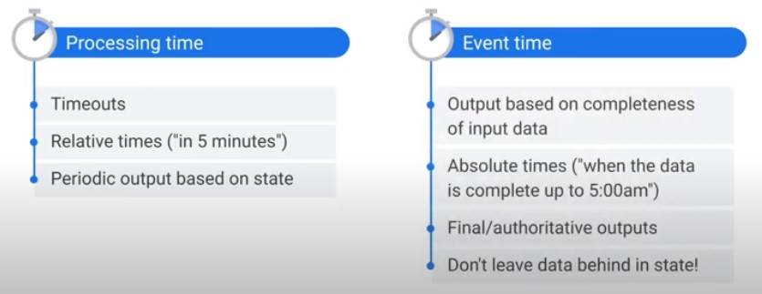  

## Best Practices

### Handling Unprocessable Data

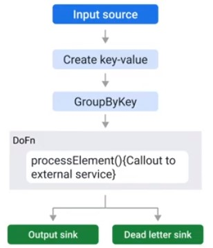  

    final TupleTag successTag;
    final TupleTag deadLetterTag;
    PCollection input = /* ... */;
    
    PCollectionTuple outputTuple = input.apply(ParDo.of(new DoDn(){
        @Override
        void processElement(ProcessContext ctxt) {
            try {
                c.output(process(c.element));
            } catch(MyException ex) {
                //optional Logging at debug level
                c.sideOutPut(deadLetterTag, c.element);
            }
        }
    })).writeOutPutTags(successTag, TupleTagList.of(deadLetterTag));
    
    // Write dead letter elements to separate sink
    outputTuple.get(deadLetterTag).apply(BigQuery.write(...));
    
    //Process the successful element differently
    PCollection success = outputTuple.get(successTag);
    
### Error Handling

* Errors are part of any data processing dataline
* Always wrap code in try-cat block
* In exception store exception to sink
<a/>

### AutoValue Code Generator

* Schemas are best way to represent objects in pipeline.
* There are still places where a POJO (Plain Old Java Objects) is needed.
* Use AutoValue class to generate POJOs.
<a/>

### Jandling JSON Data

    PCollection<MyUserType> = json
        .apply("Parse JSON to BEAM Rows", JsonToRow.withSchema(expectedSchema))
        .apply("Convert to a user type with a compatible schema registered", Convet.to(MyUserType.class))

### DoFn Lifecycle

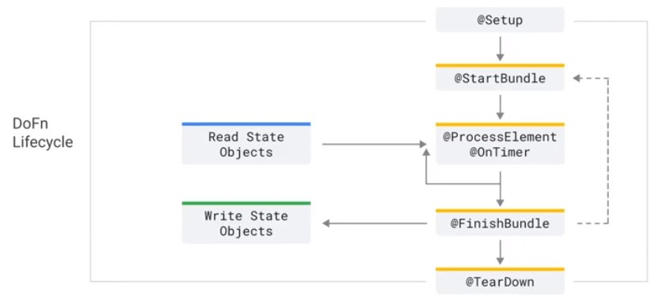

    public class External extends DoFn{
    @Override
    public void startBundle(){
        Instantiate your external service client (Static if threadsafe)
    }
    @Override
    public void processElement(){
        Call out to external service
    }
    @Override
    puvlic void finishBundle(){
        Shutdown your external service client if needed
    }}
    
    class MyDoFn(beam.DoFn):
        def setup(self):
            pass
        def start_bundle(self):
            pass
        def process(self,element):
            pass
        def finish_bundle(self):
            pass
        def teardown(self):
            pass

### Pipeline Optimizations

* Filter data early
* Move any steps that reduce data volume up
* Apply data transformations serially to let Dataflow optimize DAG
* Transform applied serially are good candidates for graph optimization
* While working with external systems, look out for back pressure.
* Ensure external system are configured to handle peak volume.
<a/>

