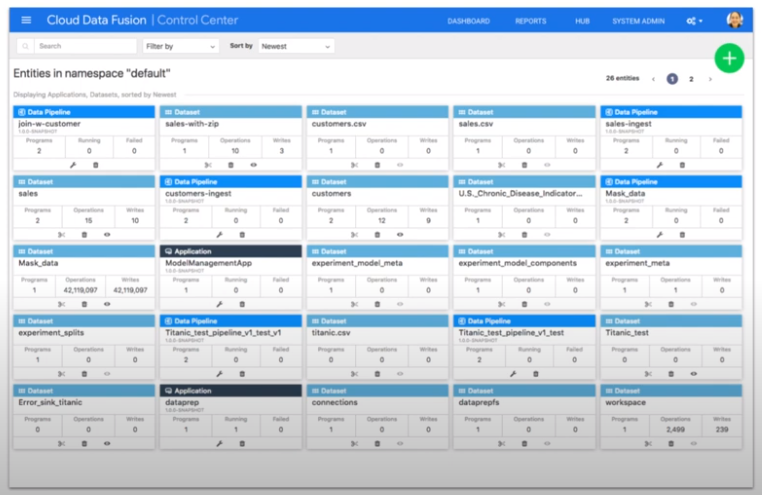
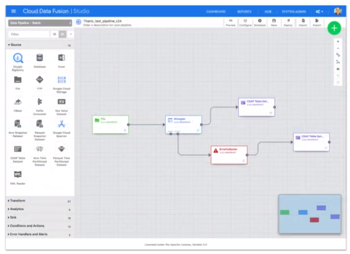
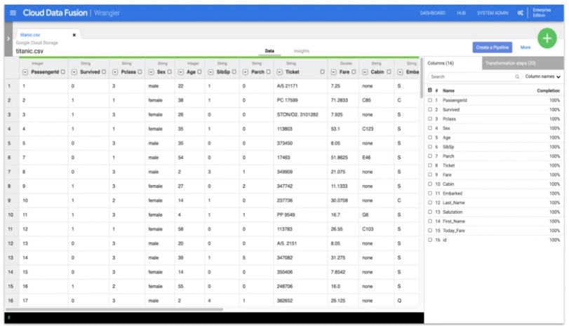
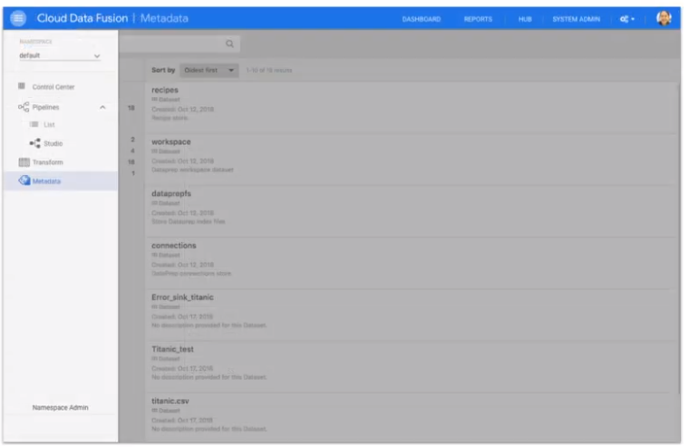
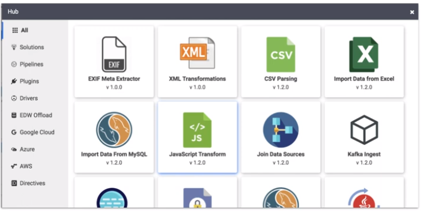
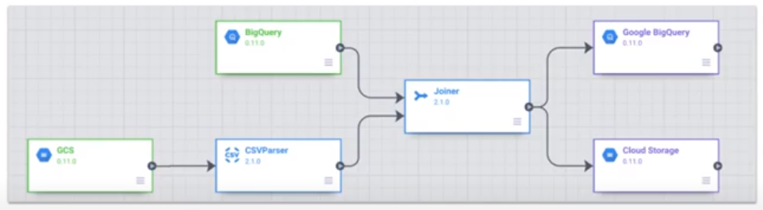
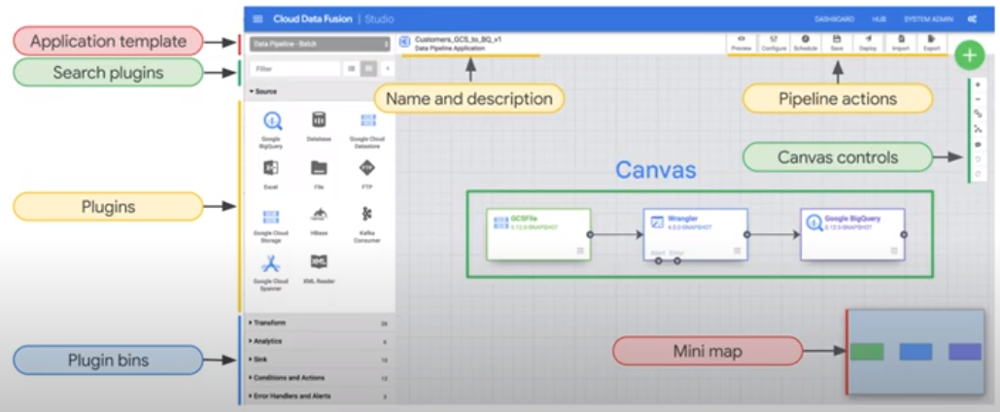
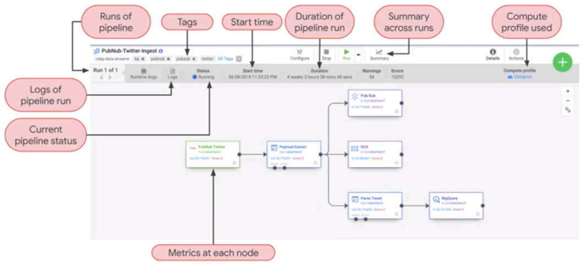
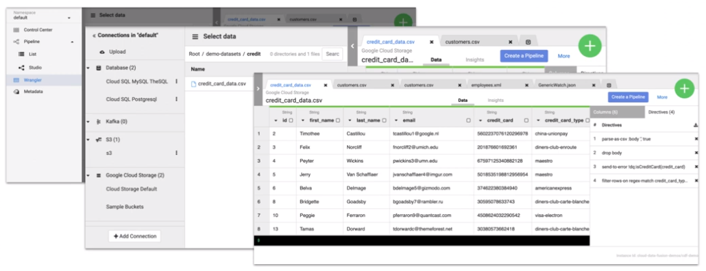

# Cloud Data Fusion

Batch data pipelines. Graphical user interface to build data pipelines.  

* Integrate any data
* Increase productivity
* Reduce complexity
* Increase flexibility
<a/>

Templetize pipelines.

## Components

* Wrangler
* Data Pipeline
* Rules Engine
* Metadata Aggregator
* Microservice
* Event Condition Action
<a/>

## UI

### Control Center

### Pipelines

### Wrangler

### Metadata

### Hub

## Build a Pipeline

### Directed Acyclic Graph (DAG)

  

  

  

## Explore Datasets in Wrangler

