# Dataproc Introduction

Managed Hadoop, Spark ecosystem.

## Evolution Big Data Tools

## Transfer On-Premise to Google Cloud.
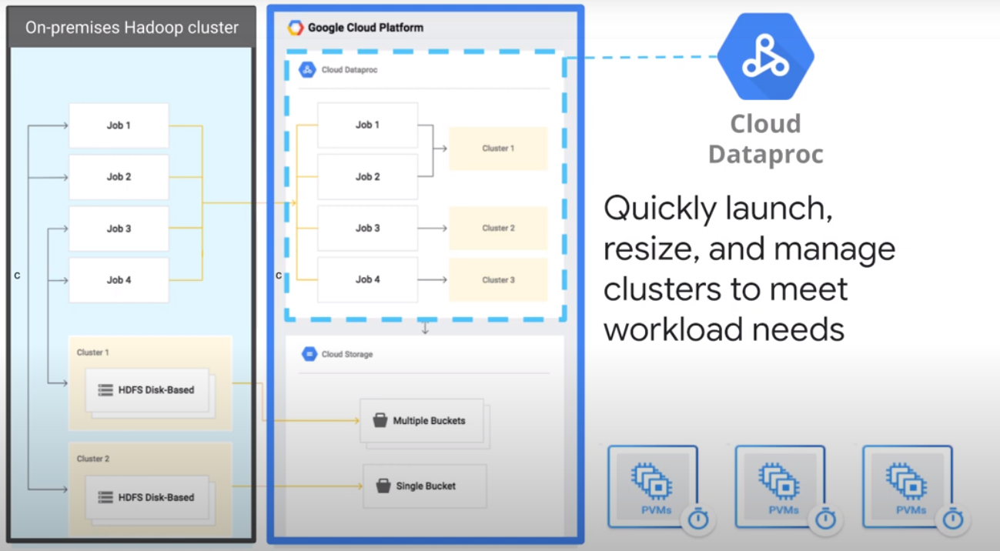  

Store recommendations to Cloud SQL.

## Run Open Source Big Data Tools on Cloud Dataproc

Clusters are flexible ressources that can be used and destroyed on demand.

  

Do not store data in the cluster, to make autoscaling possible! Store data in google cloud storage.

# Execute Spark on Dataproc

## The Hadoop Ecosystem

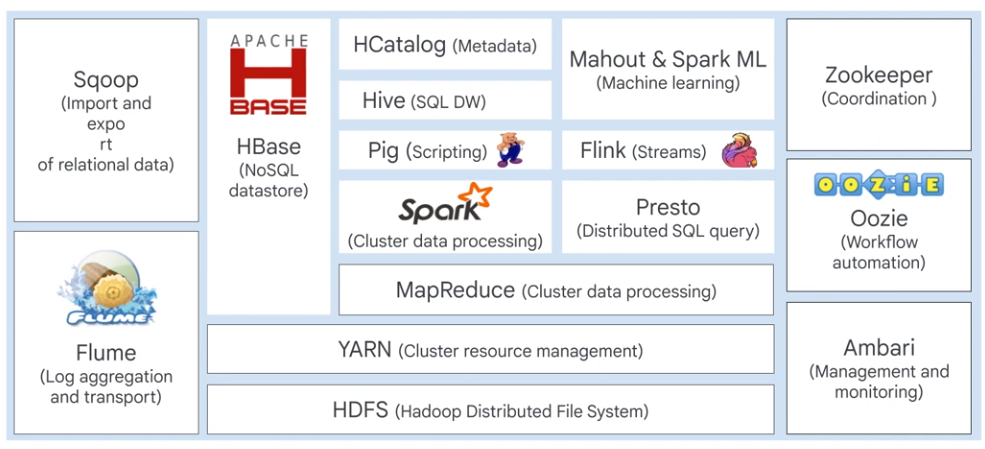

On premise Hadoop clusters are not elastic. Dataproc simplifies Hadoop workloads.  

## Dataproc

* Built-in support Hadoop
* Managed hardware
* Version management
* Flexible jop configuration
<a/>

#### Key Features

* Low cost
* Super-fast
* Resizable clusters
* Open Source ecosystem
* Integrated
* Managed
* Versioning
* Highly available
* Developer tools
* Optional components
* Initialization actions
* Automatic/manual configuration
<a/>

### Initialization Actions

Use initialization actions to install additional components

    $ gcloud dataproc clusters create <CLUSTER_NAME> \
    --initialization-actions gs://$MY_BUCKET/hbase/hbase.sh \
    --num-masters 3 --num-workers 2
    
[Github Initialization Actions](https://github.com/GoogleCloudPlatform/dataproc-initialization-actions)

### Architecture

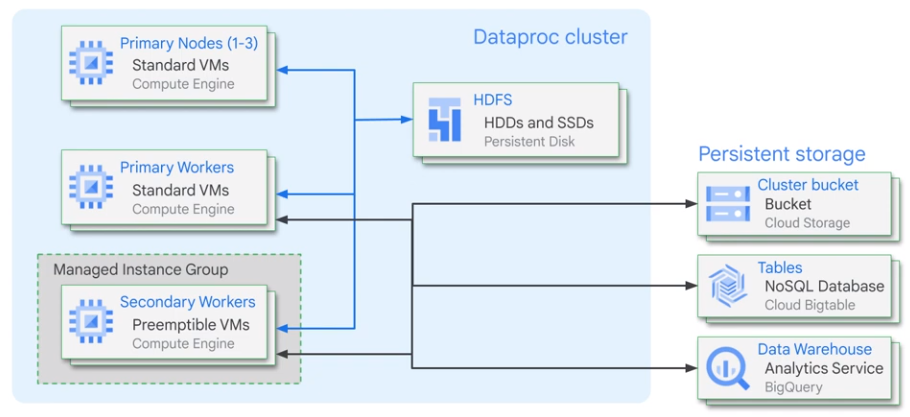

* Setup: Create cluster > Console, Cloud Console
* Configure: Cluster options, Primary node options, Worker nodes (2..n), Preemptlible nodes
* Optimize: Preemptlibe VM, Custom machine type, Custom image
* Utilize: Submit a job
* Monitor: Job driver output, Logs, Cloud monitoring
<a/>

### Cloud Storage vs Hadoop

* Block size (Hardware bound)
* Locality 8Hardware bound)
* Replication
<a/>

Cloud Storage is a drop-in replacement for HDFS.

* Cloud Storage has significant latency.
* Avoid iterating over many nested directories.
* Objects do not support 'append'
* Directories are simulated

### Compute, Storage separation

* Storage > Colossus
* Network > Jupyter (1 Pettabit network)
<a/>

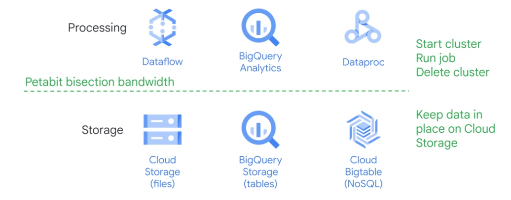

Database > Hadoop > Cloud Services

### DistCp on-prem data that you always need

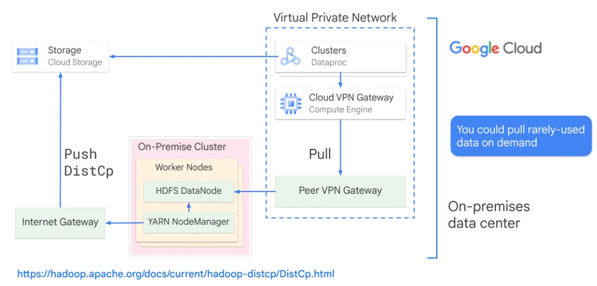

## Optimize Dataproc

* Where is data, where is cluster: Same region
* Is network traffic funneled?
* How many input files (not more than 10.000 files) > Larger file sizes
* Is the size of persistent disk limiting throughput
* Did you allocate enough virtual machines
<a/>

## Optimize Dataproc Storage

Local HDFS is good if:
* Jobs requite a lot of metadata operations
* You modify the HDFS data frequently, or rename directories
* You heavily use append operations
* Workloads with heavy I/O
* Workloads sensitive to latency
<a/>

Cloud Storage as initial and final datastore.

### Local HDFS

* Decrease total size of local HDFS by decreasing size of primary persistend disks
* Increase total size of local HDFS by increasing size of primary persistend disks
* Attach SSDs to each workers and use these disks for the HDFS
* Uase SSD persistend disks
<a/>

### Storage Options

* Cloud Storage
* Cloud Bigtable
* BigQuery
<a/>

## Ephemeral Clusters

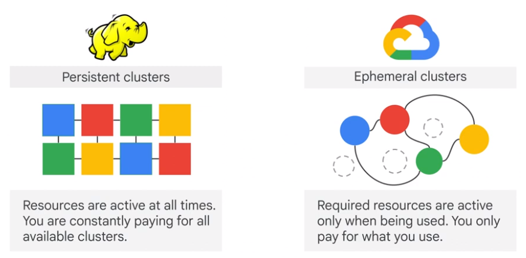  
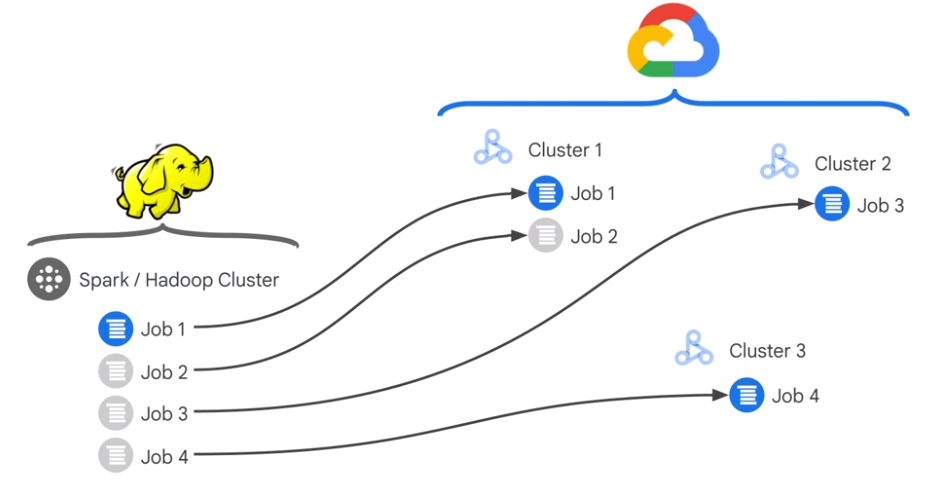

### Replicating on-premise setup drawbacks

* Persistend clusters are expensive
* Open-spurce tools may be ineffiecient
* Persistent clusters are difficult to manage
<a/>

### Cluster Scheduled Deletion

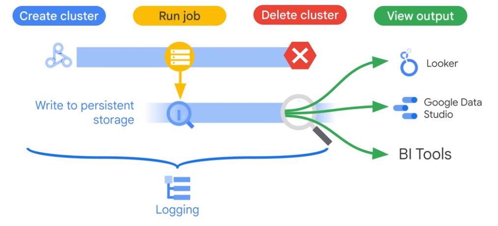

Cluster is deleted automatically, if cluster gets in idle state.

### Persistent Clusters

## Dataproc Workflow Template

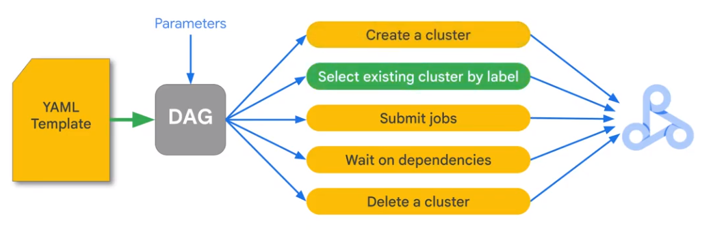

## Dataproc Autoscaling Workflow

Bases on YARN metrics. Does not scale to 0. Not for on-cluster HDFS

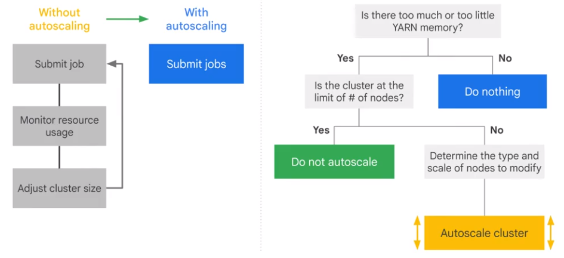

* Fine-grained controls
* Easy to understand
* Job stability
<a/>

### How Autoscaling Works

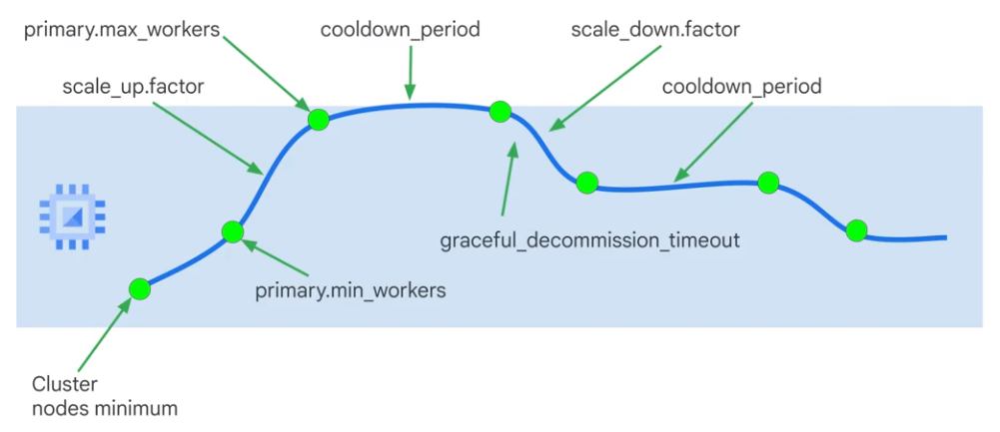

## Monitoring

    $ gcloud dataproc jobs submit hadoop --driver-log-levels
    $ spark.sparkContext.setLogLevel("DEBUG")

# Cloud Computing

## Cloud Shell

### General

    $ gcloud auth list
    $ gcloud config list project

### Set Zone

    $ gcloud config get-value compute/zone
    $ gcloud config get-value compute/region
  
    $ gcloud compute project-info describe --project qwiklabs-gcp-01-c87df1f33620
    $ export PROJECT_ID=qwiklabs-gcp-01-c87df1f33620
    $ export ZONE=europe-west1-d
  
## Create VM

### GUI

gcp > Compute Engine > VM Instances > Create Instance  
SSH into new VM

    $ sudo su
    $ apt-get update
    $ apt-get install -y nginx
    $ ps auwx | grep nginx

### Cloud Shell

    $ gcloud compute instances create gcelab2 --machine-type n1-standard-2 --zone $ZONE
  
### Help

    $ gcloud compute instances create --help
    
### Install new Component

    $ sudo apt-get install google-cloud-sdk
    $ gcloud beta interactive
    $ gcloud compute instances describe gcelab2
    
### Connect to VM with ssh

    $ gcloud compute ssh gcelab2 --zone $ZONE
    
### User Home directory

    $ cd $HOME
    $ vi ./.bashrc

## Compute Options

## Autoscaling

Provide ressources as needed

## App Engine

Provide fully managed environment > PAAS. App Enging has autoscaling.  

|Standard|Flexible|
|-|-|
|Fully-managed|Docker environment|
|Scale to zero|No Scale to zero|
|Changes limited|VMs exposed|

    $ cloud auth list
       
 gcp > API > library > App Engine Adimin API > enable
 
    $ gsutil -m cp -r gs://spls/gsp067/python-docs-samples .
    $ cd python-docs-samples/appengine/standard_python3/hello_world
    $ dev_appserver.py app.yaml
    
    $ gcloud app deploy
    $ gcloud app browse

## Cloud Functions

    $ mkdir gcf_hello_world
    $ cd gcf_hello_world
    
### Create function

    $ nano index.js
    
    /**
    * Background Cloud Function to be triggered by Pub/Sub.
    * This function is exported by index.js, and executed when
    * the trigger topic receives a message.
    *
    * @param {object} data The event payload.
    * @param {object} context The event metadata.
    */
    exports.helloWorld = (data, context) => {
    const pubSubMessage = data;
    const name = pubSubMessage.data
        ? Buffer.from(pubSubMessage.data, 'base64').toString() : "Hello World";
    console.log(`My Cloud Function: ${name}`);
    };
    
### Create Cloud Storage Bucket

    $ gsutil mb -p qwiklabs-gcp-04-fbbaef90a336 gs://qwiklabs-gcp-04-fbbaef90a336-bucket
    
### Deploy Function

    $ gcloud functions deploy helloWorld \
    --stage-bucket gs://qwiklabs-gcp-04-fbbaef90a336-bucket \
    --trigger-topic hello_world \
    --runtime nodejs8
    $ gcloud functions describe helloWorld
    
### Test Function 
    
    $ DATA=$(printf 'Hello World!'|base64) && gcloud functions call helloWorld --data '{"data":"'$DATA'"}'

### Read Logs

    $ gcloud functions logs read helloWorld
    
## Google Kubernetes Engine (GKE)

    $ gcloud auth list
    $ gcloud config list project
    $ gcloud config set compute/zone us-central1-a
    
### Create GKE Cluser

    $ gcloud container clusters create my-cluster
    
### Get Credentials

    $ gcloud container clusters get-credentials my-cluster
    
### Create Deployment

    $ kubectl create deployment hello-server --image=gcr.io/google-samples/hello-app:1.0
    
### Create Kubernetes Service

    $ kubectl expose deployment hello-server --type=LoadBalancer --port 8080
    $ kubectl get service
    
### Delete Cluster

    $ gcloud container clusters delete my-cluster
    
## Set Up Network Balancer

    $ gcloud auth list
    $ gcloud config list project
    $ gcloud config set compute/zone us-central1-a
    $ gcloud config set compute/region us-central1
    
### Create 3 VMs

    $ gcloud compute instances create www1 \
    --image-family debian-9 \
    --image-project debian-cloud \
    --zone us-central1-a \
    --tags network-lb-tag \
    --metadata startup-script="#! /bin/bash
    sudo apt-get update
    sudo apt-get install apache2 -y
    sudo service apache2 restart
    echo '<!doctype html><html><body><h1>www1</h1></body></html>' | tee /var/www/html/index.html"
    
    $ gcloud compute instances create www2 \
    --image-family debian-9 \
    --image-project debian-cloud \
    --zone us-central1-a \
    --tags network-lb-tag \
    --metadata startup-script="#! /bin/bash
    sudo apt-get update
    sudo apt-get install apache2 -y
    sudo service apache2 restart
    echo '<!doctype html><html><body><h1>www2</h1></body></html>' | tee /var/www/html/index.html"
    
    $ gcloud compute instances create www3 \
    --image-family debian-9 \
    --image-project debian-cloud \
    --zone us-central1-a \
    --tags network-lb-tag \
    --metadata startup-script="#! /bin/bash
    sudo apt-get update
    sudo apt-get install apache2 -y
    sudo service apache2 restart
    echo '<!doctype html><html><body><h1>www3</h1></body></html>' | tee /var/www/html/index.html"
    
### Create Firewall Rule

    $ gcloud compute firewall-rules create www-firewall-network-lb \
    --target-tags network-lb-tag --allow tcp:80
    
### Verify

    $ gcloud compute instances list
    $ curl http://[IP_ADDRESS]
    
### Configure Load Balancing Service

    $ gcloud compute addresses create network-lb-ip-1 \
    --region us-central1
    $ gcloud compute http-health-checks create basic-check
    $ gcloud compute target-pools create www-pool \
    --region us-central1 --http-health-check basic-check
    $ gcloud compute target-pools add-instances www-pool \
    --instances www1,www2,www3
    $ gcloud compute forwarding-rules create www-rule \
    --region us-central1 \
    --ports 80 \
    --address network-lb-ip-1 \
    --target-pool www-pool
    
### Send Traffic to Load Balancing Service

Get IP Address of Load Balancer

    $ gcloud compute forwarding-rules describe www-rule --region us-central1
    
Send Traffic
    
    $ while true; do curl -m1 34.122.157.81; done
    
## Set Up HTTP Load Balancer

### Create Load Balancer Template

    $ gcloud compute instance-templates create lb-backend-template \
    --region=us-central1 \
    --network=default \
    --subnet=default \
    --tags=allow-health-check \
    --image-family=debian-9 \
    --image-project=debian-cloud \
    --metadata=startup-script='#! /bin/bash
     apt-get update
     apt-get install apache2 -y
     a2ensite default-ssl
     a2enmod ssl
     vm_hostname="$(curl -H "Metadata-Flavor:Google" \
     http://169.254.169.254/computeMetadata/v1/instance/name)"
     echo "Page served from: $vm_hostname" | \
     tee /var/www/html/index.html
     systemctl restart apache2'
     
### Create Managed Instance Group

    $ gcloud compute instance-groups managed create lb-backend-group \
   --template=lb-backend-template --size=2 --zone=us-central1-a
   
### Create Firewall Rule

    $ gcloud compute firewall-rules create fw-allow-health-check \
    --network=default \
    --action=allow \
    --direction=ingress \
    --source-ranges=130.211.0.0/22,35.191.0.0/16 \
    --target-tags=allow-health-check \
    --rules=tcp:80
    
### Set Up Static IP Address

    $ gcloud compute addresses create lb-ipv4-1 \
    --ip-version=IPV4 \
    --global
    
Output: https://www.googleapis.com/compute/v1/projects/qwiklabs-gcp-01-022d93612fb0/global/addresses/lb-ipv4-1

### Create Health Check

    $ gcloud compute health-checks create http http-basic-check \
    --port 80
    
### Create Backend Service

    $ gcloud compute backend-services create web-backend-service \
    --protocol=HTTP \
    --port-name=http \
    --health-checks=http-basic-check \
    --global
    
### Add Instance Group to Backend Service

    $ gcloud compute backend-services add-backend web-backend-service \
    --instance-group=lb-backend-group \
    --instance-group-zone=us-central1-a \
    --global
    
### Create URL Map to Default Backend Service

    $ gcloud compute url-maps create web-map-http \
    --default-service web-backend-service
    
### Create Target Proxy to Route Requests to URL Map

    $ gcloud compute target-http-proxies create http-lb-proxy \
    --url-map web-map-http
    
### Create Forwarding Rule

    $ gcloud compute forwarding-rules create http-content-rule \
    --address=lb-ipv4-1\
    --global \
    --target-http-proxy=http-lb-proxy \
    --ports=80
    
### Verify

gcp > Network Services > Load Balancing > Backend

    
    
