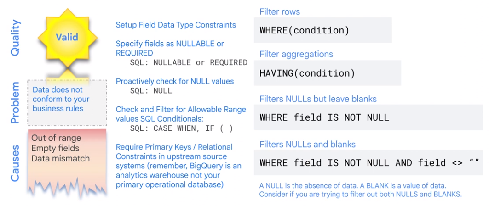
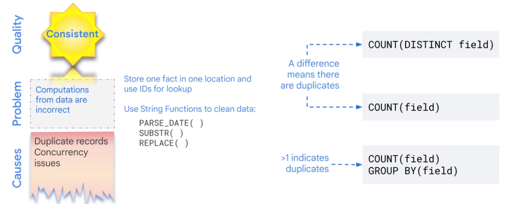
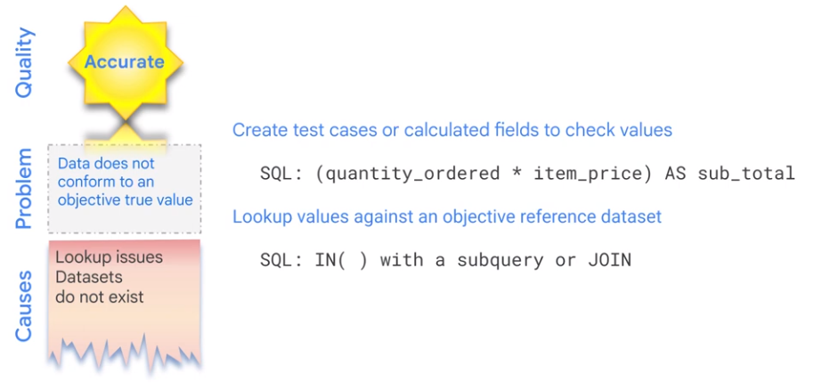
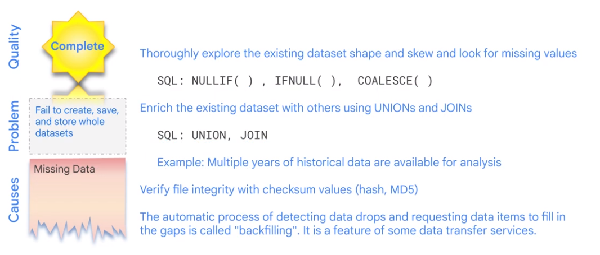
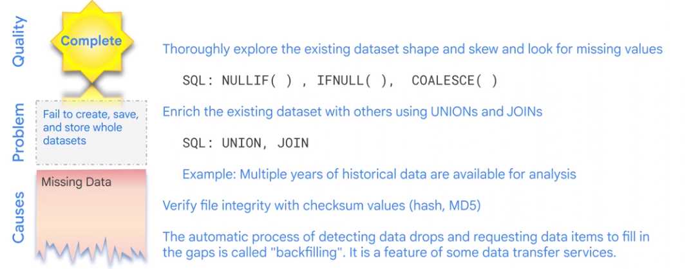
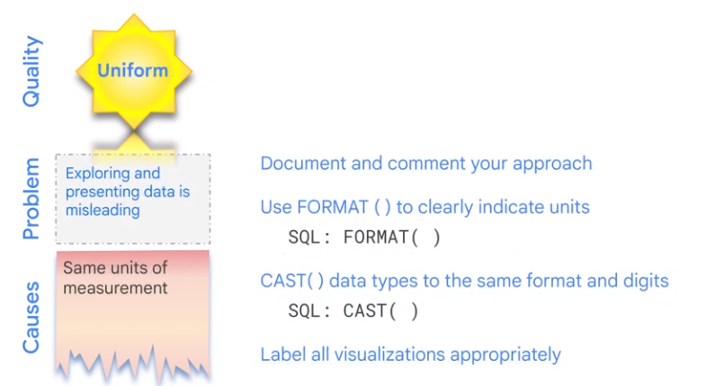
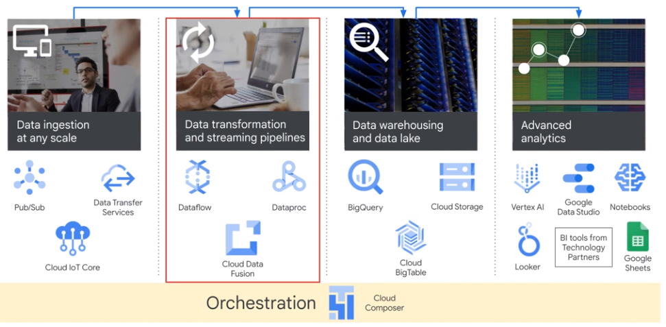
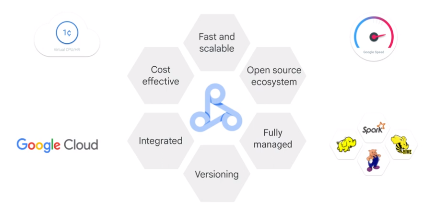
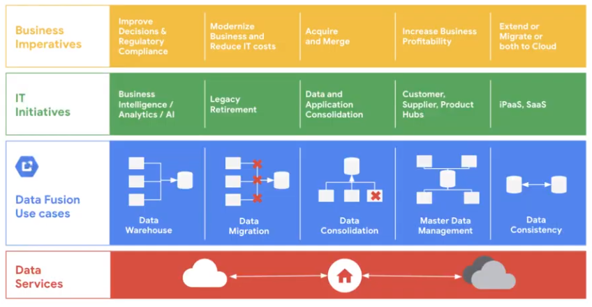
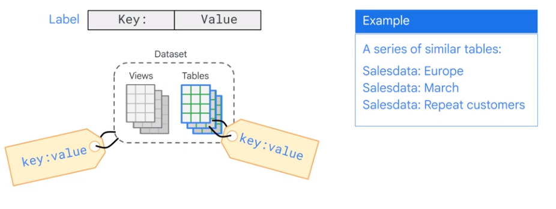

# Batch Data Pipeline

Pipelines process a certain amount of data an then exits.

## EL, ELT

* EL: Data is clean and correct. REST API call.
* ELT: Transform data on the fly. Transformation is not clear at the moment. Transformation can be expressed as SQL. 

### Quality Considerations

* Valid
* Accourate
* Complete
* Consistent
* Uniform
<a/>

### Quality Operations BigQuery

#### Filter to identify and isolate invalid data

#### Duplicates

#### Accuracy

#### Completeness

#### Missing

#### Uniform

## ETL

Tranformation cannot be expressed in SQL. Use Dataflow as ETL Tool and land data in BigQuery.

### Architecture

* Extract data from
** Pub/Sub
** Cloud Storage
** Cluod Spanner
** Cloud SQL
* Transform Data using Dataflow
* Write Data to BigQuery
<a/>

* Dataflow
* Dataproc
* Cloud Data Fusion
<a/>

### Quality Data Operations

Look Beyond Dataflow and BigQuery

|Issue|Solution|
|-|-|
|Latency|Dataflow to Bigtable|
|Spark|Dataproc|
|Visual|Cloud Data Fusion|

#### Dataproc

#### Cloud Data Fusion

### Data Catalog

Metadata as a service.

* Data Lineage
* Meta Data

* Simplify data discovery
* Unified view
* Data governance
<a/>

# Streaming Data Processing

|Bounded Data (Batch)|Unbounded Data (Stream)|
|-|-|
|Finite data set|Infinite data set|
|Complete|Never complete|
|Time of element is disregarded|Time of element is siginificant|
|in rest|in motion|
|Durable storage|Temporary storage|

|Data Integration (10sec - 10min)|Data decisions (100ms - 10sec)|
|-|-|
|Data warehouse real-time|Real-time recommendations|
||Fraud detection|
||Gaming events|
||Finance back office|

* Volume: Autoscaling
* Velocity: Streaming Processing
* Variety: AI
<a/>

  

