# Datawarehouse

* Consolidate from many sources
* Data is clean, accurate and consistent
* Data should be available for querying
* Gigabytes to petabytes

## BigQuery

* Interactive SQl queries over large datasets
* Serverless
* Ecosystem of visualization and reporting tools
* Ecosystem of ETL and data processing tools
* Up-to-the minute data
* Machine Learning
* Security and collaboration
<a/>

BigQuery is fast, because it is column-orientated

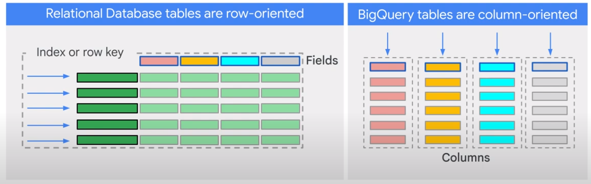  

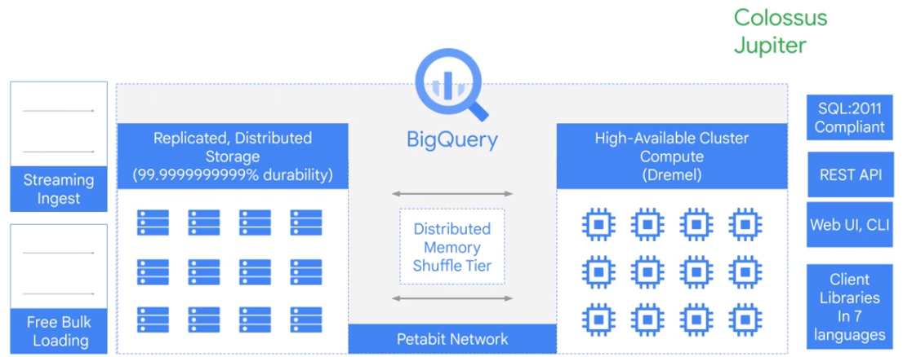  

Data are also run length-encoded and dictionary-encoded:  

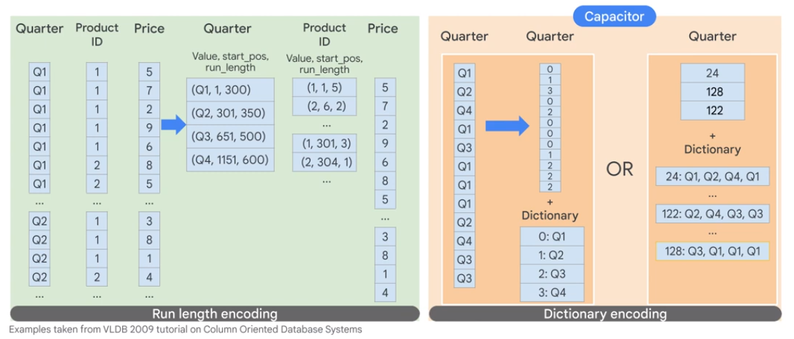  

Ressources are allocated as needed. A BigQuery Slot is a combination of gcp, memory and network ressources.

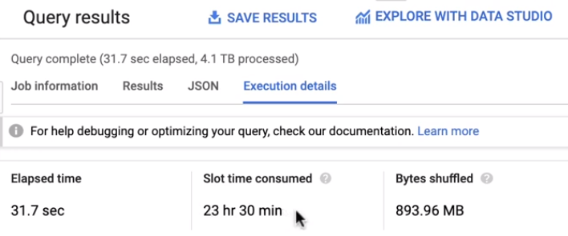  

## Security

 

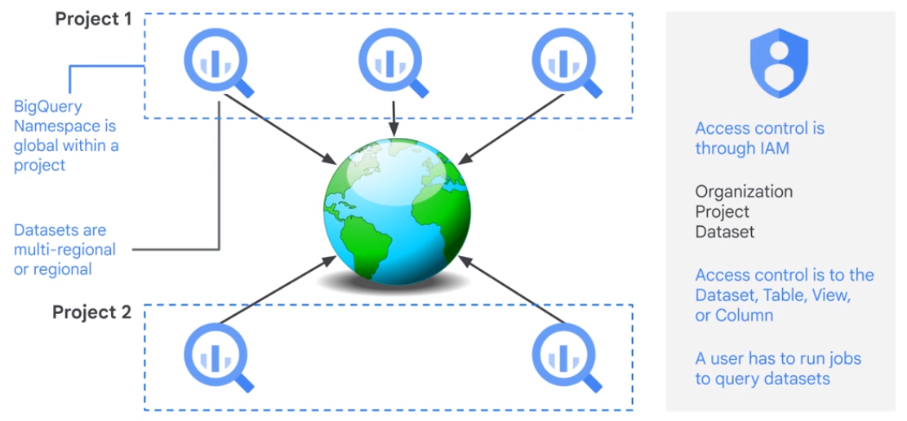  

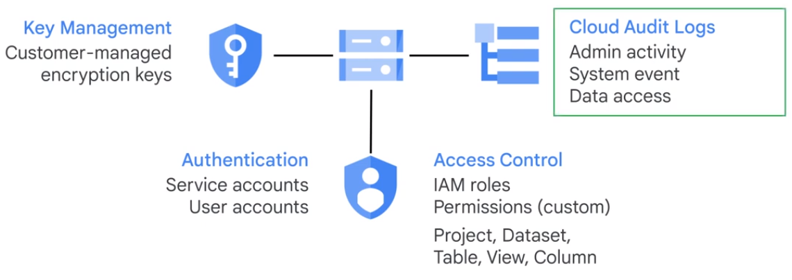  

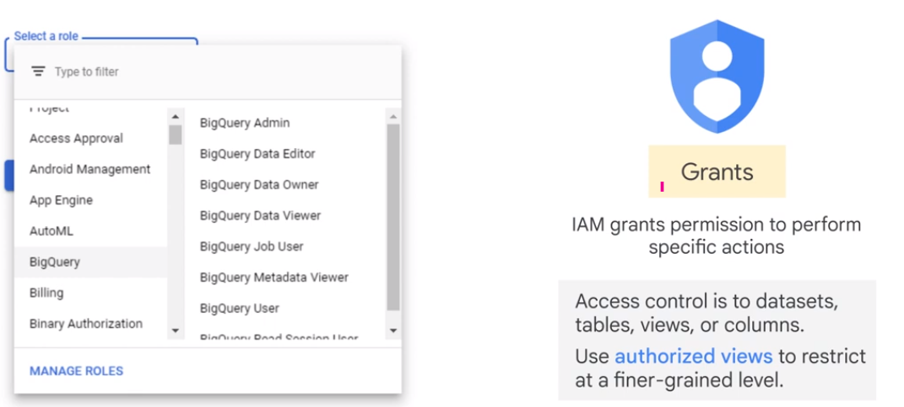  

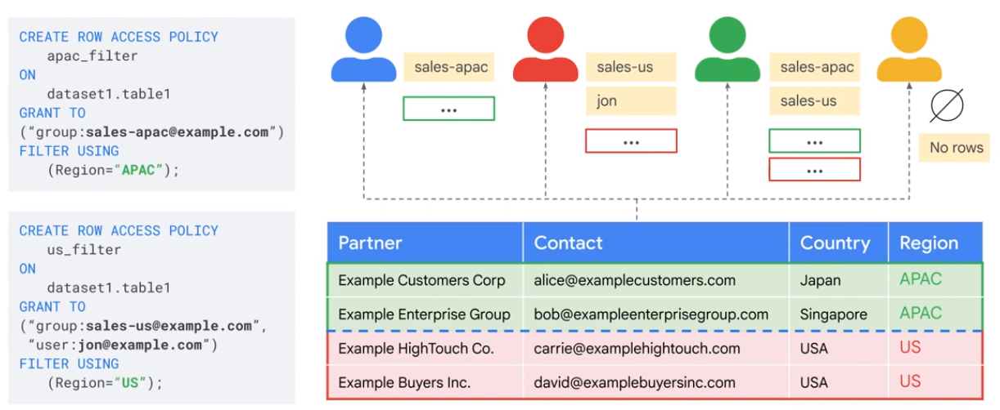  

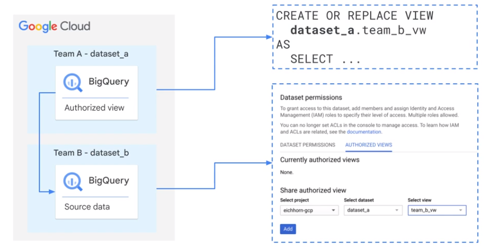  

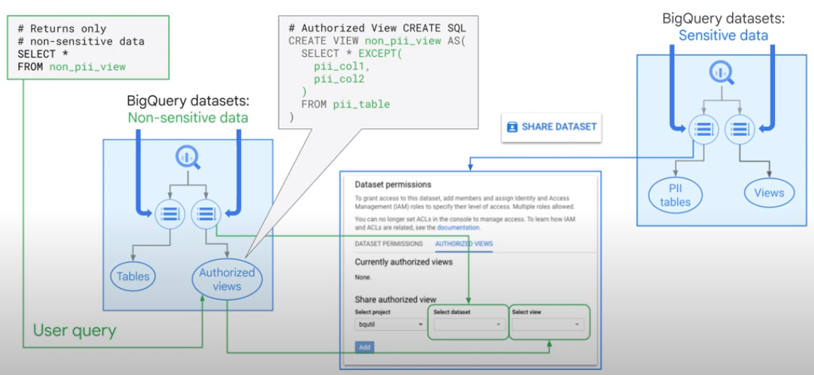  

Share Datasets. Tables, Views, Materialized Views.

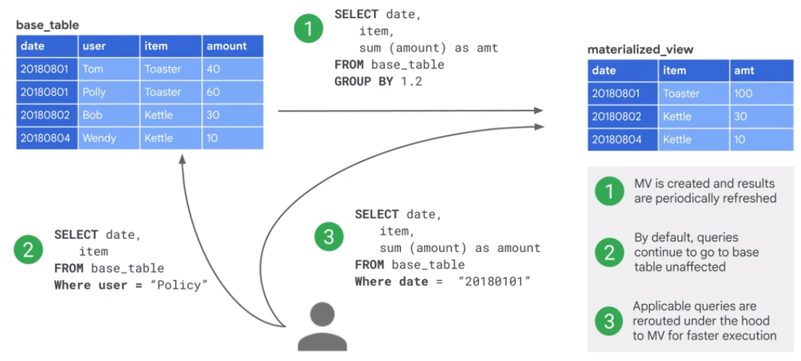  

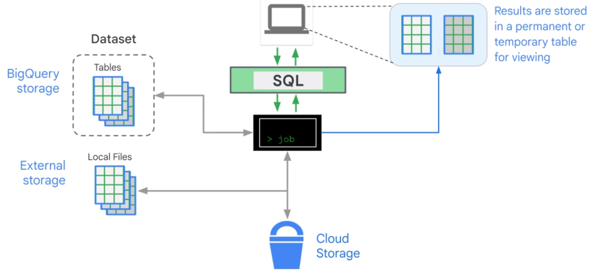  

The cost of a query occures always at a project.

## Load Data into BigQuery

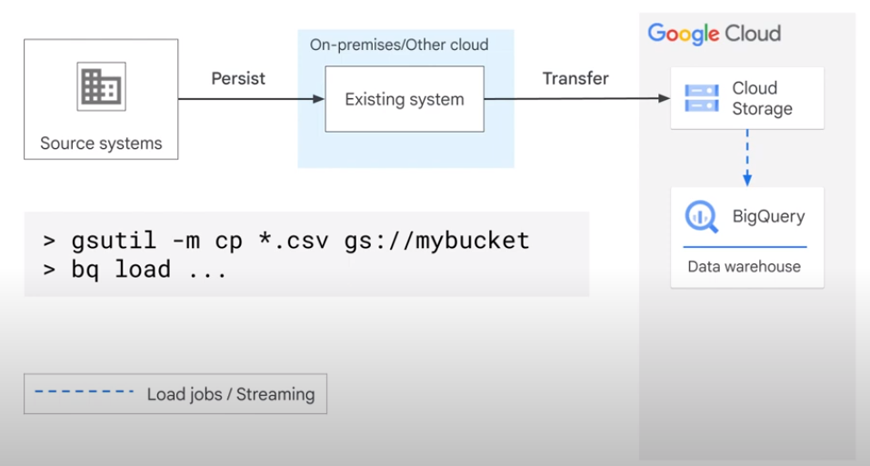  

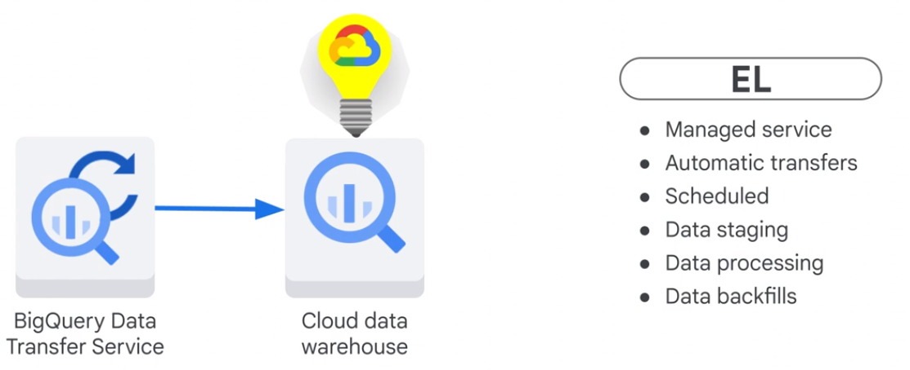  

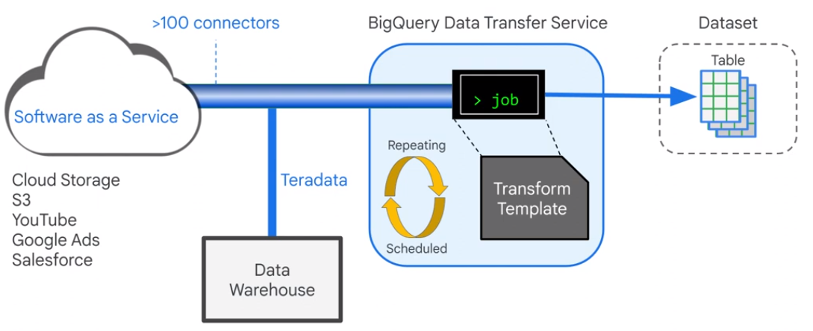  

User Defined Functions (UDF) in SQL and JavaScript.

## Schemas

### Normal Form

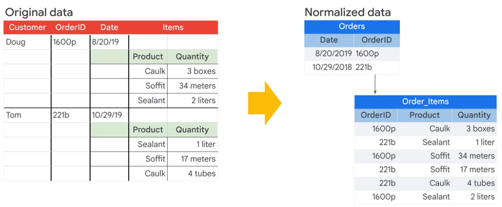  

Normalizing increases the orderlyness of the data.  

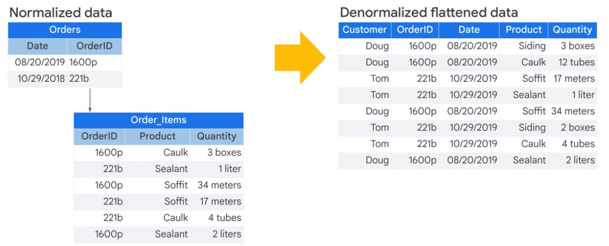 

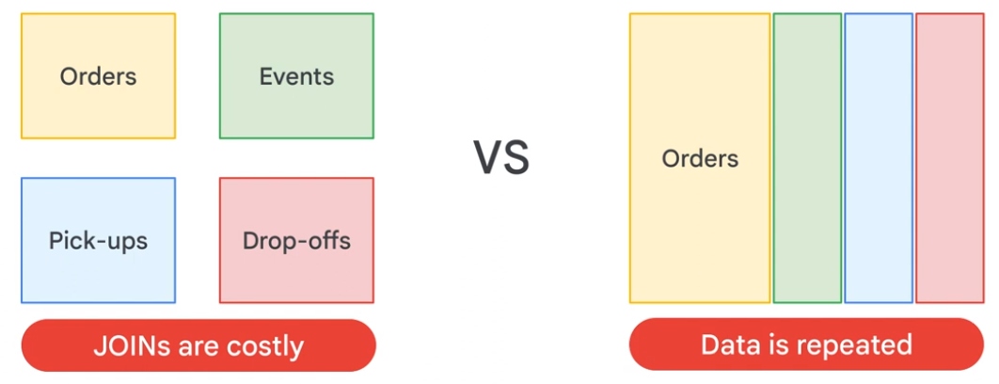 

### Nested and Repeated Fields

De-Normalizing increases speed. Fields with 1 to many relations decrease speed.  

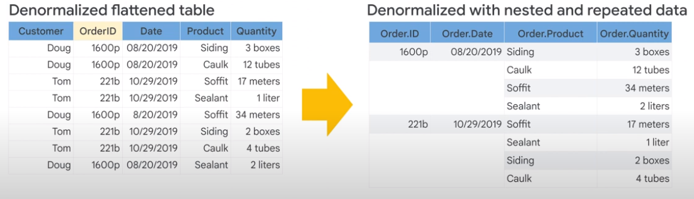  

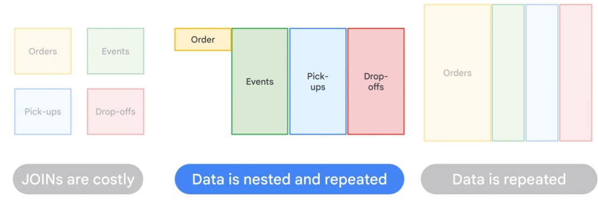    

### ARRAYS and STRUCTS

Data in Structs is pre-joined. Different levels of granularity in one dataset.   

* STRUCTS(RECORD)
* ARRAYS(REPEATED)
* ARRAYS can be part of regular fields or STRUCTS
* A single table can have many STRUCTS

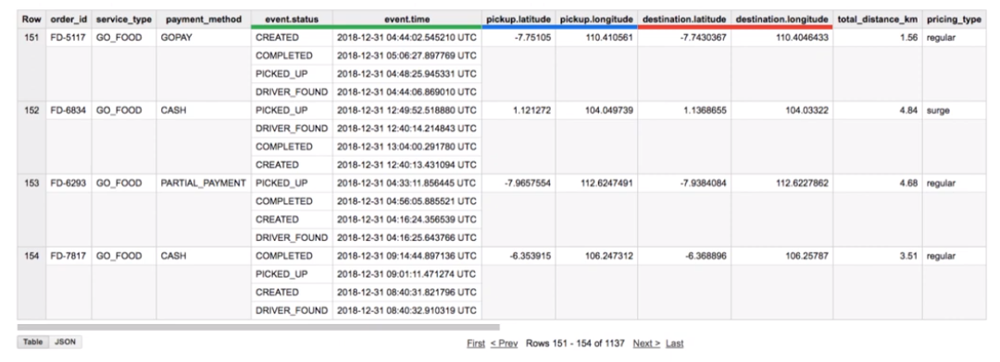

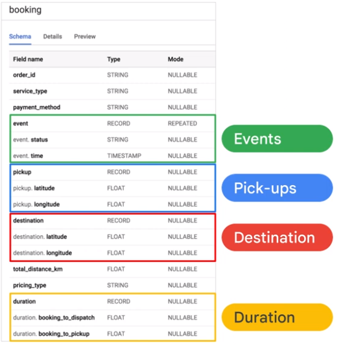  

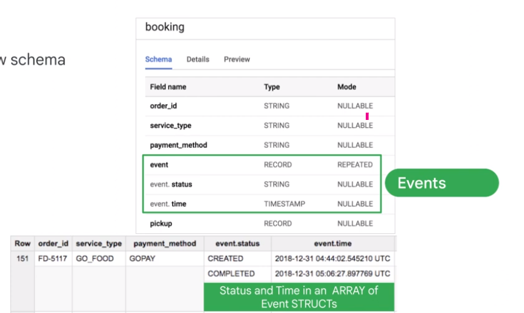  

## Optimal Schema

* Instead of joins tage advantage of nested and repeated fields in denormalized tables.
* Tables < 10 Gb = Normalized
* Tables > 10 Gb = De-Normalized
