# Data Engineer Exam

[Data Engineer Exam Guide](https://cloud.google.com/certification/guides/data-engineer)  
[Google Cloud Documentation](https://cloud.google.com/docs/overview)
[Medium Blog](https://simonleewm.medium.com/a-study-guide-to-the-google-cloud-professional-data-engineer-certification-path-9e83e41e311)

* Data Representation
* Pipelines
* Processing Infrastructure
<a/>

# Data Processing Systems

## Designing and building

### Data Processing Anatomy

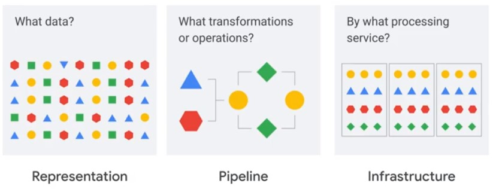

### A view of data engineering on Google Cloud

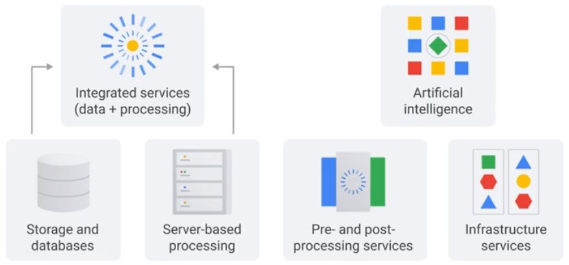  

### Storage and Databases

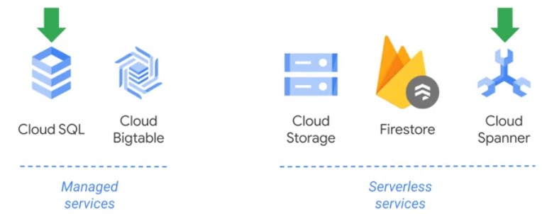 

### Processing

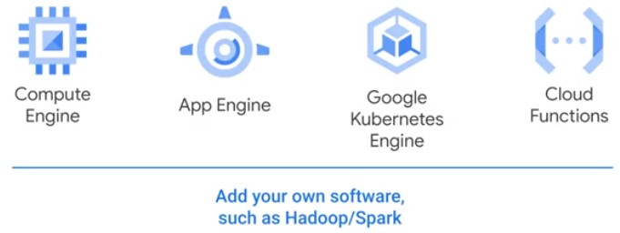

### Data Processing Services

Combines storage and compute.  

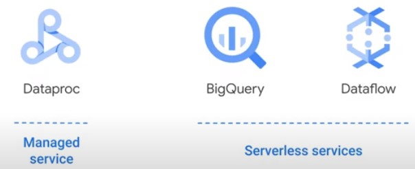

#### Data Abstractions

|Service|Data Abstraction|Compute Abstraction|
|-|-|-|
|Dataproc, Spark|RDD|DAG|
|Bigquery|Table|Query|
|Dataflow|PCollection|Pipeline|

### Artificial Intelligence

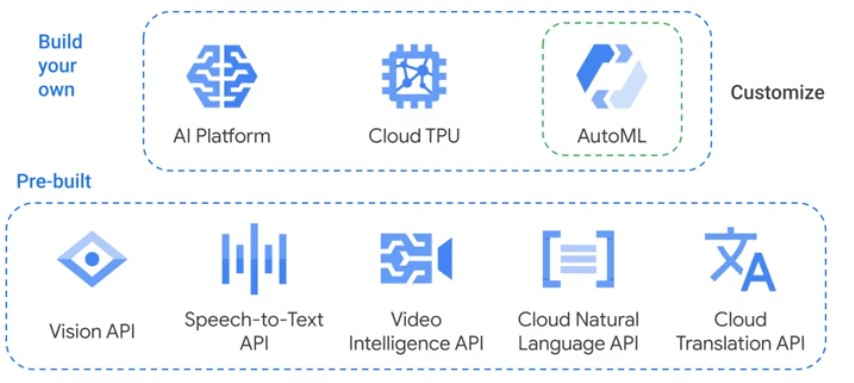

### Pre- and Postpcocessing Services

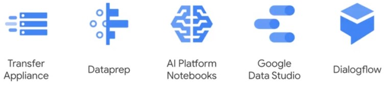

### Infrastructure Services

## Design Flexible Data Representations

|Storage|Type|Stored in|
|-|-|-|
|Cloud Storage|Object|Bucket|
|Datastore|Property|Entity > Kind|
|Cloud SQL|Values|Rows and Columns > Table > Database|
|Cloud Spanner|Values|Rows and Columns > Tables > Database|

### Data in Files and Data in Transit

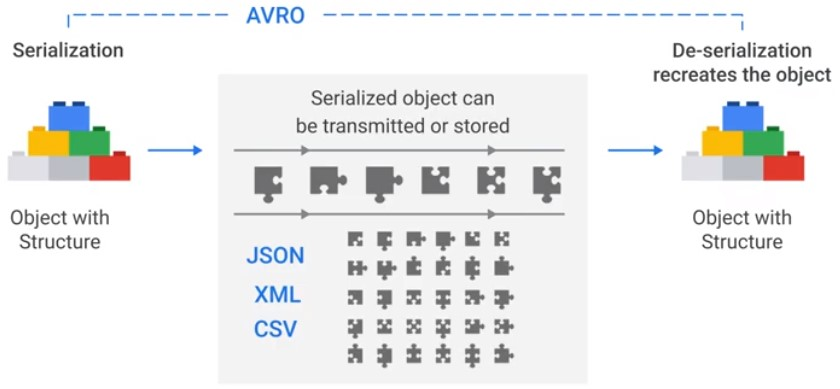  

### Standard SQL Data Types

|Data type|Value|
|-|-|
|string|variable-length (unicode) character|
|int64|64-bit integer|
|float64|Double-precision decimal values|
|bool|true or false|
|array|ordered list of zero or more elements|
|struct|container of ordered fields|
|timestamp|represents an absolutej point in time|

### BigQuery Datasets, Tables and Jobs

* Project > Users and datasets
  * Limit access to datasets and jobs
  * Manage billing
* Dataset > Tables and views
  * Access Control Lists
  * Applied to all tables in the dataset
* Table > Collection of columns
  * Columnar storage
  * Views are virtual tables
  * Tables can be external
* Job > Potentially long-running action
  * Can be cancelled
<a/>

#### BigQuery is Columnar

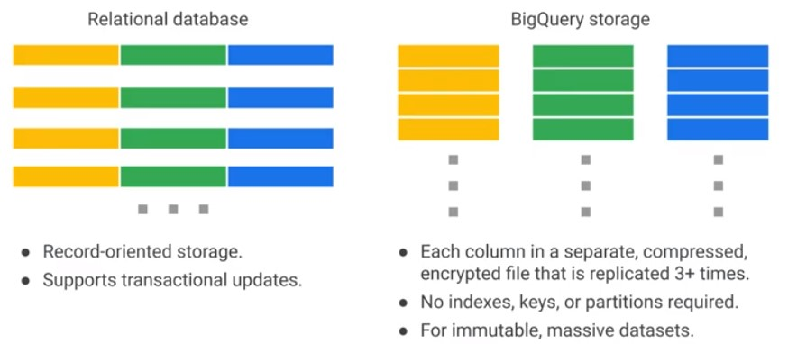

### Spark hides Complexity in RDDs

RDDs hide complexity and allow making decisions on your behald. Manages: Location, Partition, Replication, Recovery, Pipelining ...

### Dataflow

#### PCollections

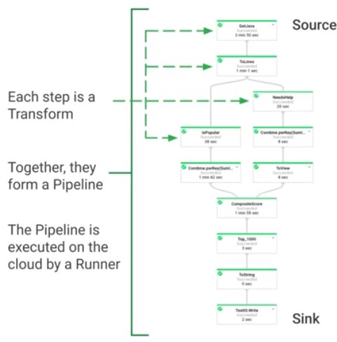

* Each step is a transformation
* All transformations are a pipeline
* Runner local, or in cloud
<a/>

* Each step is elastically scaled
* Each Transform is applied on a PCollection
* The result of an apply() is another PCollection
<a/>

#### Batch and stream processing

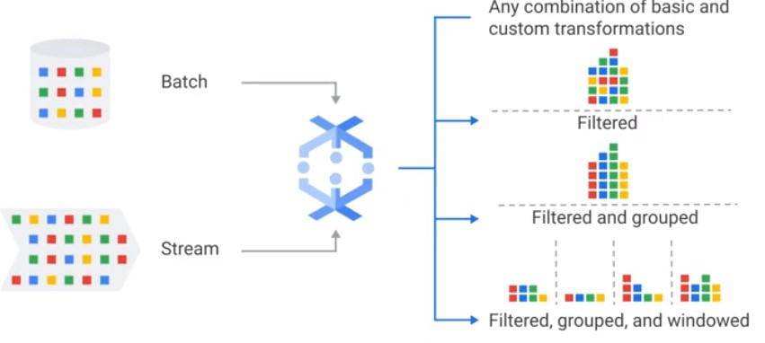  

Bounded va Unbounded data. Dataflow uses windows to use streaming data. PCollections are not compatible with RDDs.

### Tensorflow

Opensource code for machine learning.  

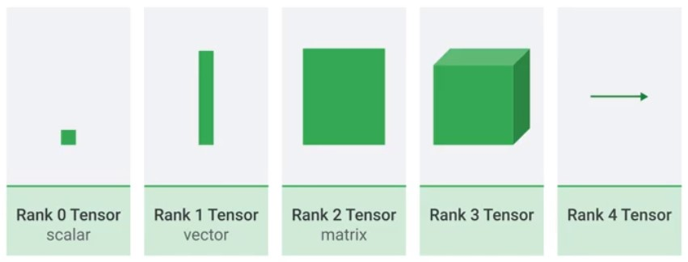

## Design Data Pipelines

### Dataproc

* Cluster node options: Single node, Standard, High availability
* Benefits: Hadoop, Automated cluster management, Fast cluster resize
* HDFS: Use Cloud Storage for stateless solution
* HBASE: Use Cloud Bigtable for stateless solution
* Objective: Shut down the cluster, Restart per job
* Data storage: Dont't use hdfs
* Cloud storage: Match you data locatoin with the compute location
<a/>

#### Spark

Spark uses a DAG to process data. It executes commands only, if told to do so = "lazy evaluation" (oppostite "eager execution).

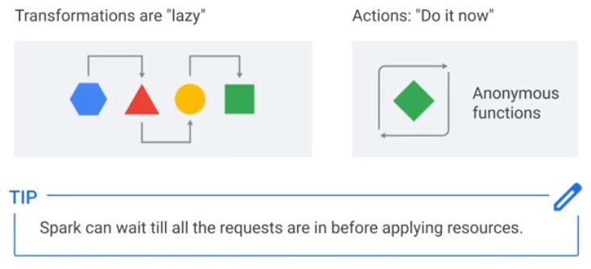

#### Dataproc can augment BigQuery

    projectId = <your-project-id>
    
    sql = "
      select
        n.year,
        n.month,
        n.day,
        n.weight_pounds
      from
        `bigquery-public-data.samples.natality` as n
      order by
        n.year
      limit 50"
      
    print "Running query ..."
    data = qbq.read_sql.gb1(sql,projectId=projectId)
    data[:5]

Extract data from BiqQuery using Dataproc and let Spark do the analysis.

#### Open Source Software

* Kafka > Pub/Sub
* HBASE > Cloud BigTable
* HDFS > Cloud BigStorage
<a/>

#### Initialization Actions

* Optional executable scripts
* Allow you to install additional components
* Provide common initialization actions on Github

#### Cluster Properties

* Allow you to modify properties in common configuration files like core-site.xml
* Remove the need to manually change property files
* Specified by file_prefix:property=value

## Dataflow

* Java, or Python
* Based on Apache Beam
* Parallel tasks
* Same Code does stream and batch
* Input from many sources
* Put code inside servlet, deploy it to App engine
* Side inputs
* User dataflow users to limit access to Dataflow ressources
<a/>

### Pipelines

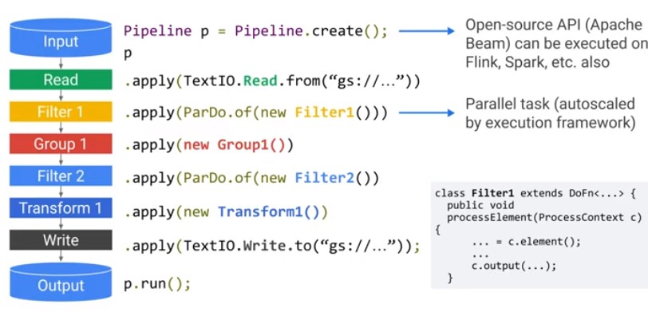

### Operations

|Operation|Action|
|-|-|
|ParDo|Allows for parallel processing|
|Map|1:1 relationship between input and output in Python|
|FlatMap|Non 1:1 relationships|
|.apply(ParDo)|Java for Map and FlatMap|
|GroupBy|Shuffle|
|GroupByKey|Explicit Shuffle|
|Combine|Aggregate values|

Pipelines are often organized in Map and Reduce sequences.

### Templates

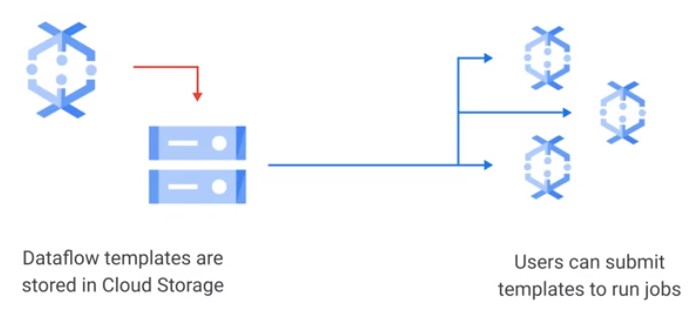  

Separation for work and better ressource allocation.

## BigQuery

* Near real-time analysis
* NoOps
* Pay for use
* Date storage is inexpensive and durable
* Queries charged on amount of data processed
* Immutable audit logs
* Iteractive analysis
* SQL query language
* Many ways to ingest, transform, load and export data
* Nested and repeated fields
* UDFs in JavaScript
* Structured data
* Frontend does analysis
* Backend does storage
* Datawarehouse solution
* Access control: Project, dataset
<a/>

### Solutions

Separate compute and storage enables serverless execution.  

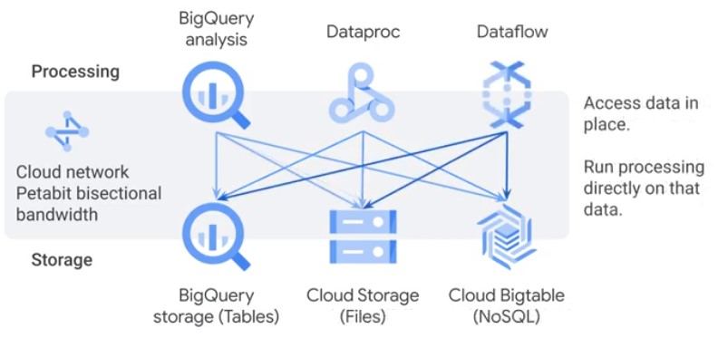  

## Design Data Processing Infrastructure

### Data Ingestion

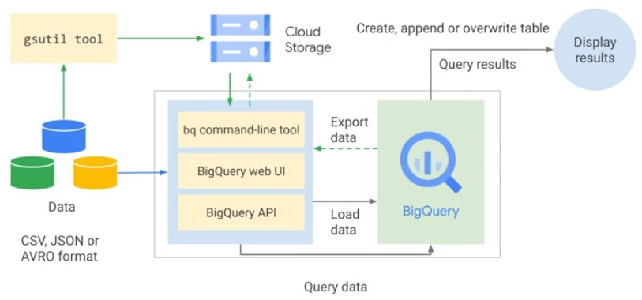  

### Load data into BigQuery

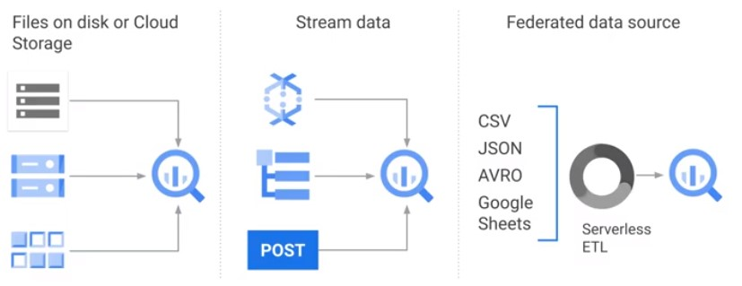  

## PubSub

* Serverless global message queue
* Asynchronous: publisher never waits, a subscriber can get the message
* At-least-onve deliver guarantee
* Push subscription and pull subscription
* 100s of ms -- fast
</a>

Pub/Sub holds messages up to 7 days.

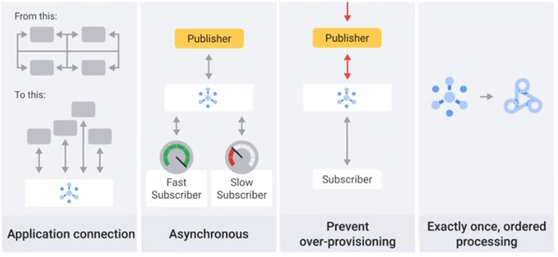

|Ingest|Processing|Analysis|
|-|-|-|
|Pub/Sub|Dataflow|BigQuery|

## Exam Guide Review

### Storage

Selecting the appropriate storage technologies
* Mapping storage systems to business requirements
* Data modeling
* Tradeoffs involving latency, thoughput and transactions
* Distributed sytems
* Schema design
<a/>

>Be familiar with the common use cases and qualities of the different storage options. Each storage system or database is optimized for different things - some are best at automatically updating the data for transactions. Some are optimized for speed of data retrieval but not for updates or changes. Some are very fast and inexpensive for simple retrieval but slow for complex queries.

### Pipelines

Designing data pipelines
* Data publishing and visualization
* Batch and streaming
* Online (interactive) vs batch predictions
* Job automation and orchestration
<a/>

>An important element in designing the data processing pipeline starts with selecting the appropriate service or collection of services.  
>All Platform Notebooks, Google Data Studion, BigQuery all have interactive interfaces. Do you know when to use each?

### Processing Infrastructure

Designing a data processing solution
* Choice of infrastructure
* System availability and fault tolerance
* use of distributed systems
* Capacity planning
* Hybrid cloud and edge computing
* Architecture options
* At least once, in-order, and exactly once event planning
<a/>

>Pub/Sub and Dataflow together provide once, in-order, processing and possibly delayed or repeated streaming data.  
>Be familiar with the common assemblies of services and how they are often used together: Dataflow, Dataproc, BigQuery, Cloud Storage and Pub/Sub.

### Migration

Migrating data warehousing and data processing
* Awareness of current state and how to migrate design to a future state
* Migrating from on-premise to cloud
* Validating a migration
<a/>

>Technologically, Dataproc is superior to Open Source Hadoop and Dataflow is superior to Dataproc. However, this does not mean that the most advanced technology is always the best solution. You need to consider the business requirements. The client might want to first migrate from the data center to the cloud. Make sure everything is working (validate it). And only after they are confident with that solution, to consider improving and modernizing.

# Building and Operationalizing Data Processing Systems

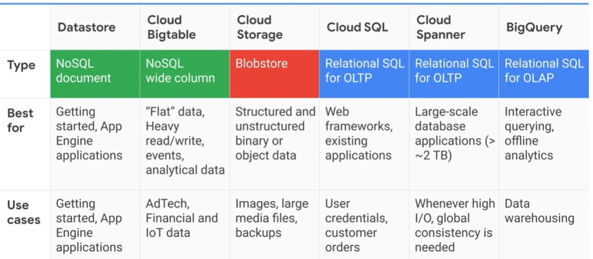

## Building Dataprocessing Systems

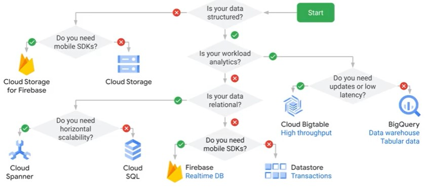

ACID - Consistency
* Atomicity
* Consistency
* Isolation
* Durability
<a/>

BASE - Availability
* Basically Available
* Soft state
* Eventual consistency
<a/>

In Cloud Datastore there are just two APIs provide a strongly consistent view for reading entity values and indexes: lookup by key, ancestor query.

## Storage Options

### Cloud Storage

Cluster node options
* Persistent storage
* Staging area for other services
* Storage classes (Cold Line, Hot Line ...)
<a/>

Access
* Granular access control: Project, Bucket or Object
* IAM roles, ACLs and Signed URLs
<a/>

Features
* Versioning
* Encryption options: Google, CMEK, CSEK
* Lifecycles
* Change storage class
* Streaming
* Data transfer / synchronization
* Storeage Transfer Service
* JSON and XML APIs
<a/>

Best Practices
* Traffic estimation
<a/>

### Cloud SQL

Familiar
* MySQL
* Stored Procedures
<a/>

Not Supported
* User-definded functions
<a/>

Flexible pricing
* Pay per use
* Pay per hour
<a/>

Connect from anywhere
* Assign IP address
<a/>

Fast
* Place Cloud SQl instance in same region as App engine, or Compute engine
<a/>

Google Security
* Secure Google data centers
* Several ways to securely access a Cloud SQL instance
<a/>

### Cloud Bigtable

Properties
* High throughput data
* Millisecond latency, NoSQL
* Access is designed to optimize for a range of Row Key prefixes
<a/>

Important Features
* Schema design and time-series support
* Access control
* Performance Design
* Choosing between SSD and HDD
<a/>

### Cloud Spanner

Properties
* Globally
* Fully managed
* Relational database
* Transactional consistency
* Data in Cloud Spanner is strongly typed
 * Define a schema for each database
 * Schema must specify the data types of each column of each table
<a/>

Important features
* Schema design, Data Model and updates
* Secondary indexes
* Timestamp bounds and Commit timestamps
* Data types
* Transactions
<a/>

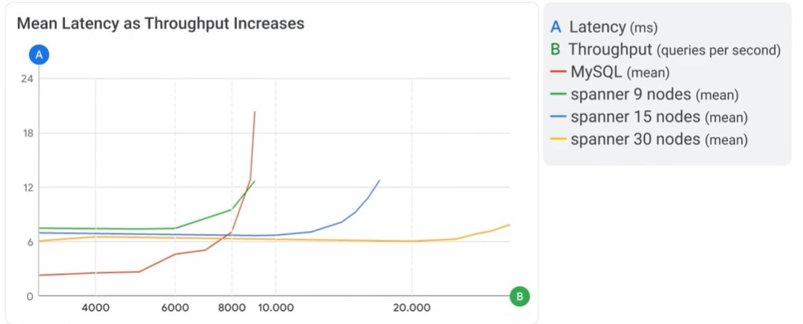

### Datastore

Properties
* Datastore is a NoSQL object database
* Atomic transactions
* ACID support
* High availibility of reads and writes
* Massive scalability with high performance
* Flexible storage and querying of data
* Blanace of strong and eventual consistency
* Encryption at rest
* Fully managed with no plannced downtime
<a/>

Important features
* Identity and access management
* Storage size calculations
* Multitenancy
* Encryption
<a/>

## Building and maintaining Pipelines

### Apache Beam

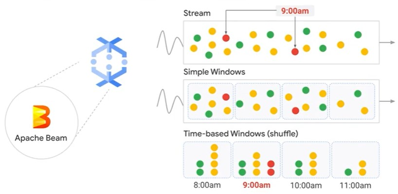  

|Size|Scalability and Fault-tolerance|Programming Model|Unbound data|
|-|-|-|-|
|Autoscaling and rebalancing handles variable volumes of data and growth|On-demand and distribution of processing scales with fault tolerance|Efficient pipelines + Efficient execution|Windowing, triggering, incremental processing and out-of-order data are addressed in the streamning model.|

#### Dataflow Windowing for streams

* Triggering: controls how results are delivered to the next transforms in the pipeline.
* Watermark: is a heuristic that tracks how far behind the system is in processing data from an event time.
* Fixed, sliding and session-based windows.
* Updated results (late), or speculative results (early)
<a/>

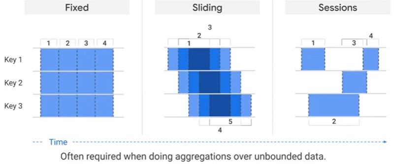

### Side Inputs in Dataflow

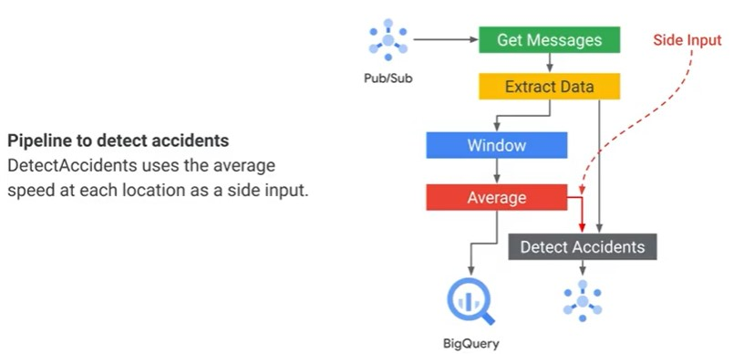

### Building a Streaming Pipeline

* Stream from Pub/Sub into BigQuery. BQ can provide streaming ingest to unbounded data sets.
* BQ provides stream ingestion at a rate of 100krows/table/second
* Pub/Sub guarantees delivery, but not the order of messages.
<a/>

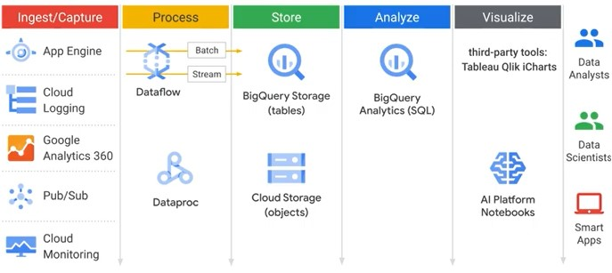

### Scaling Beyond BigQuery

|BigQuery|Cloud BigTable|
|-|-|
|Easy, Inexpensive|Low latency, High throughput|
|latency in order of seconds|100kQPS at 6ms latency in 10 node cluster|
|100k rows/second streaming||

# Analyze Data and enable Machine Learning

## Analyze Data

### Pretraned Models

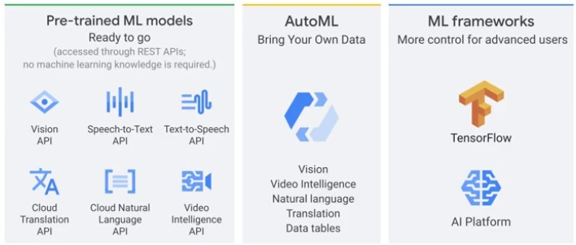

The three modes of the natural language API are: Sentiment, Entity and Syntax

### Notebooks, Datalab

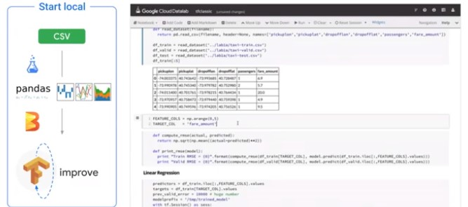

### Cloud ML

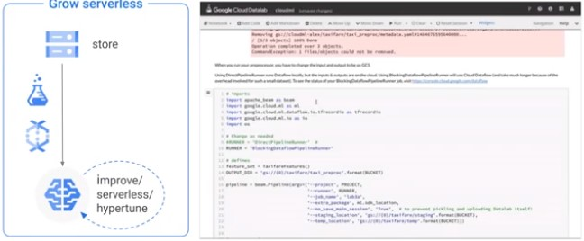

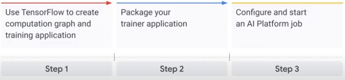

## Machine Learning

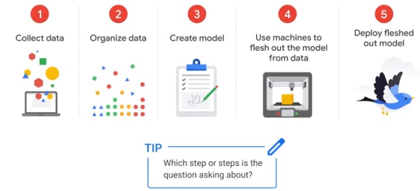

|Step|Tool|
|-|-|
|Collect data|Logging API, Pub/Sub|
|Organize data|BigQuery, Dataflow, ML Preprocessing SDK|
|Create Model|Tensorflow|
|Train, Deploy|Cloud ML|

### Tensorflow

High-Performance library for numerical computation. Tensorflow is coded for example in Python using DG (Directed Graphs) => Lazy evaluation (can be run in eager mode).

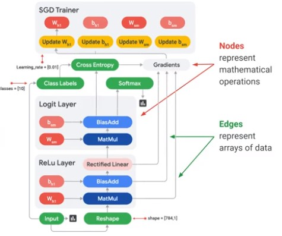

Mathematical information is transported from node to node.

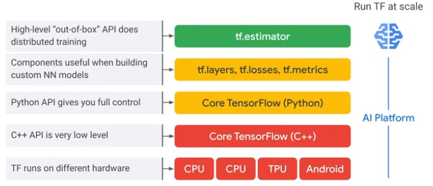

#### TF Methods

https://www.tensorflow.org/api_docs/python/tf/keras/losses

|Method|Description|
|-|-|
|tf.layers|A layser is a class implementing common neural networks operations, such as convolution, bat chorm, etc. These operations require managing variables, losses and updates, as well as applying TensorFlow ops to input tensors|
|tf.losses|Loss Function|
|tf.metrics|General Metrics about the TF performance|

### Unstructured Data

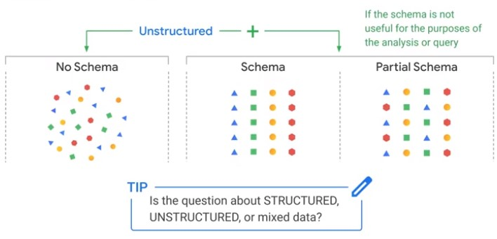

|Task|Solution|
|Real-time insight into supply chain operations. Which partner is causing issues?|Human|
|Drive product decisions. How do people really use feature x?|Human|
|Did error reates decrease after the bug fix was applied|Easy counting problems > Big Data|
|Which stores are experiencing long delays in paymemt processing|Easy counting problems > Big Data|
|Are procemmers checking in low-quality code?|Harder counting problemns > ML|
|Which stores are experiencing a lack of parking space?|Harder counting problems > ML|

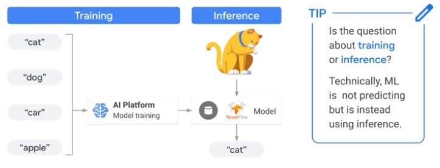

### Supervised Learning

Labels

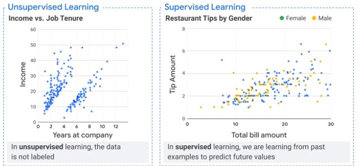

#### Regression, Classification

Regression and Classification models are supervised ML methods.

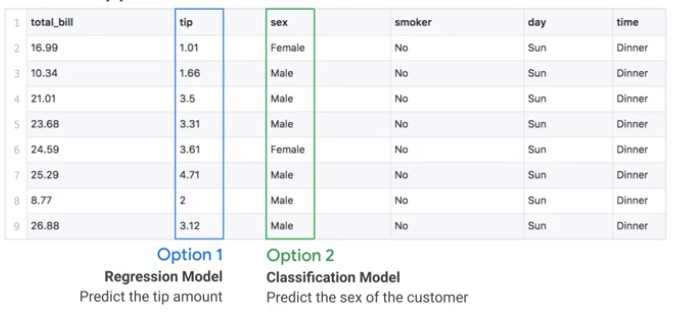

Structured data is a great source for machine learnign model, because it is already labeled.  

Regression problems predict continuous values, like prices, whereas classification problems predict categorical values, like colours.

### Measure Loss

#### Mean Squared Error (MSE)

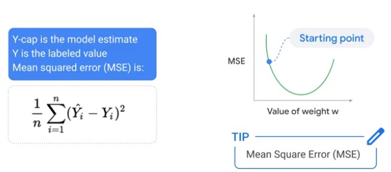e

#### Root Mean Squared Error (RMSE)

The root of MSE. The measure is in the unit of the model and is therefore easier to interpretate.

#### XEntropy

Xentropy is a hint for a classification problem.

#### Gradient Descent

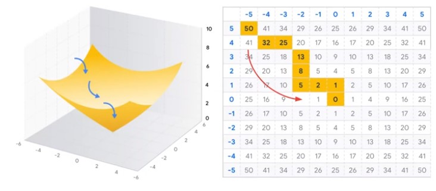

Turn ML problem into search problem.

#### Recompute Error after Batch of examples

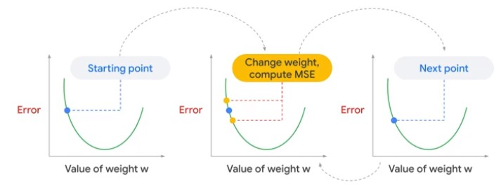

### Training and Validating

#### When is a Model sufficiently good?

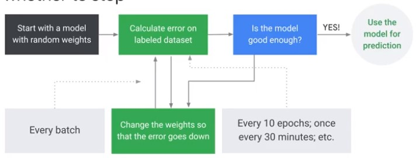

#### Training vs Evaluation Data

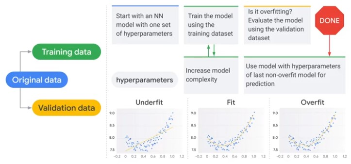

##### Validation Techniques

|Data|Validation|
|-|-|
|Scare|Independend Test Data, Cross Validate|

Cross Validation
* Training Validation
* Test
* Cross Validaton
<a/>

### Modeling Business Processes for Analysis and Optimization

#### Confusion Matrix

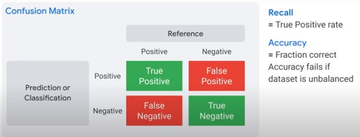

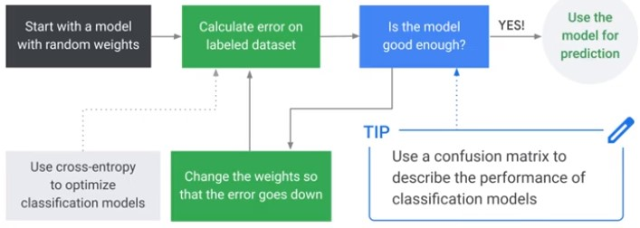

#### Build, Buy od Modify > Business Priorities

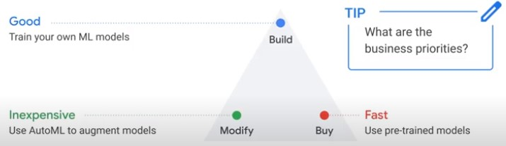

AutoML > Use an existing ML Model and tailor it to your specific needs.

#### Build Effective ML

Big Data > Feature Engineering > Model Architectures  

#### Make ML Pipeline Robust

* Fault-tolerand distributed training framework
* Choose model based on validatoin dataset
* Monitor training, expecially if it will take days
* Resume training if necessary
<a/>

#### Feature Engineering

Good features bing human insight to a problem

##### Choosing good features

* Is the feature you are considering related to the result you are trying to predict?
* Is the predictive value known?
* Is the feature a numeric value with meaningful magnitude?
* Are there enough examples?

##### Feature Engineering Process

* Pre-Processing
* Feature Creation
* Hyperparameter tuning

##### Other Important Concepts

* Feature crosses
* Discretize floats that are not meaningful
* Bucketize features
* Dense and sparse features
  * DNNs for dense, highly correlated
  * Linear for sparse, independent
##### Learning Rate

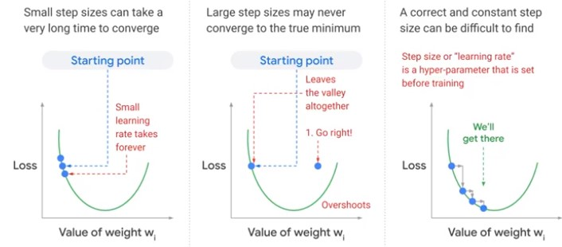

#### Performance

* Input data and data sources (I/O): How many bytes does your query read?
* Communication between nodes (Shuffling): How many bytes does your query pass to the next stage? How many bytes does your query pass to each slot?
* Computation: How much CPU work does your query require?
* Output (materialization): How many bytes does your query write?
* Query anti-patterns: Are your queries following SQL best practices?
<a/>

