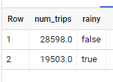

# Big Query

## Explore Datasets

gcp > BigQuery  
Add Data > Explore Public Datasets > NYC Bike  

    SELECT
      MIN(start_station_name) AS start_station_name,
      MIN(end_station_name) AS end_station_name,
      APPROX_QUANTILES(tripduration, 10)[OFFSET (5)] AS typical_duration,
      COUNT(tripduration) AS num_trips
    FROM
      `bigquery-public-data.new_york_citibike.citibike_trips`
    WHERE
      start_station_id != end_station_id
    GROUP BY
      start_station_id,
      end_station_id
    ORDER BY
      num_trips DESC
    LIMIT
      10
      
    WITH
      trip_distance AS (
    SELECT
      bikeid,
      ST_Distance(ST_GeogPoint(s.longitude,
          s.latitude),
        ST_GeogPoint(e.longitude,
          e.latitude)) AS distance
    FROM
      `bigquery-public-data.new_york_citibike.citibike_trips`,
      `bigquery-public-data.new_york_citibike.citibike_stations` as s,
      `bigquery-public-data.new_york_citibike.citibike_stations` as e
    WHERE
      start_station_id = s.station_id
      AND end_station_id = e.station_id )
    SELECT
      bikeid,
      SUM(distance)/1000 AS total_distance
    FROM
      trip_distance
    GROUP BY
      bikeid
    ORDER BY
      total_distance DESC
    LIMIT
      5
      
ghcn_d > ghcnd_2015
  
    SELECT
      wx.date,
      wx.value/10.0 AS prcp
    FROM
      `bigquery-public-data.ghcn_d.ghcnd_2015` AS wx
    WHERE
      id = 'USW00094728'
      AND qflag IS NULL
      AND element = 'PRCP'
    ORDER BY
      wx.date
      
 ## Join Tables > Correlation Weather Bike Travels
 
    WITH bicycle_rentals AS (
      SELECT
        COUNT(starttime) as num_trips,
        EXTRACT(DATE from starttime) as trip_date
      FROM `bigquery-public-data.new_york_citibike.citibike_trips`
      GROUP BY trip_date
    ),
    rainy_days AS
    (
    SELECT
      date,
      (MAX(prcp) > 5) AS rainy
    FROM (
      SELECT
        wx.date AS date,
        IF (wx.element = 'PRCP', wx.value/10, NULL) AS prcp
      FROM
        `bigquery-public-data.ghcn_d.ghcnd_2015` AS wx
      WHERE
        wx.id = 'USW00094728'
    )
    GROUP BY
      date
    )
    SELECT
      ROUND(AVG(bk.num_trips)) AS num_trips,
      wx.rainy
    FROM bicycle_rentals AS bk
    JOIN rainy_days AS wx
    ON wx.date = bk.trip_date
    GROUP BY wx.rainy
    
 
 
## Load Data

### Create Dataset

gcp > BigQuery  
Project > Create Dataset > nyctaxi  

### Ingest Dataset from CSV

nyctaxi > Create Table > 2018trips > Upload, File, csv, Autodetect Schema

    #standardSQL
    SELECT
      *
    FROM
      nyctaxi.2018trips
    ORDER BY
      fare_amount DESC
    LIMIT  5
    
### Ingest Dataset from Google Cloud Storage

    $ bq load \
    --source_format=CSV \
    --autodetect \
    --noreplace  \
    nyctaxi.2018trips \
    gs://cloud-training/OCBL013/nyc_tlc_yellow_trips_2018_subset_2.csv
    
### Create Tables from other Tables

    #standardSQL
    CREATE TABLE
      nyctaxi.january_trips AS
    SELECT
      *
    FROM
      nyctaxi.2018trips
    WHERE
      EXTRACT(Month
      FROM
        pickup_datetime)=1;
        
    #standardSQL
    SELECT
      *
    FROM
      nyctaxi.january_trips
    ORDER BY
      trip_distance DESC
    LIMIT
      1
