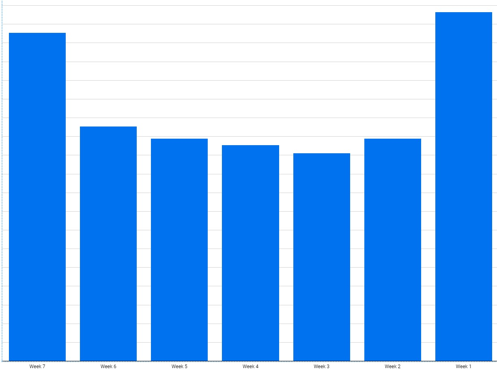
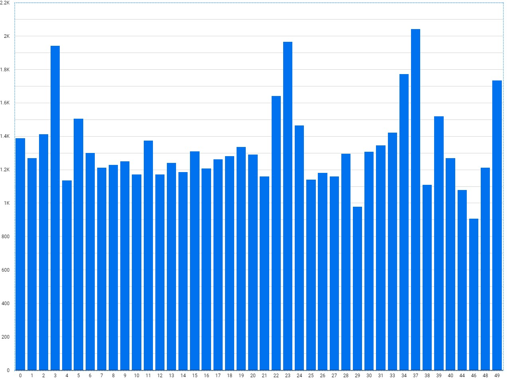

# BigQuery Regression

## Exploratory Analysis

gcp > BigQuery

    SELECT
      start_station_name,
      AVG(duration) AS duration
    FROM
      `bigquery-public-data`.london_bicycles.cycle_hire
    GROUP BY
      start_station_name;
      
Explore Data > Data Sudio

    SELECT
      EXTRACT(dayofweek
      FROM
        start_date) AS dayofweek,
      AVG(duration) AS duration
    FROM
      `bigquery-public-data`.london_bicycles.cycle_hire
    GROUP BY
      dayofweek;
      

    SELECT
      bikes_count,
      AVG(duration) AS duration
    FROM
      `bigquery-public-data`.london_bicycles.cycle_hire
    JOIN
      `bigquery-public-data`.london_bicycles.cycle_stations
    ON
      cycle_hire.start_station_name = cycle_stations.name
    GROUP BY
      bikes_count;
      

## Create Training Dataset

    SELECT
      duration,
      start_station_name,
      CAST(EXTRACT(dayofweek
        FROM
          start_date) AS STRING) AS dayofweek,
      CAST(EXTRACT(hour
        FROM
          start_date) AS STRING) AS hourofday
    FROM
      `bigquery-public-data`.london_bicycles.cycle_hire;
      
Project > Create Dataset > bike_model

    CREATE OR REPLACE MODEL
      bike_model.model
    OPTIONS
      (input_label_cols=['duration'],
        model_type='linear_reg') AS
    SELECT
      duration,
      start_station_name,
      CAST(EXTRACT(dayofweek
        FROM
          start_date) AS STRING) AS dayofweek,
      CAST(EXTRACT(hour
        FROM
          start_date) AS STRING) AS hourofday
    FROM
      `bigquery-public-data`.london_bicycles.cycle_hire;

## Evaluate Model

    SELECT
      *
    FROM
      ML.EVALUATE(MODEL `bike_model.model`);
    
|Row|mean_absolute_error|mean_squared_error|mean_squared_log_error|median_absolute_error|r2_score|explained_variance|
|-|-|-|-|-|-|-|
|1|1025.36404065957|1.8626284025307837E8|0.8624522836978052|542.246965292446|0.003625355180860046|0.0036455296071115084|

## Feature Engineering

    CREATE OR REPLACE MODEL
      bike_model.model_weekday
    OPTIONS
      (input_label_cols=['duration'],
        model_type='linear_reg') AS
    SELECT
      duration,
      start_station_name,
    IF
      (EXTRACT(dayofweek
        FROM
          start_date) BETWEEN 2 AND 6,
        'weekday',
        'weekend') AS dayofweek,
      CAST(EXTRACT(hour
        FROM
          start_date) AS STRING) AS hourofday
    FROM
      `bigquery-public-data`.london_bicycles.cycle_hire;
      
|Row|mean_absolute_error|mean_squared_error|mean_squared_log_error|median_absolute_error|r2_score|explained_variance|
|-|-|-|-|-|-|-|
|1|966.1136843345383|1.98348752043533E8|0.8875249067557017|542.1376014221246|-1.9168176613515442E-5|-1.8620968174953845E-5|

### Bucketize Hour of Day

    CREATE OR REPLACE MODEL
      bike_model.model_bucketized
    OPTIONS
      (input_label_cols=['duration'],
        model_type='linear_reg') AS
    SELECT
      duration,
      start_station_name,
    IF
      (EXTRACT(dayofweek
        FROM
          start_date) BETWEEN 2 AND 6,
        'weekday',
        'weekend') AS dayofweek,
      ML.BUCKETIZE(EXTRACT(hour
        FROM
          start_date),
        [5, 10, 17]) AS hourofday
    FROM
      `bigquery-public-data`.london_bicycles.cycle_hire;

    SELECT * FROM ML.EVALUATE(MODEL `bike_model.model_bucketized`);

|Row|mean_absolute_error|mean_squared_error|mean_squared_log_error|median_absolute_error|r2_score|explained_variance|
|-|-|-|-|-|-|-|
|1|904.2024428390068|1.862264120055824E7|0.8590501838621314|543.0490143986158|0.013913793506915684|0.01424318676008196|

### Make Predictions

    CREATE OR REPLACE MODEL
      bike_model.model_bucketized TRANSFORM(* EXCEPT(start_date),
      IF
        (EXTRACT(dayofweek
          FROM
            start_date) BETWEEN 2 AND 6,
          'weekday',
          'weekend') AS dayofweek,
        ML.BUCKETIZE(EXTRACT(HOUR
          FROM
            start_date),
          [5, 10, 17]) AS hourofday )
    OPTIONS
      (input_label_cols=['duration'],
        model_type='linear_reg') AS
    SELECT
      duration,
      start_station_name,
      start_date
    FROM
      `bigquery-public-data`.london_bicycles.cycle_hire;
      
    SELECT
      *
    FROM
      ML.PREDICT(MODEL bike_model.model_bucketized,
        (
        SELECT
          'Park Lane , Hyde Park' AS start_station_name,
          CURRENT_TIMESTAMP() AS start_date) ); 

|Row|predicted_duration|start_station_name|start_date|
|-|-|-|-|
|1|2526.0557994280207|Park Lane , Hyde Park|2022-01-14 13:53:14.435986 UTC|

    SELECT
      *
    FROM
      ML.PREDICT(MODEL bike_model.model_bucketized,
        (
        SELECT
          start_station_name,
          start_date
        FROM
          `bigquery-public-data`.london_bicycles.cycle_hire
        LIMIT
          100) );
          
### Examine Model Weights
 
    SELECT * FROM ML.WEIGHTS(MODEL bike_model.model_bucketized);
