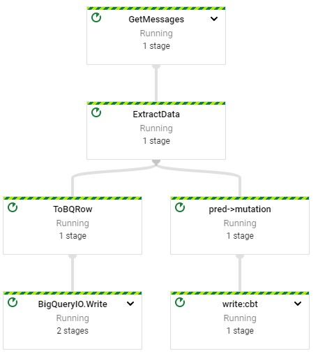
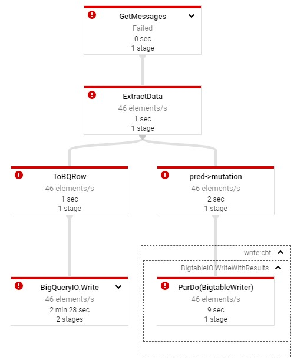

# Streaming Data into Bigtable

## Initialization

gcp > Cloud Engine > training-vm > ssh

    ssh $ ls /training
    ssh $ git clone https://github.com/GoogleCloudPlatform/training-data-analyst
    ssh $ source /training/project_env.sh
    ssh $ cd ~/training-data-analyst/courses/streaming/process/sandiego
./install_quickstart.sh

## Simulate Traffic Sensor Data

    ssh1 $ /training/sensor_magic.sh

gcp > Cloud Engine > training-vm > ssh

    ssh2 $ source /training/project_env.sh

## launch Dataflow Pipeline

    ssh2 $ cd ~/training-data-analyst/courses/streaming/process/sandiego
    ssh2 $ nano run_oncloud.sh
    
    #!/bin/bash
    if [ "$#" -lt 3 ]; then
       echo "Usage:   ./run_oncloud.sh project-name bucket-name classname [options] "
       echo "Example: ./run_oncloud.sh cloud-training-demos cloud-training-demos CurrentConditions --bigtable"
       exit
    fi
    PROJECT=$1
    shift
    BUCKET=$1
    shift
    MAIN=com.google.cloud.training.dataanalyst.sandiego.$1
    shift
    echo "Launching $MAIN project=$PROJECT bucket=$BUCKET $*"
    export PATH=/usr/lib/jvm/java-8-openjdk-amd64/bin/:$PATH
    mvn compile -e exec:java \
     -Dexec.mainClass=$MAIN \
          -Dexec.args="--project=$PROJECT \
          --stagingLocation=gs://$BUCKET/staging/ $* \
          --tempLocation=gs://$BUCKET/staging/ \
          --runner=DataflowRunner"

## Create BigTable Instance

    ssh2 $ cd ~/training-data-analyst/courses/streaming/process/sandiego
    ssh2 $ ./create_cbt.sh
    
## Run Dataflow Pipeline

    ssh2 $ cd ~/training-data-analyst/courses/streaming/process/sandiego
    ssh2 $ ./run_oncloud.sh $DEVSHELL_PROJECT_ID $BUCKET CurrentConditions --bigtable
    
## Explore Pipeline

gcp > Dataflow > Pipeline

## Query Bigtable data

    ssh2 $ cd ~/training-data-analyst/courses/streaming/process/sandiego/quickstart
    ssh2 $ ./quickstart.sh
    
    hbase(main):001:0> scan 'current_conditions', {'LIMIT' => 2}
    hbase(main):002:0> scan 'current_conditions', {'LIMIT' => 10, STARTROW => '15#S#1', ENDROW => '15#S#999', COLUMN => 'lane:speed'}
    hbase(main):003:0> quit
    
## Delete Bigtable Instance

    ssh2 $ cd ~/training-data-analyst/courses/streaming/process/sandiego
    ssh2 $ ./delete_cbt.sh
    
## Stop Pipeline

## Delete BigQuery table

gcp > BigQuery > Project > demos > Delete  

