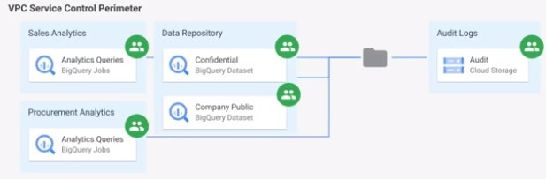

# Case Study 02

## Requirements

Capture data reading and update events to know, who, what, when and where.  
Separation of who manages the data and who can read the data.  
Allocate costs appropriately; costs to read/process vs. costs to store.  
Prevent exfiltration of data to other Google Cloud projects and to external systems.  

## Solution

All access to data should be captured in audit logs.  
All access to data should be managed via IAM.  
Configure service perimeters with VPC service controls.  

