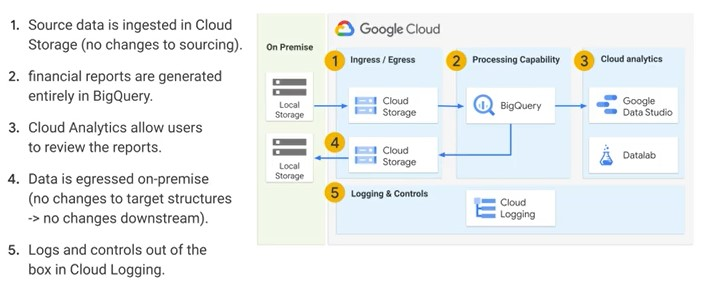

# Case Study - Daily Reports

The overall business requirement was to migrate to Cloud a on-premise reoirting solution aimed to produce daily reports to requlators. The on-oremise solution was coded directly using a SQL-like language and is was run on a Hadoop cluster using Spark/MapReduce (leverarging proprietary third-party software).  

The client wanted to optimize the target cloud solution to:
* Minimize changes to their processes and codebase.
* Leverage PaaS and native cloud solution (ie avoid thrid-party software).
* Significantly improce performance (from hours to minutes)
<a/>

|Business Requirement|Technical Requirement|
|-|-|
|Minimum changes to their processes and codebase |Programmatically conert SQL-like into ANSI SQL. No changes to source/target input structures. Automated black box regewssion testing|
|Leverage PaaS and native Cloud Solution (avoid third party software)|Minimize number of systems/interfaces, aim for full execution in BigQuery|
|Significantly improve performance|Analyze and optimize the SQL code in BigQuery for performance|

* Source data is ingested in Cloud Storage
* Output reports are generated enetirely in BigQuery
* Cloud Analytics allow users to review the reports
* Data is egressed on-premise (no changes to target structures, no changes downstream)
* Logs and controls out of the box in Cloud Logging
<a/>

