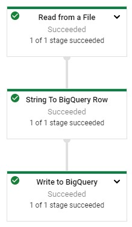
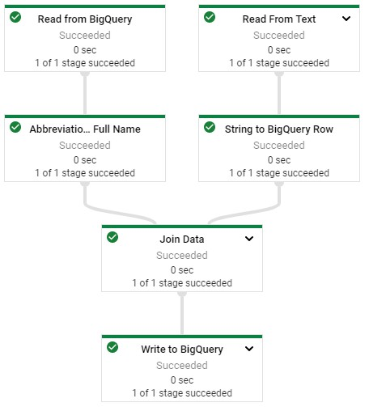
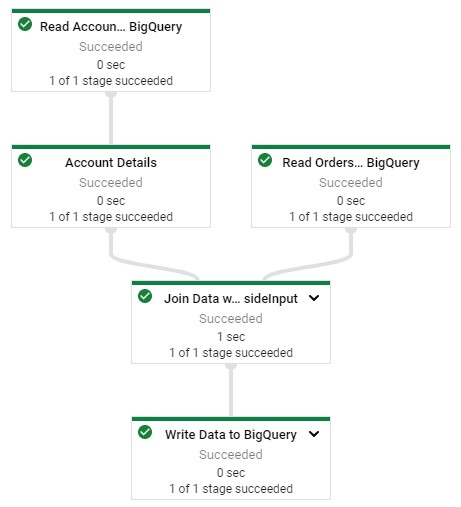

# ETL Processing on Google Cloud Using Dataflow and BigQuery

## Initialize

    $ gcloud auth list
    $ gcloud config list project

### Enable Dataflow API

gcp > APIs & Services > Dataflow API > Manage > Disable API > Enable

### Download Starter Code

    $ gsutil -m cp -R gs://spls/gsp290/dataflow-python-examples .
    $ export PROJECT=qwiklabs-gcp-04-2990d0b0f2ef
    $ gcloud config set project $PROJECT
    
### Create Cloud Storage Bucket

    $ gsutil mb -c regional -l us-central1 gs://$PROJECT

  	$ gsutil cp gs://spls/gsp290/data_files/usa_names.csv gs://$PROJECT/data_files/
    $ gsutil cp gs://spls/gsp290/data_files/head_usa_names.csv gs://$PROJECT/data_files/

### Create BigQuery Dataset

    $ bw make lake
    
## Build Dataflow Pipeline

dataflow_python_examples/resources/data_ingestion.py

## Run Pipeline

### Create Environment

    $ cd dataflow-python-examples/
    $ sudo pip install virtualenv
    $ virtualenv -p python3 venv
    $ source venv/bin/activate
    $ pip install apache-beam[gcp]==2.24.0

### Start Pipeline

    $ python dataflow_python_examples/data_ingestion.py
    --project=$PROJECT
    --region=us-central1
    --runner=DataflowRunner
    --staging_location=gs://$PROJECT/test
    --temp_location gs://$PROJECT/test
    --input gs://$PROJECT/data_files/head_usa_names.csv
    --save_main_session
    

## Check Results

gcp > BigQuery

    select * from `qwiklabs-gcp-04-2990d0b0f2ef.lake.usa_names` limit 10;
    
## Transformation

dataflow_python_examples/resources/data_transformation.py

### Start Pipeline

    $ python dataflow_python_examples/data_transformation.py
    --project=$PROJECT
    --region=us-central1
    --runner=DataflowRunner
    --staging_location=gs://$PROJECT/test
    --temp_location gs://$PROJECT/test
    --input gs://$PROJECT/data_files/head_usa_names.csv
    --save_main_session
    

## Check Results

gcp > BigQuery

    select * from `qwiklabs-gcp-04-2990d0b0f2ef.lake.usa_names_transformed` limit 10;
    
## Data Enrichment

dataflow_python_examples/resources/data_enrichment.py

      83: values = [x for x in csv_row]
      
### Start Pipeline

    $ python dataflow_python_examples/data_enrichment.py
    --project=$PROJECT
    --region=us-central1
    --runner=DataflowRunner
    --staging_location=gs://$PROJECT/test
    --temp_location gs://$PROJECT/test
    --input gs://$PROJECT/data_files/head_usa_names.csv
    --save_main_session
    

## Check Results

gcp > BigQuery

    select * from `qwiklabs-gcp-04-2990d0b0f2ef.lake.usa_names_enriched` limit 10;

## Date Lake to Data Mart

dataflow_python_examples/resources/data_lake_to_mart.py

### Run Pipeline

    $ python dataflow_python_examples/data_lake_to_mart.py
    --worker_disk_type="compute.googleapis.com/projects//zones//diskTypes/pd-ssd"
    --max_num_workers=4
    --project=$PROJECT
    --runner=DataflowRunner
    --staging_location=gs://$PROJECT/test
    --temp_location gs://$PROJECT/test
    --save_main_session
    --region=us-central1
     

## Check Results

gcp > BigQuery

    select * from `qwiklabs-gcp-04-2990d0b0f2ef.lake.orders_denormalized_sideinput` limit 10; 
    
