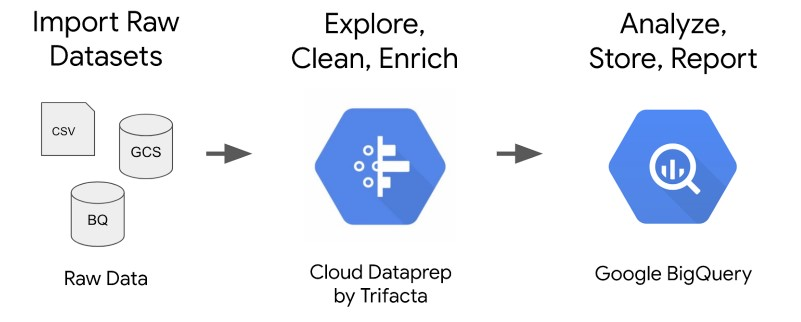
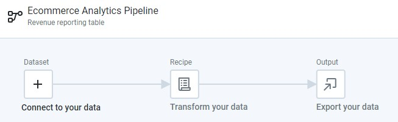
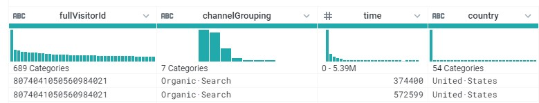
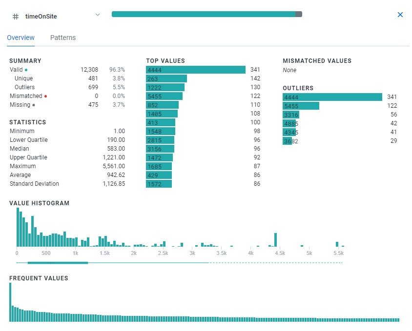
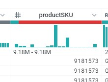
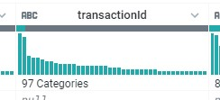
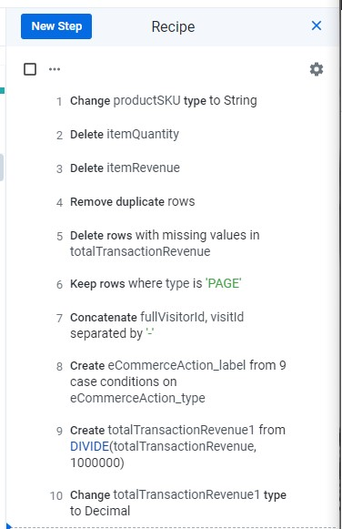
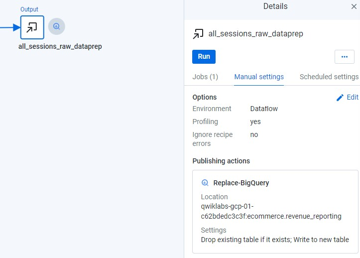

# Creating a Data Transformation Pipeline with Cloud Dataprep

## Create BigQuery Dataset

gcp > BigQuery > <PROJECT_ID> > Create Dataset > ecommerce

## Create Bigquery Table

		#standardSQL
		CREATE OR REPLACE TABLE ecommerce.all_sessions_raw_dataprep
		OPTIONS(
		 description="Raw data from analyst team to ingest into Cloud Dataprep"
		) AS
		SELECT * FROM `data-to-insights.ecommerce.all_sessions_raw`
		WHERE date = '20170801'; # limiting to one day of data 56k rows for this lab

## Dataprep

### Analyse Data

gcp > Dataprep > create Flow > 'Ecommerce Analytics Pipeline'

Dataset > Import datasets > BigQuery > ecommerce > Import & Add Flow  

Edit Recipe  

#### Data Overview

  

#### Column Detail
			
  

#### Mismatching Data Types
			
  
			
#### Missing Values
			

### Clean Data
			
* productSKU > Change Type > String
* itemQuantity, ItemRevenue > Delete
* Filter Rows > Remove Duplicate Rows > Add
* totalTransaction Revenue > Filter rows > on column values > is missing
* totalTransaction Revenue > Filter rows > on column values > is exactly > 'PAGE'

### Enrich Data
			
* Merge Columns > 'fullVisitorId-visitId' > unique_session_id
* Conditions > Case on Single Column > ecommerceAction_type > 9 cases > eCommerceAction_label

|Comparison|New value|
|-|-|
|0|'Unknown'|
|1|'Click through of product lists'|
|2|'Product detail views'|
|3|'Add product(s) to cart'|
|4|'Remove product(s) from cart'|
|5|'Check out'|
|6|'Completed purchase'|
|7|'Refund of purchase'|
|8|'Checkout options'|

### Adjust Value
			
* totalTrasactionRevenue > Calculate > Custom formula > DIVIDE(totalTransactionRevenue,1000000) > totalTrasactionRevenue1
* totalTrasactionRevenue > Change Type > Decimal

  
			
## Add Output
			
gcp > BigQuery > <PROJECT_ID> Create Table > revenue_reporting 

Output > Manual Settings > Edit > Add Action > Replace-BigQuery
			
  
