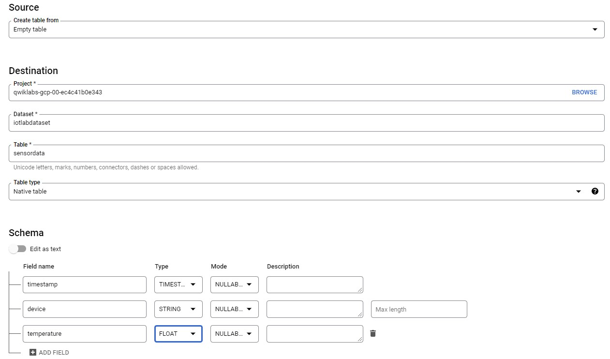
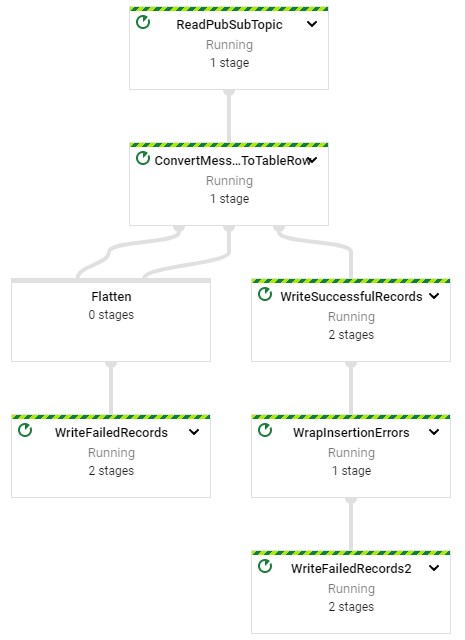

# Building an IoT Analytics Pipeline

## Enable Dataflow API

gcp > API & Services > Dataflow API > Manage > Disable API > Enable  

## Create Pub/Sub Topic

gcp > Pub/Sub > Create Topic > iotlab

iotlab > view Permissions > Add Principal > cloud-iot@system.gserviceaccount.com > Role: Pub/Sub Publisher

## Create BigQuery Dataset

gcp > BigQuery > Create Dataset > iotlabdataset  
iotlabdataset > Create Table > sensordata

## Create Cloud Storage Bucket

gcp > Cloud Storage > Create Bucket > qwiklabs-gcp-00-ec4c41b0e343-bucket

## Setup Dataflow Pipeline

gcp > Dataflow > Create Job From Template > iotlabflow  

|Item|Value|
|-|-|
|Job name|iotlabflow|
|Dataflow template|Pub/Sub Topic to BigQuery|
|Input Pub/Sub topic|projects/qwiklabs-gcp-00-ec4c41b0e343/topics/iotlab|
|BigQuery output table|qwiklabs-gcp-00-ec4c41b0e343:iotlabdataset.sensordata|
|Temporary location|gs://qwiklabs-gcp-00-ec4c41b0e343-bucket/tmp/|
|Max workers|2|
|Machine Type|n1-standard-1|

## Prepare Computeengine VM

gcp > Compute Engine > iot-device-simulator > ssh

### Create Pyhton Environment

    ssh $ sudo pip3 install virtualenv
    ssh $ virtualenv -p python3 venv
    ssh $ source venv/bin/activate

### Initialize Google Cloud SDK

    ssh $ gcloud init
    
Log in with new account > Click URL > Copy Code > Paste > Pick Lab Project

    ssh $ sudo apt-get update
    ssh $ sudo apt-get install python-pip openssl git -y
    ssh $ pip install pyjwt paho-mqtt cryptography
    ssh $ git clone http://github.com/GoogleCloudPlatform/training-data-analyst

### Create Registry for IoT devices

    ssh $ export PROJECT_ID=qwiklabs-gcp-00-ec4c41b0e343
    ssh $ export MY_REGION=europe-west1
    ssh $ gcloud iot registries create iotlab-registry \
          --project=$PROJECT_ID \
          --region=$MY_REGION \
          --event-notification-config=topic=projects/$PROJECT_ID/topics/iotlab
   
### Create Cryptographic Keypair

    ssh $ cd $HOME/training-data-analyst/quests/iotlab/
          openssl req -x509 -newkey rsa:2048 -keyout rsa_private.pem \
          -nodes -out rsa_cert.pem -subj "/CN=unused"
    
### Add Simulated Devices to Registry

    ssh $ gcloud iot devices create temp-sensor-buenos-aires \
          --project=$PROJECT_ID \
          --region=$MY_REGION \
          --registry=iotlab-registry \
          --public-key path=rsa_cert.pem,type=rs256
          
    ssh $ gcloud iot devices create temp-sensor-istanbul \
          --project=$PROJECT_ID \
          --region=$MY_REGION \
          --registry=iotlab-registry \
          --public-key path=rsa_cert.pem,type=rs256
          
### Run Simulated Decices

    ssh $ cd $HOME/training-data-analyst/quests/iotlab/
    ssh $ curl -o roots.pem -s -m 10 --retry 0 "https://pki.goog/roots.pem"
    
    ssh $ python cloudiot_mqtt_example_json.py \
         --project_id=$PROJECT_ID \
         --cloud_region=$MY_REGION \
         --registry_id=iotlab-registry \
         --device_id=temp-sensor-buenos-aires \
         --private_key_file=rsa_private.pem \
         --message_type=event \
         --algorithm=RS256 > buenos-aires-log.txt 2>&1 &
    
    ssh $ python cloudiot_mqtt_example_json.py \
         --project_id=$PROJECT_ID \
         --cloud_region=$MY_REGION \
         --registry_id=iotlab-registry \
         --device_id=temp-sensor-istanbul \
         --private_key_file=rsa_private.pem \
         --message_type=event \
         --algorithm=RS256
         
 ### Analyze Sensor Data
 
 gcp > BigQuery
 
    
