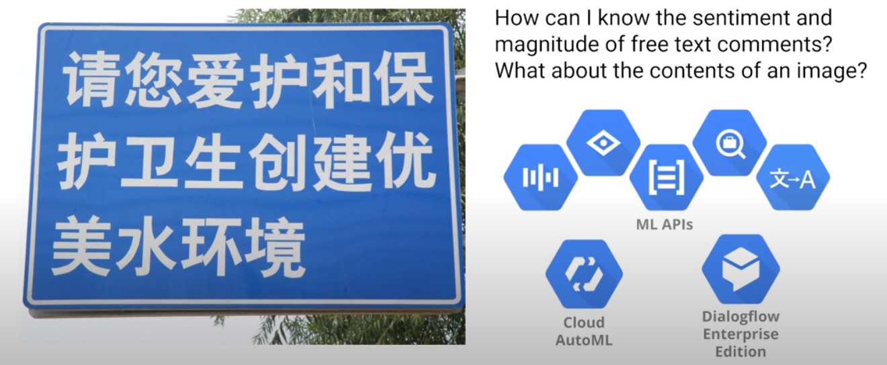

# Goal

# Setup

## Activate API

gcp > API & Services > Library > Cloud Auto ML > Enable

## Create Cloud Storage

    $ gsutil mb -p $DEVSHELL_PROJECT_ID \
    -c regional    \
    -l us-central1 \
    gs://$DEVSHELL_PROJECT_ID-vcm/

## AutoML UI

Naviate to [AutoML UI](https://console.cloud.google.com/vision/datasets)

# Upload Training Images

gcp > Cloud Storage > Browser

    $ gsutil -m cp -r gs://cloud-training/automl-lab-clouds/* gs://$DEVSHELL_PROJECT_ID-vcm/
    $ gsutil ls gs://$DEVSHELL_PROJECT_ID-vcm/
    
# Create Training Dataset

Create a csv file that contains the urls of the training data.

    $ gsutil cp gs://cloud-training/automl-lab-clouds/data.csv .
    head --lines=10 data.csv
    sed -i -e "s/placeholder/$DEVSHELL_PROJECT_ID-vcm/g" ./data.csv
    head --lines=10 data.csv
    gsutil cp ./data.csv gs://$DEVSHELL_PROJECT_ID-vcm/
    gsutil ls gs://$DEVSHELL_PROJECT_ID-vcm/
    
    $ gsutil ls gs://$DEVSHELL_PROJECT_ID-vcm/*
    
Copy the location to the data.csv file: qwiklabs-gcp-00-96ec97cb6a24-vcm/data.csv

gcp > Vision > Datasets > New Dataset

AutoML provides an In-House human labeling service!  

# Train the model

Train > Start Training

# Evaluate model

  

# Predict

