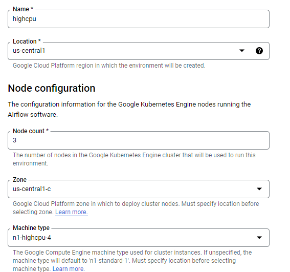
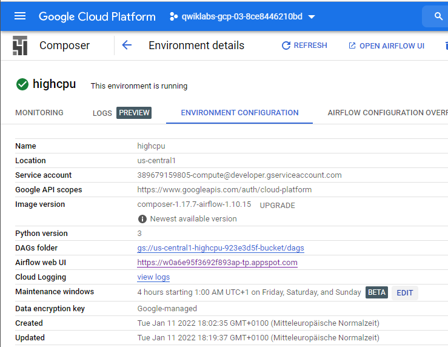
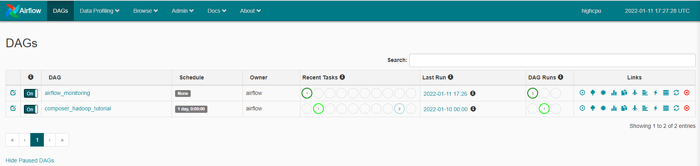

# Cloud Composer

## Initialize

    $ gcloud auth list
    $ gcloud config list project
    
## Enable Kubernetes Engine API

gcp > API > Kubernetes Engine API > Manage > Disable API  
Kubernetes Engine API > Enable  

## Enable Cloud Composer API

gcp > API > Cloud Composer API > Enable  

## Create Cloud Composer Environment

gcp > Composer > Create Environment > Composer 1  

## Create Cloud Storage Bucket

gcp > Cloud Storage > Create Bucket > qwiklabs-gcp-03-8ce8446210bd > Create  

## Create Airflow Pipline

### Set Environmet Variables

Airflow > Admin > Variables  

|Key|Value|
|-|-|
|gcp_project|qwiklabs-gcp-03-8ce8446210bd|
|gcs_bucket|gs://qwiklabs-gcp-03-8ce8446210bd|
|gce_zone|us-central1-a|

### Upload DAG to Cloud Storage

    $ gsutil cp gs://cloud-training/datawarehousing/lab_assets/hadoop_tutorial.py gs://us-central1-highcpu-923e3d5f-bucket/dags
    
## Explore DAGs

Airflow > DAGs  

  
