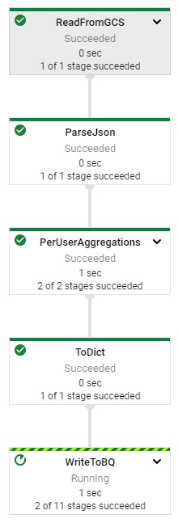
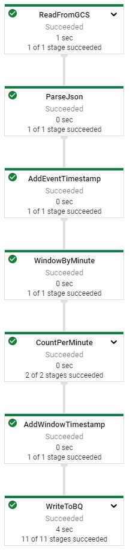

# Dataflow Batch Analytics - Java

## Initialize

    $ gcloud auth list
    $ gcloud config list project
    
## IDE

http://34.133.81.127:3000/#/home/project/training-data-analyst/quests/dataflow/

## Aggregate Site Traffic by User

BatchUserTrafficPipeline.java

### Generate Synthetic Data

    IDE $ cd 3_Batch_Analytics/labs
    IDE $ mvn clean dependency:resolve
    IDE $ export BASE_DIR=$(pwd)
    
    IDE $ cd $BASE_DIR/../..
    IDE $ source create_batch_sinks.sh
    
    #!/bin/#!/usr/bin/env bash
    echo "Creating pipeline sinks"

    PROJECT_ID=$(gcloud config get-value project)

    # GCS buckets
    #TODO: Add try/catch for the first bucket since qwiklabs
    gsutil mb -l US gs://$PROJECT_ID
    gsutil mb -l US -c "COLDLINE" gs://$PROJECT_ID-coldline

    # BiqQuery Dataset
    bq mk --location=US logs

    IDE $ source generate_batch_events.sh
    IDE $ cd $BASE_DIR

### Sum Pageviews by User

    purchases.apply(Group.byFieldNames("userId")
    .aggregateField("itemId", Count.combineFn(), "numPurchases")
    .aggregateField("costCents", Sum.ofLongs(), "totalSpendCents")
    .aggregateField("costCents", Max.ofLongs(), "largestPurchases"));

### Flatten Schema

    purchases.apply(Select.fieldNames("key.userId", "value.numPurchases", "value.totalSpendCents", "value.largestPurchases")
    
[Gitlab Source Code](https://github.com/GoogleCloudPlatform/training-data-analyst/tree/master/quests/dataflow/3_Batch_Analytics/solution/src/main/java/com/mypackage/pipeline)

### Run Pipeline

    IDE $ export PROJECT_ID=$(gcloud config get-value project)
    IDE $ export REGION='us-central1'
    IDE $ export BUCKET=gs://${PROJECT_ID}
    IDE $ export PIPELINE_FOLDER=${BUCKET}
    IDE $ export MAIN_CLASS_NAME=com.mypackage.pipeline.BatchUserTrafficPipeline
    IDE $ export RUNNER=DataflowRunner
    IDE $ export INPUT_PATH=${PIPELINE_FOLDER}/events.json
    IDE $ export TABLE_NAME=${PROJECT_ID}:logs.user_traffic
    IDE $ cd $BASE_DIR
    IDE $ mvn compile exec:java \
    -Dexec.mainClass=${MAIN_CLASS_NAME} \
    -Dexec.cleanupDaemonThreads=false \
    -Dexec.args=" \
    --project=${PROJECT_ID} \
    --region=${REGION} \
    --stagingLocation=${PIPELINE_FOLDER}/staging \
    --tempLocation=${PIPELINE_FOLDER}/temp \
    --runner=${RUNNER} \
    --inputPath=${INPUT_PATH} \
    --tableName=${TABLE_NAME}"

## Aggregate Site Traffic by Minute

BatchMinuteTrafficPipeline.java

### Add Timestamps to each element

    PCollection<MyClass> unstamped = ...;
    PCollection<MyClass> stamped = unstampedLogs.apply(WithTimestamps.of((MyClass m) -> org.joda.time.Instant.parse(m.getTimestamp())));
          
### Window in one-Minute Windows

    PCollection<String> pColl= ...;
    PCollection<String> windowedPCollection = pColl.apply(Window.<String>into(FixedWindows.of(Duration.standardSeconds(60))));
    
### Count Events per Minute

    .apply("CountPerMinute", Combine.globally(Count.<CommonLog>combineFn()).withoutDefaults())
    
### Convert Back to Row and add Timestamp

    // Define the schema for the records.
    Schema appSchema =
      Schema
          .builder()
          .addInt32Field("appId")
          .addStringField("description")
          .addDateTimeField("rowtime")
          .build();
        
    Row row =
      Row
          .withSchema(appSchema)
          .addValues(1, "Some cool app", new Date())
          .build();
          
    .apply().setRowSchema(appSchema)
    
    @ProcessElement
    public void processElement(@Element T l, OutputReceiver<T> r, IntervalWindow window) {
       Instant i = Instant.ofEpochMilli(window.start().getMillis());
       ...
       r.output(...);
    }

[Gitlab Source Code](https://github.com/GoogleCloudPlatform/training-data-analyst/tree/master/quests/dataflow/3_Batch_Analytics/solution/src/main/java/com/mypackage/pipeline)

### Run Pipeline

    IDE $ export PROJECT_ID=$(gcloud config get-value project)
    IDE $ export REGION='us-central1'
    IDE $ export BUCKET=gs://${PROJECT_ID}
    IDE $ export PIPELINE_FOLDER=${BUCKET}
    IDE $ export MAIN_CLASS_NAME=com.mypackage.pipeline.BatchMinuteTrafficPipeline
    IDE $ export RUNNER=DataflowRunner
    IDE $ export INPUT_PATH=${PIPELINE_FOLDER}/events.json
    IDE $ export TABLE_NAME=${PROJECT_ID}:logs.minute_traffic
    IDE $ cd $BASE_DIR
    IDE $ mvn compile exec:java \
    -Dexec.mainClass=${MAIN_CLASS_NAME} \
    -Dexec.cleanupDaemonThreads=false \
    -Dexec.args=" \
    --project=${PROJECT_ID} \
    --region=${REGION} \
    --stagingLocation=${PIPELINE_FOLDER}/staging \
    --tempLocation=${PIPELINE_FOLDER}/temp \
    --runner=${RUNNER} \
    --inputPath=${INPUT_PATH} \
    --tableName=${TABLE_NAME}"

# Dataflow Batch Analytics - Python

## Initialize

    $ gcloud auth list
    $ gcloud config list project

Editor

    $ git clone https://github.com/GoogleCloudPlatform/training-data-analyst
    $ cd ~/training-data-analyst/quests/dataflow_python/

## Aggregate Site Traffic by User

### Generate Synthetic Data

    $ cd 3_Batch_Analytics/lab
    $ export BASE_DIR=$(pwd)

### Setup Virtual Environment

    $ sudo apt-get install -y python3-venv
    $ python3 -m venv df-env
    $ source df-env/bin/activate
    
### Install Missing Packages

    $ python3 -m pip install -q --upgrade pip setuptools wheel
    $ python3 -m pip install apache-beam[gcp]

### Enable Dataflow API

    $ gcloud services enable dataflow.googleapis.com
    
### Grant dataflow.worker role

    $ PROJECT_ID=$(gcloud config get-value project)
    $ export PROJECT_NUMBER=$(gcloud projects list --filter="$PROJECT_ID" --format="value(PROJECT_NUMBER)")
    $ export serviceAccount=""$PROJECT_NUMBER"-compute@developer.gserviceaccount.com"
    $ gcloud projects add-iam-policy-binding $PROJECT_ID --member="serviceAccount:${serviceAccount}" --role="roles/dataflow.worker"
    
### Setup Data Environment

    $ cd $BASE_DIR/../..
    $ source create_batch_sinks.sh
    $ source generate_batch_events.sh
    $ cd $BASE_DIR
    
### Sum Page Views per User

    (purchases | GroupBy('user_id')
             .aggregate_field("item_id", CountCombineFn(), "num_purchases")
             .aggregate_field("cost_cents", sum, "total_spend_cents")
             .aggregate_field("cost_cents", max, "largest_purchases"))
             .with_output_types(UserPurchases)
             
    class UserPurchases(typing.NamedTuple):
      user_id : str
      num_purchases : int
      total_spend_cents : int
      largest_purchases : int
      
    beam.coders.registry.register_coder(UserPurchases, beam.coders.RowCoder)

[Gihub Code Source](https://github.com/GoogleCloudPlatform/training-data-analyst/tree/master/quests/dataflow_python/3_Batch_Analytics/solution/batch_user_traffic_pipeline.py)

### Run Pipeline

    $ export PROJECT_ID=$(gcloud config get-value project)
    $ export REGION='us-central1'
    $ export BUCKET=gs://${PROJECT_ID}
    $ export PIPELINE_FOLDER=${BUCKET}
    $ export RUNNER=DataflowRunner
    $ export INPUT_PATH=${PIPELINE_FOLDER}/events.json
    $ export TABLE_NAME=${PROJECT_ID}:logs.user_traffic
    $ cd $BASE_DIR
    $ python3 batch_user_traffic_pipeline.py \
    --project=${PROJECT_ID} \
    --region=${REGION} \
    --staging_location=${PIPELINE_FOLDER}/staging \
    --temp_location=${PIPELINE_FOLDER}/temp \
    --runner=${RUNNER} \
    --input_path=${INPUT_PATH} \
    --table_name=${TABLE_NAME}
    

## Aggregate Site Traffic by Minute

### Add Timestamp to each Element

    def add_timestamp(element):
      ts = # Do Something
      return beam.window.TimestampedValue(element, ts)
    unstamped = ...
    stamped = unstamped | beam.Map(add_timestamp)

### Window into one-minute Windows

    p = ...
    p_windowed = p | beam.WindowInto(beam.window.FixedWindows(5*60))

### Count Events per Windows

    p = ...
    p | beam.CombineGlobally(CountCombineFn()).without_defaults()
    
### Convert back to a row and add timestamp

    class GetTimestampFn(beam.DoFn):
    def process(self, element, window=beam.DoFn.WindowParam):
        window_start = #Do something!
        output = {'page_views': element, 'timestamp': window_start}
        yield output
        
[Github Source Code](https://github.com/GoogleCloudPlatform/training-data-analyst/tree/master/quests/dataflow_python/3_Batch_Analytics/solution/batch_minute_traffic_pipeline.py)
        
### Run Pipeline

    $ export PROJECT_ID=$(gcloud config get-value project)
    $ export REGION='us-central1'
    $ export BUCKET=gs://${PROJECT_ID}
    $ export PIPELINE_FOLDER=${BUCKET}
    $ export RUNNER=DataflowRunner
    $ export INPUT_PATH=${PIPELINE_FOLDER}/events.json
    $ export TABLE_NAME=${PROJECT_ID}:logs.minute_traffic
    $ cd $BASE_DIR
    $ python3 batch_minute_traffic_pipeline.py \
    --project=${PROJECT_ID} \
    --region=${REGION} \
    --staging_location=${PIPELINE_FOLDER}/staging \
    --temp_location=${PIPELINE_FOLDER}/temp \
    --runner=${RUNNER} \
    --input_path=${INPUT_PATH} \
    --table_name=${TABLE_NAME}

