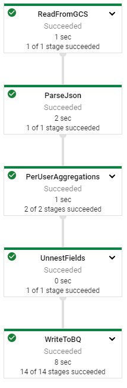
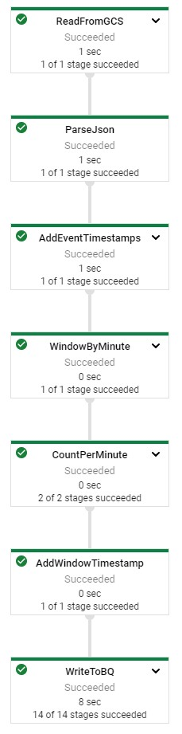

# Dataflow Batch Analytics - Java

## Initialize

    $ gcloud auth list
    $ gcloud config list project
    
## IDE

http://34.133.81.127:3000/#/home/project/training-data-analyst/quests/dataflow/

## Aggregate Site Traffic by User

BatchUserTrafficPipeline.java

### Generate Synthetic Data

    IDE $ cd 3_Batch_Analytics/labs
    IDE $ mvn clean dependency:resolve
    IDE $ export BASE_DIR=$(pwd)
    
    IDE $ cd $BASE_DIR/../..
    IDE $ source create_batch_sinks.sh
    IDE $ source generate_batch_events.sh
    IDE $ cd $BASE_DIR

### Sum Pageviews by User

    purchases.apply(Group.byFieldNames("userId")
    .aggregateField("itemId", Count.combineFn(), "numPurchases")
    .aggregateField("costCents", Sum.ofLongs(), "totalSpendCents")
    .aggregateField("costCents", Max.ofLongs(), "largestPurchases"));

### Flatten Schema

    purchases.apply(Select.fieldNames("key.userId", "value.numPurchases", "value.totalSpendCents", "value.largestPurchases")
    
[Gitlab Source Code](https://github.com/GoogleCloudPlatform/training-data-analyst/tree/master/quests/dataflow/3_Batch_Analytics/solution/src/main/java/com/mypackage/pipeline)

### Run Pipeline

    IDE $ export PROJECT_ID=$(gcloud config get-value project)
    IDE $ export REGION='us-central1'
    IDE $ export BUCKET=gs://${PROJECT_ID}
    IDE $ export PIPELINE_FOLDER=${BUCKET}
    IDE $ export MAIN_CLASS_NAME=com.mypackage.pipeline.BatchUserTrafficPipeline
    IDE $ export RUNNER=DataflowRunner
    IDE $ export INPUT_PATH=${PIPELINE_FOLDER}/events.json
    IDE $ export TABLE_NAME=${PROJECT_ID}:logs.user_traffic
    IDE $ cd $BASE_DIR
    IDE $ mvn compile exec:java \
    -Dexec.mainClass=${MAIN_CLASS_NAME} \
    -Dexec.cleanupDaemonThreads=false \
    -Dexec.args=" \
    --project=${PROJECT_ID} \
    --region=${REGION} \
    --stagingLocation=${PIPELINE_FOLDER}/staging \
    --tempLocation=${PIPELINE_FOLDER}/temp \
    --runner=${RUNNER} \
    --inputPath=${INPUT_PATH} \
    --tableName=${TABLE_NAME}"

## Aggregate Site Traffic by Minute

BatchMinuteTrafficPipeline.java

### Add Timestamps to each element

    PCollection<MyClass> unstamped = ...;
    PCollection<MyClass> stamped = unstampedLogs.apply(WithTimestamps.of((MyClass m) -> org.joda.time.Instant.parse(m.getTimestamp())));
          
### Window in one-Minute Windows

    PCollection<String> pColl= ...;
    PCollection<String> windowedPCollection = pColl.apply(Window.<String>into(FixedWindows.of(Duration.standardSeconds(60))));
    
### Count Events per Minute

    .apply("CountPerMinute", Combine.globally(Count.<CommonLog>combineFn()).withoutDefaults())
    
### Convert Back to Row and add Timestamp

    // Define the schema for the records.
    Schema appSchema =
      Schema
          .builder()
          .addInt32Field("appId")
          .addStringField("description")
          .addDateTimeField("rowtime")
          .build();
        
    Row row =
      Row
          .withSchema(appSchema)
          .addValues(1, "Some cool app", new Date())
          .build();
          
    .apply().setRowSchema(appSchema)
    
    @ProcessElement
    public void processElement(@Element T l, OutputReceiver<T> r, IntervalWindow window) {
       Instant i = Instant.ofEpochMilli(window.start().getMillis());
       ...
       r.output(...);
    }

[Gitlab Source Code](https://github.com/GoogleCloudPlatform/training-data-analyst/tree/master/quests/dataflow/3_Batch_Analytics/solution/src/main/java/com/mypackage/pipeline)

### Run Pipeline

    IDE $ export PROJECT_ID=$(gcloud config get-value project)
    IDE $ export REGION='us-central1'
    IDE $ export BUCKET=gs://${PROJECT_ID}
    IDE $ export PIPELINE_FOLDER=${BUCKET}
    IDE $ export MAIN_CLASS_NAME=com.mypackage.pipeline.BatchMinuteTrafficPipeline
    IDE $ export RUNNER=DataflowRunner
    IDE $ export INPUT_PATH=${PIPELINE_FOLDER}/events.json
    IDE $ export TABLE_NAME=${PROJECT_ID}:logs.minute_traffic
    IDE $ cd $BASE_DIR
    IDE $ mvn compile exec:java \
    -Dexec.mainClass=${MAIN_CLASS_NAME} \
    -Dexec.cleanupDaemonThreads=false \
    -Dexec.args=" \
    --project=${PROJECT_ID} \
    --region=${REGION} \
    --stagingLocation=${PIPELINE_FOLDER}/staging \
    --tempLocation=${PIPELINE_FOLDER}/temp \
    --runner=${RUNNER} \
    --inputPath=${INPUT_PATH} \
    --tableName=${TABLE_NAME}"

