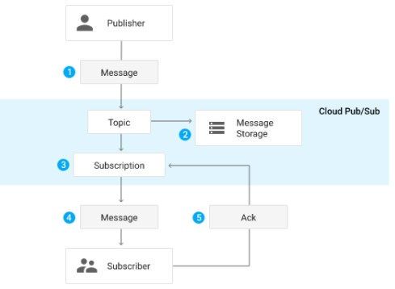
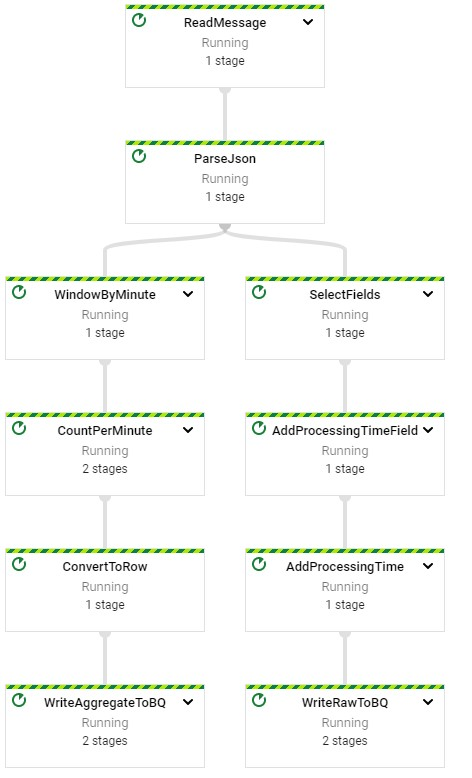
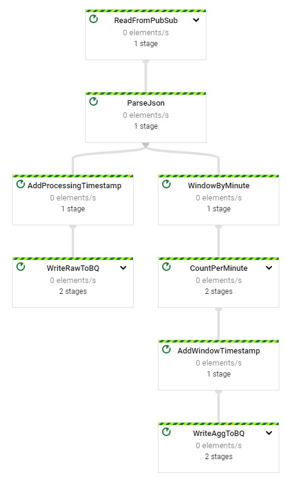

# Dataflow Analytics Stream - Java

## Initialize

    $ gcloud auth list
    $ gcloud config list project
    
## IDE

http://34.71.129.198:3000/#/home/project/training-data-analyst/quests/dataflow/

    IDE $ cd 5_Streaming_Analytics/labs
    IDE $ mvn clean dependency:resolve
    IDE $ export BASE_DIR=$(pwd)
    
## Setup Environment

    IDE $ cd $BASE_DIR/../..
    IDE $ source create_streaming_sinks.sh
    
    #!/bin/#!/usr/bin/env bash
    echo "Creating pipeline sinks"

    PROJECT_ID=$(gcloud config get-value project)

    # GCS buckets
    #TODO: Add try/catch for the first bucket since qwiklabs
    gsutil mb -l US gs://$PROJECT_ID
    gsutil mb -l US -c "COLDLINE" gs://$PROJECT_ID-coldline

    # BiqQuery Dataset
    bq mk --location=US logs

    # PubSub Topic
    gcloud pubsub topics create my_topic

    IDE $ cd $BASE_DIR
    
## Read from Streaming Source

## Window into one-minute Windows

    PCollection<String> pColl= ...;
    PCollection<String> windowedPCollection = pColl.apply(
            Window.<String>into(FixedWindows.of(Duration.standardSeconds(60))));
            
## Aggregate Data

### Count Events per Window

    PCollection<Long> counts = pColl.apply("CountPerWindow",
    Combine.globally(Count.<MyClass>combineFn()).withoutDefaults());
    
    @ProcessElement
    public void processElement(@Element T l, OutputReceiver<T> r, IntervalWindow window) {
       Instant i = Instant.ofEpochMilli(window.end().getMillis());
       Row row = Row.withSchema(appSchema)
                .addValues(.......)
                .build()
       ...
       r.output(...);
    }
    
    apply().setRowSchema(appSchema)

## Write to BigQuery

### Write Aggregated Data to BigQuery

    
    rowsPCollection.apply("WriteToBQ",
                    BigQueryIO.<Row>write().to(myTableName).useBeamSchema()
                            .withWriteDisposition(BigQueryIO.Write.WriteDisposition.WRITE_APPEND)
                            .withCreateDisposition(BigQueryIO.Write.CreateDisposition.CREATE_IF_NEEDED));
                            
### Write Raw Data to BigQuery

## Run Pipeline

    IDE $ export PROJECT_ID=$(gcloud config get-value project)
    IDE $ export REGION=us-central1
    IDE $ export BUCKET=gs://${PROJECT_ID}
    IDE $ export PIPELINE_FOLDER=${BUCKET}
    IDE $ export MAIN_CLASS_NAME=com.mypackage.pipeline.StreamingMinuteTrafficPipeline
    IDE $ export RUNNER=DataflowRunner
    IDE $ export PUBSUB_TOPIC=projects/${PROJECT_ID}/topics/my_topic
    IDE $ export WINDOW_DURATION=60
    IDE $ export AGGREGATE_TABLE_NAME=${PROJECT_ID}:logs.windowed_traffic
    IDE $ export RAW_TABLE_NAME=${PROJECT_ID}:logs.raw
    IDE $ cd $BASE_DIR
    IDE $ mvn compile exec:java \
    -Dexec.mainClass=${MAIN_CLASS_NAME} \
    -Dexec.cleanupDaemonThreads=false \
    -Dexec.args=" \
    --project=${PROJECT_ID} \
    --region=${REGION} \
    --stagingLocation=${PIPELINE_FOLDER}/staging \
    --tempLocation=${PIPELINE_FOLDER}/temp \
    --runner=${RUNNER} \
    --inputTopic=${PUBSUB_TOPIC} \
    --windowDuration=${WINDOW_DURATION} \
    --aggregateTableName=${AGGREGATE_TABLE_NAME} \
    --rawTableName=${RAW_TABLE_NAME}"
    
[Gitlab Source](https://github.com/GoogleCloudPlatform/training-data-analyst/blob/master/quests/dataflow/5_Streaming_Analytics/solution/src/main/java/com/mypackage/pipeline/StreamingMinuteTrafficPipeline.java)

## Generate Lag-Less Streaming Input

    IDE $ cd $BASE_DIR/../..
    IDE $ bash generate_streaming_events.sh
    
    #!/bin/#!/usr/bin/env bash
    echo "Installing packages"
    # Install modules
    sh ./install_packages.sh

    echo "Generating synthetic users"
    # Generate 10 fake web site users
    python3 user_generator.py --n=10

    echo "Generating synthetic events"
    use_lag=$1

    if [ "$use_lag" = true ] ; then
        echo "Using lag"
        python3 streaming_event_generator.py --project_id=$(gcloud config get-value project) -t=my_topic
    else
        echo "Not using lag"
        python3 streaming_event_generator.py --project_id=$(gcloud config get-value project) -t=my_topic -off=1. -on=0. -l=0
    fi
    
  ## Examine Results
  
  gcp > BigQuery
  
    SELECT minute, pageviews
    FROM `logs.windowed_traffic`
    ORDER BY minute ASC;
  
    $ bq head logs.raw
    $ bq head logs.windowed_traffic
    
    SELECT
      UNIX_MILLIS(event_timestamp) - min_millis.min_event_millis AS event_millis,
      UNIX_MILLIS(processing_timestamp) - min_millis.min_event_millis AS processing_millis,
      user_id,
      -- added as unique label so we see all the points
      CAST(UNIX_MILLIS(event_timestamp) - min_millis.min_event_millis AS STRING) AS label
    FROM
      `logs.raw`
    CROSS JOIN (
      SELECT
        MIN(UNIX_MILLIS(event_timestamp)) AS min_event_millis
      FROM
        `logs.raw`) min_millis
    WHERE
      event_timestamp IS NOT NULL
    ORDER BY
      event_millis ASC;
      
# Dataflow Analytics Stream - Python

## Initialize

    $ gcloud auth list
    $ gcloud config list project

## Open Gitlab Repo

    $ git clone https://github.com/GoogleCloudPlatform/training-data-analyst/
    $ cd ~/training-data-analyst/quests/dataflow_python/
    
    $ cd 5_Streaming_Analytics/lab
    $ export BASE_DIR=$(pwd)
    
## Setup Virtual Environment

    $ sudo apt-get install -y python3-venv
    $ python3 -m venv df-env
    $ source df-env/bin/activate
    
## Install Packages

    $ python3 -m pip install -q --upgrade pip setuptools wheel
    $ python3 -m pip install apache-beam[gcp]

## Enable Dataflow API

    $ gcloud services enable dataflow.googleapis.com

## Grant Dataflow.Worker role to Compute Engine

    $ PROJECT_ID=$(gcloud config get-value project)
    $ export PROJECT_NUMBER=$(gcloud projects list --filter="$PROJECT_ID" --format="value(PROJECT_NUMBER)")
    $ export serviceAccount=""$PROJECT_NUMBER"-compute@developer.gserviceaccount.com"
    $ gcloud projects add-iam-policy-binding $PROJECT_ID --member="serviceAccount:${serviceAccount}" --role="roles/dataflow.worker"

## Set up Data Environment

    $ cd $BASE_DIR/../..
    $ source create_streaming_sinks.sh
    $ cd $BASE_DIR
    
## Write Pipeline

### Reading from Streaming Source

### Window the Data

    "WindowByMinute" >> beam.WindowInto(beam.window.FixedWindows(60))
    
### Aggregate the Data

    "CountPerMinute" >> beam.CombineGlobally(CountCombineFn()).without_defaults()
    
### Write to BigQuery

    'WriteAggToBQ' >> beam.io.WriteToBigQuery(
      agg_table_name,
      schema=agg_table_schema,
      create_disposition=beam.io.BigQueryDisposition.CREATE_IF_NEEDED,
      write_disposition=beam.io.BigQueryDisposition.WRITE_APPEND
      )

## Run Pipeline

    $ export PROJECT_ID=$(gcloud config get-value project)
    $ export REGION='us-central1'
    $ export BUCKET=gs://${PROJECT_ID}
    $ export PIPELINE_FOLDER=${BUCKET}
    $ export RUNNER=DataflowRunner
    $ export PUBSUB_TOPIC=projects/${PROJECT_ID}/topics/my_topic
    $ export WINDOW_DURATION=60
    $ export AGGREGATE_TABLE_NAME=${PROJECT_ID}:logs.windowed_traffic
    $ export RAW_TABLE_NAME=${PROJECT_ID}:logs.raw
    $ python3 streaming_minute_traffic_pipeline.py \
    --project=${PROJECT_ID} \
    --region=${REGION} \
    --staging_location=${PIPELINE_FOLDER}/staging \
    --temp_location=${PIPELINE_FOLDER}/temp \
    --runner=${RUNNER} \
    --input_topic=${PUBSUB_TOPIC} \
    --window_duration=${WINDOW_DURATION} \
    --agg_table_name=${AGGREGATE_TABLE_NAME} \
    --raw_table_name=${RAW_TABLE_NAME}
 

## Create Input

    $ cd $BASE_DIR/../..
    $ bash generate_streaming_events.sh
