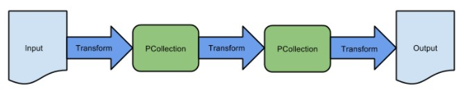
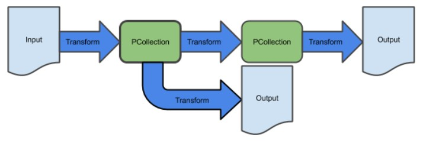
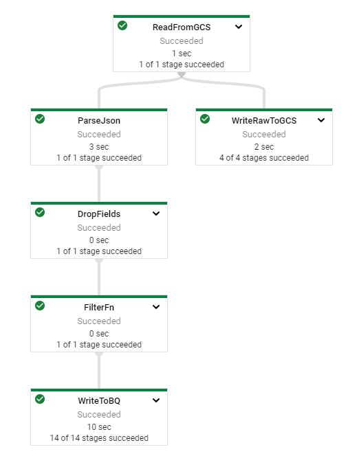
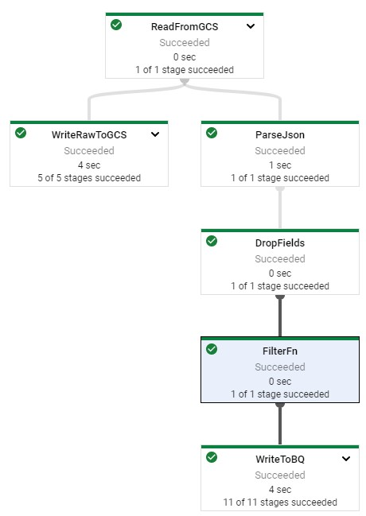

# Dataflow Branching - Java

## Initialize

    $ gcloud auth list
    $ gcloud config list project

IDE > http://35.239.30.60:3000/#/home/project/training-data-analyst/quests/dataflow/

## Multiple Transforms

    [PCollection1] = [Initial Input PCollection].apply([A Transform])
    [PCollection2] = [Initial Input PCollection].apply([A Different Transform])
    
## Implementing a Branching Pipeline

### Add Branch

#### Open Lab

    IDE $ cd 2_Branching_Pipelines/labs
    IDE $ mvn clean dependency:resolve
    IDE $ export BASE_DIR=$(pwd)
    
#### Setup Data Environment

    IDE $ cd $BASE_DIR/../..
    IDE $ source create_batch_sinks.sh
    IDE $ source generate_batch_events.sh
    IDE $ cd $BASE_DIR
    
#### Add Branching Transformation

MyPipeline.java

    // Write to Google Cloud Storage
    lines.apply("WriteRawToGCS", TextIO.write().to(options.getOutputPath()));

    // Convert elements to CommonLog, filter out individual elements, and write to BigQuery
    lines.apply("ParseJson", ParDo.of(new JsonToCommonLog()))
            .apply("DropFields", DropFields.fields("user_agent"))
            .apply("FilterFn", Filter.<Row>create().whereFieldName("num_bytes", (Long num_bytes) -> num_bytes < 120))
            .apply("WriteToBQ",
                    BigQueryIO.<Row>write().to(options.getTableName()).useBeamSchema()
                            .withWriteDisposition(BigQueryIO.Write.WriteDisposition.WRITE_TRUNCATE)
                            .withCreateDisposition(BigQueryIO.Write.CreateDisposition.CREATE_IF_NEEDED));
                                
#### Filter Data by Field
    
    PCollection<MyClass> pCollection = ...;
    pCollection.apply("SelectUserState", Select.fieldNames("state")));

    PCollection<MyClass> pCollection = ...;
    pCollection.apply("DropPII", DropFields.fields("ssn", "state"));

#### Filter Data by Element

    purchases.apply(Filter.<MyObject>create()
    .whereFieldName(“costCents”, (Long c) -> c > 100 * 20)
    .whereFieldName(“shippingAddress.country”, (String c) -> c.equals(“de”));
      
#### Add custom coommand-line Parameters
    
    public interface Options extends PipelineOptions {
    }
    public static void main(String[] args) {
     Options options = PipelineOptionsFactory.fromArgs(args).withValidation().as(Options.class);
     run(options);
    }
    
    public interface Options extends PipelineOptions {
      @Description("My custom command line argument.")
      @Default.String("DEFAULT")
      String getMyCustomOption();
      void setMyCustomOption(String myCustomOption);
    }
    
    PipelineOptionsFactory.register(Options.class);
    Options options = PipelineOptionsFactory.fromArgs(args).withValidation().as(Options.class);
    
    String myCustomOption = option.getMyCustomOption();

#### Add Nullable Fields to Pipeline

    @DefaultSchema(JavaFieldSchema.class)
    class MyClass {
      int field1;
      @javax.annotation.Nullable String field2;
    }
    
[Gitlab Source](https://github.com/GoogleCloudPlatform/training-data-analyst/tree/master/quests/dataflow/2_Branching_Pipelines/solution/src/main/java/com/mypackage/pipeline/MyPipeline.java)

### Run Pipeline

    IDE $ export PROJECT_ID=$(gcloud config get-value project)
    IDE $ export REGION='us-central1'
    IDE $ export BUCKET=gs://${PROJECT_ID}
    IDE $ export COLDLINE_BUCKET=${BUCKET}-coldline
    IDE $ export PIPELINE_FOLDER=${BUCKET}
    IDE $ export MAIN_CLASS_NAME=com.mypackage.pipeline.MyPipeline
    IDE $ export RUNNER=DataflowRunner
    IDE $ export INPUT_PATH=${PIPELINE_FOLDER}/events.json
    IDE $ export OUTPUT_PATH=${PIPELINE_FOLDER}-coldline
    IDE $ export TABLE_NAME=${PROJECT_ID}:logs.logs_filtered
    IDE $ cd $BASE_DIR
    IDE $ mvn compile exec:java \
    -Dexec.mainClass=${MAIN_CLASS_NAME} \
    -Dexec.cleanupDaemonThreads=false \
    -Dexec.args=" \
    --project=${PROJECT_ID} \
    --region=${REGION} \
    --stagingLocation=${PIPELINE_FOLDER}/staging \
    --tempLocation=${PIPELINE_FOLDER}/temp \
    --runner=${RUNNER} \
    --inputPath=${INPUT_PATH} \
    --outputPath=${OUTPUT_PATH} \
    --tableName=${TABLE_NAME}"
    

# Dataflow Branching - Python

## Initialize

    $ gcloud auth list
    $ gcloud config list project
    
## Get Repo
    
    $ git clone https://github.com/GoogleCloudPlatform/training-data-analyst
    $ cd ~/training-data-analyst/quests/dataflow_python/
    
## Multiple Transactions

    [PCollection1] = [Initial Input PCollection] | [A Transform]
    [PCollection2] = [Initial Input PCollection] | [A Different Transform]
    
## Implement Branching Pipeline

### Open Lab

    $ cd 2_Branching_Pipelines/lab
    $ export BASE_DIR=$(pwd)
    
### Setup Virtual Environment

    $ sudo apt-get install -y python3-venv
    $ python3 -m venv df-env
    $ source df-env/bin/activate
    
### Install Packages

    $ python3 -m pip install -q --upgrade pip setuptools wheel
    $ python3 -m pip install apache-beam[gcp]
    
### Enable Dataflow API

    $ gcloud services enable dataflow.googleapis.com

### Setup Data Environment

    $ cd $BASE_DIR/../..
    $ source create_batch_sinks.sh
    $ source generate_batch_events.sh
    $ cd $BASE_DIR
    
### Add Branch

    # Read in lines to an initial PCollection that can then be branched off of
    lines = p | 'ReadFromGCS' >> beam.io.ReadFromText(input_path)

    # Write to Google Cloud Storage
    lines | 'WriteRawToGCS' >> beam.io.WriteToText(output_path)

    # Read elements from Json, filter out individual elements, and write to BigQuery
    (lines
        | 'ParseJson' >> beam.Map(parse_json)
        | 'DropFields' >> beam.Map(drop_fields)
        | 'FilterFn' >> beam.Filter(lambda row: row['num_bytes'] < 120)
        | 'WriteToBQ' >> beam.io.WriteToBigQuery(
            table_name,
            schema=table_schema,
            create_disposition=beam.io.BigQueryDisposition.CREATE_IF_NEEDED,
            write_disposition=beam.io.BigQueryDisposition.WRITE_TRUNCATE
            )
    )

### Filter Data by Field

    def drop_field(element):
      element.pop('field_name')
      return element
      
### Filter Data by Element

    purchases | beam.Filter(lambda element : element['cost_cents'] > 20*100)
    
### Add Custom Command-Line Parameters

    parser = argparse.ArgumentParser(description='...')
    # Define and parse arguments
    options = PipelineOptions()
    # Set options values from options
    p = beam.Pipeline(options=options)
    
    parser.add_argument('--argument_name', required=True, help='Argument description')
    
    opts = parser.parse_args()
    arg_value = opts.arg_name

### Add Nullable Fields

    {
        "name": "field_name",
        "type": "STRING",
        "mode": "NULLABLE"
    }
    
[Github Source](https://github.com/GoogleCloudPlatform/training-data-analyst/blob/master/quests/dataflow_python/2_Branching_Pipelines/solution/my_pipeline.py)
    
## Run Pipeline

