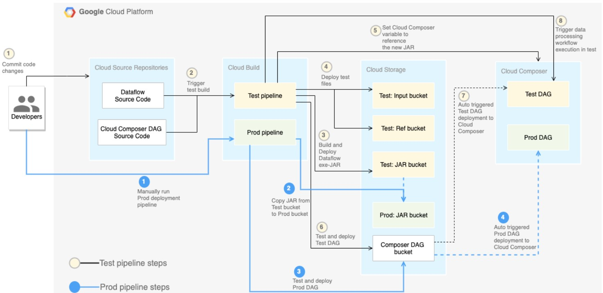
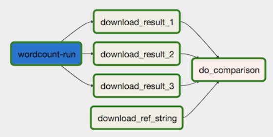

# Dataflow CI/CD

1. A developer commits code changes to the Cloud Source Repositories.
2. Code changes trigger a test build in Cloud Build.
3. Cloud Build builds the self-executing JAR file and deploys it to the test JAR bucket on Cloud Storage.
4. Cloud Build deploys the test files to the test-file buckets on Cloud Storage.
5. Cloud Build sets the variable in Cloud Composer to reference the newly deployed JAR file.
6. Cloud Build tests the data-processing workflow Directed acyclic graph (DAG) and deploys it to the Cloud Composer bucket on Cloud Storage.
7. The workflow DAG file is deployed to Cloud Composer.
8. Cloud Build triggers the newly deployed data-processing workflow to run.

## Setup Environment

### Download Repo

    $ git clone https://github.com/GoogleCloudPlatform/ci-cd-for-data-processing-workflow.git

### Set Environment Variables
    
    $ cd ~/ci-cd-for-data-processing-workflow/env-setup
    $ source set_env.sh

### Update WordCount.java

    $ sed -i '185 s/options.getOutput())/options.getOutput()).withNumShards(3)/' ~/ci-cd-for-data-processing-workflow/source-code/data-processing-code/src/main/java/org/apache/beam/examples/WordCount.java

## Create CloudComposer Environment

    $ gcloud composer environments create $COMPOSER_ENV_NAME \
    --location $COMPOSER_REGION \
    --zone $COMPOSER_ZONE_ID \
    --machine-type n1-standard-1 \
    --node-count 3 \
    --disk-size 20 \
    --python-version 2
    
    $ cd ~/ci-cd-for-data-processing-workflow/env-setup
    $ chmod +x set_composer_variables.sh
    $ ./set_composer_variables.sh
    
## Extract CloudComposer Environment Properties

    $ export COMPOSER_DAG_BUCKET=$(gcloud composer environments describe $COMPOSER_ENV_NAME \
    --location $COMPOSER_REGION \
    --format="get(config.dagGcsPrefix)")
    
    $ export COMPOSER_SERVICE_ACCOUNT=$(gcloud composer environments describe $COMPOSER_ENV_NAME \
    --location $COMPOSER_REGION \
    --format="get(config.nodeConfig.serviceAccount)")
    
## Create Cloud Storage Buckets

    $ cd ~/ci-cd-for-data-processing-workflow/env-setup
    $ chmod +x create_buckets.sh
    $ ./create_buckets.sh

