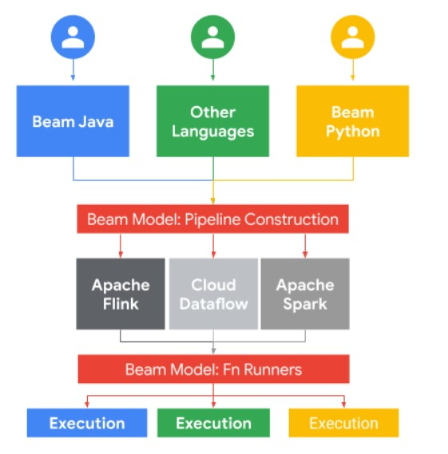
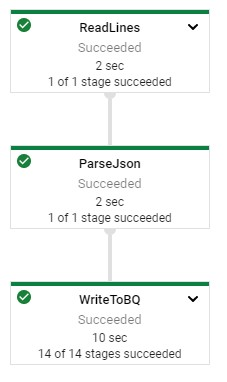
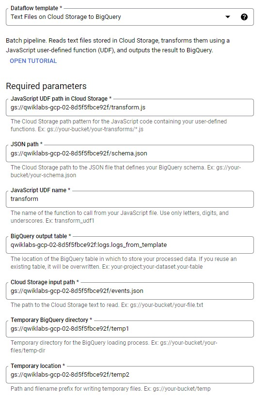

# Dataflow ETL Pipeline Java

## Initialize

    $ gcloud auth list
    $ gcloud config list project
    
## IDE

http://35.224.135.98:3000/#/home/project/training-data-analyst/quests/dataflow/

## Write ETL Pipeline

    theia $ cd 1_Basic_ETL/labs
    theia $ export BASE_DIR=$(pwd)

#### Modify pom.xml

    <dependency>
      <groupId>org.apache.beam</groupId>
      <artifactId>beam-sdks-java-core</artifactId>
      <version>${beam.version}</version>
    </dependency>
    <dependency>
      <groupId>org.apache.beam</groupId>
      <artifactId>beam-runners-direct-java</artifactId>
      <version>${beam.version}</version>
    </dependency>
    <dependency>
      <groupId>org.apache.beam</groupId>
      <artifactId>beam-sdks-java-io-google-cloud-platform</artifactId>
      <version>${beam.version}</version>
    </dependency>
    <dependency>
      <groupId>org.apache.beam</groupId>
      <artifactId>beam-runners-google-cloud-dataflow-java</artifactId>
      <version>${beam.version}</version>
    </dependency>
    <dependency>
      <groupId>org.apache.beam</groupId>
      <artifactId>beam-sdks-java-extensions-google-cloud-platform-core</artifactId>
      <version>${beam.version}</version>
    </dependency>
    
    theia $ mvn clean dependency:resolve
    
#### Write Pipeline

    theia $ cd $BASE_DIR/../..
    theia $ source create_batch_sinks.sh
    theia $ bash generate_batch_events.sh
    theia $ head events.json

gcp > Cloud Storage > Project > events.json

#### Read Data from Source

IDE > MyPipeline.java

    String input = "gs://qwiklabs-gcp-02-8d5f5fbce92f/events.json";
    
    pipeline.apply("ReadLines", TextIO.read().from(input));

    theia $ cd $BASE_DIR
    theia $ export MAIN_CLASS_NAME=com.mypackage.pipeline.MyPipeline
    theia $ mvn compile exec:java -Dexec.mainClass=${MAIN_CLASS_NAME}
    
#### Apply Transformation

    /**
     * A class used for parsing JSON web server events
     * Annotated with @DefaultSchema to the allow the use of Beam Schemas and <Row> object
     */
    @DefaultSchema(JavaFieldSchema.class)
    public static class CommonLog {
        String user_id;
        String ip;
        Double lat;
        Double lng;
        String timestamp;
        String http_request;
        String user_agent;
        Long http_response;
        Long num_bytes;
    }

    /**
    * A DoFn acccepting Json and outputing CommonLog with Beam Schema
    */
    static class JsonToCommonLog extends DoFn<String, CommonLog> {

        @ProcessElement
        public void processElement(@Element String json, OutputReceiver<CommonLog> r) throws Exception {
            Gson gson = new Gson();
            CommonLog commonLog = gson.fromJson(json, CommonLog.class);
            r.output(commonLog);
        }
    }
    
    pipeline.apply("ReadLines", TextIO.read().from(input))
        .apply("ParseJson", ParDo.of(new JsonToCommonLog()));
        
#### Write to Sink

    theia $ bq ls
    theia $ bq ls logs
    
    String output = "qwiklabs-gcp-02-8d5f5fbce92f:logs.logs";
    
    pipeline.apply("ReadLines", TextIO.read().from(input))
            .apply("ParseJson", ParDo.of(new JsonToCommonLog()))
            .apply("WriteToBQ",
                BigQueryIO.<CommonLog>write().to(output).useBeamSchema()
                        .withWriteDisposition(BigQueryIO.Write.WriteDisposition.WRITE_TRUNCATE)
                        .withCreateDisposition(BigQueryIO.Write.CreateDisposition.CREATE_IF_NEEDED));

#### Run Pipeline

    theia $ export PROJECT_ID=$(gcloud config get-value project)
    theia $ export REGION='us-central1'
    theia $ export PIPELINE_FOLDER=gs://${PROJECT_ID}
    theia $ export MAIN_CLASS_NAME=com.mypackage.pipeline.MyPipeline
    theia $ export RUNNER=DataflowRunner
    theia $ cd $BASE_DIR
    theia $ mvn compile exec:java \
    -Dexec.mainClass=${MAIN_CLASS_NAME} \
    -Dexec.cleanupDaemonThreads=false \
    -Dexec.args=" \
    --project=${PROJECT_ID} \
    --region=${REGION} \
    --stagingLocation=${PIPELINE_FOLDER}/staging \
    --tempLocation=${PIPELINE_FOLDER}/temp \
    --runner=${RUNNER}" 

[Full Gitlab Code](https://github.com/GoogleCloudPlatform/training-data-analyst/blob/master/quests/dataflow/1_Basic_ETL/solution/src/main/java/com/mypackage/pipeline/MyPipeline.java)

## Parametrizing ETL Pipeline

### Create JSON Schema File

    theia $ cd $BASE_DIR/../..
    theia $ bq show --schema --format=prettyjson logs.logs
    
    theia $ bq show --schema --format=prettyjson logs.logs | sed '1s/^/{"BigQuery Schema":/' | sed '$s/$/}/' > schema.json
    theia $ cat schema.json
    theia $ export PROJECT_ID=$(gcloud config get-value project)
    theia $ gsutil cp schema.json gs://${PROJECT_ID}/
    
IDE > transform.js

    function transform(line) {
      return line;
    }
    
    theia $ export PROJECT_ID=$(gcloud config get-value project)
    theia $ gsutil cp *.js gs://${PROJECT_ID}/
    
### Run The Template

gcp > DataFlow > Create Job from Template > Textfiles on Cloud Storage to BigQuery  

[Dataflow Template Code](https://github.com/GoogleCloudPlatform/DataflowTemplates/blob/master/src/main/java/com/google/cloud/teleport/templates/TextIOToBigQuery.java)

