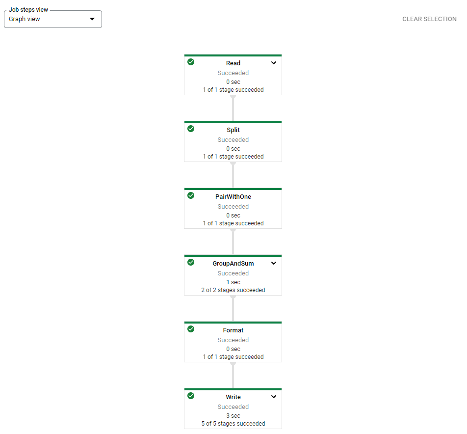

# Dataflow Python

## Setup

    $ gcloud auth list
    $ gcloud condig list project
    
## Create cloud storage Bucket

gcp > Cloud Storage > create Bucket

## Install pip

    $ python3 --version
    $ pip3 --version
    $ sudo pip3 install -U pip
    
## Create virtual Environment

    $ sudo pip3 install --upgrade virtualenv
    $ virtualenv -p python3.7 env
    $ source env/bin/activate
    
## Install Apache Beam

    $ pip install apache-beam[gcp]
    $ python -m apache_beam.examples.wordcount --output OUTPUT_FILE
    $ cat OUPUT_FILE
    
## Run Example Pipeline

Deactivate and activate Dataflow API to make this example run.

    $ BUCKET=gs://qwiklabs-gcp-00-4fea76ad544e
    $ python -m apache_beam.examples.wordcount --project $DEVSHELL_PROJECT_ID \
    --runner DataflowRunner \
    --staging_location $BUCKET/staging \
    --temp_location $BUCKET/temp \
    --output $BUCKET/results/output \
    --region us-central1
  
## Ceck Result

Check, if Pipeline is running: gcp > DataFlow

gcp > CloudStorage > Project > results

Check data: 
