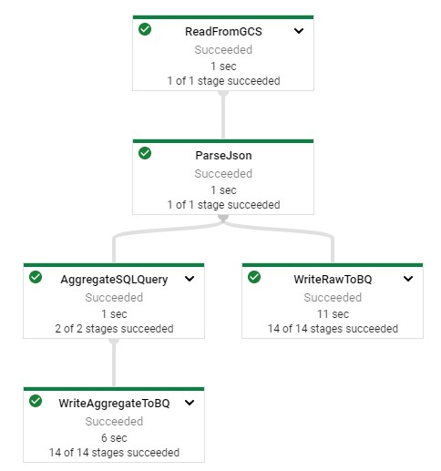
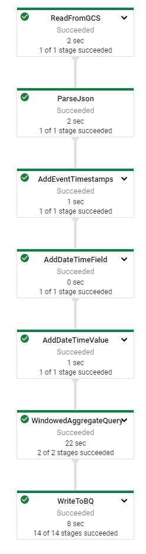
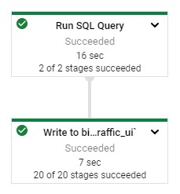
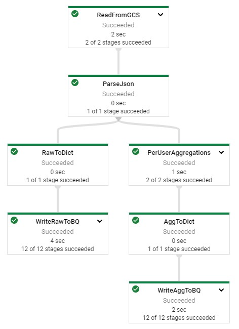
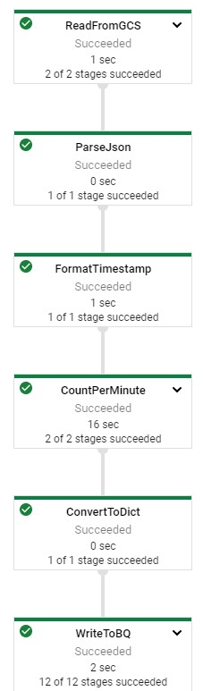
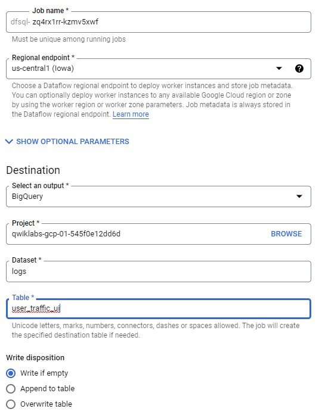
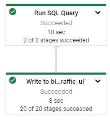

# Dataflow SQL Batch - Java

[Github Source](https://github.com/GoogleCloudPlatform/training-data-analyst/blob/master/quests/dataflow/4_SQL_Batch_Analytics/solution/src/main/java/com/mypackage/pipeline/BatchUserTrafficSQLPipeline.java)

## Initialize

    $ gcloud auth list
    $ gcloud config list project

### IDE

http://34.135.142.254:3000/#/home/project/training-data-analyst/quests/dataflow/

    ide $ cd 4_SQL_Batch_Analytics/labs
    ide $ mvn clean dependency:resolve
    ide $ export BASE_DIR=$(pwd)

### Create GCS buckets and BQ dataset

    ide $ cd $BASE_DIR/../..
    ide $ source create_batch_sinks.sh
    ide $ source generate_batch_events.sh
    ide $ cd $BASE_DIR
    
### Enable Datacatalog API

    ide $ gcloud services enable datacatalog.googleapis.com
    
## Add SQL Dependencies

pom.xml

    <dependency>
      <groupId>org.apache.beam</groupId>
      <artifactId>beam-sdks-java-extensions-sql</artifactId>
      <version>${beam.version}</version>
    </dependency>
    <dependency>
      <groupId>org.apache.beam</groupId>
      <artifactId>beam-sdks-java-extensions-sql-zetasql</artifactId>
      <version>${beam.version}</version>
    </dependency>
    
    ide $ mvn clean dependency:resolve

## Aggregate Traffic by User

BatchUserTrafficSQLPipeline.java

    import org.apache.beam.sdk.extensions.sql.impl.BeamSqlPipelineOptions;
    import org.apache.beam.sdk.extensions.sql.SqlTransform;    
    
    public interface Options extends PipelineOptions, BeamSqlPipelineOptions {
        // All existing options here
    }
    
    Options options = PipelineOptionsFactory.fromArgs(args)
                .withValidation()
                .as(Options.class);
        options.setPlannerName("org.apache.beam.sdk.extensions.sql.zetasql.ZetaSQLQueryPlanner");

### Implement SQL Transform aggregations

    PCollection<Row> filteredNames = testApps.apply(
    SqlTransform.query(
        "SELECT appId, description, rowtime "
        + "FROM PCOLLECTION "
        + "WHERE id=1"));
        
    aggregateField("user_id", Count.combineFn(), "pageviews")
                        .aggregateField("num_bytes", Sum.ofIntegers(), "total_bytes")
                        .aggregateField("num_bytes", Max.ofIntegers(), "max_num_bytes")
                        .aggregateField("num_bytes", Min.ofIntegers(), "min_num_bytes"))
                        
## Run Pipeline

    ide $ export PROJECT_ID=$(gcloud config get-value project)
    ide $ export REGION='us-central1'
    ide $ export BUCKET=gs://${PROJECT_ID}
    ide $ export PIPELINE_FOLDER=${BUCKET}
    ide $ export MAIN_CLASS_NAME=com.mypackage.pipeline.BatchUserTrafficSQLPipeline
    ide $ export RUNNER=DataflowRunner
    ide $ export INPUT_PATH=${PIPELINE_FOLDER}/events.json
    ide $ export AGGREGATE_TABLE_NAME=${PROJECT_ID}:logs.user_traffic
    ide $ export RAW_TABLE_NAME=${PROJECT_ID}:logs.raw
    ide $ cd $BASE_DIR
    ide $ mvn compile exec:java \
    -Dexec.mainClass=${MAIN_CLASS_NAME} \
    -Dexec.cleanupDaemonThreads=false \
    -Dexec.args=" \
    --project=${PROJECT_ID} \
    --region=${REGION} \
    --stagingLocation=${PIPELINE_FOLDER}/staging \
    --tempLocation=${PIPELINE_FOLDER}/temp \
    --runner=${RUNNER} \
    --inputPath=${INPUT_PATH} \
    --aggregateTableName=${AGGREGATE_TABLE_NAME} \
    --rawTableName=${RAW_TABLE_NAME}"

## Aggregate Traffic by Minute

### Add Timestamp

BatchMinuteTrafficSQLPipeline.java

    purchases.apply(AddFields.<PurchasePojo>create()
    .field("timeOfDaySeconds", FieldType.INT32)
    .field("shippingAddress.deliveryNotes", FieldType.STRING)
    .field("transactions.isFlagged", FieldType.BOOLEAN, false));
    
    // The input PCollection.
    PCollection<String> words = ...;
    // Apply a MapElements with an anonymous lambda function to the PCollection words.
    // Save the result as the PCollection wordLengths.
    PCollection<Integer> wordLengths = words.apply(
      MapElements.into(TypeDescriptors.integers())
                 .via((String word) -> word.length()));
  
    // The input PCollection.
    PCollection<String> words = ...;
    // Apply a MapElements with an anonymous lambda function to the PCollection words.
    // Save the result as the PCollection wordLengths.
    PCollection<Integer> wordLengths = words.apply(
      MapElements.via(new SimpleFunction<String, Integer> () {
          @Override
          public Row apply(String word) {
              return word.length();
          }
      }));
      
### Implement SQL Transformations

    SELECT COUNT(*) AS order_count, MAX(num_items) as max_items, tr.window_end AS hour
    FROM
        TUMBLE ( ( SELECT * FROM PCOLLECTION ),
        DESCRIPTOR(timestamp_joda), "INTERVAL 60 MINUTES" ) as tr
    GROUP BY tr.window_end

## Run Pipeline

    ide $ export PROJECT_ID=$(gcloud config get-value project)
    ide $ export REGION='us-central1'
    ide $ export BUCKET=gs://${PROJECT_ID}
    ide $ export PIPELINE_FOLDER=${BUCKET}
    ide $ export MAIN_CLASS_NAME=com.mypackage.pipeline.BatchMinuteTrafficSQLPipeline
    ide $ export RUNNER=DataflowRunner
    ide $ export INPUT_PATH=${PIPELINE_FOLDER}/events.json
    ide $ export TABLE_NAME=${PROJECT_ID}:logs.minute_traffic
    ide $ cd $BASE_DIR
    ide $ mvn compile exec:java \
    -Dexec.mainClass=${MAIN_CLASS_NAME} \
    -Dexec.cleanupDaemonThreads=false \
    -Dexec.args=" \
    --project=${PROJECT_ID} \
    --region=${REGION} \
    --stagingLocation=${PIPELINE_FOLDER}/staging \
    --tempLocation=${PIPELINE_FOLDER}/temp \
    --runner=${RUNNER} \
    --inputPath=${INPUT_PATH} \
    --tableName=${TABLE_NAME}"

## Check Results

    $ bq head -n 10 $PROJECT_ID:logs.minute_traffic
    
## Dataflow SQL UI

gcp > Dataflow > SQL Workspace
https://console.cloud.google.com/bigquery?qe=df

    SELECT
      user_id,
      COUNT(*) AS pageviews,
      SUM(num_bytes) AS total_bytes,
      MAX(num_bytes) AS max_num_bytes,
      MIN(num_bytes) AS min_num_bytes
    FROM
      `qwiklabs-gcp-00-563426a68528`.logs.raw
    GROUP BY
      user_id
      
Create Job

|Option|Value|
|-|-|
|Output|BigQuery|
|Dataset|logs|
|Table|user_traffic_ui|

# Dataflow SQL Batch - Python

## Initialize

    $ gcloud auth list
    $ gcloud config list project
    
## Aggregate Site Traffig by User

### Clone Project

    $ git clone https://github.com/GoogleCloudPlatform/training-data-analyst/
    $ cd ~/training-data-analyst/quests/dataflow_python/
    
    $ cd 4_SQL_Batch_Analytics/lab
    $ export BASE_DIR=$(pwd)
    
### Setup Virtual Environment

    $ sudo apt-get install -y python3-venv
    $ python3 -m venv df-env
    $ source df-env/bin/activate

### Install Packages

    $ python3 -m pip install -q --upgrade pip setuptools wheel
    $ python3 -m pip install apache-beam[gcp]
    
### Enable Dataflow API

    $ gcloud services enable dataflow.googleapis.com
    $ gcloud services enable datacatalog.googleapis.com
    
### Grant Dataflow Worker

    $ PROJECT_ID=$(gcloud config get-value project)
    $ export PROJECT_NUMBER=$(gcloud projects list --filter="$PROJECT_ID" --format="value(PROJECT_NUMBER)")
    $ export serviceAccount=""$PROJECT_NUMBER"-compute@developer.gserviceaccount.com"
    $ gcloud projects add-iam-policy-binding $PROJECT_ID --member="serviceAccount:${serviceAccount}" --role="roles/dataflow.worker"

### Setup Data Environment

    $ cd $BASE_DIR/../..
    $ source create_batch_sinks.sh
    $ source generate_batch_events.sh
    $ cd $BASE_DIR

## Aggregate Site Traffic by User

### Add SQL Dependencies

training-data-analyst/quests/dataflow_python/4_SQL_Batch_Analytics/lab/batch_user_traffic_SQL_pipeline.py

    from apache_beam.transforms.sql import SqlTransform
    
    SELECT user_id,
    COUNT(*) AS page_views, SUM(num_bytes) as total_bytes,
    MAX(num_bytes) AS max_bytes, MIN(num_bytes) as min_bytes
    FROM PCOLLECTION
    GROUP BY user_id
    
    logs | 'WriteRawToBQ' >> beam.io.WriteToBigQuery(
      raw_table_name,
      schema=raw_table_schema,
      create_disposition=beam.io.BigQueryDisposition.CREATE_IF_NEEDED,
      write_disposition=beam.io.BigQueryDisposition.WRITE_TRUNCATE
      )
    
    SqlTransform(query, dialect='zetasql')
    
### Run Pipeline

    $ export PROJECT_ID=$(gcloud config get-value project)
    $ export REGION='us-central1'
    $ export BUCKET=gs://${PROJECT_ID}
    $ export PIPELINE_FOLDER=${BUCKET}
    $ export RUNNER=DataflowRunner
    $ export INPUT_PATH=${PIPELINE_FOLDER}/events.json
    $ export TABLE_NAME=${PROJECT_ID}:logs.user_traffic
    $ export AGGREGATE_TABLE_NAME=${PROJECT_ID}:logs.user_traffic
    $ export RAW_TABLE_NAME=${PROJECT_ID}:logs.raw
    $ python3 batch_user_traffic_SQL_pipeline.py \
    --project=${PROJECT_ID} \
    --region=${REGION} \
    --staging_location=${PIPELINE_FOLDER}/staging \
    --temp_location=${PIPELINE_FOLDER}/temp \
    --runner=${RUNNER} \
    --experiments=use_runner_v2 \
    --input_path=${INPUT_PATH} \
    --agg_table_name=${AGGREGATE_TABLE_NAME} \
    --raw_table_name=${RAW_TABLE_NAME}
    
### Check Progress

gcp > Dataflow > jobs

## Aggregate Site Traffic by Minute

training-data-analyst/quests/dataflow_python/4_SQL_Batch_Analytics/lab/batch_minute_user_SQL_pipeline.py

    ts = datetime.strptime(element.ts[:-8], "%Y-%m-%dT%H:%M:%S")
    ts = datetime.strftime(ts, "%Y-%m-%d %H:%M:%S")

    SELECT
        COUNT(*) AS page_views,
        STRING(window_start) AS start_time
    FROM
        TUMBLE(
            (SELECT TIMESTAMP(ts) AS ts FROM PCOLLECTION),
            DESCRIPTOR(ts),
            'INTERVAL 1 MINUTE')
    GROUP BY window_start
    
    SqlTransform(query, dialect='zetasql')

### Run Pipeline

    $ export PROJECT_ID=$(gcloud config get-value project)
    $ export REGION='us-central1'
    $ export BUCKET=gs://${PROJECT_ID}
    $ export PIPELINE_FOLDER=${BUCKET}
    $ export RUNNER=DataflowRunner
    $ export INPUT_PATH=${PIPELINE_FOLDER}/events.json
    $ export TABLE_NAME=${PROJECT_ID}:logs.minute_traffic
    $ python3 batch_minute_traffic_SQL_pipeline.py \
    --project=${PROJECT_ID} \
    --region=${REGION} \
    --stagingLocation=${PIPELINE_FOLDER}/staging \
    --tempLocation=${PIPELINE_FOLDER}/temp \
    --runner=${RUNNER} \
    --inputPath=${INPUT_PATH} \
    --tableName=${TABLE_NAME} \
    --experiments=use_runner_v2
    

### Check Result

    $ bq head -n 10 $PROJECT_ID:logs.minute_traffic
    
## Dataflow SQL UI

Dataflow Jobs > SQL Workspace

    SELECT
      user_id,
      COUNT(*) AS pageviews,
      SUM(num_bytes) AS total_bytes,
      MAX(num_bytes) AS max_num_bytes,  
      MIN(num_bytes) AS min_num_bytes
    FROM
      bigquery.table.`qwiklabs-gcp-01-545f0e12dd6d`.logs.raw
    GROUP BY
      user_id

  

