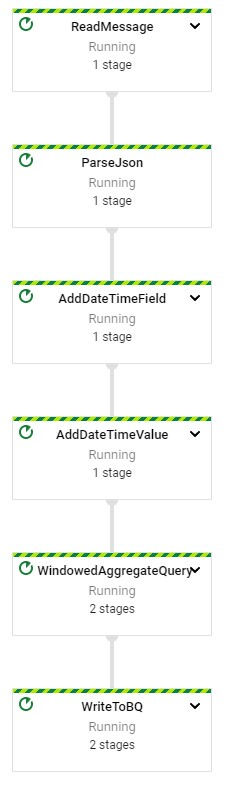
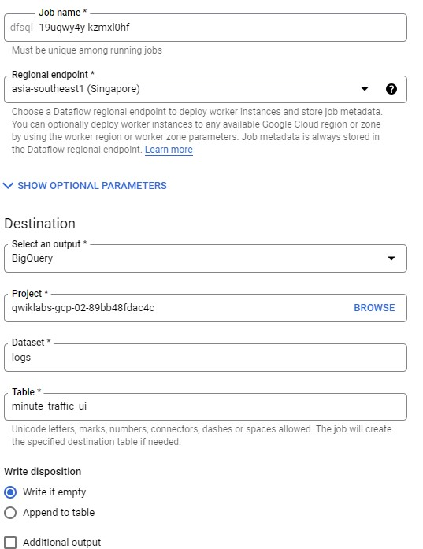
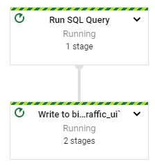
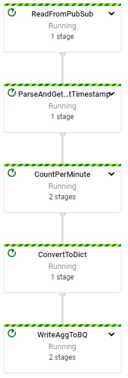
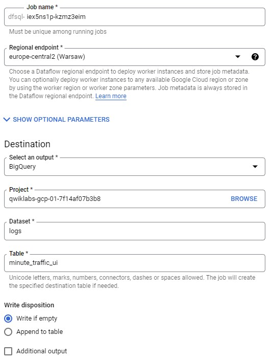
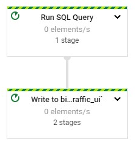

# Serverless Data Processing with Dataflow SQL - Java

## Aggregate Date using SQL

### IDE

http://35.239.141.124:3000/#/home/project/training-data-analyst/quests/dataflow/

    ide $ cd 6_SQL_Streaming_Analytics/labs
    ide $ mvn clean dependency:resolve
    ide $ export BASE_DIR=$(pwd)
    
    ide $ cd $BASE_DIR/../..
    ide $ source create_streaming_sinks.sh
    ide $ cd $BASE_DIR

### Read from Pubsub

labs/src/main/java/com/mypackage/pipeline/StreamingMinuteTrafficSQLPipeline.java

    SELECT COUNT(*) AS order_count, MAX(num_items) as max_items, tr.window_end AS hour
    FROM
        TUMBLE ( ( SELECT * FROM PCOLLECTION ),
        DESCRIPTOR(timestamp_joda), "INTERVAL 60 MINUTES" ) as tr
    GROUP BY tr.window_end
    
### Enable Dataflow API

    ide $ gcloud services enable dataflow.googleapis.com
    ide $ gcloud services enable datacatalog.googleapis.com
    
### Execute Pipeline

    ide $ export PROJECT_ID=$(gcloud config get-value project)
    ide $ export REGION='us-central1'
    ide $ export BUCKET=gs://${PROJECT_ID}
    ide $ export PIPELINE_FOLDER=${BUCKET}
    ide $ export MAIN_CLASS_NAME=com.mypackage.pipeline.StreamingMinuteTrafficSQLPipeline
    ide $ export RUNNER=DataflowRunner
    ide $ export PUBSUB_TOPIC=projects/${PROJECT_ID}/topics/my_topic
    ide $ export TABLE_NAME=${PROJECT_ID}:logs.minute_traffic
    ide $ cd $BASE_DIR
    ide $ mvn compile exec:java \
    -Dexec.mainClass=${MAIN_CLASS_NAME} \
    -Dexec.cleanupDaemonThreads=false \
    -Dexec.args=" \
    --project=${PROJECT_ID} \
    --region=${REGION} \
    --stagingLocation=${PIPELINE_FOLDER}/staging \
    --tempLocation=${PIPELINE_FOLDER}/temp \
    --runner=${RUNNER} \
    --inputTopic=${PUBSUB_TOPIC} \
    --tableName=${TABLE_NAME}"
    

### Generate lag-less Streaming Input

    $ cd ../../
    $ bash generate_streaming_events.sh
    
gcp > BigQuery

    SELECT * FROM logs.minute_traffic
    
## Aggregate Data Using Dataflow SQL

### Enable Dataflow Engine

    $ gcloud services enable dataflow.googleapis.com datacatalog.googleapis.com

### Add PubSub as Datasource in Data Catalog

    $ touch my_topic_schema.yaml
    
    - column: event_timestamp
      description: Pub/Sub event timestamp (Required by Dataflow SQL)
      mode: REQUIRED
      type: TIMESTAMP
    - column: user_id
      description: User ID
      mode: REQUIRED
      type: STRING
    - column: ip
      description: IP Address
      mode: REQUIRED
      type: STRING   
    - column: lat
      description: Latitude
      mode: NULLABLE
      type: FLOAT64
    - column: lng
      description: Longitude
      mode: NULLABLE
      type: FLOAT64
    - column: timestamp
      description: Network log timestamp
      mode: REQUIRED
      type: STRING
    - column: http_request
      description: HTTP request
      mode: REQUIRED
      type: STRING
    - column: user_agent
      description: User agent name
      mode: REQUIRED
      type: STRING
    - column: http_response
      description: HTTP response code
      mode: REQUIRED
      type: INT64
    - column: num_bytes
      description: Number of bytes in message
      mode: REQUIRED
      type: INT64

### Register my_topic in Data Catalog

    $ gcloud data-catalog entries update \
    --lookup-entry='pubsub.topic.`qwiklabs-gcp-02-89bb48fdac4c`.my_topic' \
    --schema-from-file=./my_topic_schema.yaml
    
    $ gcloud data-catalog entries lookup 'pubsub.topic.`qwiklabs-gcp-02-89bb48fdac4c`.my_topic'

### Write SQL Query

gcp > Dataflow > SQL Workspace

    SELECT * FROM pubsub.topic.`qwiklabs-gcp-02-89bb48fdac4c`.`my_topic`
    
  

### Generate Data

    ide $ cd ~/training-data-analyst/quests/dataflow/
    ide $ cd 6_SQL_Streaming_Analytics/lab
    ide $ export BASE_DIR=$(pwd)
    ide $ cd $BASE_DIR/../..
    ide $ bash generate_streaming_events.sh

### Check Data

gcp > BigQuery
    
# Serverless Data Processing with Dataflow SQL - Python

## Initialize

    $ gcloud auth list
    $ gcloud config list project
    
## Aggregate Streaming Site Traffic by Minute with SQL

### Prepare Environment

    $ git clone https://github.com/GoogleCloudPlatform/training-data-analyst/
    $ cd ~/training-data-analyst/quests/dataflow_python/
    
    $ cd 6_SQL_Streaming_Analytics/lab
    $ export BASE_DIR=$(pwd)

### Setup Virtual Environment

    $ sudo apt-get install -y python3-venv
    $ python3 -m venv df-env
    $ source df-env/bin/activate

### Install Packages

    $ python3 -m pip install -q --upgrade pip setuptools wheel
    $ python3 -m pip install apache-beam[gcp]
    
### Enable Dataflow API

    $ gcloud services enable dataflow.googleapis.com
    
### Grant Dataflow Wortker

    $ PROJECT_ID=$(gcloud config get-value project)
    $ export PROJECT_NUMBER=$(gcloud projects list --filter="$PROJECT_ID" --format="value(PROJECT_NUMBER)")
    $ export serviceAccount=""$PROJECT_NUMBER"-compute@developer.gserviceaccount.com"
    $ gcloud projects add-iam-policy-binding $PROJECT_ID --member="serviceAccount:${serviceAccount}" --role="roles/dataflow.worker"

### Setup Data Environment

    $ cd $BASE_DIR/../..
    $ source create_streaming_sinks.sh
    $ cd $BASE_DIR
    
### Read from PubSub

training-data-analyst/quest/dataflow_python/6_SQL_Streaming_Analytics/lab/streaming_minute_traffic_SQL_pipeline.py

    'ParseJson' >> beam.Map(parse_json)
    
    'GetEventTimestamp' >> beam.ParDo(GetEventTimestampFn())
    
    beam.io.ReadFromPubSub(input_topic)
    
    ParseAndGetEventTimestamp().with_output_types(CommonLog)
    
    SELECT
        COUNT(*) AS page_views,
        STRING(window_start) AS start_time
    FROM
        TUMBLE(
            (SELECT TIMESTAMP(event_timestamp) AS ts FROM PCOLLECTION),
            DESCRIPTOR(ts),
            'INTERVAL 1 MINUTE')
    GROUP BY window_start
    
### Execute Pipeline

    $ export PROJECT_ID=$(gcloud config get-value project)
    $ export REGION='us-central1'
    $ export BUCKET=gs://${PROJECT_ID}
    $ export PIPELINE_FOLDER=${BUCKET}
    $ export RUNNER=DataflowRunner
    $ export PUBSUB_TOPIC=projects/${PROJECT_ID}/topics/my_topic
    $ export TABLE_NAME=${PROJECT_ID}:logs.minute_traffic
    $ python3 streaming_minute_traffic_SQL_pipeline.py \
    --project=${PROJECT_ID} \
    --region=${REGION} \
    --staging_location=${PIPELINE_FOLDER}/staging \
    --temp_location=${PIPELINE_FOLDER}/temp \
    --runner=${RUNNER} \
    --input_topic=${PUBSUB_TOPIC} \
    --table_name=${TABLE_NAME} \
    --experiments=use_runner_v2

### Generate lag-less streaming Input

    $ cd training-data-analyst/quests/dataflow_python
    $ bash generate_streaming_events.sh

### Check Data

gcp > BigQuery

    SELECT * FROM logs.minute_traffic
    
## Create SQL Dataflow Pipeline from UI

### Enable Dataflow Engine

    $ gcloud services enable dataflow.googleapis.com datacatalog.googleapis.com

### Add PUbSub Topic to Data Catalog

    $ touch my_topic_schema.yaml
    
    - column: event_timestamp
      description: Pub/Sub event timestamp (Required by Dataflow SQL)
      mode: REQUIRED
      type: TIMESTAMP
    - column: user_id
      description: User ID
      mode: REQUIRED
      type: STRING
    - column: ip
      description: IP Address
      mode: REQUIRED
      type: STRING   
    - column: lat
      description: Latitude
      mode: NULLABLE
      type: FLOAT64
    - column: lng
      description: Longitude
      mode: NULLABLE
      type: FLOAT64
    - column: timestamp
      description: Network log timestamp
      mode: REQUIRED
      type: STRING
    - column: http_request
      description: HTTP request
      mode: REQUIRED
      type: STRING
    - column: user_agent
      description: User agent name
      mode: REQUIRED
      type: STRING
    - column: http_response
      description: HTTP response code
      mode: REQUIRED
      type: INT64
    - column: num_bytes
      description: Number of bytes in message
      mode: REQUIRED
      type: INT64
  
### Register Schema in Data Catalog

    $ gcloud data-catalog entries update \
    --lookup-entry='pubsub.topic.`qwiklabs-gcp-01-7f14af07b3b8`.my_topic' \
    --schema-from-file=./my_topic_schema.yaml
    
    $ gcloud data-catalog entries lookup 'pubsub.topic.`qwiklabs-gcp-01-7f14af07b3b8`.my_topic'

### Write Streaming Query

gcp > Dataflow > SQL Workspace

    SELECT * FROM pubsub.topic.`qwiklabs-gcp-01-7f14af07b3b8`.`my_topic`
    
  

  

### Generate Data

    $ cd ~/training-data-analyst/quests/dataflow_python/
    $ cd 6_SQL_Streaming_Analytics/lab
    $ export BASE_DIR=$(pwd)
    $ cd $BASE_DIR/../..
    $ bash generate_streaming_events.sh

### Check Result

gcp > BigQuery

    SELECT * FROM logs.minute_traffic_ui
