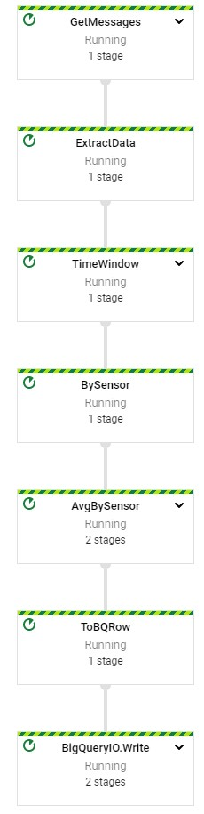
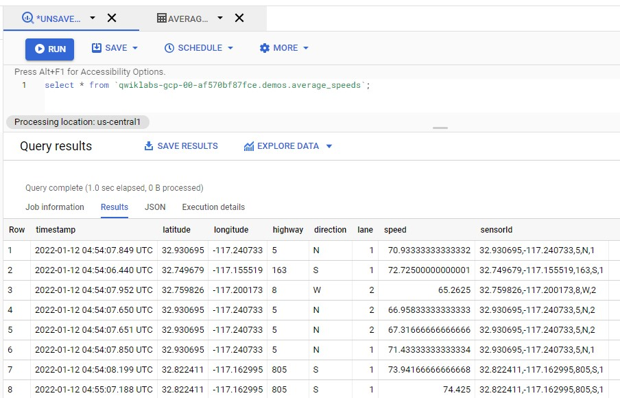
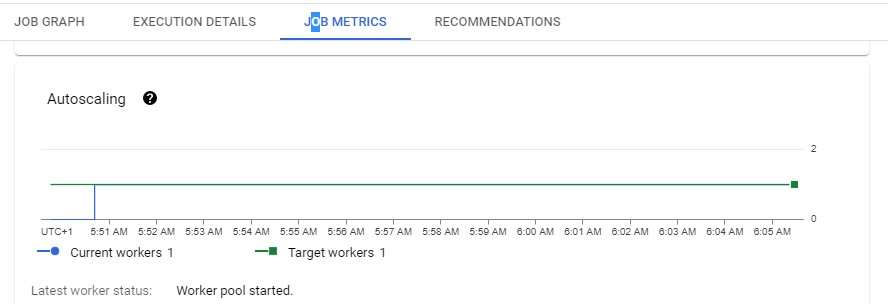
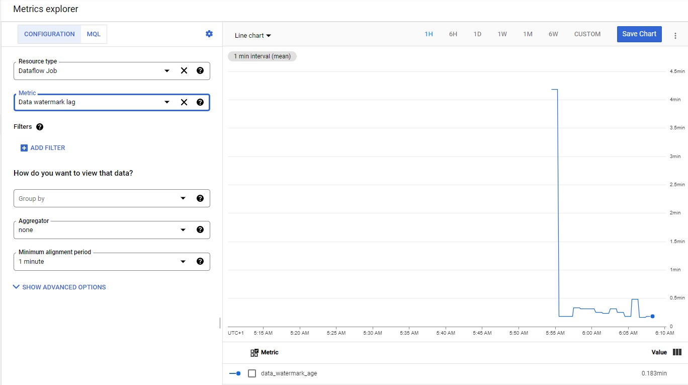
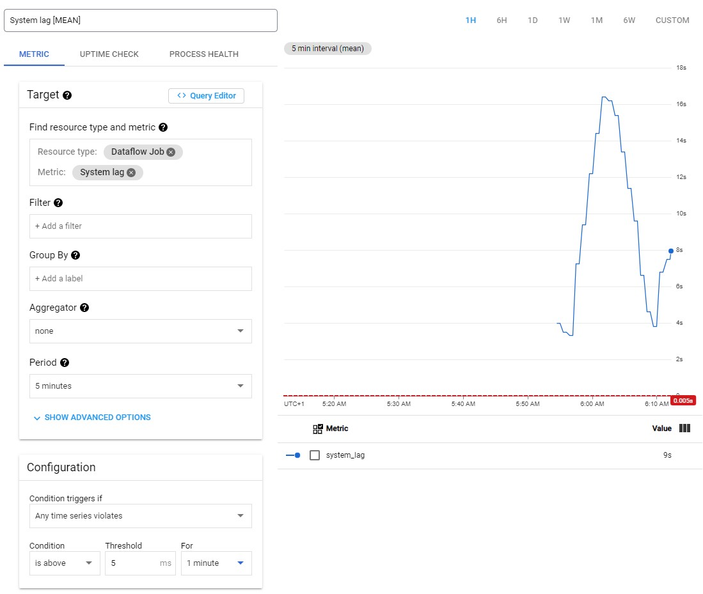
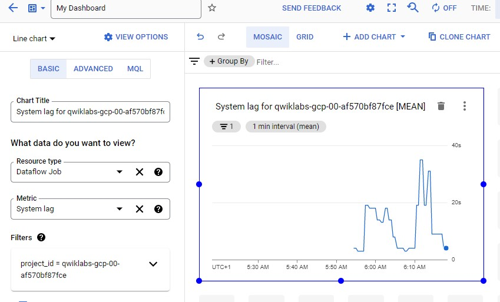
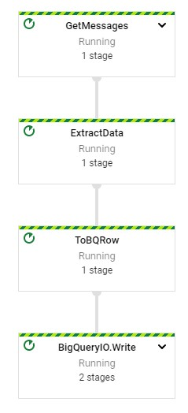

# Streaming Data Processing

## Initialize

gcp > Compute Engine > training-vm > ssh

    ssh1 $ ls /training
    ssh1 $ git clone https://github.com/GoogleCloudPlatform/training-data-analyst
    ssh1 $ source /training/project_env.sh

## Create BigQuery Dataset

gcp > BigQuery > Create Dataset > demos

## Create Cloud Storage Bucket

gcp > Cloud Storage

## Simulate Traffic Sensor Data

    ssh1 $ /training/sensor_magic.sh
    
gcp > Compute Engine > training-vm > ssh

    ssh2 $ source /training/project_env.sh
    
## Launch Dataflow Pipeline

gcp > APIs > Dataflow API > Disable API  
gcp > APIs > Dataflow API > Enable  

    ssh2 $ cd ~/training-data-analyst/courses/streaming/process/sandiego
    ssh2 $ cat run_oncloud.sh
    
    #!/bin/bash
    if [ "$#" -lt 3 ]; then
       echo "Usage:   ./run_oncloud.sh project-name bucket-name classname [options] "
       echo "Example: ./run_oncloud.sh cloud-training-demos cloud-training-demos CurrentConditions --bigtable"
       exit
    fi
    PROJECT=$1
    shift
    BUCKET=$1
    shift
    MAIN=com.google.cloud.training.dataanalyst.sandiego.$1
    shift
    echo "Launching $MAIN project=$PROJECT bucket=$BUCKET $*"
    export PATH=/usr/lib/jvm/java-8-openjdk-amd64/bin/:$PATH
    mvn compile -e exec:java \
     -Dexec.mainClass=$MAIN \
          -Dexec.args="--project=$PROJECT \
          --stagingLocation=gs://$BUCKET/staging/ $* \
          --tempLocation=gs://$BUCKET/staging/ \
          --runner=DataflowRunner"
    # If you run into quota problems, add this option the command line above
    #     --maxNumWorkers=2 
    # In this case, you will not be able to view autoscaling, however.
    
[Gihub](https://github.com/GoogleCloudPlatform/training-data-analyst/blob/master/courses/streaming/process/sandiego/run_oncloud.sh)

    ssh2 $ cd ~/training-data-analyst/courses/streaming/process/sandiego/src/main/java/com/google/cloud/training/dataanalyst/sandiego
    ssh2 $ cat AverageSpeeds.java
    
    package com.google.cloud.training.dataanalyst.sandiego;
    
    import java.util.ArrayList;
    import java.util.List;
    import org.apache.beam.runners.dataflow.options.DataflowPipelineOptions;
    import org.apache.beam.sdk.Pipeline;
    import org.apache.beam.sdk.io.gcp.pubsub.PubsubIO;
    import org.apache.beam.sdk.io.gcp.bigquery.BigQueryIO;
    import org.apache.beam.sdk.options.Default;
    import org.apache.beam.sdk.options.Description;
    import org.apache.beam.sdk.options.PipelineOptionsFactory;
    import org.apache.beam.sdk.transforms.DoFn;
    import org.apache.beam.sdk.transforms.Mean;
    import org.apache.beam.sdk.transforms.ParDo;
    import org.apache.beam.sdk.transforms.windowing.SlidingWindows;
    import org.apache.beam.sdk.transforms.windowing.Window;
    import org.apache.beam.sdk.values.KV;
    import org.apache.beam.sdk.values.PCollection;
    import org.joda.time.Duration;
    import org.joda.time.Instant;
    import com.google.api.services.bigquery.model.TableFieldSchema;
    import com.google.api.services.bigquery.model.TableRow;
    import com.google.api.services.bigquery.model.TableSchema;
    /**
     * A dataflow pipeline that computes average speeds in each lane
     * 
     * @author vlakshmanan
     *
     */
    public class AverageSpeeds {
    
      public static interface MyOptions extends DataflowPipelineOptions {
        @Description("Over how long a time period should we average? (in minutes)")
        @Default.Double(60.0)
        Double getAveragingInterval();
        void setAveragingInterval(Double d);
        @Description("Simulation speedup factor. Use 1.0 if no speedup")
        @Default.Double(60.0)
        Double getSpeedupFactor();
        void setSpeedupFactor(Double d);
      }
      
      @SuppressWarnings("serial")
      
      public static void main(String[] args) {
        MyOptions options = PipelineOptionsFactory.fromArgs(args).withValidation().as(MyOptions.class);
        options.setStreaming(true);
        
        Pipeline p = Pipeline.create(options);
        String topic = "projects/" + options.getProject() + "/topics/sandiego";
        String avgSpeedTable = options.getProject() + ":demos.average_speeds";
        
        // if we need to average over 60 minutes and speedup is 30x
        // then we need to average over 2 minutes of sped-up stream
        Duration averagingInterval = Duration.millis(Math.round(1000 * 60 * (options.getAveragingInterval() / options.getSpeedupFactor())));
        Duration averagingFrequency = averagingInterval.dividedBy(2); // 2 times
        // in
        // window
        System.out.println("Averaging interval = " + averagingInterval);
        System.out.println("Averaging freq = " + averagingFrequency);
        
        // Build the table schema for the output table.
        List<TableFieldSchema> fields = new ArrayList<>();
        fields.add(new TableFieldSchema().setName("timestamp").setType("TIMESTAMP"));
        fields.add(new TableFieldSchema().setName("latitude").setType("FLOAT"));
        fields.add(new TableFieldSchema().setName("longitude").setType("FLOAT"));
        fields.add(new TableFieldSchema().setName("highway").setType("STRING"));
        fields.add(new TableFieldSchema().setName("direction").setType("STRING"));
        fields.add(new TableFieldSchema().setName("lane").setType("INTEGER"));
        fields.add(new TableFieldSchema().setName("speed").setType("FLOAT"));
        fields.add(new TableFieldSchema().setName("sensorId").setType("STRING"));
        TableSchema schema = new TableSchema().setFields(fields);
        
        PCollection<LaneInfo> currentConditions = p //
            .apply("GetMessages", PubsubIO.readStrings().fromTopic(topic)) //
            .apply("ExtractData", ParDo.of(new DoFn<String, LaneInfo>() {
              @ProcessElement
              public void processElement(ProcessContext c) throws Exception {
                String line = c.element();
                c.output(LaneInfo.newLaneInfo(line));
              }
            }));
            
        PCollection<KV<String, Double>> avgSpeed = currentConditions //
            .apply("TimeWindow",
                Window.into(SlidingWindows//
                    .of(averagingInterval)//
                    .every(averagingFrequency))) //
            .apply("BySensor", ParDo.of(new DoFn<LaneInfo, KV<String, Double>>() {
              @ProcessElement
              public void processElement(ProcessContext c) throws Exception {
                LaneInfo info = c.element();
                String key = info.getSensorKey();
                Double speed = info.getSpeed();
                c.output(KV.of(key, speed));
              }
            })) //
            .apply("AvgBySensor", Mean.perKey());
        
        avgSpeed.apply("ToBQRow", ParDo.of(new DoFn<KV<String, Double>, TableRow>() {
          @ProcessElement
          public void processElement(ProcessContext c) throws Exception {
            TableRow row = new TableRow();
            String stationKey = c.element().getKey();
            Double speed = c.element().getValue();
            String line = Instant.now().toString() + "," + stationKey + "," + speed; // CSV
            LaneInfo info = LaneInfo.newLaneInfo(line);
            row.set("timestamp", info.getTimestamp());
            row.set("latitude", info.getLatitude());
            row.set("longitude", info.getLongitude());
            row.set("highway", info.getHighway());
            row.set("direction", info.getDirection());
            row.set("lane", info.getLane());
            row.set("speed", info.getSpeed());
            row.set("sensorId", info.getSensorKey());
            c.output(row);
          }
        })) //
        
            .apply(BigQueryIO.writeTableRows().to(avgSpeedTable)//
                .withSchema(schema)//
                .withWriteDisposition(BigQueryIO.Write.WriteDisposition.WRITE_APPEND)
                .withCreateDisposition(BigQueryIO.Write.CreateDisposition.CREATE_IF_NEEDED));
        p.run();
      }
    }
    
    ssh2 $ cd ~/training-data-analyst/courses/streaming/process/sandiego
    ssh2 $ ./run_oncloud.sh $DEVSHELL_PROJECT_ID $BUCKET AverageSpeeds

## Explore Pipeline

gcp > Dataflow > Pipeline  

  

gcp > Pub/Sub Topics > sandiego  

gcp > BigQuery > Project > demos > average_speeds  

  

## Determine Throughput Speeds

gcp > Dataflow > Pipeilne > GetMessages  

  

## Analyze BigQuery

gcp > BigQuery > Project > demos > average_speeds  

    SELECT *
    FROM `demos.average_speeds`
    ORDER BY timestamp DESC
    LIMIT 100;
    
    SELECT
    MAX(timestamp)
    FROM
    `demos.average_speeds`;
    
    SELECT *
    FROM `demos.average_speeds`
    FOR SYSTEM_TIME AS OF TIMESTAMP_SUB(CURRENT_TIMESTAMP, INTERVAL 10 MINUTE)
    ORDER BY timestamp DESC
    LIMIT 100;
    
## Autoscaling

gcp > Dataflow > Job > Recource Metrics > Autoscaling  
    

## Refresh Sensor Data Script

    ssh1 $ cd ~/training-data-analyst/courses/streaming/publish
    ssh1 $ ./send_sensor_data.py --speedFactor=60 --project $DEVSHELL_PROJECT_ID
    
## Cloud Monitoring Integration

gcp > Monitoring > Metrics Explorer

## Create Alerts

gcp > Monitoring > Alerting > Create Policy  

## Dashboard

gcp > Monitoring > Dashboards > Create Dashboard

## Launch Another Straming Pipeline

    ssh1 $ cd ~/training-data-analyst/courses/streaming/process/sandiego/src/main/java/com/google/cloud/training/dataanalyst/sandiego
    ssh1 $ cat CurrentConditions.java
    
    package com.google.cloud.training.dataanalyst.sandiego;
    import java.util.ArrayList;
    import java.util.List;
    import org.apache.beam.runners.dataflow.options.DataflowPipelineOptions;
    import org.apache.beam.sdk.Pipeline;
    import org.apache.beam.sdk.io.gcp.bigquery.BigQueryIO;
    import org.apache.beam.sdk.io.gcp.pubsub.PubsubIO;
    import org.apache.beam.sdk.options.Default;
    import org.apache.beam.sdk.options.Description;
    import org.apache.beam.sdk.options.PipelineOptionsFactory;
    import org.apache.beam.sdk.transforms.DoFn;
    import org.apache.beam.sdk.transforms.ParDo;
    import org.apache.beam.sdk.values.PCollection;
    import com.google.api.services.bigquery.model.TableFieldSchema;
    import com.google.api.services.bigquery.model.TableRow;
    import com.google.api.services.bigquery.model.TableSchema;
    /**
     * A dataflow pipeline that pulls from Pub/Sub and writes to BigQuery
     * 
     * @author vlakshmanan
     *
     */
     
    @SuppressWarnings("serial")
    
    public class CurrentConditions {
    
      public static interface MyOptions extends DataflowPipelineOptions {
        @Description("Also stream to Bigtable?")
        @Default.Boolean(false)
        boolean getBigtable();
        void setBigtable(boolean b);
      }
      
      public static void main(String[] args) {
        MyOptions options = PipelineOptionsFactory.fromArgs(args).withValidation().as(MyOptions.class);
        options.setStreaming(true);
        Pipeline p = Pipeline.create(options);
        String topic = "projects/" + options.getProject() + "/topics/sandiego";
        String currConditionsTable = options.getProject() + ":demos.current_conditions";
        // Build the table schema for the output table.
        List<TableFieldSchema> fields = new ArrayList<>();
        fields.add(new TableFieldSchema().setName("timestamp").setType("TIMESTAMP"));
        fields.add(new TableFieldSchema().setName("latitude").setType("FLOAT"));
        fields.add(new TableFieldSchema().setName("longitude").setType("FLOAT"));
        fields.add(new TableFieldSchema().setName("highway").setType("STRING"));
        fields.add(new TableFieldSchema().setName("direction").setType("STRING"));
        fields.add(new TableFieldSchema().setName("lane").setType("INTEGER"));
        fields.add(new TableFieldSchema().setName("speed").setType("FLOAT"));
        fields.add(new TableFieldSchema().setName("sensorId").setType("STRING"));
        TableSchema schema = new TableSchema().setFields(fields);
        PCollection<LaneInfo> currentConditions = p //
            .apply("GetMessages", PubsubIO.readStrings().fromTopic(topic)) //
            .apply("ExtractData", ParDo.of(new DoFn<String, LaneInfo>() {
              @ProcessElement
              public void processElement(ProcessContext c) throws Exception {
                String line = c.element();
                c.output(LaneInfo.newLaneInfo(line));
              }
            }));
        if (options.getBigtable()) {
          BigtableHelper.writeToBigtable(currentConditions, options);
        }
        currentConditions.apply("ToBQRow", ParDo.of(new DoFn<LaneInfo, TableRow>() {
          @ProcessElement
          public void processElement(ProcessContext c) throws Exception {
            TableRow row = new TableRow();
            LaneInfo info = c.element();
            row.set("timestamp", info.getTimestamp());
            row.set("latitude", info.getLatitude());
            row.set("longitude", info.getLongitude());
            row.set("highway", info.getHighway());
            row.set("direction", info.getDirection());
            row.set("lane", info.getLane());
            row.set("speed", info.getSpeed());
            row.set("sensorId", info.getSensorKey());
            c.output(row);
          }
        })) //
            .apply(BigQueryIO.writeTableRows().to(currConditionsTable)//
                .withSchema(schema)//
                .withWriteDisposition(BigQueryIO.Write.WriteDisposition.WRITE_APPEND)
                .withCreateDisposition(BigQueryIO.Write.CreateDisposition.CREATE_IF_NEEDED));
        p.run();
      }
    }
    
 [Github](https://github.com/GoogleCloudPlatform/training-data-analyst/blob/master/courses/streaming/process/sandiego/src/main/java/com/google/cloud/training/dataanalyst/sandiego/CurrentConditions.java)
 
    ssh1 $ cd ~/training-data-analyst/courses/streaming/process/sandiego
    ssh1 $ ./run_oncloud.sh $DEVSHELL_PROJECT_ID $BUCKET CurrentConditions
    
gcp > Dataflow  

gcp > BigQuery > Project > demos > current_conditions  

