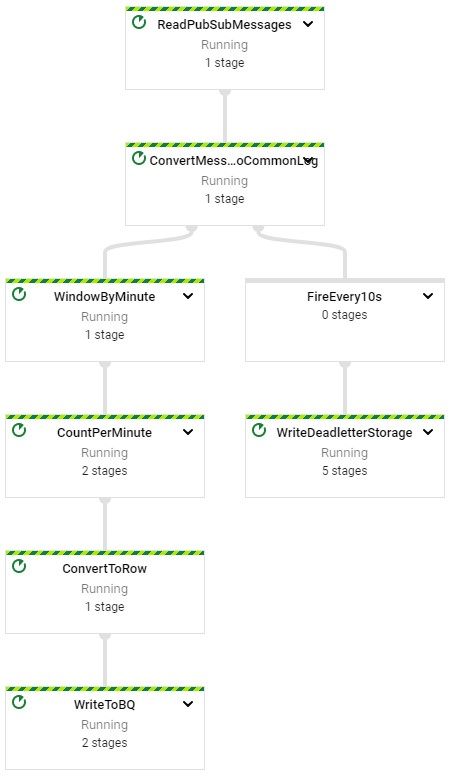

# Dataflow Streaming Advanced - Java

## Initialize

IDE > http://35.202.158.182:3000/#/home/project/training-data-analyst/quests/dataflow/

### Open Lab

    $ cd 7_Advanced_Streaming_Analytics/labs
    $ mvn clean dependency:resolve
    $ export BASE_DIR=$(pwd)

### Setup Environment

    $ cd $BASE_DIR/../..
    $ source create_streaming_sinks.sh
    $ cd $BASE_DIR

## Create ETL Pipeline

### Deal With the Data
    
    commonLogs
       .apply("WindowCommonLogs",
               Window.into(
                       FixedWindows.of(
                       Duration.standardMinutes(
                       options.getWindowDuration()))))
       .apply("CountEventsPerWindow",
            Combine.globally(
            Count.<CommonLog>combineFn()).withoutDefaults());

#### Set Allowed Lateness

    
    PCollection<String> items = ...;
    PCollection<String> windowed_items = items.apply(
        Window.<String>into(FixedWindows.of(Duration.standardMinutes(1)))
        .withAllowedLateness(Duration.standardDays(1)));

#### Set Trigger

    
    PCollection<String> pc = ...;
    pc.apply(Window.<String>into(FixedWindows.of(1, TimeUnit.MINUTES))
        .triggering(AfterProcessingTime.pastFirstElementInPane()
        .plusDelayOf(Duration.standardMinutes(1))
        .discardingFiredPanes());
        
### Deal with Malformed Data

#### Collect Malformed Data

    PCollection<String> pc1 = ...;
    PCollection<Integer> pc2 = ...;
    TupleTag<String> tag1 = new TupleTag<>();
    TupleTag<Integer> tag2 = new TupleTag<>();
    PCollectionTuple pcs =
         PCollectionTuple.of(tag1, pc1)
                         .and(tag2, pc2);
    PCollection<Integer> pcX = pcs.get(tag1);
    PCollection<String> pcY = pcs.get(tag2);
    
    final TupleTag<String> aTag = new TupleTag<String>(){};
    final TupleTag<String> bTag = new TupleTag<String>(){};
    PCollectionTuple mixedCollection =
        input.apply(ParDo
            .of(new DoFn<String, String>() {
              @ProcessElement
              public void processElement(ProcessContext c) {
                if (c.element().startsWith("A")) {
                  // Emit to main output, which is the output with tag aTag.
                  c.output(c.element());
                } else if(c.element().startsWith("B")) {
                  // Emit to output with tag bTag.
                  c.output(bTag, c.element());
                }
              }
            })
            // Specify main output. In this example, it is the output
            // with tag startsWithATag.
            .withOutputTags(aTag,
            // Specify the output with tag bTag, as a TupleTagList.
                            TupleTagList.of(bTag)));
    // Get subset of the output with tag bTag.
    mixedCollection.get(aTag).apply(...);
    // Get subset of the output with tag startsWithBTag.
    mixedCollection.get(bTag).apply(...);
    
    static class MyCompositeTransform
      extends PTransform<PCollection<String>, PCollection<Integer>> {
      ...
    }
    
    static class MyCompositeTransform
      extends PTransform<PCollection<String>, PCollection<Integer>> {
        @Override
        public PCollection<Integer> expand(PCollection<String>) {
          ...
          // transform logic goes here
          ...
        }
    }
    
    PCollection<Integer> i = stringPColl.apply("CompositeTransform", new MyCompositeTransform());

#### Write Malformed Data for Later Analysis

    pCollection.apply("FireEvery10s",
       Window.<String>configure()
               .triggering(Repeatedly.forever(
                        AfterProcessingTime.pastFirstElementInPane()
                                .plusDelayOf(Duration.standardSeconds(10))))
               .discardingFiredPanes())
               
    fixedWindowedItems.apply(
      "WriteWindowedPCollection",
      TextIO
         .write()
         .to("gs://path/to/somewhere")
         .withWindowedWrites()
         .withNumShards(NUM_SHARDS));
         
## Run Pipeline

    $ export PROJECT_ID=$(gcloud config get-value project)
    $ export REGION='us-central1'
    $ export BUCKET=gs://${PROJECT_ID}
    $ export PIPELINE_FOLDER=${BUCKET}
    $ export MAIN_CLASS_NAME=com.mypackage.pipeline.StreamingMinuteTrafficPipeline
    $ export RUNNER=DataflowRunner
    $ export PUBSUB_TOPIC=projects/${PROJECT_ID}/topics/my_topic
    $ export WINDOW_DURATION=60
    $ export ALLOWED_LATENESS=1
    $ export OUTPUT_TABLE_NAME=${PROJECT_ID}:logs.minute_traffic
    $ export DEADLETTER_BUCKET=${BUCKET}
    $ cd $BASE_DIR
    $ mvn compile exec:java \
    -Dexec.mainClass=${MAIN_CLASS_NAME} \
    -Dexec.cleanupDaemonThreads=false \
    -Dexec.args=" \
    --project=${PROJECT_ID} \
    --region=${REGION} \
    --stagingLocation=${PIPELINE_FOLDER}/staging \
    --tempLocation=${PIPELINE_FOLDER}/temp \
    --runner=${RUNNER} \
    --inputTopic=${PUBSUB_TOPIC} \
    --windowDuration=${WINDOW_DURATION} \
    --allowedLateness=${ALLOWED_LATENESS} \
    --outputTableName=${OUTPUT_TABLE_NAME} \
    --deadletterBucket=${DEADLETTER_BUCKET}"

## Create Streaming Events

    $ cd $BASE_DIR/../..
    $ bash generate_streaming_events.sh true

# Dataflow Streaming Advanced - Python

## Initialize

    $ gcloud auth list
    $ gcloud config list project
    
### Open Lab
    
    $ git clone https://github.com/GoogleCloudPlatform/training-data-analyst/
    $ cd ~/training-data-analyst/quests/dataflow_python/
    
    $ cd 7_Advanced_Streaming_Analytics/lab
    $ export BASE_DIR=$(pwd)

### Setup Virtual Environment

    $ sudo apt-get install -y python3-venv
    $ python3 -m venv df-env
    $ source df-env/bin/activate
    
### Install Packages

    $ python3 -m pip install -q --upgrade pip setuptools wheel
    $ python3 -m pip install apache-beam[gcp]
    
### Enable Dataflow API

    $ gcloud services enable dataflow.googleapis.com
    
### Grant Dataflow.worker

    $ PROJECT_ID=$(gcloud config get-value project)
    $ export PROJECT_NUMBER=$(gcloud projects list --filter="$PROJECT_ID" --format="value(PROJECT_NUMBER)")
    $ export serviceAccount=""$PROJECT_NUMBER"-compute@developer.gserviceaccount.com"
    $ gcloud projects add-iam-policy-binding $PROJECT_ID --member="serviceAccount:${serviceAccount}" --role="roles/dataflow.worker"
    
### Setup Data Environment

    $ cd $BASE_DIR/../../
    $ source create_streaming_sinks.sh
    $ cd $BASE_DIR

## Create ETL Pipeline

### Deal with Late Data

    parsed_msgs
        | "WindowByMinute" >> beam.WindowInto(beam.window.FixedWindows(window_duration))
        | "CountPerMinute" >> beam.CombineGlobally(CountCombineFn()).without_defaults()

### Set Allowed Lateness

streaming_minute_traffic_pipeline.py
    
    items = p | ...
    Windowed_items = items | beam.WindowInto(beam.window.FixedWindows(60), # 1 minute
                                             trigger=AfterWatermark(),
                                             allowed_lateness=60*60*24) # 1 day

### Set a Trigger

    
    items = p | ...
    windowed_items = items | beam.WindowInto(FixedWindows(60), # 1 minute
                                             trigger=AfterProcessingTime(60),
                                             accumulation_mode=AccumulationMode.DISCARDING)

    trigger=AfterProcessingTime(120),
    accumulation_mode=AccumulationMode.DISCARDING)
    
    trigger=AfterWatermark(late=AfterCount(1)),
    allowed_lateness=int(allowed_lateness),
    accumulation_mode=AccumulationMode.ACCUMULATING)
    
### Collect Malformed Data

    
    class ConvertToCommonLogFn(beam.DoFn):
    def process(self, element):
      try:
          row = json.loads(element.decode('utf-8'))
          yield beam.pvalue.TaggedOutput('parsed_row', CommonLog(**row))
      except:
          yield beam.pvalue.TaggedOutput('unparsed_row', element.decode('utf-8'))
    …
    rows = (p | 'ReadFromPubSub' >> beam.io.ReadFromPubSub(input_topic)
                  | 'ParseJson' >> beam.ParDo(ConvertToCommonLogFn()).with_outputs('parsed_row', 'unparsed_row')
                                                                     .with_output_types(CommonLog))
    (rows.unparsed_row | …
    (rows.parsed_row | …
    
    beam.pvalue.TaggedOutput('parsed_row', CommonLog(**row))
    
    beam.pvalue.TaggedOutput('unparsed_row', element.decode('utf-8'))
    
### Write Malformed Data for later Analysis

    pcollection | “FireEvery10s” >> WindowInto(FixedWindows(10)
                                               trigger=AfterProcessingTime(10))
                                               accumulation_mode=AccumulationMode.DISCARDING   
    
    windowed_items = p | 'WriteWindowedPCollection' >> fileio.WriteToFiles("gs://path/to/somewhere",
    shards=int(num_shards),
    max_writers_per_bundle=0)
    
    fileio.WriteToFiles(output_path,shards=1,max_writers_per_bundle=0)
    
[Github Source Code](https://github.com/GoogleCloudPlatform//training-data-analyst/tree/master/quests/dataflow_python/7_Advanced_Streaming_Analytics/solution)
    
## Run Pipeline

    $ export PROJECT_ID=$(gcloud config get-value project)
    $ export REGION='us-central1'
    $ export BUCKET=gs://${PROJECT_ID}
    $ export PIPELINE_FOLDER=${BUCKET}
    $ export RUNNER=DataflowRunner
    $ export PUBSUB_TOPIC=projects/${PROJECT_ID}/topics/my_topic
    $ export WINDOW_DURATION=60
    $ export ALLOWED_LATENESS=1
    $ export OUTPUT_TABLE_NAME=${PROJECT_ID}:logs.minute_traffic
    $ export DEADLETTER_BUCKET=${BUCKET}
    $ cd $BASE_DIR
    $ python3 streaming_minute_traffic_pipeline.py \
    --project=${PROJECT_ID} \
    --region=${REGION} \
    --staging_location=${PIPELINE_FOLDER}/staging \
    --temp_location=${PIPELINE_FOLDER}/temp \
    --runner=${RUNNER} \
    --input_topic=${PUBSUB_TOPIC} \
    --window_duration=${WINDOW_DURATION} \
    --allowed_lateness=${ALLOWED_LATENESS} \
    --table_name=${OUTPUT_TABLE_NAME} \
    --dead_letter_bucket=${DEADLETTER_BUCKET}

