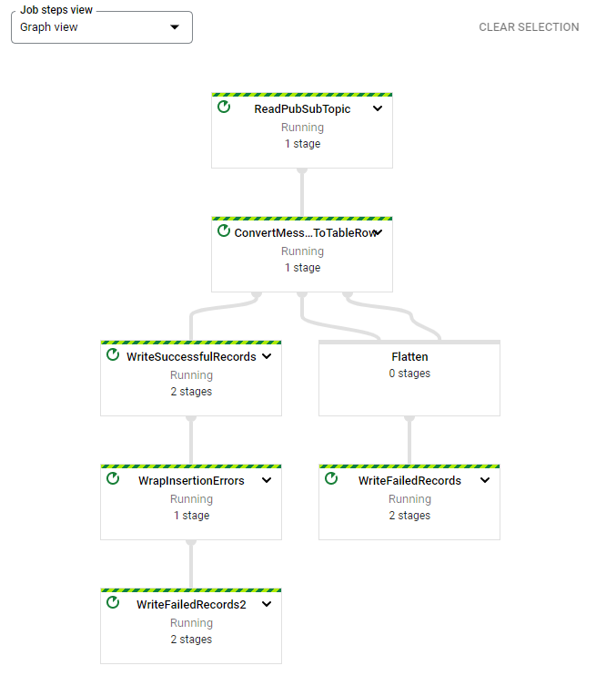

# Dataflow

## Cloud Shell

    $ gcloud auth list
    $ gcloud config list project

## Enable Dataflow API

Check, if dataflow API is enabled. Search: "Dataflow API"  

gcp > API > Dataflow API > Disable > Enable

## Option 1: Shell

### Create BigQuery Dataset and Table

    $ bq mk taxirides

Instantianate table

    $ bq mk \
    --time_partitioning_field timestamp \
    --schema ride_id:string,point_idx:integer,latitude:float,longitude:float,\
    timestamp:timestamp,meter_reading:float,meter_increment:float,ride_status:string,\
    passenger_count:integer -t taxirides.realtime
    
 ### Create Storage Bucket
 
    $ export BUCKET_NAME=qwiklabs-gcp-01-0ea5e8eb4c32
    $ gsutil mb gs://$BUCKET_NAME/

## Option 2: Cloud Console

### Create BigQuery Dataset and Table (Cloud Console)

gcp > Big Data > Big Query > Project > create Dataset  
Dataset > create table  

### Create Storage Bucket

gcp > Cloud Storage > Create Bucket

## Run Pipeline

gcp > Big Data > Dataflow > Create Job from Template > Pub/Sub Topic to BigQuery  

|Parameter|Value|
|-|-|
|Input Pub/Sub Topic|projects/pubsub-public-data/topics/taxirides-realtime|
|BigGuery output Table|qwiklabs-gcp-01-0ea5e8eb4c32:taxirides.realtime|
|Temporary Location|gs://qwiklabs-gcp-01-0ea5e8eb4c32/temp|

## Check Data

gcp > BigQuery

    select * from `qwiklabs-gcp-01-0ea5e8eb4c32.taxirides.realtime` limit 1000;
    

