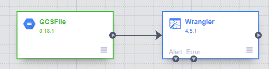
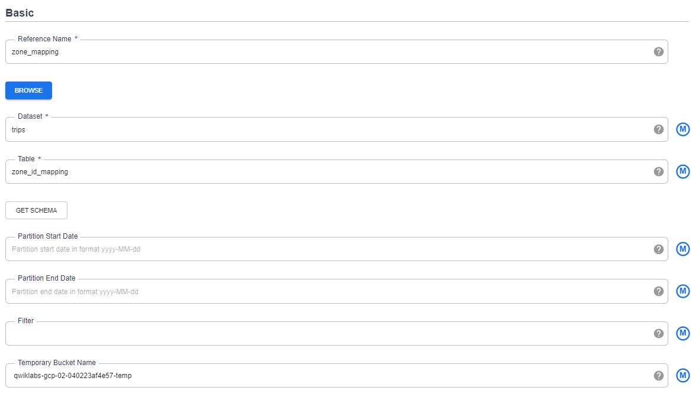
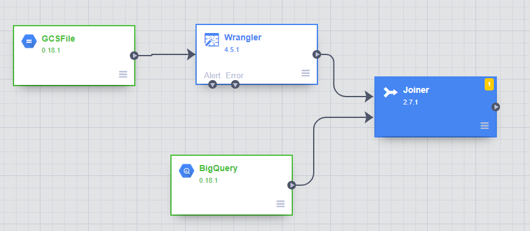
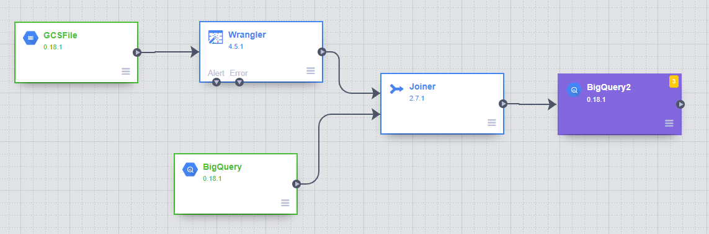
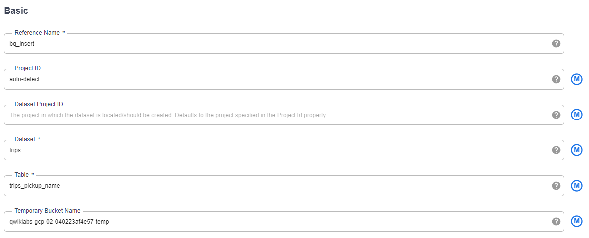
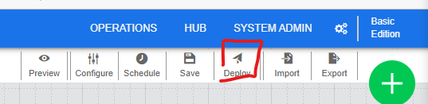
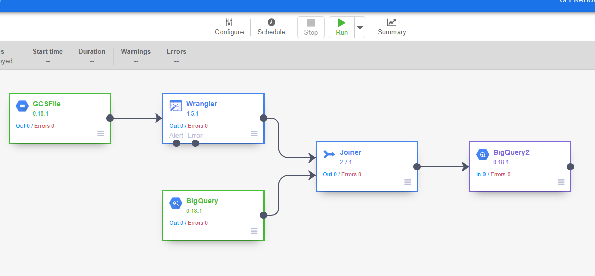

# Cloud Data Fusion

## Initialize

    $ gcloud auth list
    $ gcloud config list project
    
## Create Cloud Data Fusion Instance

    $ gcloud services disable datafusion.googleapis.com
    
gcp > Cloud Data Fusion API > enable  
gcp > Data Fusion > Create an Instance  

... Wait for the instance to start  

Get name of the service account > cloud-datafusion-management-sa@rc033a4906586647a-tp.iam.gserviceaccount.com 

gcp > IAM > Add > cloud-datafusion-management-sa@rc033a4906586647a-tp.iam.gserviceaccount.com > Cloud Data Fusion API Service Account

## Load Data

    $ export BUCKET=$GOOGLE_CLOUD_PROJECT
    $ gsutil mb gs://$BUCKET
    $ gsutil cp gs://cloud-training/OCBL017/ny-taxi-2018-sample.csv gs://$BUCKET
    $ gsutil mb gs://$BUCKET-temp
    
gcp > Data Fusion > View Instance > Wrangler  
Cloud Storage > qwiklabs-gcp-02-040223af4e57 > ny-taxi-2018-sample.csv

## Clean Data

body > Parcse CSV > First row header  
trip_distance > filter > Keep rows > Custom condition > >0.0  

## Create Pipeline

Create a Pipeline > Batch Pipeline  

## Add Data Source

gcp > BigQuery > Project > Create Dataset > trips
Project > More > Query Settings > Set a destination table for query results  

    SELECT
      zone_id,
      zone_name,
      borough
    FROM
      `bigquery-public-data.new_york_taxi_trips.taxi_zone_geom`;
      
 Cloud Data Fusion > Big Query > Properties  

  

## Join Data Sources

  

Joiner > Properties  
Join Type > Inner  

## Store Output to BigQuery

Sink > BigQuery

  

  

## Deploy

Name the pipeline > Save > Deploy > Run

  

  

## View Results

gcp > BigQuery

    SELECT
      *
    FROM
      `trips.trips_pickup_name`
