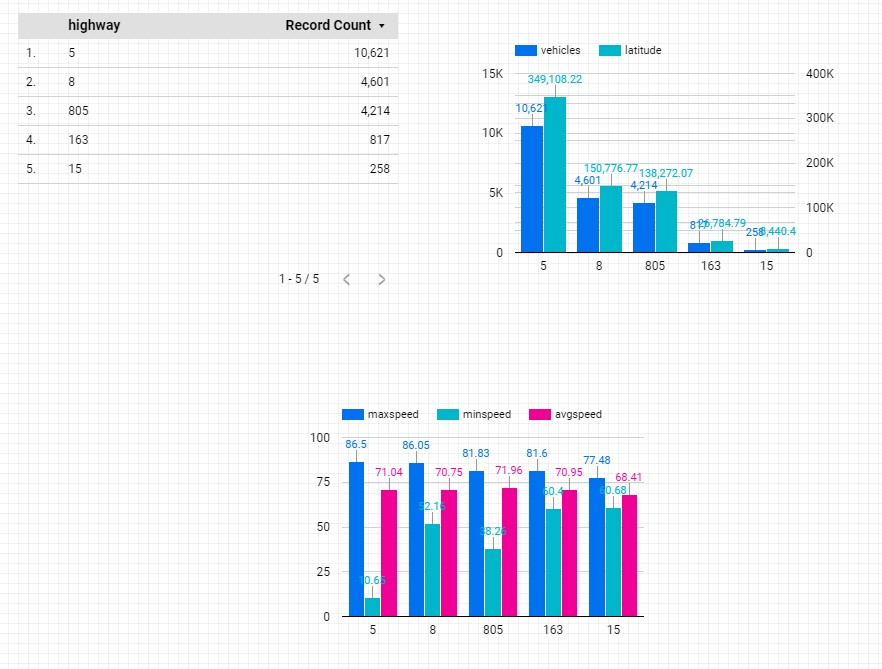

# Data Studio

## Initialize

gcp > Compute Engine > Vm instances > training-vm > ssh

    ssh $ ls /training
    ssh $ git clone https://github.com/GoogleCloudPlatform/training-data-analyst
    ssh $ source /training/project_env.sh
    
## Data Source

[Data Studio](https://datastudio.google.com/)

Blank Report > BigQuery > Authorize  

### Custom Query

    SELECT max(speed) as maxspeed, min(speed) as minspeed,
    avg(speed) as avgspeed, highway
    FROM `qwiklabs-gcp-02-4c546ecd1925.demos.current_conditions`
    group by highway;

