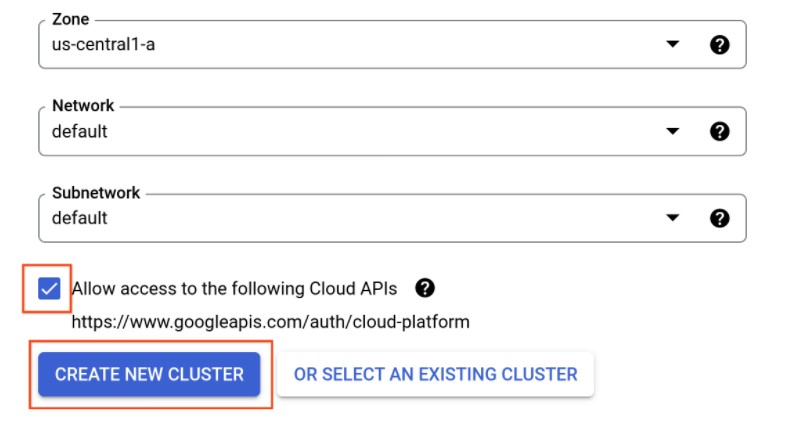
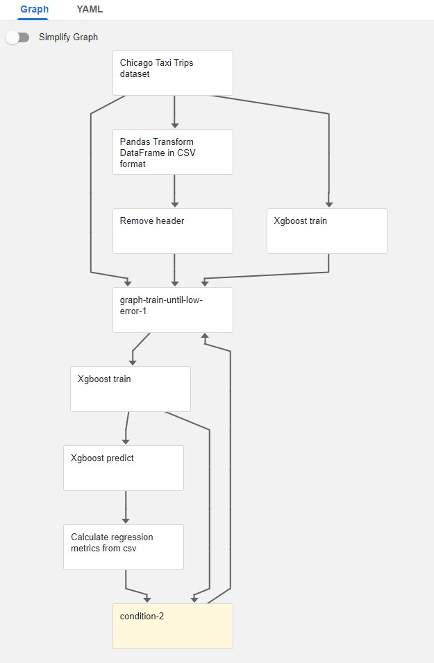
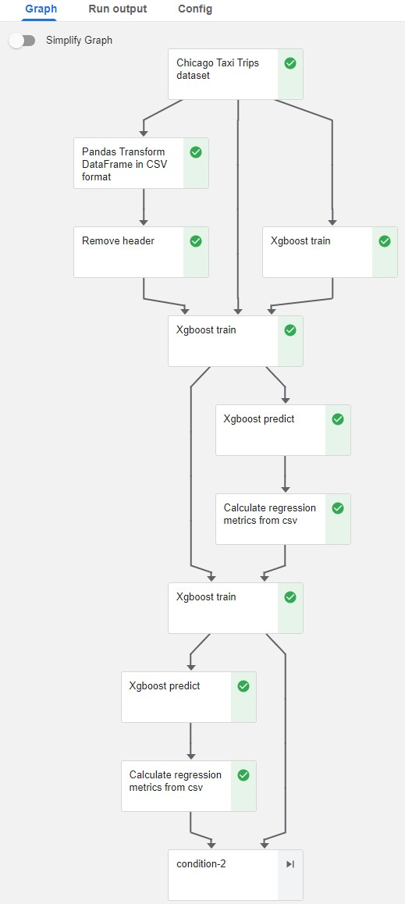

# Kubeflow

gcp > AI Platform > Pipelines > New Instance > Configure  

> Create New Cluster  

> Deploy  

## Run Example Pipeline

AI Platform > Open Pipelines Dashboard > Pipeline > Demo XGBoost

> Create Experiment > my-first-experiment
> Next > Start  

